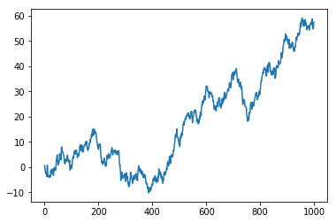
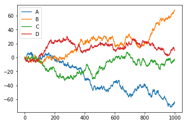
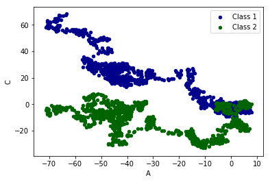

```python
import pandas as pd
import numpy as np
```


```python
s=pd.Series([1,3,34,np.nan,44,1])
print(s)
```

    0     1.0
    1     3.0
    2    34.0
    3     NaN
    4    44.0
    5     1.0
    dtype: float64
    


```python
dates=pd.date_range('20170101',periods=6)
print(dates)
```

    DatetimeIndex(['2017-01-01', '2017-01-02', '2017-01-03', '2017-01-04',
                   '2017-01-05', '2017-01-06'],
                  dtype='datetime64[ns]', freq='D')
    


```python
df=pd.DataFrame(np.random.randn(6,4),index=dates,columns=['a','b','c','d'])
print(df)
```

                       a         b         c         d
    2017-01-01  1.872583 -0.984165 -1.414168 -1.233643
    2017-01-02  0.657882  1.996861 -1.102523 -0.491087
    2017-01-03 -0.060314  0.100613 -1.237733  1.477374
    2017-01-04 -0.649592  0.795036  0.542792  0.286291
    2017-01-05  0.240358  0.586605 -0.701494  0.505145
    2017-01-06  0.303781  1.851289 -0.972403  1.168722
    


```python
df1=pd.DataFrame(np.arange(12).reshape((3,4)))
print(df1)
```

       0  1   2   3
    0  0  1   2   3
    1  4  5   6   7
    2  8  9  10  11
    


```python
df.dtypes
```


    a    float64
    b    float64
    c    float64
    d    float64
    dtype: object


```python
df.index
```


    DatetimeIndex(['2017-01-01', '2017-01-02', '2017-01-03', '2017-01-04',
                   '2017-01-05', '2017-01-06'],
                  dtype='datetime64[ns]', freq='D')


```python
dates = pd.date_range('20130101', periods=6)
df = pd.DataFrame(np.arange(24).reshape((6,4)), index=dates, columns=['A', 'B', 'C', 'D'])
print(df)
```

                 A   B   C   D
    2013-01-01   0   1   2   3
    2013-01-02   4   5   6   7
    2013-01-03   8   9  10  11
    2013-01-04  12  13  14  15
    2013-01-05  16  17  18  19
    2013-01-06  20  21  22  23
    


```python
print(df['A'])
```

    2013-01-01     0
    2013-01-02     4
    2013-01-03     8
    2013-01-04    12
    2013-01-05    16
    2013-01-06    20
    Freq: D, Name: A, dtype: int32
    


```python
print(df.A)
```

    2013-01-01     0
    2013-01-02     4
    2013-01-03     8
    2013-01-04    12
    2013-01-05    16
    2013-01-06    20
    Freq: D, Name: A, dtype: int32
    


```python
print(df[0:3])
```

                A  B   C   D
    2013-01-01  0  1   2   3
    2013-01-02  4  5   6   7
    2013-01-03  8  9  10  11
    


```python
print(df["2013-01-01":"2013-01-03"])
```

                A  B   C   D
    2013-01-01  0  1   2   3
    2013-01-02  4  5   6   7
    2013-01-03  8  9  10  11
    


```python
print(df.loc['20130102'])
```

    A    4
    B    5
    C    6
    D    7
    Name: 2013-01-02 00:00:00, dtype: int32
    


```python
#print(df.loc['2013-01-02',['A','B']])
```


```python
#print(df.iloc[3:5,1:3])#选取某行列块儿
```


```python
#print(df.iloc[[1,3,5],1:3])
```


```python
print(df.ix[:3,['A','C']])
```

                A   C
    2013-01-01  0   2
    2013-01-02  4   6
    2013-01-03  8  10
    


```python
print(df[df.A>8])#条件筛选
```

                 A   B   C   D
    2013-01-04  12  13  14  15
    2013-01-05  16  17  18  19
    2013-01-06  20  21  22  23
    


```python
df.iloc[2,2]=111#下面开始pandas赋值
print(df)
```

                 A   B    C   D
    2013-01-01   0   1    2   3
    2013-01-02   4   5    6   7
    2013-01-03   8   9  111  11
    2013-01-04  12  13   14  15
    2013-01-05  16  17   18  19
    2013-01-06  20  21   22  23
    


```python
df.loc['20130101','B']=222
print(df)
```

                 A    B    C   D
    2013-01-01   0  222    2   3
    2013-01-02   4    5    6   7
    2013-01-03   8    9  111  11
    2013-01-04  12   13   14  15
    2013-01-05  16   17   18  19
    2013-01-06  20   21   22  23
    


```python
df[df.A>3]=55#条件赋值
print(df)
```

                 A    B   C   D
    2013-01-01   0  222   2   3
    2013-01-02  55   55  55  55
    2013-01-03  55   55  55  55
    2013-01-04  55   55  55  55
    2013-01-05  55   55  55  55
    2013-01-06  55   55  55  55
    


```python
df.A[df.A<1000]=23
print(df)
```

                 A    B   C   D
    2013-01-01  23  222   2   3
    2013-01-02  23   55  55  55
    2013-01-03  23   55  55  55
    2013-01-04  23   55  55  55
    2013-01-05  23   55  55  55
    2013-01-06  23   55  55  55
    


```python
df['F']=np.nan#插入一列
print(df)
```

                 A    B   C   D   F
    2013-01-01  23  222   2   3 NaN
    2013-01-02  23   55  55  55 NaN
    2013-01-03  23   55  55  55 NaN
    2013-01-04  23   55  55  55 NaN
    2013-01-05  23   55  55  55 NaN
    2013-01-06  23   55  55  55 NaN
    


```python
df['E']=pd.Series([1,2,3,4,5,6],index=pd.date_range('20130101',periods=6))
print(df)
```

                 A    B   C   D   F  E
    2013-01-01  23  222   2   3 NaN  1
    2013-01-02  23   55  55  55 NaN  2
    2013-01-03  23   55  55  55 NaN  3
    2013-01-04  23   55  55  55 NaN  4
    2013-01-05  23   55  55  55 NaN  5
    2013-01-06  23   55  55  55 NaN  6
    


```python
df.iloc[0,1]=np.nan
df.iloc[1,2]=np.nan
print(df)
```

                 A     B     C   D   F  E
    2013-01-01  23   NaN   2.0   3 NaN  1
    2013-01-02  23  55.0   NaN  55 NaN  2
    2013-01-03  23  55.0  55.0  55 NaN  3
    2013-01-04  23  55.0  55.0  55 NaN  4
    2013-01-05  23  55.0  55.0  55 NaN  5
    2013-01-06  23  55.0  55.0  55 NaN  6
    


```python
print(df.dropna(axis=1,how='all'))#丢弃含丢失数据,how 可选择 any 或者 all
```

                 A     B     C   D  E
    2013-01-01  23   NaN   2.0   3  1
    2013-01-02  23  55.0   NaN  55  2
    2013-01-03  23  55.0  55.0  55  3
    2013-01-04  23  55.0  55.0  55  4
    2013-01-05  23  55.0  55.0  55  5
    2013-01-06  23  55.0  55.0  55  6
    


```python
print(df.fillna(value=0))#将空数据替换
```

                 A     B     C   D    F  E
    2013-01-01  23   0.0   2.0   3  0.0  1
    2013-01-02  23  55.0   0.0  55  0.0  2
    2013-01-03  23  55.0  55.0  55  0.0  3
    2013-01-04  23  55.0  55.0  55  0.0  4
    2013-01-05  23  55.0  55.0  55  0.0  5
    2013-01-06  23  55.0  55.0  55  0.0  6
    


```python
print(df.isnull())#查看是否缺失数据
```

                    A      B      C      D     F      E
    2013-01-01  False   True  False  False  True  False
    2013-01-02  False  False   True  False  True  False
    2013-01-03  False  False  False  False  True  False
    2013-01-04  False  False  False  False  True  False
    2013-01-05  False  False  False  False  True  False
    2013-01-06  False  False  False  False  True  False
    


```python
np.any(df.isnull()) #检查是否存在丢失数据
```


    True


```python
data=pd.read_csv('student.csv')#其实也可以读txt文件
print(data)
```

        Student ID   name  age  gender  Unnamed: 4
    0         1100  Kelly   22  Female         NaN
    1         1101    Clo   21  Female         NaN
    2         1102  Tilly   22  Female         NaN
    3         1103   Tony   24    Male         NaN
    4         1104  David   20    Male         NaN
    5         1105  Catty   22  Female         NaN
    6         1106      M    3  Female         NaN
    7         1107      N   43    Male         NaN
    8         1108      A   13    Male         NaN
    9         1109      S   12    Male         NaN
    10        1110  David   33    Male         NaN
    11        1111     Dw    3  Female         NaN
    12        1112      Q   23    Male         NaN
    13        1113      W   21  Female         NaN
    


```python
data.to_pickle('student.pickle')
```


```python
df1 = pd.DataFrame(np.ones((3,4))*0, columns=['a','b','c','d'])
df2 = pd.DataFrame(np.ones((3,4))*1, columns=['a','b','c','d'])
df3 = pd.DataFrame(np.ones((3,4))*2, columns=['a','b','c','d'])
```


```python
res=pd.concat([df1,df2,df3],axis=0,ignore_index=True)#数据的合并，ignore_index=True 表示忽略原来纵向index
print(res)
```

         a    b    c    d
    0  0.0  0.0  0.0  0.0
    1  0.0  0.0  0.0  0.0
    2  0.0  0.0  0.0  0.0
    3  1.0  1.0  1.0  1.0
    4  1.0  1.0  1.0  1.0
    5  1.0  1.0  1.0  1.0
    6  2.0  2.0  2.0  2.0
    7  2.0  2.0  2.0  2.0
    8  2.0  2.0  2.0  2.0
    


```python
df1 = pd.DataFrame(np.ones((3,4))*0, columns=['a','b','c','d'], index=[1,2,3])
df2 = pd.DataFrame(np.ones((3,4))*1, columns=['b','c','d', 'e'], index=[2,3,4])
```


```python
res=pd.concat([df1,df2])#默认join=outer
print(res)
```

         a    b    c    d    e
    1  0.0  0.0  0.0  0.0  NaN
    2  0.0  0.0  0.0  0.0  NaN
    3  0.0  0.0  0.0  0.0  NaN
    2  NaN  1.0  1.0  1.0  1.0
    3  NaN  1.0  1.0  1.0  1.0
    4  NaN  1.0  1.0  1.0  1.0
    


```python
res=pd.concat([df1,df2],join='inner')
```

         b    c    d
    1  0.0  0.0  0.0
    2  0.0  0.0  0.0
    3  0.0  0.0  0.0
    2  1.0  1.0  1.0
    3  1.0  1.0  1.0
    4  1.0  1.0  1.0
    


```python
res=pd.concat([df1,df2],join='inner',ignore_index='True')
print(res)
```

         b    c    d
    0  0.0  0.0  0.0
    1  0.0  0.0  0.0
    2  0.0  0.0  0.0
    3  1.0  1.0  1.0
    4  1.0  1.0  1.0
    5  1.0  1.0  1.0
    


```python
res = pd.concat([df1, df2], axis=1, join_axes=[df1.index])
print(res)
```

         a    b    c    d    b    c    d    e
    1  0.0  0.0  0.0  0.0  NaN  NaN  NaN  NaN
    2  0.0  0.0  0.0  0.0  1.0  1.0  1.0  1.0
    3  0.0  0.0  0.0  0.0  1.0  1.0  1.0  1.0
    


```python
res=df1.append(df2,ignore_index=True)
print(res)
```

         a    b    c    d    e
    0  0.0  0.0  0.0  0.0  NaN
    1  0.0  0.0  0.0  0.0  NaN
    2  0.0  0.0  0.0  0.0  NaN
    3  NaN  1.0  1.0  1.0  1.0
    4  NaN  1.0  1.0  1.0  1.0
    5  NaN  1.0  1.0  1.0  1.0
    


```python
s1=pd.Series([1,2,3,4],index=['a','b','c','d'])#添加一行
res=df1.append(s1,ignore_index=True)
print(res)
```

         a    b    c    d
    0  0.0  0.0  0.0  0.0
    1  0.0  0.0  0.0  0.0
    2  0.0  0.0  0.0  0.0
    3  1.0  2.0  3.0  4.0
    


```python
left = pd.DataFrame({'key': ['K0', 'K1', 'K2', 'K3'],
                                  'A': ['A0', 'A1', 'A2', 'A3'],
                                  'B': ['B0', 'B1', 'B2', 'B3']})
right = pd.DataFrame({'key': ['K0', 'K1', 'K2', 'K3'],
                                    'C': ['C0', 'C1', 'C2', 'C3'],
                                    'D': ['D0', 'D1', 'D2', 'D3']})
print(left)
print(right)
```

        A   B key
    0  A0  B0  K0
    1  A1  B1  K1
    2  A2  B2  K2
    3  A3  B3  K3
        C   D key
    0  C0  D0  K0
    1  C1  D1  K1
    2  C2  D2  K2
    3  C3  D3  K3
    


```python
res=pd.merge(left,right,on='key')
print(res)
```

        A   B key   C   D
    0  A0  B0  K0  C0  D0
    1  A1  B1  K1  C1  D1
    2  A2  B2  K2  C2  D2
    3  A3  B3  K3  C3  D3
    


```python
left = pd.DataFrame({'key1': ['K0', 'K0', 'K1', 'K2'],#带参照式的合并
                             'key2': ['K0', 'K1', 'K0', 'K1'],
                             'A': ['A0', 'A1', 'A2', 'A3'],
                             'B': ['B0', 'B1', 'B2', 'B3']})
right = pd.DataFrame({'key1': ['K0', 'K1', 'K1', 'K2'],
                              'key2': ['K0', 'K0', 'K0', 'K0'],
                              'C': ['C0', 'C1', 'C2', 'C3'],
                              'D': ['D0', 'D1', 'D2', 'D3']})
print(left)
print(right)
```

        A   B key1 key2
    0  A0  B0   K0   K0
    1  A1  B1   K0   K1
    2  A2  B2   K1   K0
    3  A3  B3   K2   K1
        C   D key1 key2
    0  C0  D0   K0   K0
    1  C1  D1   K1   K0
    2  C2  D2   K1   K0
    3  C3  D3   K2   K0
    


```python
res=pd.merge(left,right,on=['key1','key2'])#默认 how=inner
print(res)
```

        A   B key1 key2   C   D
    0  A0  B0   K0   K0  C0  D0
    1  A2  B2   K1   K0  C1  D1
    2  A2  B2   K1   K0  C2  D2
    


```python
res=pd.merge(left,right,on=['key1','key2'],how='outer')
print(res)
```

         A    B key1 key2    C    D
    0   A0   B0   K0   K0   C0   D0
    1   A1   B1   K0   K1  NaN  NaN
    2   A2   B2   K1   K0   C1   D1
    3   A2   B2   K1   K0   C2   D2
    4   A3   B3   K2   K1  NaN  NaN
    5  NaN  NaN   K2   K0   C3   D3
    


```python
res=pd.merge(left,right,on=['key1','key2'],how='left')
print(res)
```

        A   B key1 key2    C    D
    0  A0  B0   K0   K0   C0   D0
    1  A1  B1   K0   K1  NaN  NaN
    2  A2  B2   K1   K0   C1   D1
    3  A2  B2   K1   K0   C2   D2
    4  A3  B3   K2   K1  NaN  NaN
    


```python
res=pd.merge(left,right,on=['key1','key2'],how='right')
print(res)
```

         A    B key1 key2   C   D
    0   A0   B0   K0   K0  C0  D0
    1   A2   B2   K1   K0  C1  D1
    2   A2   B2   K1   K0  C2  D2
    3  NaN  NaN   K2   K0  C3  D3
    


```python
df1 = pd.DataFrame({'col1':[0,1], 'col_left':['a','b']})
df2 = pd.DataFrame({'col1':[1,2,2],'col_right':[2,2,2]})
print(df1)
print(df2)

# give the indicator a custom name

```

       col1 col_left
    0     0        a
    1     1        b
       col1  col_right
    0     1          2
    1     2          2
    2     2          2
    


```python
res = pd.merge(df1, df2, on='col1', how='outer', indicator=True)
print(res)
```

       col1 col_left  col_right      _merge
    0     0        a        NaN   left_only
    1     1        b        2.0        both
    2     2      NaN        2.0  right_only
    3     2      NaN        2.0  right_only
    


```python
res = pd.merge(df1, df2, on='col1', how='outer', indicator='indicator_column')
print(res)
```

       col1 col_left  col_right indicator_column
    0     0        a        NaN        left_only
    1     1        b        2.0             both
    2     2      NaN        2.0       right_only
    3     2      NaN        2.0       right_only
    


```python
left = pd.DataFrame({'A': ['A0', 'A1', 'A2'],
                                  'B': ['B0', 'B1', 'B2']},
                                  index=['K0', 'K1', 'K2'])
right = pd.DataFrame({'C': ['C0', 'C2', 'C3'],
                                     'D': ['D0', 'D2', 'D3']},
                                      index=['K0', 'K2', 'K3'])
print(left)
print(right)
```

         A   B
    K0  A0  B0
    K1  A1  B1
    K2  A2  B2
         C   D
    K0  C0  D0
    K2  C2  D2
    K3  C3  D3
    


```python
res = pd.merge(left, right, left_index=True, right_index=True, how='outer')#参照表外数据合并
print(res)
```

          A    B    C    D
    K0   A0   B0   C0   D0
    K1   A1   B1  NaN  NaN
    K2   A2   B2   C2   D2
    K3  NaN  NaN   C3   D3
    


```python
res = pd.merge(left, right, left_index=True, right_index=True, how='inner')
print(res)
```

         A   B   C   D
    K0  A0  B0  C0  D0
    K2  A2  B2  C2  D2
    


```python
boys = pd.DataFrame({'k': ['K0', 'K1', 'K2'], 'age': [1, 2, 3]})
girls = pd.DataFrame({'k': ['K0', 'K0', 'K3'], 'age': [4, 5, 6]})
print(boys)
print(girls)
```

       age   k
    0    1  K0
    1    2  K1
    2    3  K2
       age   k
    0    4  K0
    1    5  K0
    2    6  K3
    


```python
res = pd.merge(boys, girls, on='k', suffixes=['_boy', '_girl'], how='inner')#让列名不重复
print(res)
```

       age_boy   k  age_girl
    0        1  K0         4
    1        1  K0         5
    


```python
import matplotlib.pyplot as plt
```


```python
data=pd.Series(np.random.randn(1000),index=np.arange(1000))
data=data.cumsum()
data.plot()
plt.show()
```





```python
data=pd.DataFrame(np.random.randn(1000,4),
                  index=np.arange(1000),
                  columns=list("ABCD"))
print(data.head())
                  
```

              A         B         C         D
    0 -0.786007  1.382360 -0.910604 -0.018034
    1 -0.567586 -1.784837  1.337644 -1.979652
    2  1.116737 -0.079163 -0.346398 -0.028989
    3 -1.406374 -0.901805 -0.032376 -1.177631
    4 -0.610322  1.468203 -1.060481  1.960372
    


```python
data=data.cumsum()
print(data.head())
```

              A         B         C         D
    0 -0.786007  1.382360 -0.910604 -0.018034
    1 -1.353593 -0.402477  0.427040 -1.997686
    2 -0.236857 -0.481640  0.080642 -2.026675
    3 -1.643231 -1.383445  0.048266 -3.204306
    4 -2.253552  0.084758 -1.012215 -1.243934
    


```python
data.plot()
plt.show()
```





```python
bx=data.plot.scatter(x='A',y='B',color='DarkBlue',label='Class 1')
data.plot.scatter(x='A',y='C',color='DarkGreen',label='Class 2',ax=bx)
plt.show
```


    <function matplotlib.pyplot.show>




