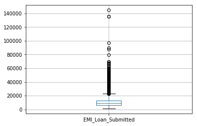
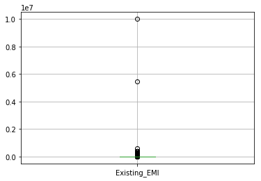

```python
import xgboost as xgb
```


```python
import pandas as pd
import numpy as np
%matplotlib inline
```


```python
import matplotlib.pyplot as plt
```


```python
train=pd.read_csv('Train_nyOWmfK.csv',encoding='latin1')
test=pd.read_csv('Test_bCtAN1w.csv',encoding='utf-8')
```


```python
train.shape,test.shape
```


    ((87020, 26), (37717, 24))


```python
train.dtypes
```


    ID                        object
    Gender                    object
    City                      object
    Monthly_Income             int64
    DOB                       object
    Lead_Creation_Date        object
    Loan_Amount_Applied      float64
    Loan_Tenure_Applied      float64
    Existing_EMI             float64
    Employer_Name             object
    Salary_Account            object
    Mobile_Verified           object
    Var5                       int64
    Var1                      object
    Loan_Amount_Submitted    float64
    Loan_Tenure_Submitted    float64
    Interest_Rate            float64
    Processing_Fee           float64
    EMI_Loan_Submitted       float64
    Filled_Form               object
    Device_Type               object
    Var2                      object
    Source                    object
    Var4                       int64
    LoggedIn                   int64
    Disbursed                  int64
    dtype: object


```python
train['source']='train'
test['source']='test'
data=pd.concat([train,test],ignore_index=True)
```


```python
data.shape
```


    (124737, 27)


```python
data.apply(lambda x:sum(x.isnull()))
```


    City                      1401
    DOB                          0
    Device_Type                  0
    Disbursed                37717
    EMI_Loan_Submitted       84901
    Employer_Name              113
    Existing_EMI               111
    Filled_Form                  0
    Gender                       0
    ID                           0
    Interest_Rate            84901
    Lead_Creation_Date           0
    Loan_Amount_Applied        111
    Loan_Amount_Submitted    49535
    Loan_Tenure_Applied        111
    Loan_Tenure_Submitted    49535
    LoggedIn                 37717
    Mobile_Verified              0
    Monthly_Income               0
    Processing_Fee           85346
    Salary_Account           16801
    Source                       0
    Var1                         0
    Var2                         0
    Var4                         0
    Var5                         0
    source                       0
    dtype: int64


```python
var = ['Gender','Salary_Account','Mobile_Verified','Var1','Filled_Form','Device_Type','Var2','Source']
for v in var:
    print('\nFrequency count for variable %s'%v)
    print(data[v].value_counts())
```

    
    Frequency count for variable Gender
    Male      71398
    Female    53339
    Name: Gender, dtype: int64
    
    Frequency count for variable Salary_Account
    HDFC Bank                                          25180
    ICICI Bank                                         19547
    State Bank of India                                17110
    Axis Bank                                          12590
    Citibank                                            3398
    Kotak Bank                                          2955
    IDBI Bank                                           2213
    Punjab National Bank                                1747
    Bank of India                                       1713
    Bank of Baroda                                      1675
    Standard Chartered Bank                             1434
    Canara Bank                                         1385
    Union Bank of India                                 1330
    Yes Bank                                            1120
    ING Vysya                                            996
    Corporation bank                                     948
    Indian Overseas Bank                                 901
    State Bank of Hyderabad                              854
    Indian Bank                                          773
    Oriental Bank of Commerce                            761
    IndusInd Bank                                        711
    Andhra Bank                                          706
    Central Bank of India                                648
    Syndicate Bank                                       614
    Bank of Maharasthra                                  576
    HSBC                                                 474
    State Bank of Bikaner & Jaipur                       448
    Karur Vysya Bank                                     435
    State Bank of Mysore                                 385
    Federal Bank                                         377
    Vijaya Bank                                          354
    Allahabad Bank                                       345
    UCO Bank                                             344
    State Bank of Travancore                             333
    Karnataka Bank                                       279
    United Bank of India                                 276
    Dena Bank                                            268
    Saraswat Bank                                        265
    State Bank of Patiala                                263
    South Indian Bank                                    223
    Deutsche Bank                                        176
    Abhyuday Co-op Bank Ltd                              161
    The Ratnakar Bank Ltd                                113
    Tamil Nadu Mercantile Bank                           103
    Punjab & Sind bank                                    84
    J&K Bank                                              78
    Lakshmi Vilas bank                                    69
    Dhanalakshmi Bank Ltd                                 66
    State Bank of Indore                                  32
    Catholic Syrian Bank                                  27
    India Bulls                                           21
    B N P Paribas                                         15
    Firstrand Bank Limited                                11
    GIC Housing Finance Ltd                               10
    Bank of Rajasthan                                      8
    Kerala Gramin Bank                                     4
    Industrial And Commercial Bank Of China Limited        3
    Ahmedabad Mercantile Cooperative Bank                  1
    Name: Salary_Account, dtype: int64
    
    Frequency count for variable Mobile_Verified
    Y    80928
    N    43809
    Name: Mobile_Verified, dtype: int64
    
    Frequency count for variable Var1
    HBXX    84901
    HBXC    12952
    HBXB     6502
    HAXA     4214
    HBXA     3042
    HAXB     2879
    HBXD     2818
    HAXC     2171
    HBXH     1387
    HCXF      990
    HAYT      710
    HAVC      570
    HAXM      386
    HCXD      348
    HCYS      318
    HVYS      252
    HAZD      161
    HCXG      114
    HAXF       22
    Name: Var1, dtype: int64
    
    Frequency count for variable Filled_Form
    N    96740
    Y    27997
    Name: Filled_Form, dtype: int64
    
    Frequency count for variable Device_Type
    Web-browser    92105
    Mobile         32632
    Name: Device_Type, dtype: int64
    
    Frequency count for variable Var2
    B    53481
    G    47338
    C    20366
    E     1855
    D      918
    F      770
    A        9
    Name: Var2, dtype: int64
    
    Frequency count for variable Source
    S122    55249
    S133    42900
    S159     7999
    S143     6140
    S127     2804
    S137     2450
    S134     1900
    S161     1109
    S151     1018
    S157      929
    S153      705
    S144      447
    S156      432
    S158      294
    S123      112
    S141       83
    S162       60
    S124       43
    S150       19
    S160       11
    S136        5
    S155        5
    S138        5
    S129        4
    S139        4
    S135        2
    S132        1
    S126        1
    S131        1
    S154        1
    S125        1
    S140        1
    S142        1
    S130        1
    Name: Source, dtype: int64
    


```python
print(len(data['City'].unique()))
data.drop('City',axis=1,inplace=True)
```

    724
    


```python
data['DOB'].head()
```


    0    23-May-78
    1    07-Oct-85
    2    10-Oct-81
    3    30-Nov-87
    4    17-Feb-84
    Name: DOB, dtype: object


```python
data['Age']=data['DOB'].apply(lambda x:115-int(x[-2:]))
data['Age'].head()
```


    0    37
    1    30
    2    34
    3    28
    4    31
    Name: Age, dtype: int64


```python
data.drop('DOB',axis=1,inplace=True)
```


```python
data.boxplot(column=['EMI_Loan_Submitted'],return_type='axes')
```


    <matplotlib.axes._subplots.AxesSubplot at 0x1b1a60578d0>





```python
data['EMI_Loan_Submitted_Missing']=data['EMI_Loan_Submitted'].apply(lambda x:1 if pd.isnull(x) else 0)
data[['EMI_Loan_Submitted','EMI_Loan_Submitted_Missing']].head(10)
```


<div>
<style scoped>
    .dataframe tbody tr th:only-of-type {
        vertical-align: middle;
    }

    .dataframe tbody tr th {
        vertical-align: top;
    }

    .dataframe thead th {
        text-align: right;
    }
</style>
<table border="1" class="dataframe">
  <thead>
    <tr style="text-align: right;">
      <th></th>
      <th>EMI_Loan_Submitted</th>
      <th>EMI_Loan_Submitted_Missing</th>
    </tr>
  </thead>
  <tbody>
    <tr>
      <th>0</th>
      <td>NaN</td>
      <td>1</td>
    </tr>
    <tr>
      <th>1</th>
      <td>6762.90</td>
      <td>0</td>
    </tr>
    <tr>
      <th>2</th>
      <td>NaN</td>
      <td>1</td>
    </tr>
    <tr>
      <th>3</th>
      <td>NaN</td>
      <td>1</td>
    </tr>
    <tr>
      <th>4</th>
      <td>NaN</td>
      <td>1</td>
    </tr>
    <tr>
      <th>5</th>
      <td>6978.92</td>
      <td>0</td>
    </tr>
    <tr>
      <th>6</th>
      <td>NaN</td>
      <td>1</td>
    </tr>
    <tr>
      <th>7</th>
      <td>NaN</td>
      <td>1</td>
    </tr>
    <tr>
      <th>8</th>
      <td>30824.65</td>
      <td>0</td>
    </tr>
    <tr>
      <th>9</th>
      <td>10883.38</td>
      <td>0</td>
    </tr>
  </tbody>
</table>
</div>


```python
data.drop('EMI_Loan_Submitted',axis=1,inplace=True)
```


```python
len(data['Employer_Name'].value_counts())
```


    57194


```python
data.drop('Employer_Name',axis=1,inplace=True)
```


```python
data.boxplot(column='Existing_EMI',return_type='axes')
```


    <matplotlib.axes._subplots.AxesSubplot at 0x1b1a63b3668>





```python
data['Existing_EMI'].describe()
```


    count    1.246260e+05
    mean     3.636342e+03
    std      3.369124e+04
    min      0.000000e+00
    25%      0.000000e+00
    50%      0.000000e+00
    75%      3.500000e+03
    max      1.000000e+07
    Name: Existing_EMI, dtype: float64


```python
data['Existing_EMI'].fillna(0,inplace=True)
```


```python
data['Interest_Rate_Missing']=data['Interest_Rate'].apply(lambda x:1 if pd.isnull(x) else 0)
print(data[['Interest_Rate','Interest_Rate_Missing']].head(10))
```

       Interest_Rate  Interest_Rate_Missing
    0            NaN                      1
    1          13.25                      0
    2            NaN                      1
    3            NaN                      1
    4            NaN                      1
    5          13.99                      0
    6            NaN                      1
    7            NaN                      1
    8          14.85                      0
    9          18.25                      0
    


```python
data.drop('Interest_Rate',axis=1,inplace=True)
```


```python
data.drop('Lead_Creation_Date',axis=1,inplace=True)
```


```python
data['Loan_Amount_Applied'].fillna(data['Loan_Amount_Applied'].median(),inplace=True)
data['Loan_Tenure_Applied'].fillna(data['Loan_Tenure_Applied'].median(),inplace=True)
```


```python
data['Loan_Amount_Submitted_Missing']=data['Loan_Amount_Submitted'].apply(lambda x:1 if pd.isnull(x) else 0)
data['Loan_Tenure_Submitted_Missing']=data['Loan_Tenure_Submitted'].apply(lambda x:1 if pd.isnull(x) else 0)
```


```python
data.drop(['Loan_Amount_Submitted','Loan_Tenure_Submitted'],axis=1,inplace=True)
```


```python
data.drop('LoggedIn',axis=1,inplace=True)
```


```python
data.drop('Salary_Account',axis=1,inplace=True)
```


```python
data['Processing_Fee_Missing']=data['Processing_Fee'].apply(lambda x: 1 if pd.isnull(x) else 0)
data.drop('Processing_Fee',axis=1,inplace=True)
```


```python
data['Source']=data['Source'].apply(lambda x:'others' if x not in ['S122','S133'] else x)
data['Source'].value_counts()
```


    S122      55249
    S133      42900
    others    26588
    Name: Source, dtype: int64


```python
data.apply(lambda x:sum(x.isnull()))
```


    Device_Type                          0
    Disbursed                        37717
    Existing_EMI                         0
    Filled_Form                          0
    Gender                               0
    ID                                   0
    Loan_Amount_Applied                  0
    Loan_Tenure_Applied                  0
    Mobile_Verified                      0
    Monthly_Income                       0
    Source                               0
    Var1                                 0
    Var2                                 0
    Var4                                 0
    Var5                                 0
    source                               0
    Age                                  0
    EMI_Loan_Submitted_Missing           0
    Interest_Rate_Missing                0
    Loan_Amount_Submitted_Missing        0
    Loan_Tenure_Submitted_Missing        0
    Processing_Fee_Missing               0
    dtype: int64


```python
data.dtypes
```


    Device_Type                       object
    Disbursed                        float64
    Existing_EMI                     float64
    Filled_Form                       object
    Gender                            object
    ID                                object
    Loan_Amount_Applied              float64
    Loan_Tenure_Applied              float64
    Mobile_Verified                   object
    Monthly_Income                     int64
    Source                            object
    Var1                              object
    Var2                              object
    Var4                               int64
    Var5                               int64
    source                            object
    Age                                int64
    EMI_Loan_Submitted_Missing         int64
    Interest_Rate_Missing              int64
    Loan_Amount_Submitted_Missing      int64
    Loan_Tenure_Submitted_Missing      int64
    Processing_Fee_Missing             int64
    dtype: object


```python
from sklearn.preprocessing import LabelEncoder
le=LabelEncoder()
var_to_encode=['Device_Type','Filled_Form','Gender','Var1','Var2','Mobile_Verified','Source']
for col in var_to_encode:
    data[col]=le.fit_transform(data[col]) ###fit和transform合在一起
```


```python
data=pd.get_dummies(data,columns=var_to_encode)
data.columns
```


    Index(['Disbursed', 'Existing_EMI', 'ID', 'Loan_Amount_Applied',
           'Loan_Tenure_Applied', 'Monthly_Income', 'Var4', 'Var5', 'source',
           'Age', 'EMI_Loan_Submitted_Missing', 'Interest_Rate_Missing',
           'Loan_Amount_Submitted_Missing', 'Loan_Tenure_Submitted_Missing',
           'Processing_Fee_Missing', 'Device_Type_0', 'Device_Type_1',
           'Filled_Form_0', 'Filled_Form_1', 'Gender_0', 'Gender_1', 'Var1_0',
           'Var1_1', 'Var1_2', 'Var1_3', 'Var1_4', 'Var1_5', 'Var1_6', 'Var1_7',
           'Var1_8', 'Var1_9', 'Var1_10', 'Var1_11', 'Var1_12', 'Var1_13',
           'Var1_14', 'Var1_15', 'Var1_16', 'Var1_17', 'Var1_18', 'Var2_0',
           'Var2_1', 'Var2_2', 'Var2_3', 'Var2_4', 'Var2_5', 'Var2_6',
           'Mobile_Verified_0', 'Mobile_Verified_1', 'Source_0', 'Source_1',
           'Source_2'],
          dtype='object')


```python
train=data.loc[data['source']=='train']
test=data.loc[data['source']=='test']
```


```python
train.drop('source',axis=1,inplace=True)
test.drop(['source','Disbursed'],axis=1,inplace=True)
```

    c:\users\dell\appdata\local\programs\python\python36\lib\site-packages\ipykernel_launcher.py:1: SettingWithCopyWarning: 
    A value is trying to be set on a copy of a slice from a DataFrame
    
    See the caveats in the documentation: http://pandas.pydata.org/pandas-docs/stable/indexing.html#indexing-view-versus-copy
      """Entry point for launching an IPython kernel.
    c:\users\dell\appdata\local\programs\python\python36\lib\site-packages\ipykernel_launcher.py:2: SettingWithCopyWarning: 
    A value is trying to be set on a copy of a slice from a DataFrame
    
    See the caveats in the documentation: http://pandas.pydata.org/pandas-docs/stable/indexing.html#indexing-view-versus-copy
      
    


```python
train.to_csv('train_modified.csv',index=False)
test.to_csv('test_modified.csv',index=False)
train.shape,test.shape
```


    ((87020, 51), (37717, 50))


