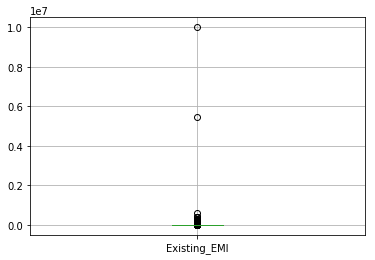
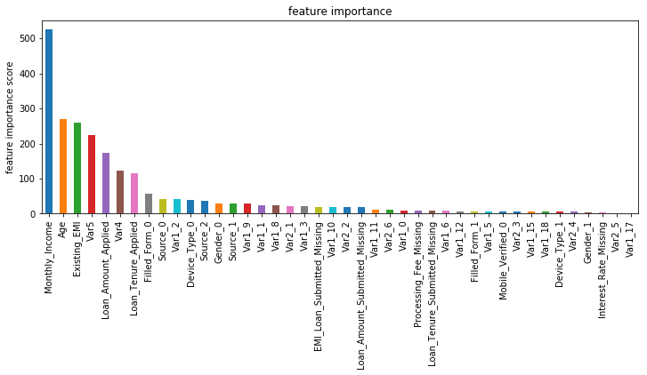
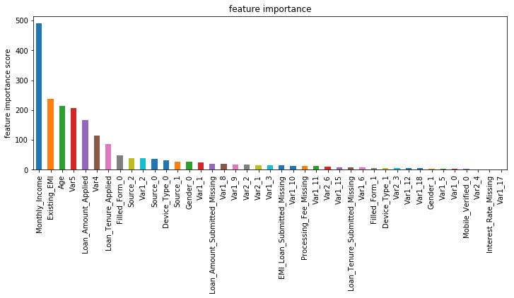

```python
import xgboost as xgb
```


```python
import pandas as pd
import numpy as np
%matplotlib inline
```


```python
train= pd.read_csv('Train_nyOWmfK.csv',encoding='latin1')
test = pd.read_csv('Test_bCtAN1w.csv',encoding='utf-8')
```


```python
train.head()
```


<div>
<style scoped>
    .dataframe tbody tr th:only-of-type {
        vertical-align: middle;
    }

    .dataframe tbody tr th {
        vertical-align: top;
    }

    .dataframe thead th {
        text-align: right;
    }
</style>
<table border="1" class="dataframe">
  <thead>
    <tr style="text-align: right;">
      <th></th>
      <th>ID</th>
      <th>Gender</th>
      <th>City</th>
      <th>Monthly_Income</th>
      <th>DOB</th>
      <th>Lead_Creation_Date</th>
      <th>Loan_Amount_Applied</th>
      <th>Loan_Tenure_Applied</th>
      <th>Existing_EMI</th>
      <th>Employer_Name</th>
      <th>...</th>
      <th>Interest_Rate</th>
      <th>Processing_Fee</th>
      <th>EMI_Loan_Submitted</th>
      <th>Filled_Form</th>
      <th>Device_Type</th>
      <th>Var2</th>
      <th>Source</th>
      <th>Var4</th>
      <th>LoggedIn</th>
      <th>Disbursed</th>
    </tr>
  </thead>
  <tbody>
    <tr>
      <th>0</th>
      <td>ID000002C20</td>
      <td>Female</td>
      <td>Delhi</td>
      <td>20000</td>
      <td>23-May-78</td>
      <td>15-May-15</td>
      <td>300000.0</td>
      <td>5.0</td>
      <td>0.0</td>
      <td>CYBOSOL</td>
      <td>...</td>
      <td>NaN</td>
      <td>NaN</td>
      <td>NaN</td>
      <td>N</td>
      <td>Web-browser</td>
      <td>G</td>
      <td>S122</td>
      <td>1</td>
      <td>0</td>
      <td>0</td>
    </tr>
    <tr>
      <th>1</th>
      <td>ID000004E40</td>
      <td>Male</td>
      <td>Mumbai</td>
      <td>35000</td>
      <td>07-Oct-85</td>
      <td>04-May-15</td>
      <td>200000.0</td>
      <td>2.0</td>
      <td>0.0</td>
      <td>TATA CONSULTANCY SERVICES LTD (TCS)</td>
      <td>...</td>
      <td>13.25</td>
      <td>NaN</td>
      <td>6762.9</td>
      <td>N</td>
      <td>Web-browser</td>
      <td>G</td>
      <td>S122</td>
      <td>3</td>
      <td>0</td>
      <td>0</td>
    </tr>
    <tr>
      <th>2</th>
      <td>ID000007H20</td>
      <td>Male</td>
      <td>Panchkula</td>
      <td>22500</td>
      <td>10-Oct-81</td>
      <td>19-May-15</td>
      <td>600000.0</td>
      <td>4.0</td>
      <td>0.0</td>
      <td>ALCHEMIST HOSPITALS LTD</td>
      <td>...</td>
      <td>NaN</td>
      <td>NaN</td>
      <td>NaN</td>
      <td>N</td>
      <td>Web-browser</td>
      <td>B</td>
      <td>S143</td>
      <td>1</td>
      <td>0</td>
      <td>0</td>
    </tr>
    <tr>
      <th>3</th>
      <td>ID000008I30</td>
      <td>Male</td>
      <td>Saharsa</td>
      <td>35000</td>
      <td>30-Nov-87</td>
      <td>09-May-15</td>
      <td>1000000.0</td>
      <td>5.0</td>
      <td>0.0</td>
      <td>BIHAR GOVERNMENT</td>
      <td>...</td>
      <td>NaN</td>
      <td>NaN</td>
      <td>NaN</td>
      <td>N</td>
      <td>Web-browser</td>
      <td>B</td>
      <td>S143</td>
      <td>3</td>
      <td>0</td>
      <td>0</td>
    </tr>
    <tr>
      <th>4</th>
      <td>ID000009J40</td>
      <td>Male</td>
      <td>Bengaluru</td>
      <td>100000</td>
      <td>17-Feb-84</td>
      <td>20-May-15</td>
      <td>500000.0</td>
      <td>2.0</td>
      <td>25000.0</td>
      <td>GLOBAL EDGE SOFTWARE</td>
      <td>...</td>
      <td>NaN</td>
      <td>NaN</td>
      <td>NaN</td>
      <td>N</td>
      <td>Web-browser</td>
      <td>B</td>
      <td>S134</td>
      <td>3</td>
      <td>1</td>
      <td>0</td>
    </tr>
  </tbody>
</table>
<p>5 rows × 26 columns</p>
</div>


```python
test.head()
```


<div>
<style scoped>
    .dataframe tbody tr th:only-of-type {
        vertical-align: middle;
    }

    .dataframe tbody tr th {
        vertical-align: top;
    }

    .dataframe thead th {
        text-align: right;
    }
</style>
<table border="1" class="dataframe">
  <thead>
    <tr style="text-align: right;">
      <th></th>
      <th>ID</th>
      <th>Gender</th>
      <th>City</th>
      <th>Monthly_Income</th>
      <th>DOB</th>
      <th>Lead_Creation_Date</th>
      <th>Loan_Amount_Applied</th>
      <th>Loan_Tenure_Applied</th>
      <th>Existing_EMI</th>
      <th>Employer_Name</th>
      <th>...</th>
      <th>Loan_Amount_Submitted</th>
      <th>Loan_Tenure_Submitted</th>
      <th>Interest_Rate</th>
      <th>Processing_Fee</th>
      <th>EMI_Loan_Submitted</th>
      <th>Filled_Form</th>
      <th>Device_Type</th>
      <th>Var2</th>
      <th>Source</th>
      <th>Var4</th>
    </tr>
  </thead>
  <tbody>
    <tr>
      <th>0</th>
      <td>ID000026A10</td>
      <td>Male</td>
      <td>Dehradun</td>
      <td>21500</td>
      <td>03-Apr-87</td>
      <td>05-May-15</td>
      <td>100000.0</td>
      <td>3.0</td>
      <td>0.0</td>
      <td>APTARA INC</td>
      <td>...</td>
      <td>100000.0</td>
      <td>3.0</td>
      <td>20.0</td>
      <td>1000.0</td>
      <td>2649.39</td>
      <td>N</td>
      <td>Web-browser</td>
      <td>B</td>
      <td>S122</td>
      <td>3</td>
    </tr>
    <tr>
      <th>1</th>
      <td>ID000054C40</td>
      <td>Male</td>
      <td>Mumbai</td>
      <td>42000</td>
      <td>12-May-80</td>
      <td>01-May-15</td>
      <td>0.0</td>
      <td>0.0</td>
      <td>0.0</td>
      <td>ATUL LTD</td>
      <td>...</td>
      <td>690000.0</td>
      <td>5.0</td>
      <td>24.0</td>
      <td>13800.0</td>
      <td>19849.90</td>
      <td>Y</td>
      <td>Mobile</td>
      <td>C</td>
      <td>S133</td>
      <td>5</td>
    </tr>
    <tr>
      <th>2</th>
      <td>ID000066O10</td>
      <td>Female</td>
      <td>Jaipur</td>
      <td>10000</td>
      <td>19-Sep-89</td>
      <td>01-May-15</td>
      <td>300000.0</td>
      <td>2.0</td>
      <td>0.0</td>
      <td>SHAREKHAN PVT LTD</td>
      <td>...</td>
      <td>NaN</td>
      <td>NaN</td>
      <td>NaN</td>
      <td>NaN</td>
      <td>NaN</td>
      <td>N</td>
      <td>Web-browser</td>
      <td>B</td>
      <td>S133</td>
      <td>1</td>
    </tr>
    <tr>
      <th>3</th>
      <td>ID000110G00</td>
      <td>Female</td>
      <td>Chennai</td>
      <td>14650</td>
      <td>15-Aug-91</td>
      <td>01-May-15</td>
      <td>0.0</td>
      <td>0.0</td>
      <td>0.0</td>
      <td>MAERSK GLOBAL SERVICE CENTRES</td>
      <td>...</td>
      <td>NaN</td>
      <td>NaN</td>
      <td>NaN</td>
      <td>NaN</td>
      <td>NaN</td>
      <td>N</td>
      <td>Mobile</td>
      <td>C</td>
      <td>S133</td>
      <td>1</td>
    </tr>
    <tr>
      <th>4</th>
      <td>ID000113J30</td>
      <td>Male</td>
      <td>Chennai</td>
      <td>23400</td>
      <td>22-Jul-87</td>
      <td>01-May-15</td>
      <td>100000.0</td>
      <td>1.0</td>
      <td>5000.0</td>
      <td>SCHAWK</td>
      <td>...</td>
      <td>100000.0</td>
      <td>2.0</td>
      <td>NaN</td>
      <td>NaN</td>
      <td>NaN</td>
      <td>N</td>
      <td>Web-browser</td>
      <td>B</td>
      <td>S143</td>
      <td>1</td>
    </tr>
  </tbody>
</table>
<p>5 rows × 24 columns</p>
</div>


```python
train.shape,test.shape
```


    ((87020, 26), (37717, 24))


```python
train.dtypes
```


    ID                        object
    Gender                    object
    City                      object
    Monthly_Income             int64
    DOB                       object
    Lead_Creation_Date        object
    Loan_Amount_Applied      float64
    Loan_Tenure_Applied      float64
    Existing_EMI             float64
    Employer_Name             object
    Salary_Account            object
    Mobile_Verified           object
    Var5                       int64
    Var1                      object
    Loan_Amount_Submitted    float64
    Loan_Tenure_Submitted    float64
    Interest_Rate            float64
    Processing_Fee           float64
    EMI_Loan_Submitted       float64
    Filled_Form               object
    Device_Type               object
    Var2                      object
    Source                    object
    Var4                       int64
    LoggedIn                   int64
    Disbursed                  int64
    dtype: object


```python
train['source']='train'
test['source']='test'
```


```python
data=pd.concat([train,test],ignore_index=True)
data.shape
```


    (124737, 27)


```python
data.apply(lambda x:sum(x.isnull()))
```


    City                      1401
    DOB                          0
    Device_Type                  0
    Disbursed                37717
    EMI_Loan_Submitted       84901
    Employer_Name              113
    Existing_EMI               111
    Filled_Form                  0
    Gender                       0
    ID                           0
    Interest_Rate            84901
    Lead_Creation_Date           0
    Loan_Amount_Applied        111
    Loan_Amount_Submitted    49535
    Loan_Tenure_Applied        111
    Loan_Tenure_Submitted    49535
    LoggedIn                 37717
    Mobile_Verified              0
    Monthly_Income               0
    Processing_Fee           85346
    Salary_Account           16801
    Source                       0
    Var1                         0
    Var2                         0
    Var4                         0
    Var5                         0
    source                       0
    dtype: int64


```python
var=['Gender','Salary_Account','Mobile_Verified','Var1','Filled_Form','Device_Type','Var2','Source']
for v in var:
    print('\nFrequency count for variable %s'%v)
    print(data[v].value_counts())
```

    
    Frequency count for variable Gender
    Male      71398
    Female    53339
    Name: Gender, dtype: int64
    
    Frequency count for variable Salary_Account
    HDFC Bank                                          25180
    ICICI Bank                                         19547
    State Bank of India                                17110
    Axis Bank                                          12590
    Citibank                                            3398
    Kotak Bank                                          2955
    IDBI Bank                                           2213
    Punjab National Bank                                1747
    Bank of India                                       1713
    Bank of Baroda                                      1675
    Standard Chartered Bank                             1434
    Canara Bank                                         1385
    Union Bank of India                                 1330
    Yes Bank                                            1120
    ING Vysya                                            996
    Corporation bank                                     948
    Indian Overseas Bank                                 901
    State Bank of Hyderabad                              854
    Indian Bank                                          773
    Oriental Bank of Commerce                            761
    IndusInd Bank                                        711
    Andhra Bank                                          706
    Central Bank of India                                648
    Syndicate Bank                                       614
    Bank of Maharasthra                                  576
    HSBC                                                 474
    State Bank of Bikaner & Jaipur                       448
    Karur Vysya Bank                                     435
    State Bank of Mysore                                 385
    Federal Bank                                         377
    Vijaya Bank                                          354
    Allahabad Bank                                       345
    UCO Bank                                             344
    State Bank of Travancore                             333
    Karnataka Bank                                       279
    United Bank of India                                 276
    Dena Bank                                            268
    Saraswat Bank                                        265
    State Bank of Patiala                                263
    South Indian Bank                                    223
    Deutsche Bank                                        176
    Abhyuday Co-op Bank Ltd                              161
    The Ratnakar Bank Ltd                                113
    Tamil Nadu Mercantile Bank                           103
    Punjab & Sind bank                                    84
    J&K Bank                                              78
    Lakshmi Vilas bank                                    69
    Dhanalakshmi Bank Ltd                                 66
    State Bank of Indore                                  32
    Catholic Syrian Bank                                  27
    India Bulls                                           21
    B N P Paribas                                         15
    Firstrand Bank Limited                                11
    GIC Housing Finance Ltd                               10
    Bank of Rajasthan                                      8
    Kerala Gramin Bank                                     4
    Industrial And Commercial Bank Of China Limited        3
    Ahmedabad Mercantile Cooperative Bank                  1
    Name: Salary_Account, dtype: int64
    
    Frequency count for variable Mobile_Verified
    Y    80928
    N    43809
    Name: Mobile_Verified, dtype: int64
    
    Frequency count for variable Var1
    HBXX    84901
    HBXC    12952
    HBXB     6502
    HAXA     4214
    HBXA     3042
    HAXB     2879
    HBXD     2818
    HAXC     2171
    HBXH     1387
    HCXF      990
    HAYT      710
    HAVC      570
    HAXM      386
    HCXD      348
    HCYS      318
    HVYS      252
    HAZD      161
    HCXG      114
    HAXF       22
    Name: Var1, dtype: int64
    
    Frequency count for variable Filled_Form
    N    96740
    Y    27997
    Name: Filled_Form, dtype: int64
    
    Frequency count for variable Device_Type
    Web-browser    92105
    Mobile         32632
    Name: Device_Type, dtype: int64
    
    Frequency count for variable Var2
    B    53481
    G    47338
    C    20366
    E     1855
    D      918
    F      770
    A        9
    Name: Var2, dtype: int64
    
    Frequency count for variable Source
    S122    55249
    S133    42900
    S159     7999
    S143     6140
    S127     2804
    S137     2450
    S134     1900
    S161     1109
    S151     1018
    S157      929
    S153      705
    S144      447
    S156      432
    S158      294
    S123      112
    S141       83
    S162       60
    S124       43
    S150       19
    S160       11
    S136        5
    S155        5
    S138        5
    S129        4
    S139        4
    S135        2
    S132        1
    S131        1
    S142        1
    S154        1
    S140        1
    S125        1
    S130        1
    S126        1
    Name: Source, dtype: int64
    


```python
print(len(data['City'].unique()))
```

    724
    


```python
data.drop('City',axis=1,inplace=True)
```


```python
data['DOB'].head()
```


    0    23-May-78
    1    07-Oct-85
    2    10-Oct-81
    3    30-Nov-87
    4    17-Feb-84
    Name: DOB, dtype: object


```python
data['Age']=data['DOB'].apply(lambda x:115-int(x[-2:]))
data['Age'].head()
```


    0    37
    1    30
    2    34
    3    28
    4    31
    Name: Age, dtype: int64


```python
data.drop('DOB',axis=1,inplace=True)
```


```python
data.boxplot(column=['EMI_Loan_Submitted'],return_type='axes')
```


    <matplotlib.axes._subplots.AxesSubplot at 0x3117db70>


```python
data['EMI_Loan_Submitted_Missing']=data['EMI_Loan_Submitted'].apply(lambda x:1 if pd.isnull(x) else 0)
data[['EMI_Loan_Submitted','EMI_Loan_Submitted_Missing']].head(10)
```


<div>
<style scoped>
    .dataframe tbody tr th:only-of-type {
        vertical-align: middle;
    }

    .dataframe tbody tr th {
        vertical-align: top;
    }

    .dataframe thead th {
        text-align: right;
    }
</style>
<table border="1" class="dataframe">
  <thead>
    <tr style="text-align: right;">
      <th></th>
      <th>EMI_Loan_Submitted</th>
      <th>EMI_Loan_Submitted_Missing</th>
    </tr>
  </thead>
  <tbody>
    <tr>
      <th>0</th>
      <td>NaN</td>
      <td>1</td>
    </tr>
    <tr>
      <th>1</th>
      <td>6762.90</td>
      <td>0</td>
    </tr>
    <tr>
      <th>2</th>
      <td>NaN</td>
      <td>1</td>
    </tr>
    <tr>
      <th>3</th>
      <td>NaN</td>
      <td>1</td>
    </tr>
    <tr>
      <th>4</th>
      <td>NaN</td>
      <td>1</td>
    </tr>
    <tr>
      <th>5</th>
      <td>6978.92</td>
      <td>0</td>
    </tr>
    <tr>
      <th>6</th>
      <td>NaN</td>
      <td>1</td>
    </tr>
    <tr>
      <th>7</th>
      <td>NaN</td>
      <td>1</td>
    </tr>
    <tr>
      <th>8</th>
      <td>30824.65</td>
      <td>0</td>
    </tr>
    <tr>
      <th>9</th>
      <td>10883.38</td>
      <td>0</td>
    </tr>
  </tbody>
</table>
</div>


```python
data.drop('EMI_Loan_Submitted',axis=1,inplace=True)
```


```python
len(data['Employer_Name'].value_counts())
```


    57194


```python
data.drop('Employer_Name',axis=1,inplace=True)
```


```python
data.boxplot(column='Existing_EMI',return_type='axes')
```


    <matplotlib.axes._subplots.AxesSubplot at 0x39f18978>





```python
data['Existing_EMI'].describe()
```


    count    1.246260e+05
    mean     3.636342e+03
    std      3.369124e+04
    min      0.000000e+00
    25%      0.000000e+00
    50%      0.000000e+00
    75%      3.500000e+03
    max      1.000000e+07
    Name: Existing_EMI, dtype: float64


```python
data['Existing_EMI'].fillna(0,inplace=True)
```


```python
data['Interest_Rate_Missing']=data['Interest_Rate'].apply(lambda x:1 if pd.isnull(x) else 0)
print(data[['Interest_Rate','Interest_Rate_Missing']].head(10))
```

       Interest_Rate  Interest_Rate_Missing
    0            NaN                      1
    1          13.25                      0
    2            NaN                      1
    3            NaN                      1
    4            NaN                      1
    5          13.99                      0
    6            NaN                      1
    7            NaN                      1
    8          14.85                      0
    9          18.25                      0
    


```python
data.drop('Interest_Rate',axis=1,inplace=True)
```


```python
data.drop('Lead_Creation_Date',axis=1,inplace=True)
```


```python
data['Loan_Amount_Applied'].fillna(data['Loan_Amount_Applied'].median(),inplace=True)
data['Loan_Tenure_Applied'].fillna(data['Loan_Tenure_Applied'].median(),inplace=True)
```


```python
data['Loan_Amount_Submitted_Missing'] = data['Loan_Amount_Submitted'].apply(lambda x: 1 if pd.isnull(x) else 0)
data['Loan_Tenure_Submitted_Missing'] = data['Loan_Tenure_Submitted'].apply(lambda x: 1 if pd.isnull(x) else 0)
```


```python
data.drop(['Loan_Amount_Submitted','Loan_Tenure_Submitted'],axis=1,inplace=True)
```


```python
data.drop('LoggedIn',axis=1,inplace=True)
```


```python
data.drop('Salary_Account',axis=1,inplace=True)
```


```python
data['Processing_Fee_Missing']=data['Processing_Fee'].apply(lambda x:1 if pd.isnull(x) else 0)
data.drop('Processing_Fee',axis=1,inplace=True)
```


```python
data['Source']=data['Source'].apply(lambda x:'others' if x not in ['S122','S133'] else x)
data['Source'].value_counts()
```


    S122      55249
    S133      42900
    others    26588
    Name: Source, dtype: int64


```python
data.apply(lambda x:sum(x.isnull()))
```


    Device_Type                          0
    Disbursed                        37717
    Existing_EMI                         0
    Filled_Form                          0
    Gender                               0
    ID                                   0
    Loan_Amount_Applied                  0
    Loan_Tenure_Applied                  0
    Mobile_Verified                      0
    Monthly_Income                       0
    Source                               0
    Var1                                 0
    Var2                                 0
    Var4                                 0
    Var5                                 0
    source                               0
    Age                                  0
    EMI_Loan_Submitted_Missing           0
    Interest_Rate_Missing                0
    Loan_Amount_Submitted_Missing        0
    Loan_Tenure_Submitted_Missing        0
    Processing_Fee_Missing               0
    dtype: int64


```python
from sklearn.preprocessing import LabelEncoder
```


```python
le=LabelEncoder()
```


```python
var_to_encode=['Device_Type','Filled_Form','Gender','Var1','Var2','Mobile_Verified','Source']
```


```python
for col in var_to_encode:
    data[col]=le.fit_transform(data[col])
```


```python
data=pd.get_dummies(data,columns=var_to_encode)
data.columns
```


    Index(['Disbursed', 'Existing_EMI', 'ID', 'Loan_Amount_Applied',
           'Loan_Tenure_Applied', 'Monthly_Income', 'Var4', 'Var5', 'source',
           'Age', 'EMI_Loan_Submitted_Missing', 'Interest_Rate_Missing',
           'Loan_Amount_Submitted_Missing', 'Loan_Tenure_Submitted_Missing',
           'Processing_Fee_Missing', 'Device_Type_0', 'Device_Type_1',
           'Filled_Form_0', 'Filled_Form_1', 'Gender_0', 'Gender_1', 'Var1_0',
           'Var1_1', 'Var1_2', 'Var1_3', 'Var1_4', 'Var1_5', 'Var1_6', 'Var1_7',
           'Var1_8', 'Var1_9', 'Var1_10', 'Var1_11', 'Var1_12', 'Var1_13',
           'Var1_14', 'Var1_15', 'Var1_16', 'Var1_17', 'Var1_18', 'Var2_0',
           'Var2_1', 'Var2_2', 'Var2_3', 'Var2_4', 'Var2_5', 'Var2_6',
           'Mobile_Verified_0', 'Mobile_Verified_1', 'Source_0', 'Source_1',
           'Source_2'],
          dtype='object')


```python
train=data.loc[data['source']=='train']
test=data.loc[data['source']=='test']
```


```python
train.drop('source',axis=1,inplace=True)
test.drop(['source','Disbursed'],axis=1,inplace=True)
```

    c:\users\tom\appdata\local\programs\python\python36\lib\site-packages\ipykernel_launcher.py:1: SettingWithCopyWarning: 
    A value is trying to be set on a copy of a slice from a DataFrame
    
    See the caveats in the documentation: http://pandas.pydata.org/pandas-docs/stable/indexing.html#indexing-view-versus-copy
      """Entry point for launching an IPython kernel.
    c:\users\tom\appdata\local\programs\python\python36\lib\site-packages\ipykernel_launcher.py:2: SettingWithCopyWarning: 
    A value is trying to be set on a copy of a slice from a DataFrame
    
    See the caveats in the documentation: http://pandas.pydata.org/pandas-docs/stable/indexing.html#indexing-view-versus-copy
      
    


```python
train.to_csv('train_modified.csv',index=False)
test.to_csv('test_modified.csv',index=False)
train.shape,test.shape
```


    ((87020, 51), (37717, 50))


上面是feature engenering部分，下面是调参部分


```python
from xgboost.sklearn import XGBClassifier
```


```python
from sklearn import cross_validation,metrics
```

    c:\users\tom\appdata\local\programs\python\python36\lib\site-packages\sklearn\cross_validation.py:41: DeprecationWarning: This module was deprecated in version 0.18 in favor of the model_selection module into which all the refactored classes and functions are moved. Also note that the interface of the new CV iterators are different from that of this module. This module will be removed in 0.20.
      "This module will be removed in 0.20.", DeprecationWarning)
    


```python
from sklearn.grid_search import GridSearchCV
```

    c:\users\tom\appdata\local\programs\python\python36\lib\site-packages\sklearn\grid_search.py:42: DeprecationWarning: This module was deprecated in version 0.18 in favor of the model_selection module into which all the refactored classes and functions are moved. This module will be removed in 0.20.
      DeprecationWarning)
    


```python
import matplotlib.pylab as plt
```


```python
from matplotlib.pylab import rcParams
rcParams['figure.figsize']=12,4
```


```python
train=pd.read_csv('train_modified.csv')
test=pd.read_csv('test_modified.csv')
```


```python
train.shape,test.shape
```


    ((87020, 51), (37717, 50))


```python
target='Disbursed'
IDcol='ID'
```


```python
train['Disbursed'].value_counts()
```


    0.0    85747
    1.0     1273
    Name: Disbursed, dtype: int64


```python
test2.index
```


    RangeIndex(start=0, stop=37717, step=1)


```python
test2.info
```


    <bound method DataFrame.info of        Existing_EMI           ID  Loan_Amount_Applied  Loan_Tenure_Applied  \
    0               0.0  ID000026A10             100000.0                  3.0   
    1               0.0  ID000054C40                  0.0                  0.0   
    2               0.0  ID000066O10             300000.0                  2.0   
    3               0.0  ID000110G00                  0.0                  0.0   
    4            5000.0  ID000113J30             100000.0                  1.0   
    5            4500.0  ID000133D30             100000.0                  0.0   
    6           30000.0  ID000156A10             200000.0                  5.0   
    7            7497.0  ID000162G20             100000.0                  2.0   
    8               0.0  ID000174S40             100000.0                  1.0   
    9               0.0  ID000175T00             300000.0                  4.0   
    10              0.0  ID000178W30                  0.0                  0.0   
    11              0.0  ID000199R40             500000.0                  4.0   
    12           2500.0  ID000235B00             200000.0                  3.0   
    13              0.0  ID000240G00             200000.0                  5.0   
    14           2500.0  ID000247N20             150000.0                  5.0   
    15           6000.0  ID000267H20             300000.0                  3.0   
    16          41000.0  ID000289D40            1000000.0                  5.0   
    17              0.0  ID000291F10                  0.0                  0.0   
    18              0.0  ID000301P10                  0.0                  0.0   
    19              0.0  ID000320I00                  0.0                  0.0   
    20              0.0  ID000323L30             100000.0                  2.0   
    21              0.0  ID000339B40             100000.0                  5.0   
    22           1880.0  ID000364A40             200000.0                  5.0   
    23              0.0  ID000389Z40                  0.0                  0.0   
    24              0.0  ID000400K00             100000.0                  1.0   
    25          10000.0  ID000406Q10             200000.0                  0.0   
    26              0.0  ID000410U00              74000.0                  2.0   
    27              0.0  ID000417B20             200000.0                  4.0   
    28           2500.0  ID000420E00             100000.0                  1.0   
    29              0.0  ID000429N40             100000.0                  3.0   
    ...             ...          ...                  ...                  ...   
    37687           0.0  ID124713R30                  0.0                  0.0   
    37688       45000.0  ID124715T00             100000.0                  2.0   
    37689        6200.0  ID124719X40             100000.0                  1.0   
    37690           0.0  ID124720Y00             200000.0                  3.0   
    37691           0.0  ID124724C40                  0.0                  0.0   
    37692           0.0  ID124725D00             100000.0                  2.0   
    37693           0.0  ID124726E10                  0.0                  0.0   
    37694           0.0  ID124735N00             100000.0                  3.0   
    37695           0.0  ID124741T10                  0.0                  0.0   
    37696           0.0  ID124744W40                  0.0                  0.0   
    37697           0.0  ID124745X00                  0.0                  0.0   
    37698           0.0  ID124748A30                  0.0                  0.0   
    37699           0.0  ID124755H00                  0.0                  0.0   
    37700           0.0  ID124760M00                  0.0                  0.0   
    37701           0.0  ID124762O20                  0.0                  0.0   
    37702        3560.0  ID124764Q40             500000.0                  5.0   
    37703           0.0  ID124769V40                  0.0                  0.0   
    37704           0.0  ID124770W00             100000.0                  3.0   
    37705           0.0  ID124779F40                  0.0                  0.0   
    37706           0.0  ID124781H10                  0.0                  0.0   
    37707           0.0  ID124784K40                  0.0                  0.0   
    37708           0.0  ID124800A00                  0.0                  0.0   
    37709           0.0  ID124801B10                  0.0                  0.0   
    37710           0.0  ID124805F00                  0.0                  0.0   
    37711        3500.0  ID124807H20             100000.0                  2.0   
    37712       10000.0  ID124809J40            1000000.0                  4.0   
    37713           0.0  ID124817R20                  0.0                  0.0   
    37714           0.0  ID124820U00                  0.0                  0.0   
    37715       67000.0  ID124822W20             600000.0                  0.0   
    37716        4364.0  ID124823X30             100000.0                  1.0   
    
           Monthly_Income  Var4  Var5  Age  EMI_Loan_Submitted_Missing  \
    0               21500     3     3   28                           0   
    1               42000     5     8   35                           0   
    2               10000     1     0   26                           1   
    3               14650     1     0   24                           1   
    4               23400     1     0   28                           1   
    5               15000     1     0   29                           1   
    6               69000     1     0   43                           1   
    7               20555     1     0   25                           1   
    8               30000     2    12   25                           1   
    9               40400     3    15   32                           1   
    10              17000     5     1   26                           0   
    11              24800     3     3   30                           1   
    12              10000     1     0   20                           1   
    13              25600     5    11   26                           0   
    14              10500     1     0   28                           1   
    15              30000     2    11   29                           1   
    16             100000     1     0   36                           1   
    17              29600     5     4   27                           0   
    18              38000     5     4   43                           0   
    19              15000     1     0   28                           1   
    20              20000     2     3   24                           1   
    21              10190     1     0   40                           1   
    22              12680     4     1   31                           0   
    23              30000     5     4   31                           0   
    24              20600     3     3   32                           1   
    25              65000     4    15   28                           1   
    26              25300     2    13   27                           1   
    27              24000     3     3   30                           1   
    28              10000     1     0   24                           1   
    29              15500     4     1   36                           0   
    ...               ...   ...   ...  ...                         ...   
    37687             922     1     0   27                           1   
    37688          900000     3    18   54                           1   
    37689           45000     3    14   25                           1   
    37690           13000     4     1   22                           0   
    37691           19000     5     2   24                           0   
    37692           20500     1     0   43                           1   
    37693           12000     1     0   24                           1   
    37694           16000     3     2   27                           1   
    37695           10500     1     0   24                           1   
    37696           15500     1     0   24                           1   
    37697              32     1     0   24                           1   
    37698           30000     3     2   26                           1   
    37699            1250     1     0   23                           1   
    37700           25000     7     9   23                           1   
    37701           23550     5     2   26                           0   
    37702           21000     1     0   55                           1   
    37703           10000     1     0   22                           1   
    37704           16000     1     0   24                           1   
    37705           10000     1     0   21                           1   
    37706           28200     5     1   40                           0   
    37707           12400     5     1   36                           0   
    37708           40000     3     6   30                           1   
    37709          110000     3     7   29                           1   
    37710           20000     3     1   23                           1   
    37711           10000     1     0   26                           1   
    37712           40000     3     7   44                           1   
    37713           20500     5     1   31                           0   
    37714           25000     3     1   46                           1   
    37715          130000     1     0   43                           1   
    37716           30000     3     9   27                           1   
    
           Interest_Rate_Missing    ...     Var2_2  Var2_3  Var2_4  Var2_5  \
    0                          0    ...          0       0       0       0   
    1                          0    ...          1       0       0       0   
    2                          1    ...          0       0       0       0   
    3                          1    ...          1       0       0       0   
    4                          1    ...          0       0       0       0   
    5                          1    ...          0       0       0       0   
    6                          1    ...          0       0       0       0   
    7                          1    ...          0       0       0       0   
    8                          1    ...          0       0       0       0   
    9                          1    ...          0       0       0       0   
    10                         0    ...          1       0       0       0   
    11                         1    ...          0       0       0       0   
    12                         1    ...          0       0       0       0   
    13                         0    ...          0       0       0       0   
    14                         1    ...          0       0       0       0   
    15                         1    ...          0       0       0       0   
    16                         1    ...          0       0       0       0   
    17                         0    ...          1       0       0       0   
    18                         0    ...          1       0       0       0   
    19                         1    ...          1       0       0       0   
    20                         1    ...          0       0       0       0   
    21                         1    ...          0       0       1       0   
    22                         0    ...          0       0       0       0   
    23                         0    ...          1       0       0       0   
    24                         1    ...          0       0       0       0   
    25                         1    ...          0       0       0       0   
    26                         1    ...          0       0       0       0   
    27                         1    ...          0       0       0       0   
    28                         1    ...          0       0       0       0   
    29                         0    ...          0       0       0       0   
    ...                      ...    ...        ...     ...     ...     ...   
    37687                      1    ...          0       0       0       0   
    37688                      1    ...          0       0       0       0   
    37689                      1    ...          0       0       0       0   
    37690                      0    ...          0       0       0       0   
    37691                      0    ...          0       0       0       0   
    37692                      1    ...          0       0       0       0   
    37693                      1    ...          0       0       0       0   
    37694                      1    ...          0       0       0       0   
    37695                      1    ...          0       0       0       0   
    37696                      1    ...          0       0       0       0   
    37697                      1    ...          0       0       0       0   
    37698                      1    ...          0       0       0       0   
    37699                      1    ...          0       0       0       0   
    37700                      1    ...          0       0       0       0   
    37701                      0    ...          0       0       0       0   
    37702                      1    ...          0       0       0       0   
    37703                      1    ...          0       0       0       0   
    37704                      1    ...          0       0       0       0   
    37705                      1    ...          0       0       0       0   
    37706                      0    ...          0       0       0       0   
    37707                      0    ...          0       0       0       0   
    37708                      1    ...          0       0       0       0   
    37709                      1    ...          0       0       0       0   
    37710                      1    ...          0       0       0       0   
    37711                      1    ...          0       0       0       0   
    37712                      1    ...          0       0       0       0   
    37713                      0    ...          0       0       0       0   
    37714                      1    ...          0       0       0       0   
    37715                      1    ...          0       0       0       0   
    37716                      1    ...          0       0       0       0   
    
           Var2_6  Mobile_Verified_0  Mobile_Verified_1  Source_0  Source_1  \
    0           0                  0                  1         1         0   
    1           0                  0                  1         0         1   
    2           0                  1                  0         0         1   
    3           0                  1                  0         0         1   
    4           0                  0                  1         0         0   
    5           0                  1                  0         0         1   
    6           0                  1                  0         0         0   
    7           0                  1                  0         0         1   
    8           0                  0                  1         0         0   
    9           0                  0                  1         0         1   
    10          0                  0                  1         0         1   
    11          0                  1                  0         0         0   
    12          0                  1                  0         0         1   
    13          0                  0                  1         0         1   
    14          0                  1                  0         1         0   
    15          0                  0                  1         0         0   
    16          0                  1                  0         0         1   
    17          0                  0                  1         0         1   
    18          0                  0                  1         0         0   
    19          0                  1                  0         0         1   
    20          0                  0                  1         1         0   
    21          0                  1                  0         0         1   
    22          0                  0                  1         0         0   
    23          0                  0                  1         0         1   
    24          0                  0                  1         0         1   
    25          0                  1                  0         0         1   
    26          0                  0                  1         0         1   
    27          0                  0                  1         0         1   
    28          0                  1                  0         0         1   
    29          0                  0                  1         0         0   
    ...       ...                ...                ...       ...       ...   
    37687       1                  1                  0         1         0   
    37688       1                  1                  0         1         0   
    37689       1                  1                  0         1         0   
    37690       1                  0                  1         1         0   
    37691       1                  0                  1         1         0   
    37692       1                  1                  0         1         0   
    37693       1                  1                  0         1         0   
    37694       1                  0                  1         1         0   
    37695       1                  1                  0         1         0   
    37696       1                  1                  0         1         0   
    37697       1                  1                  0         1         0   
    37698       1                  0                  1         1         0   
    37699       1                  1                  0         1         0   
    37700       1                  0                  1         1         0   
    37701       1                  0                  1         1         0   
    37702       1                  0                  1         1         0   
    37703       1                  1                  0         1         0   
    37704       1                  1                  0         1         0   
    37705       1                  1                  0         1         0   
    37706       1                  0                  1         1         0   
    37707       1                  0                  1         1         0   
    37708       1                  0                  1         1         0   
    37709       1                  0                  1         1         0   
    37710       1                  0                  1         1         0   
    37711       1                  1                  0         1         0   
    37712       1                  1                  0         1         0   
    37713       1                  0                  1         1         0   
    37714       1                  0                  1         1         0   
    37715       1                  1                  0         1         0   
    37716       1                  0                  1         1         0   
    
           Source_2  
    0             0  
    1             0  
    2             0  
    3             0  
    4             1  
    5             0  
    6             1  
    7             0  
    8             1  
    9             0  
    10            0  
    11            1  
    12            0  
    13            0  
    14            0  
    15            1  
    16            0  
    17            0  
    18            1  
    19            0  
    20            0  
    21            0  
    22            1  
    23            0  
    24            0  
    25            0  
    26            0  
    27            0  
    28            0  
    29            1  
    ...         ...  
    37687         0  
    37688         0  
    37689         0  
    37690         0  
    37691         0  
    37692         0  
    37693         0  
    37694         0  
    37695         0  
    37696         0  
    37697         0  
    37698         0  
    37699         0  
    37700         0  
    37701         0  
    37702         0  
    37703         0  
    37704         0  
    37705         0  
    37706         0  
    37707         0  
    37708         0  
    37709         0  
    37710         0  
    37711         0  
    37712         0  
    37713         0  
    37714         0  
    37715         0  
    37716         0  
    
    [37717 rows x 50 columns]>


```python
def modelfit(alg,dtrain,dtest,predictors,useTrainCV=True,cv_folds=5,early_stopping_rounds=50):
    
    if useTrainCV:
        xgb_param=alg.get_xgb_params()
        xgtrain=xgb.DMatrix(dtrain[predictors].values,label=dtrain[target].values)
        xgtest=xgb.DMatrix(dtest[predictors].values)
        cvresult=xgb.cv(xgb_param,xgtrain,num_boost_round=alg.get_params()['n_estimators'],nfold=cv_folds,
                       metrics='auc',early_stopping_rounds=early_stopping_rounds)
        print(cvresult.shape[0])
        alg.set_params(n_estimators=cvresult.shape[0])
    
    alg.fit(dtrain[predictors],dtrain['Disbursed'],eval_metric='auc')
    
    dtrain_predictions=alg.predict(dtrain[predictors])
    dtrain_predprob=alg.predict_proba(dtrain[predictors])[:,1]
    
    print('\nModel Report')
    print('accuracy: %.4g' %metrics.accuracy_score(dtrain['Disbursed'].values,dtrain_predictions))###原文中用的alg.booster()会出错
    print('AUC score(train): %f' %metrics.roc_auc_score(dtrain['Disbursed'],dtrain_predprob))
    
    feat_imp = pd.Series(alg.get_booster().get_fscore()).sort_values(ascending=False)
    feat_imp.plot(kind='bar',title='feature importance')
    plt.ylabel('feature importance score')
```

XGBoost的调节顺序，最先调节在高learning rate 下的n_estimators


```python
predictors=[x for x in train.columns if x not in [target,IDcol]]
xgb1=XGBClassifier(learing_rate=0.1,
                  n_estimators=1000,
                  max_depth=5,
                  min_child_weight=1,
                  gamma=0,
                  subsample=0.8,
                  colsample_bytree=0.8,
                  objective='binary:logistic',
                  nthread=4,
                  scale_pos_weight=1,
                  seed=27)
modelfit(xgb1,train,test,predictors)
```

    118
    
    Model Report
    accuracy: 0.9854
    AUC score(train): 0.895159
    





```python
param_test1={
    'max_depth':list(range(3,10,2)),
    'min_child_weight':list(range(1,6,2))
}
gsearch1=GridSearchCV(estimator=XGBClassifier(learning_rate=0.1,n_estimators=118,max_depth=5,
                                             min_child_weight=1,gamma=0,subsample=0.8,colsample_bytree=0.8,
                                             objective='binary:logistic',nthread=4,scale_pos_weight=1,seed=27),
                     param_grid=param_test1,scoring='roc_auc',n_jobs=4,iid=False,cv=5)
gsearch1.fit(train[predictors],train[target])
```


    GridSearchCV(cv=5, error_score='raise',
           estimator=XGBClassifier(base_score=0.5, booster='gbtree', colsample_bylevel=1,
           colsample_bytree=0.8, gamma=0, learning_rate=0.1, max_delta_step=0,
           max_depth=5, min_child_weight=1, missing=None, n_estimators=118,
           n_jobs=1, nthread=4, objective='binary:logistic', random_state=0,
           reg_alpha=0, reg_lambda=1, scale_pos_weight=1, seed=27, silent=True,
           subsample=0.8),
           fit_params={}, iid=False, n_jobs=4,
           param_grid={'max_depth': [3, 5, 7, 9], 'min_child_weight': [1, 3, 5]},
           pre_dispatch='2*n_jobs', refit=True, scoring='roc_auc', verbose=0)


```python
gsearch1.grid_scores_,gsearch1.best_params_,gsearch1.best_score_
```


    ([mean: 0.83649, std: 0.00949, params: {'max_depth': 3, 'min_child_weight': 1},
      mean: 0.83613, std: 0.00930, params: {'max_depth': 3, 'min_child_weight': 3},
      mean: 0.83590, std: 0.00979, params: {'max_depth': 3, 'min_child_weight': 5},
      mean: 0.84181, std: 0.00786, params: {'max_depth': 5, 'min_child_weight': 1},
      mean: 0.84164, std: 0.00731, params: {'max_depth': 5, 'min_child_weight': 3},
      mean: 0.84091, std: 0.00587, params: {'max_depth': 5, 'min_child_weight': 5},
      mean: 0.83836, std: 0.00702, params: {'max_depth': 7, 'min_child_weight': 1},
      mean: 0.83794, std: 0.00687, params: {'max_depth': 7, 'min_child_weight': 3},
      mean: 0.83878, std: 0.00645, params: {'max_depth': 7, 'min_child_weight': 5},
      mean: 0.83253, std: 0.00659, params: {'max_depth': 9, 'min_child_weight': 1},
      mean: 0.83232, std: 0.00696, params: {'max_depth': 9, 'min_child_weight': 3},
      mean: 0.83349, std: 0.00602, params: {'max_depth': 9, 'min_child_weight': 5}],
     {'max_depth': 5, 'min_child_weight': 1},
     0.8418068256302563)


```python
param_test2={
    'max_depth':[4,5,6],
    'min_child_weight':[1,2,3,4]
}
gsearch2=GridSearchCV(estimator=XGBClassifier(learning_rate=0.1,n_estimators=118,max_depth=5,
                                             min_child_weight=2,gamma=0,subsample=0.8,colsample_bytree=0.8,
                                             objective='binary:logistic',nthread=4,scale_pos_weight=1,seed=27),
                     param_grid=param_test2,scoring='roc_auc',n_jobs=4,iid=False,cv=5)
gsearch2.fit(train[predictors],train[target])
```


    GridSearchCV(cv=5, error_score='raise',
           estimator=XGBClassifier(base_score=0.5, booster='gbtree', colsample_bylevel=1,
           colsample_bytree=0.8, gamma=0, learning_rate=0.1, max_delta_step=0,
           max_depth=5, min_child_weight=2, missing=None, n_estimators=118,
           n_jobs=1, nthread=4, objective='binary:logistic', random_state=0,
           reg_alpha=0, reg_lambda=1, scale_pos_weight=1, seed=27, silent=True,
           subsample=0.8),
           fit_params={}, iid=False, n_jobs=4,
           param_grid={'max_depth': [4, 5, 6], 'min_child_weight': [1, 2, 3, 4]},
           pre_dispatch='2*n_jobs', refit=True, scoring='roc_auc', verbose=0)


```python
gsearch2.grid_scores_,gsearch2.best_params_,gsearch2.best_score_
```


    ([mean: 0.84096, std: 0.00799, params: {'max_depth': 4, 'min_child_weight': 1},
      mean: 0.84054, std: 0.00736, params: {'max_depth': 4, 'min_child_weight': 2},
      mean: 0.84075, std: 0.00805, params: {'max_depth': 4, 'min_child_weight': 3},
      mean: 0.84014, std: 0.00732, params: {'max_depth': 4, 'min_child_weight': 4},
      mean: 0.84181, std: 0.00786, params: {'max_depth': 5, 'min_child_weight': 1},
      mean: 0.84254, std: 0.00781, params: {'max_depth': 5, 'min_child_weight': 2},
      mean: 0.84164, std: 0.00731, params: {'max_depth': 5, 'min_child_weight': 3},
      mean: 0.84170, std: 0.00615, params: {'max_depth': 5, 'min_child_weight': 4},
      mean: 0.84055, std: 0.00628, params: {'max_depth': 6, 'min_child_weight': 1},
      mean: 0.84082, std: 0.00705, params: {'max_depth': 6, 'min_child_weight': 2},
      mean: 0.83926, std: 0.00780, params: {'max_depth': 6, 'min_child_weight': 3},
      mean: 0.83977, std: 0.00678, params: {'max_depth': 6, 'min_child_weight': 4}],
     {'max_depth': 5, 'min_child_weight': 2},
     0.8425409448872994)


```python
param_test2b={
    'min_child_weight':[6,8,10,12]
}
gsearch2b=GridSearchCV(estimator=XGBClassifier(learning_rate=0.1,n_estimators=118,max_depth=5,
                                             min_child_weight=2,gamma=0,subsample=0.8,colsample_bytree=0.8,
                                             objective='binary:logistic',nthread=4,scale_pos_weight=1,seed=27),
                     param_grid=param_test2,scoring='roc_auc',n_jobs=4,iid=False,cv=5)
gsearch2b.fit(train[predictors],train[target])
```


    GridSearchCV(cv=5, error_score='raise',
           estimator=XGBClassifier(base_score=0.5, booster='gbtree', colsample_bylevel=1,
           colsample_bytree=0.8, gamma=0, learning_rate=0.1, max_delta_step=0,
           max_depth=5, min_child_weight=2, missing=None, n_estimators=118,
           n_jobs=1, nthread=4, objective='binary:logistic', random_state=0,
           reg_alpha=0, reg_lambda=1, scale_pos_weight=1, seed=27, silent=True,
           subsample=0.8),
           fit_params={}, iid=False, n_jobs=4,
           param_grid={'min_child_weight': [6, 8, 10, 12]},
           pre_dispatch='2*n_jobs', refit=True, scoring='roc_auc', verbose=0)


```python
gsearch2b.grid_scores_,gsearch2b.best_params_,gsearch2b.best_score_
```


    ([mean: 0.84110, std: 0.00774, params: {'min_child_weight': 6},
      mean: 0.84123, std: 0.00759, params: {'min_child_weight': 8},
      mean: 0.84075, std: 0.00681, params: {'min_child_weight': 10},
      mean: 0.84081, std: 0.00754, params: {'min_child_weight': 12}],
     {'min_child_weight': 8},
     0.8412257137160353)


```python
param_test3={
    'gamma':[i/10 for i in range(0,5)]
}
gsearch3=GridSearchCV(estimator=XGBClassifier(learning_rate=0.1,n_estimators=118,max_depth=5,
                                             min_child_weight=2,gamma=0,subsample=0.8,colsample_bytree=0.8,
                                             objective='binary:logistic',nthread=4,scale_pos_weight=1,seed=27),
                     param_grid=param_test3,scoring='roc_auc',n_jobs=4,iid=False,cv=5)
gsearch3.fit(train[predictors],train[target])
```


    GridSearchCV(cv=5, error_score='raise',
           estimator=XGBClassifier(base_score=0.5, booster='gbtree', colsample_bylevel=1,
           colsample_bytree=0.8, gamma=0, learning_rate=0.1, max_delta_step=0,
           max_depth=5, min_child_weight=2, missing=None, n_estimators=118,
           n_jobs=1, nthread=4, objective='binary:logistic', random_state=0,
           reg_alpha=0, reg_lambda=1, scale_pos_weight=1, seed=27, silent=True,
           subsample=0.8),
           fit_params={}, iid=False, n_jobs=4,
           param_grid={'gamma': [0.0, 0.1, 0.2, 0.3, 0.4]},
           pre_dispatch='2*n_jobs', refit=True, scoring='roc_auc', verbose=0)


```python
gsearch3.grid_scores_,gsearch3.best_params_,gsearch3.best_score_
```


    ([mean: 0.84254, std: 0.00781, params: {'gamma': 0.0},
      mean: 0.84198, std: 0.00852, params: {'gamma': 0.1},
      mean: 0.84245, std: 0.00695, params: {'gamma': 0.2},
      mean: 0.84313, std: 0.00704, params: {'gamma': 0.3},
      mean: 0.84204, std: 0.00801, params: {'gamma': 0.4}],
     {'gamma': 0.3},
     0.8431259033825663)


```python
predictors=[x for x in train.columns if x not in [target,IDcol]]
xgb2=XGBClassifier(learning_rate=0.1,
                  n_estimators=1000,
                  max_depth=5,
                  min_child_weight=2,
                  gamma=0.3,
                  subsample=0.8,
                  colsample_bytree=0.8,
                  objective='binary:logistic',
                  nthread=4,
                  scale_pos_weight=1,
                  seed=27)
modelfit(xgb2,train,test,predictors)
```

    118
    
    Model Report
    accuracy: 0.9854
    AUC score(train): 0.890714
    





```python
param_test4 = {
    'subsample':[i/10.0 for i in range(6,10)],
    'colsample_bytree':[i/10.0 for i in range(6,10)]
}
gsearch4 = GridSearchCV(estimator = XGBClassifier( learning_rate =0.1, n_estimators=117, max_depth=5,
                                        min_child_weight=2, gamma=0.3, subsample=0.8, colsample_bytree=0.8,
                                        objective= 'binary:logistic', nthread=4, scale_pos_weight=1,seed=27), 
                       param_grid = param_test4, scoring='roc_auc',n_jobs=4,iid=False, cv=5)
gsearch4.fit(train[predictors],train[target])
```


    GridSearchCV(cv=5, error_score='raise',
           estimator=XGBClassifier(base_score=0.5, booster='gbtree', colsample_bylevel=1,
           colsample_bytree=0.8, gamma=0.3, learning_rate=0.1,
           max_delta_step=0, max_depth=5, min_child_weight=2, missing=None,
           n_estimators=117, n_jobs=1, nthread=4, objective='binary:logistic',
           random_state=0, reg_alpha=0, reg_lambda=1, scale_pos_weight=1,
           seed=27, silent=True, subsample=0.8),
           fit_params={}, iid=False, n_jobs=4,
           param_grid={'subsample': [0.6, 0.7, 0.8, 0.9], 'colsample_bytree': [0.6, 0.7, 0.8, 0.9]},
           pre_dispatch='2*n_jobs', refit=True, scoring='roc_auc', verbose=0)


```python
gsearch4.grid_scores_, gsearch4.best_params_, gsearch4.best_score_
```


    ([mean: 0.83860, std: 0.00922, params: {'colsample_bytree': 0.6, 'subsample': 0.6},
      mean: 0.84001, std: 0.00582, params: {'colsample_bytree': 0.6, 'subsample': 0.7},
      mean: 0.83950, std: 0.00739, params: {'colsample_bytree': 0.6, 'subsample': 0.8},
      mean: 0.83980, std: 0.00828, params: {'colsample_bytree': 0.6, 'subsample': 0.9},
      mean: 0.83908, std: 0.00743, params: {'colsample_bytree': 0.7, 'subsample': 0.6},
      mean: 0.83998, std: 0.00651, params: {'colsample_bytree': 0.7, 'subsample': 0.7},
      mean: 0.84058, std: 0.00652, params: {'colsample_bytree': 0.7, 'subsample': 0.8},
      mean: 0.84009, std: 0.00758, params: {'colsample_bytree': 0.7, 'subsample': 0.9},
      mean: 0.84040, std: 0.00659, params: {'colsample_bytree': 0.8, 'subsample': 0.6},
      mean: 0.83854, std: 0.00710, params: {'colsample_bytree': 0.8, 'subsample': 0.7},
      mean: 0.84300, std: 0.00684, params: {'colsample_bytree': 0.8, 'subsample': 0.8},
      mean: 0.84153, std: 0.00834, params: {'colsample_bytree': 0.8, 'subsample': 0.9},
      mean: 0.84047, std: 0.00675, params: {'colsample_bytree': 0.9, 'subsample': 0.6},
      mean: 0.83956, std: 0.00725, params: {'colsample_bytree': 0.9, 'subsample': 0.7},
      mean: 0.84151, std: 0.00763, params: {'colsample_bytree': 0.9, 'subsample': 0.8},
      mean: 0.84045, std: 0.00690, params: {'colsample_bytree': 0.9, 'subsample': 0.9}],
     {'colsample_bytree': 0.8, 'subsample': 0.8},
     0.8430004999260936)


```python
param_test5 = {
    'subsample':[i/100.0 for i in range(70,90,5)],
    'colsample_bytree':[i/100.0 for i in range(70,90,5)]
}
gsearch5 = GridSearchCV(estimator = XGBClassifier( learning_rate =0.1, n_estimators=117, max_depth=5,
                                        min_child_weight=2, gamma=0.3, subsample=0.8, colsample_bytree=0.8,
                                        objective= 'binary:logistic', nthread=4, scale_pos_weight=1,seed=27), 
                       param_grid = param_test5, scoring='roc_auc',n_jobs=4,iid=False, cv=5)
gsearch5.fit(train[predictors],train[target])
```


    GridSearchCV(cv=5, error_score='raise',
           estimator=XGBClassifier(base_score=0.5, booster='gbtree', colsample_bylevel=1,
           colsample_bytree=0.8, gamma=0.3, learning_rate=0.1,
           max_delta_step=0, max_depth=5, min_child_weight=2, missing=None,
           n_estimators=117, n_jobs=1, nthread=4, objective='binary:logistic',
           random_state=0, reg_alpha=0, reg_lambda=1, scale_pos_weight=1,
           seed=27, silent=True, subsample=0.8),
           fit_params={}, iid=False, n_jobs=4,
           param_grid={'subsample': [0.7, 0.75, 0.8, 0.85], 'colsample_bytree': [0.7, 0.75, 0.8, 0.85]},
           pre_dispatch='2*n_jobs', refit=True, scoring='roc_auc', verbose=0)


```python
gsearch5.grid_scores_, gsearch5.best_params_, gsearch5.best_score_
```


    ([mean: 0.83998, std: 0.00651, params: {'colsample_bytree': 0.7, 'subsample': 0.7},
      mean: 0.83978, std: 0.00723, params: {'colsample_bytree': 0.7, 'subsample': 0.75},
      mean: 0.84058, std: 0.00652, params: {'colsample_bytree': 0.7, 'subsample': 0.8},
      mean: 0.84162, std: 0.00741, params: {'colsample_bytree': 0.7, 'subsample': 0.85},
      mean: 0.84019, std: 0.00668, params: {'colsample_bytree': 0.75, 'subsample': 0.7},
      mean: 0.83926, std: 0.00627, params: {'colsample_bytree': 0.75, 'subsample': 0.75},
      mean: 0.84185, std: 0.00652, params: {'colsample_bytree': 0.75, 'subsample': 0.8},
      mean: 0.84114, std: 0.00776, params: {'colsample_bytree': 0.75, 'subsample': 0.85},
      mean: 0.83854, std: 0.00710, params: {'colsample_bytree': 0.8, 'subsample': 0.7},
      mean: 0.83951, std: 0.00776, params: {'colsample_bytree': 0.8, 'subsample': 0.75},
      mean: 0.84300, std: 0.00684, params: {'colsample_bytree': 0.8, 'subsample': 0.8},
      mean: 0.84041, std: 0.00854, params: {'colsample_bytree': 0.8, 'subsample': 0.85},
      mean: 0.83931, std: 0.00723, params: {'colsample_bytree': 0.85, 'subsample': 0.7},
      mean: 0.83990, std: 0.00769, params: {'colsample_bytree': 0.85, 'subsample': 0.75},
      mean: 0.84271, std: 0.00785, params: {'colsample_bytree': 0.85, 'subsample': 0.8},
      mean: 0.84045, std: 0.00864, params: {'colsample_bytree': 0.85, 'subsample': 0.85}],
     {'colsample_bytree': 0.8, 'subsample': 0.8},
     0.8430004999260936)


```python
param_test6 = {
    'reg_alpha':[1e-5, 1e-2, 0.1, 1, 100]
}
gsearch6 = GridSearchCV(estimator = XGBClassifier( learning_rate =0.1, n_estimators=117, max_depth=5,
                                        min_child_weight=2, gamma=0.3, subsample=0.8, colsample_bytree=0.8,
                                        objective= 'binary:logistic', nthread=4, scale_pos_weight=1,seed=27), 
                       param_grid = param_test6, scoring='roc_auc',n_jobs=4,iid=False, cv=5)
gsearch6.fit(train[predictors],train[target])
```


    GridSearchCV(cv=5, error_score='raise',
           estimator=XGBClassifier(base_score=0.5, booster='gbtree', colsample_bylevel=1,
           colsample_bytree=0.8, gamma=0.3, learning_rate=0.1,
           max_delta_step=0, max_depth=5, min_child_weight=2, missing=None,
           n_estimators=117, n_jobs=1, nthread=4, objective='binary:logistic',
           random_state=0, reg_alpha=0, reg_lambda=1, scale_pos_weight=1,
           seed=27, silent=True, subsample=0.8),
           fit_params={}, iid=False, n_jobs=4,
           param_grid={'reg_alpha': [1e-05, 0.01, 0.1, 1, 100]},
           pre_dispatch='2*n_jobs', refit=True, scoring='roc_auc', verbose=0)


```python
gsearch6.grid_scores_, gsearch6.best_params_, gsearch6.best_score_
```


    ([mean: 0.84300, std: 0.00684, params: {'reg_alpha': 1e-05},
      mean: 0.84258, std: 0.00723, params: {'reg_alpha': 0.01},
      mean: 0.84241, std: 0.00662, params: {'reg_alpha': 0.1},
      mean: 0.84147, std: 0.00696, params: {'reg_alpha': 1},
      mean: 0.80901, std: 0.01604, params: {'reg_alpha': 100}],
     {'reg_alpha': 1e-05},
     0.843000431325892)


```python
param_test7 = {
    'reg_alpha':[0, 0.001, 0.005, 0.01, 0.05]
}
gsearch7 = GridSearchCV(estimator = XGBClassifier( learning_rate =0.1, n_estimators=117, max_depth=5,
                                        min_child_weight=5, gamma=0, subsample=0.9, colsample_bytree=0.8,
                                        objective= 'binary:logistic', nthread=4, scale_pos_weight=1,seed=27), 
                       param_grid = param_test7, scoring='roc_auc',n_jobs=4,iid=False, cv=5)
gsearch7.fit(train[predictors],train[target])
```


```python
gsearch7.grid_scores_, gsearch7.best_params_, gsearch7.best_score_
```


```python
xgb3xgb3  ==  XGBClassifierXGBClass (
        learning_rate =0.1,
        n_estimators=1000,
        max_depth=5,
        min_child_weight=5,
        gamma=0,
        subsample=0.9,
        colsample_bytree=0.8,
        reg_alpha=0,
        objective= 'binary:logistic',
        nthread=4,
        scale_pos_weight=1,
        seed=27)
modelfit(xgb3, train, test, predictors)
```


```python
xgb4 = XGBClassifier(
        learning_rate =0.01,
        n_estimators=5000,
        max_depth=5,
        min_child_weight=5,
        gamma=0,
        subsample=0.9,
        colsample_bytree=0.8,
        reg_alpha=0,
        objective= 'binary:logistic',
        nthread=4,
        scale_pos_weight=1,
        seed=27)
modelfit(xgb4, train, test, predictors)
```
