```python
from IPython.display import Image
```


```python
Image(url= "https://static1.squarespace.com/static/5006453fe4b09ef2252ba068/5095eabce4b06cb305058603/5095eabce4b02d37bef4c24c/1352002236895/100_anniversary_titanic_sinking_by_esai8mellows-d4xbme8.jpg")
```


```python
import pandas as pd
```


```python
pwd
```


    'C:\\Users\\DELL\\testing and learning\\selfize\\kaggle\\titanic\\youtube minsuk heo'


```python
train=pd.read_csv('train.csv')
test=pd.read_csv('test.csv')
```


```python
train.head()
```


<div>
<style scoped>
    .dataframe tbody tr th:only-of-type {
        vertical-align: middle;
    }

    .dataframe tbody tr th {
        vertical-align: top;
    }

    .dataframe thead th {
        text-align: right;
    }
</style>
<table border="1" class="dataframe">
  <thead>
    <tr style="text-align: right;">
      <th></th>
      <th>PassengerId</th>
      <th>Survived</th>
      <th>Pclass</th>
      <th>Name</th>
      <th>Sex</th>
      <th>Age</th>
      <th>SibSp</th>
      <th>Parch</th>
      <th>Ticket</th>
      <th>Fare</th>
      <th>Cabin</th>
      <th>Embarked</th>
    </tr>
  </thead>
  <tbody>
    <tr>
      <th>0</th>
      <td>1</td>
      <td>0</td>
      <td>3</td>
      <td>Braund, Mr. Owen Harris</td>
      <td>male</td>
      <td>22.0</td>
      <td>1</td>
      <td>0</td>
      <td>A/5 21171</td>
      <td>7.2500</td>
      <td>NaN</td>
      <td>S</td>
    </tr>
    <tr>
      <th>1</th>
      <td>2</td>
      <td>1</td>
      <td>1</td>
      <td>Cumings, Mrs. John Bradley (Florence Briggs Th...</td>
      <td>female</td>
      <td>38.0</td>
      <td>1</td>
      <td>0</td>
      <td>PC 17599</td>
      <td>71.2833</td>
      <td>C85</td>
      <td>C</td>
    </tr>
    <tr>
      <th>2</th>
      <td>3</td>
      <td>1</td>
      <td>3</td>
      <td>Heikkinen, Miss. Laina</td>
      <td>female</td>
      <td>26.0</td>
      <td>0</td>
      <td>0</td>
      <td>STON/O2. 3101282</td>
      <td>7.9250</td>
      <td>NaN</td>
      <td>S</td>
    </tr>
    <tr>
      <th>3</th>
      <td>4</td>
      <td>1</td>
      <td>1</td>
      <td>Futrelle, Mrs. Jacques Heath (Lily May Peel)</td>
      <td>female</td>
      <td>35.0</td>
      <td>1</td>
      <td>0</td>
      <td>113803</td>
      <td>53.1000</td>
      <td>C123</td>
      <td>S</td>
    </tr>
    <tr>
      <th>4</th>
      <td>5</td>
      <td>0</td>
      <td>3</td>
      <td>Allen, Mr. William Henry</td>
      <td>male</td>
      <td>35.0</td>
      <td>0</td>
      <td>0</td>
      <td>373450</td>
      <td>8.0500</td>
      <td>NaN</td>
      <td>S</td>
    </tr>
  </tbody>
</table>
</div>


```python
test.head()
```


<div>
<style scoped>
    .dataframe tbody tr th:only-of-type {
        vertical-align: middle;
    }

    .dataframe tbody tr th {
        vertical-align: top;
    }

    .dataframe thead th {
        text-align: right;
    }
</style>
<table border="1" class="dataframe">
  <thead>
    <tr style="text-align: right;">
      <th></th>
      <th>PassengerId</th>
      <th>Pclass</th>
      <th>Name</th>
      <th>Sex</th>
      <th>Age</th>
      <th>SibSp</th>
      <th>Parch</th>
      <th>Ticket</th>
      <th>Fare</th>
      <th>Cabin</th>
      <th>Embarked</th>
    </tr>
  </thead>
  <tbody>
    <tr>
      <th>0</th>
      <td>892</td>
      <td>3</td>
      <td>Kelly, Mr. James</td>
      <td>male</td>
      <td>34.5</td>
      <td>0</td>
      <td>0</td>
      <td>330911</td>
      <td>7.8292</td>
      <td>NaN</td>
      <td>Q</td>
    </tr>
    <tr>
      <th>1</th>
      <td>893</td>
      <td>3</td>
      <td>Wilkes, Mrs. James (Ellen Needs)</td>
      <td>female</td>
      <td>47.0</td>
      <td>1</td>
      <td>0</td>
      <td>363272</td>
      <td>7.0000</td>
      <td>NaN</td>
      <td>S</td>
    </tr>
    <tr>
      <th>2</th>
      <td>894</td>
      <td>2</td>
      <td>Myles, Mr. Thomas Francis</td>
      <td>male</td>
      <td>62.0</td>
      <td>0</td>
      <td>0</td>
      <td>240276</td>
      <td>9.6875</td>
      <td>NaN</td>
      <td>Q</td>
    </tr>
    <tr>
      <th>3</th>
      <td>895</td>
      <td>3</td>
      <td>Wirz, Mr. Albert</td>
      <td>male</td>
      <td>27.0</td>
      <td>0</td>
      <td>0</td>
      <td>315154</td>
      <td>8.6625</td>
      <td>NaN</td>
      <td>S</td>
    </tr>
    <tr>
      <th>4</th>
      <td>896</td>
      <td>3</td>
      <td>Hirvonen, Mrs. Alexander (Helga E Lindqvist)</td>
      <td>female</td>
      <td>22.0</td>
      <td>1</td>
      <td>1</td>
      <td>3101298</td>
      <td>12.2875</td>
      <td>NaN</td>
      <td>S</td>
    </tr>
  </tbody>
</table>
</div>


```python
train.shape
```


    (891, 12)


```python
test.shape
```


    (418, 11)


```python
train.info()
```

    <class 'pandas.core.frame.DataFrame'>
    RangeIndex: 891 entries, 0 to 890
    Data columns (total 12 columns):
    PassengerId    891 non-null int64
    Survived       891 non-null int64
    Pclass         891 non-null int64
    Name           891 non-null object
    Sex            891 non-null object
    Age            714 non-null float64
    SibSp          891 non-null int64
    Parch          891 non-null int64
    Ticket         891 non-null object
    Fare           891 non-null float64
    Cabin          204 non-null object
    Embarked       889 non-null object
    dtypes: float64(2), int64(5), object(5)
    memory usage: 83.6+ KB
    


```python
test.info()
```

    <class 'pandas.core.frame.DataFrame'>
    RangeIndex: 418 entries, 0 to 417
    Data columns (total 11 columns):
    PassengerId    418 non-null int64
    Pclass         418 non-null int64
    Name           418 non-null object
    Sex            418 non-null object
    Age            332 non-null float64
    SibSp          418 non-null int64
    Parch          418 non-null int64
    Ticket         418 non-null object
    Fare           417 non-null float64
    Cabin          91 non-null object
    Embarked       418 non-null object
    dtypes: float64(2), int64(4), object(5)
    memory usage: 36.0+ KB
    


```python
train.isnull().sum()
```


    PassengerId      0
    Survived         0
    Pclass           0
    Name             0
    Sex              0
    Age            177
    SibSp            0
    Parch            0
    Ticket           0
    Fare             0
    Cabin          687
    Embarked         2
    dtype: int64


```python
test.isnull().sum()
```


    PassengerId      0
    Pclass           0
    Name             0
    Sex              0
    Age             86
    SibSp            0
    Parch            0
    Ticket           0
    Fare             1
    Cabin          327
    Embarked         0
    dtype: int64


```python
import matplotlib.pyplot as plt
%matplotlib inline
import seaborn as sns
sns.set()
```


```python
def bar_chart(feature):
    survived=train[train['Survived']==1][feature].value_counts()
    dead=train[train['Survived']==0][feature].value_counts()
    df=pd.DataFrame([survived,dead])
    df.index=['Survived','Dead']
    df.plot(kind='bar',stacked=True,figsize=(10,5))
```


```python
def bar_chart_t(feature):   ###自己稍加改动的，从两一个角度观察结果
    survived=train[train['Survived']==1][feature].value_counts()
    dead=train[train['Survived']==0][feature].value_counts()
    df=pd.DataFrame([survived,dead])
    df.index=['Survived','Dead']
    df.T.plot(kind='bar',stacked=True,figsize=(10,5))
```


```python
bar_chart('Sex')
```


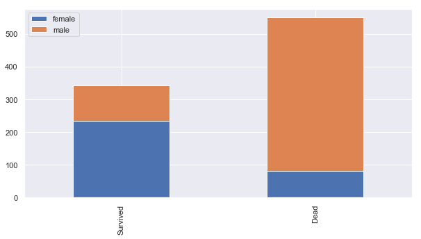


```python
bar_chart_t('Sex')
```


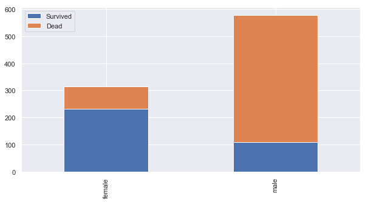


```python
bar_chart('Pclass')
```


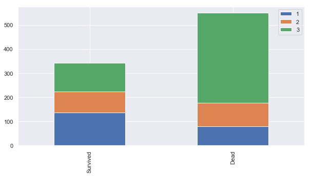


```python
bar_chart_t('Pclass')
```


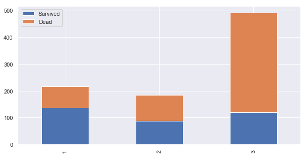


```python
bar_chart('SibSp')
```


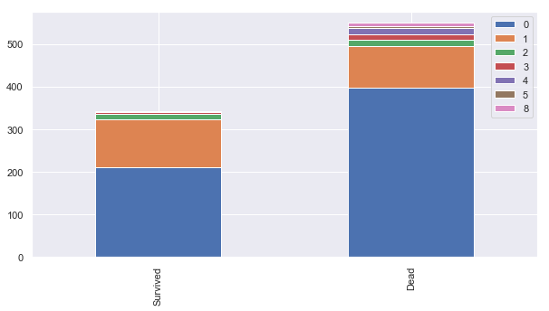


```python
bar_chart_t('SibSp')
```


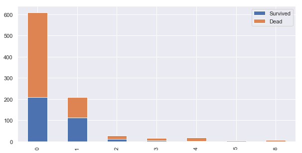


```python
bar_chart('Parch')
```


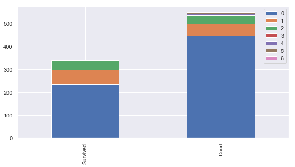


```python
bar_chart_t('Parch')
```


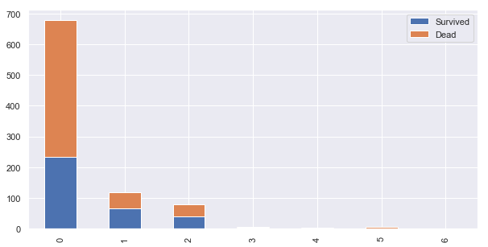


```python
bar_chart('Embarked')
```


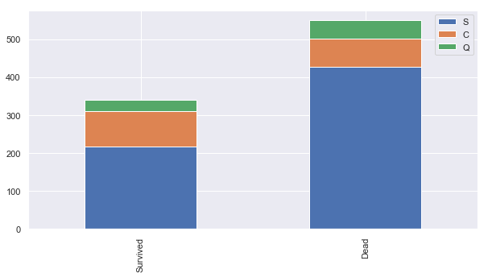


```python
bar_chart_t('Embarked')
```


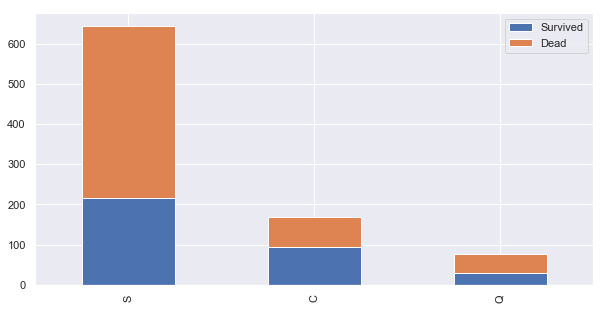


```python
train.head(0)
```


<div>
<style scoped>
    .dataframe tbody tr th:only-of-type {
        vertical-align: middle;
    }

    .dataframe tbody tr th {
        vertical-align: top;
    }

    .dataframe thead th {
        text-align: right;
    }
</style>
<table border="1" class="dataframe">
  <thead>
    <tr style="text-align: right;">
      <th></th>
      <th>PassengerId</th>
      <th>Survived</th>
      <th>Pclass</th>
      <th>Name</th>
      <th>Sex</th>
      <th>Age</th>
      <th>SibSp</th>
      <th>Parch</th>
      <th>Ticket</th>
      <th>Fare</th>
      <th>Cabin</th>
      <th>Embarked</th>
    </tr>
  </thead>
  <tbody>
  </tbody>
</table>
</div>


```python
Image(url="https://static1.squarespace.com/static/5006453fe4b09ef2252ba068/t/5090b249e4b047ba54dfd258/1351660113175/TItanic-Survival-Infographic.jpg?format=1500w" )
```


```python
train_test_data=[train,test]
```


```python
for dataset in train_test_data:
    dataset['Title']=dataset['Name'].str.extract('([A-Za-z]+)\.',expand=False)#####str.extract的用法非常重用，超实用！！！
```


```python
train.head(5)
```


<div>
<style scoped>
    .dataframe tbody tr th:only-of-type {
        vertical-align: middle;
    }

    .dataframe tbody tr th {
        vertical-align: top;
    }

    .dataframe thead th {
        text-align: right;
    }
</style>
<table border="1" class="dataframe">
  <thead>
    <tr style="text-align: right;">
      <th></th>
      <th>PassengerId</th>
      <th>Survived</th>
      <th>Pclass</th>
      <th>Name</th>
      <th>Sex</th>
      <th>Age</th>
      <th>SibSp</th>
      <th>Parch</th>
      <th>Ticket</th>
      <th>Fare</th>
      <th>Cabin</th>
      <th>Embarked</th>
      <th>Title</th>
    </tr>
  </thead>
  <tbody>
    <tr>
      <th>0</th>
      <td>1</td>
      <td>0</td>
      <td>3</td>
      <td>Braund, Mr. Owen Harris</td>
      <td>male</td>
      <td>22.0</td>
      <td>1</td>
      <td>0</td>
      <td>A/5 21171</td>
      <td>7.2500</td>
      <td>NaN</td>
      <td>S</td>
      <td>Mr</td>
    </tr>
    <tr>
      <th>1</th>
      <td>2</td>
      <td>1</td>
      <td>1</td>
      <td>Cumings, Mrs. John Bradley (Florence Briggs Th...</td>
      <td>female</td>
      <td>38.0</td>
      <td>1</td>
      <td>0</td>
      <td>PC 17599</td>
      <td>71.2833</td>
      <td>C85</td>
      <td>C</td>
      <td>Mrs</td>
    </tr>
    <tr>
      <th>2</th>
      <td>3</td>
      <td>1</td>
      <td>3</td>
      <td>Heikkinen, Miss. Laina</td>
      <td>female</td>
      <td>26.0</td>
      <td>0</td>
      <td>0</td>
      <td>STON/O2. 3101282</td>
      <td>7.9250</td>
      <td>NaN</td>
      <td>S</td>
      <td>Miss</td>
    </tr>
    <tr>
      <th>3</th>
      <td>4</td>
      <td>1</td>
      <td>1</td>
      <td>Futrelle, Mrs. Jacques Heath (Lily May Peel)</td>
      <td>female</td>
      <td>35.0</td>
      <td>1</td>
      <td>0</td>
      <td>113803</td>
      <td>53.1000</td>
      <td>C123</td>
      <td>S</td>
      <td>Mrs</td>
    </tr>
    <tr>
      <th>4</th>
      <td>5</td>
      <td>0</td>
      <td>3</td>
      <td>Allen, Mr. William Henry</td>
      <td>male</td>
      <td>35.0</td>
      <td>0</td>
      <td>0</td>
      <td>373450</td>
      <td>8.0500</td>
      <td>NaN</td>
      <td>S</td>
      <td>Mr</td>
    </tr>
  </tbody>
</table>
</div>


```python
train['Title'].value_counts()
```


    Mr          517
    Miss        182
    Mrs         125
    Master       40
    Dr            7
    Rev           6
    Mlle          2
    Major         2
    Col           2
    Lady          1
    Don           1
    Countess      1
    Mme           1
    Ms            1
    Capt          1
    Sir           1
    Jonkheer      1
    Name: Title, dtype: int64


```python
test['Title'].value_counts()
```


    Mr        240
    Miss       78
    Mrs        72
    Master     21
    Rev         2
    Col         2
    Dona        1
    Dr          1
    Ms          1
    Name: Title, dtype: int64


```python
title_mapping={"Mr":0,"Miss":1,"Mrs":2,
              "Master":3,"Dr":3,"Rev":3,"Col":3,"Major":3,"Mlle":3,"Countess":3,
              "Ms":3,"Lady":3,"Jonkheer":3,"Don":3,"Dona":3,"Mme":3,"Capt":3,"Sir":3}
```


```python
for dataset in train_test_data:
    dataset['Title']=dataset['Title'].map(title_mapping)
```


```python
train.head()
```


<div>
<style scoped>
    .dataframe tbody tr th:only-of-type {
        vertical-align: middle;
    }

    .dataframe tbody tr th {
        vertical-align: top;
    }

    .dataframe thead th {
        text-align: right;
    }
</style>
<table border="1" class="dataframe">
  <thead>
    <tr style="text-align: right;">
      <th></th>
      <th>PassengerId</th>
      <th>Survived</th>
      <th>Pclass</th>
      <th>Name</th>
      <th>Sex</th>
      <th>Age</th>
      <th>SibSp</th>
      <th>Parch</th>
      <th>Ticket</th>
      <th>Fare</th>
      <th>Cabin</th>
      <th>Embarked</th>
      <th>Title</th>
    </tr>
  </thead>
  <tbody>
    <tr>
      <th>0</th>
      <td>1</td>
      <td>0</td>
      <td>3</td>
      <td>Braund, Mr. Owen Harris</td>
      <td>male</td>
      <td>22.0</td>
      <td>1</td>
      <td>0</td>
      <td>A/5 21171</td>
      <td>7.2500</td>
      <td>NaN</td>
      <td>S</td>
      <td>0</td>
    </tr>
    <tr>
      <th>1</th>
      <td>2</td>
      <td>1</td>
      <td>1</td>
      <td>Cumings, Mrs. John Bradley (Florence Briggs Th...</td>
      <td>female</td>
      <td>38.0</td>
      <td>1</td>
      <td>0</td>
      <td>PC 17599</td>
      <td>71.2833</td>
      <td>C85</td>
      <td>C</td>
      <td>2</td>
    </tr>
    <tr>
      <th>2</th>
      <td>3</td>
      <td>1</td>
      <td>3</td>
      <td>Heikkinen, Miss. Laina</td>
      <td>female</td>
      <td>26.0</td>
      <td>0</td>
      <td>0</td>
      <td>STON/O2. 3101282</td>
      <td>7.9250</td>
      <td>NaN</td>
      <td>S</td>
      <td>1</td>
    </tr>
    <tr>
      <th>3</th>
      <td>4</td>
      <td>1</td>
      <td>1</td>
      <td>Futrelle, Mrs. Jacques Heath (Lily May Peel)</td>
      <td>female</td>
      <td>35.0</td>
      <td>1</td>
      <td>0</td>
      <td>113803</td>
      <td>53.1000</td>
      <td>C123</td>
      <td>S</td>
      <td>2</td>
    </tr>
    <tr>
      <th>4</th>
      <td>5</td>
      <td>0</td>
      <td>3</td>
      <td>Allen, Mr. William Henry</td>
      <td>male</td>
      <td>35.0</td>
      <td>0</td>
      <td>0</td>
      <td>373450</td>
      <td>8.0500</td>
      <td>NaN</td>
      <td>S</td>
      <td>0</td>
    </tr>
  </tbody>
</table>
</div>


```python
bar_chart('Title')
```


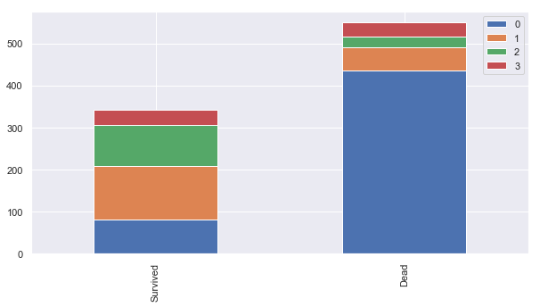


```python
bar_chart_t('Title')
```


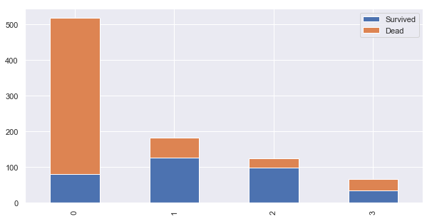


```python
train.drop('Name',axis=1,inplace=True)
test.drop('Name',axis=1,inplace=True)
```


```python
train.head()
```


<div>
<style scoped>
    .dataframe tbody tr th:only-of-type {
        vertical-align: middle;
    }

    .dataframe tbody tr th {
        vertical-align: top;
    }

    .dataframe thead th {
        text-align: right;
    }
</style>
<table border="1" class="dataframe">
  <thead>
    <tr style="text-align: right;">
      <th></th>
      <th>PassengerId</th>
      <th>Survived</th>
      <th>Pclass</th>
      <th>Sex</th>
      <th>Age</th>
      <th>SibSp</th>
      <th>Parch</th>
      <th>Ticket</th>
      <th>Fare</th>
      <th>Cabin</th>
      <th>Embarked</th>
      <th>Title</th>
    </tr>
  </thead>
  <tbody>
    <tr>
      <th>0</th>
      <td>1</td>
      <td>0</td>
      <td>3</td>
      <td>male</td>
      <td>22.0</td>
      <td>1</td>
      <td>0</td>
      <td>A/5 21171</td>
      <td>7.2500</td>
      <td>NaN</td>
      <td>S</td>
      <td>0</td>
    </tr>
    <tr>
      <th>1</th>
      <td>2</td>
      <td>1</td>
      <td>1</td>
      <td>female</td>
      <td>38.0</td>
      <td>1</td>
      <td>0</td>
      <td>PC 17599</td>
      <td>71.2833</td>
      <td>C85</td>
      <td>C</td>
      <td>2</td>
    </tr>
    <tr>
      <th>2</th>
      <td>3</td>
      <td>1</td>
      <td>3</td>
      <td>female</td>
      <td>26.0</td>
      <td>0</td>
      <td>0</td>
      <td>STON/O2. 3101282</td>
      <td>7.9250</td>
      <td>NaN</td>
      <td>S</td>
      <td>1</td>
    </tr>
    <tr>
      <th>3</th>
      <td>4</td>
      <td>1</td>
      <td>1</td>
      <td>female</td>
      <td>35.0</td>
      <td>1</td>
      <td>0</td>
      <td>113803</td>
      <td>53.1000</td>
      <td>C123</td>
      <td>S</td>
      <td>2</td>
    </tr>
    <tr>
      <th>4</th>
      <td>5</td>
      <td>0</td>
      <td>3</td>
      <td>male</td>
      <td>35.0</td>
      <td>0</td>
      <td>0</td>
      <td>373450</td>
      <td>8.0500</td>
      <td>NaN</td>
      <td>S</td>
      <td>0</td>
    </tr>
  </tbody>
</table>
</div>


```python
test.head()
```


<div>
<style scoped>
    .dataframe tbody tr th:only-of-type {
        vertical-align: middle;
    }

    .dataframe tbody tr th {
        vertical-align: top;
    }

    .dataframe thead th {
        text-align: right;
    }
</style>
<table border="1" class="dataframe">
  <thead>
    <tr style="text-align: right;">
      <th></th>
      <th>PassengerId</th>
      <th>Pclass</th>
      <th>Sex</th>
      <th>Age</th>
      <th>SibSp</th>
      <th>Parch</th>
      <th>Ticket</th>
      <th>Fare</th>
      <th>Cabin</th>
      <th>Embarked</th>
      <th>Title</th>
    </tr>
  </thead>
  <tbody>
    <tr>
      <th>0</th>
      <td>892</td>
      <td>3</td>
      <td>male</td>
      <td>34.5</td>
      <td>0</td>
      <td>0</td>
      <td>330911</td>
      <td>7.8292</td>
      <td>NaN</td>
      <td>Q</td>
      <td>0</td>
    </tr>
    <tr>
      <th>1</th>
      <td>893</td>
      <td>3</td>
      <td>female</td>
      <td>47.0</td>
      <td>1</td>
      <td>0</td>
      <td>363272</td>
      <td>7.0000</td>
      <td>NaN</td>
      <td>S</td>
      <td>2</td>
    </tr>
    <tr>
      <th>2</th>
      <td>894</td>
      <td>2</td>
      <td>male</td>
      <td>62.0</td>
      <td>0</td>
      <td>0</td>
      <td>240276</td>
      <td>9.6875</td>
      <td>NaN</td>
      <td>Q</td>
      <td>0</td>
    </tr>
    <tr>
      <th>3</th>
      <td>895</td>
      <td>3</td>
      <td>male</td>
      <td>27.0</td>
      <td>0</td>
      <td>0</td>
      <td>315154</td>
      <td>8.6625</td>
      <td>NaN</td>
      <td>S</td>
      <td>0</td>
    </tr>
    <tr>
      <th>4</th>
      <td>896</td>
      <td>3</td>
      <td>female</td>
      <td>22.0</td>
      <td>1</td>
      <td>1</td>
      <td>3101298</td>
      <td>12.2875</td>
      <td>NaN</td>
      <td>S</td>
      <td>2</td>
    </tr>
  </tbody>
</table>
</div>


```python
sex_mapping={"male":0,"female":1}
```


```python
for dataset in train_test_data:
    dataset['Sex']=dataset['Sex'].map(sex_mapping)
```


```python
bar_chart('Sex')
```


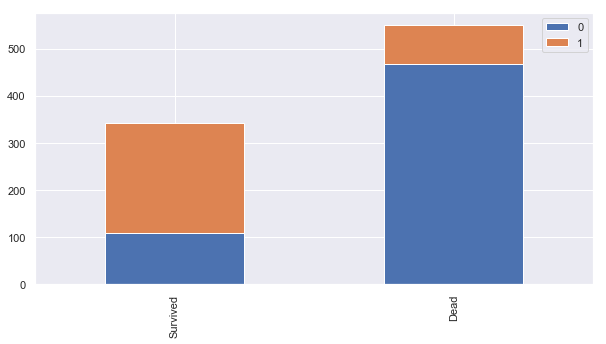


```python
train.head(100)
```


<div>
<style scoped>
    .dataframe tbody tr th:only-of-type {
        vertical-align: middle;
    }

    .dataframe tbody tr th {
        vertical-align: top;
    }

    .dataframe thead th {
        text-align: right;
    }
</style>
<table border="1" class="dataframe">
  <thead>
    <tr style="text-align: right;">
      <th></th>
      <th>PassengerId</th>
      <th>Survived</th>
      <th>Pclass</th>
      <th>Sex</th>
      <th>Age</th>
      <th>SibSp</th>
      <th>Parch</th>
      <th>Ticket</th>
      <th>Fare</th>
      <th>Cabin</th>
      <th>Embarked</th>
      <th>Title</th>
    </tr>
  </thead>
  <tbody>
    <tr>
      <th>0</th>
      <td>1</td>
      <td>0</td>
      <td>3</td>
      <td>0</td>
      <td>22.00</td>
      <td>1</td>
      <td>0</td>
      <td>A/5 21171</td>
      <td>7.2500</td>
      <td>NaN</td>
      <td>S</td>
      <td>0</td>
    </tr>
    <tr>
      <th>1</th>
      <td>2</td>
      <td>1</td>
      <td>1</td>
      <td>1</td>
      <td>38.00</td>
      <td>1</td>
      <td>0</td>
      <td>PC 17599</td>
      <td>71.2833</td>
      <td>C85</td>
      <td>C</td>
      <td>2</td>
    </tr>
    <tr>
      <th>2</th>
      <td>3</td>
      <td>1</td>
      <td>3</td>
      <td>1</td>
      <td>26.00</td>
      <td>0</td>
      <td>0</td>
      <td>STON/O2. 3101282</td>
      <td>7.9250</td>
      <td>NaN</td>
      <td>S</td>
      <td>1</td>
    </tr>
    <tr>
      <th>3</th>
      <td>4</td>
      <td>1</td>
      <td>1</td>
      <td>1</td>
      <td>35.00</td>
      <td>1</td>
      <td>0</td>
      <td>113803</td>
      <td>53.1000</td>
      <td>C123</td>
      <td>S</td>
      <td>2</td>
    </tr>
    <tr>
      <th>4</th>
      <td>5</td>
      <td>0</td>
      <td>3</td>
      <td>0</td>
      <td>35.00</td>
      <td>0</td>
      <td>0</td>
      <td>373450</td>
      <td>8.0500</td>
      <td>NaN</td>
      <td>S</td>
      <td>0</td>
    </tr>
    <tr>
      <th>5</th>
      <td>6</td>
      <td>0</td>
      <td>3</td>
      <td>0</td>
      <td>NaN</td>
      <td>0</td>
      <td>0</td>
      <td>330877</td>
      <td>8.4583</td>
      <td>NaN</td>
      <td>Q</td>
      <td>0</td>
    </tr>
    <tr>
      <th>6</th>
      <td>7</td>
      <td>0</td>
      <td>1</td>
      <td>0</td>
      <td>54.00</td>
      <td>0</td>
      <td>0</td>
      <td>17463</td>
      <td>51.8625</td>
      <td>E46</td>
      <td>S</td>
      <td>0</td>
    </tr>
    <tr>
      <th>7</th>
      <td>8</td>
      <td>0</td>
      <td>3</td>
      <td>0</td>
      <td>2.00</td>
      <td>3</td>
      <td>1</td>
      <td>349909</td>
      <td>21.0750</td>
      <td>NaN</td>
      <td>S</td>
      <td>3</td>
    </tr>
    <tr>
      <th>8</th>
      <td>9</td>
      <td>1</td>
      <td>3</td>
      <td>1</td>
      <td>27.00</td>
      <td>0</td>
      <td>2</td>
      <td>347742</td>
      <td>11.1333</td>
      <td>NaN</td>
      <td>S</td>
      <td>2</td>
    </tr>
    <tr>
      <th>9</th>
      <td>10</td>
      <td>1</td>
      <td>2</td>
      <td>1</td>
      <td>14.00</td>
      <td>1</td>
      <td>0</td>
      <td>237736</td>
      <td>30.0708</td>
      <td>NaN</td>
      <td>C</td>
      <td>2</td>
    </tr>
    <tr>
      <th>10</th>
      <td>11</td>
      <td>1</td>
      <td>3</td>
      <td>1</td>
      <td>4.00</td>
      <td>1</td>
      <td>1</td>
      <td>PP 9549</td>
      <td>16.7000</td>
      <td>G6</td>
      <td>S</td>
      <td>1</td>
    </tr>
    <tr>
      <th>11</th>
      <td>12</td>
      <td>1</td>
      <td>1</td>
      <td>1</td>
      <td>58.00</td>
      <td>0</td>
      <td>0</td>
      <td>113783</td>
      <td>26.5500</td>
      <td>C103</td>
      <td>S</td>
      <td>1</td>
    </tr>
    <tr>
      <th>12</th>
      <td>13</td>
      <td>0</td>
      <td>3</td>
      <td>0</td>
      <td>20.00</td>
      <td>0</td>
      <td>0</td>
      <td>A/5. 2151</td>
      <td>8.0500</td>
      <td>NaN</td>
      <td>S</td>
      <td>0</td>
    </tr>
    <tr>
      <th>13</th>
      <td>14</td>
      <td>0</td>
      <td>3</td>
      <td>0</td>
      <td>39.00</td>
      <td>1</td>
      <td>5</td>
      <td>347082</td>
      <td>31.2750</td>
      <td>NaN</td>
      <td>S</td>
      <td>0</td>
    </tr>
    <tr>
      <th>14</th>
      <td>15</td>
      <td>0</td>
      <td>3</td>
      <td>1</td>
      <td>14.00</td>
      <td>0</td>
      <td>0</td>
      <td>350406</td>
      <td>7.8542</td>
      <td>NaN</td>
      <td>S</td>
      <td>1</td>
    </tr>
    <tr>
      <th>15</th>
      <td>16</td>
      <td>1</td>
      <td>2</td>
      <td>1</td>
      <td>55.00</td>
      <td>0</td>
      <td>0</td>
      <td>248706</td>
      <td>16.0000</td>
      <td>NaN</td>
      <td>S</td>
      <td>2</td>
    </tr>
    <tr>
      <th>16</th>
      <td>17</td>
      <td>0</td>
      <td>3</td>
      <td>0</td>
      <td>2.00</td>
      <td>4</td>
      <td>1</td>
      <td>382652</td>
      <td>29.1250</td>
      <td>NaN</td>
      <td>Q</td>
      <td>3</td>
    </tr>
    <tr>
      <th>17</th>
      <td>18</td>
      <td>1</td>
      <td>2</td>
      <td>0</td>
      <td>NaN</td>
      <td>0</td>
      <td>0</td>
      <td>244373</td>
      <td>13.0000</td>
      <td>NaN</td>
      <td>S</td>
      <td>0</td>
    </tr>
    <tr>
      <th>18</th>
      <td>19</td>
      <td>0</td>
      <td>3</td>
      <td>1</td>
      <td>31.00</td>
      <td>1</td>
      <td>0</td>
      <td>345763</td>
      <td>18.0000</td>
      <td>NaN</td>
      <td>S</td>
      <td>2</td>
    </tr>
    <tr>
      <th>19</th>
      <td>20</td>
      <td>1</td>
      <td>3</td>
      <td>1</td>
      <td>NaN</td>
      <td>0</td>
      <td>0</td>
      <td>2649</td>
      <td>7.2250</td>
      <td>NaN</td>
      <td>C</td>
      <td>2</td>
    </tr>
    <tr>
      <th>20</th>
      <td>21</td>
      <td>0</td>
      <td>2</td>
      <td>0</td>
      <td>35.00</td>
      <td>0</td>
      <td>0</td>
      <td>239865</td>
      <td>26.0000</td>
      <td>NaN</td>
      <td>S</td>
      <td>0</td>
    </tr>
    <tr>
      <th>21</th>
      <td>22</td>
      <td>1</td>
      <td>2</td>
      <td>0</td>
      <td>34.00</td>
      <td>0</td>
      <td>0</td>
      <td>248698</td>
      <td>13.0000</td>
      <td>D56</td>
      <td>S</td>
      <td>0</td>
    </tr>
    <tr>
      <th>22</th>
      <td>23</td>
      <td>1</td>
      <td>3</td>
      <td>1</td>
      <td>15.00</td>
      <td>0</td>
      <td>0</td>
      <td>330923</td>
      <td>8.0292</td>
      <td>NaN</td>
      <td>Q</td>
      <td>1</td>
    </tr>
    <tr>
      <th>23</th>
      <td>24</td>
      <td>1</td>
      <td>1</td>
      <td>0</td>
      <td>28.00</td>
      <td>0</td>
      <td>0</td>
      <td>113788</td>
      <td>35.5000</td>
      <td>A6</td>
      <td>S</td>
      <td>0</td>
    </tr>
    <tr>
      <th>24</th>
      <td>25</td>
      <td>0</td>
      <td>3</td>
      <td>1</td>
      <td>8.00</td>
      <td>3</td>
      <td>1</td>
      <td>349909</td>
      <td>21.0750</td>
      <td>NaN</td>
      <td>S</td>
      <td>1</td>
    </tr>
    <tr>
      <th>25</th>
      <td>26</td>
      <td>1</td>
      <td>3</td>
      <td>1</td>
      <td>38.00</td>
      <td>1</td>
      <td>5</td>
      <td>347077</td>
      <td>31.3875</td>
      <td>NaN</td>
      <td>S</td>
      <td>2</td>
    </tr>
    <tr>
      <th>26</th>
      <td>27</td>
      <td>0</td>
      <td>3</td>
      <td>0</td>
      <td>NaN</td>
      <td>0</td>
      <td>0</td>
      <td>2631</td>
      <td>7.2250</td>
      <td>NaN</td>
      <td>C</td>
      <td>0</td>
    </tr>
    <tr>
      <th>27</th>
      <td>28</td>
      <td>0</td>
      <td>1</td>
      <td>0</td>
      <td>19.00</td>
      <td>3</td>
      <td>2</td>
      <td>19950</td>
      <td>263.0000</td>
      <td>C23 C25 C27</td>
      <td>S</td>
      <td>0</td>
    </tr>
    <tr>
      <th>28</th>
      <td>29</td>
      <td>1</td>
      <td>3</td>
      <td>1</td>
      <td>NaN</td>
      <td>0</td>
      <td>0</td>
      <td>330959</td>
      <td>7.8792</td>
      <td>NaN</td>
      <td>Q</td>
      <td>1</td>
    </tr>
    <tr>
      <th>29</th>
      <td>30</td>
      <td>0</td>
      <td>3</td>
      <td>0</td>
      <td>NaN</td>
      <td>0</td>
      <td>0</td>
      <td>349216</td>
      <td>7.8958</td>
      <td>NaN</td>
      <td>S</td>
      <td>0</td>
    </tr>
    <tr>
      <th>...</th>
      <td>...</td>
      <td>...</td>
      <td>...</td>
      <td>...</td>
      <td>...</td>
      <td>...</td>
      <td>...</td>
      <td>...</td>
      <td>...</td>
      <td>...</td>
      <td>...</td>
      <td>...</td>
    </tr>
    <tr>
      <th>70</th>
      <td>71</td>
      <td>0</td>
      <td>2</td>
      <td>0</td>
      <td>32.00</td>
      <td>0</td>
      <td>0</td>
      <td>C.A. 33111</td>
      <td>10.5000</td>
      <td>NaN</td>
      <td>S</td>
      <td>0</td>
    </tr>
    <tr>
      <th>71</th>
      <td>72</td>
      <td>0</td>
      <td>3</td>
      <td>1</td>
      <td>16.00</td>
      <td>5</td>
      <td>2</td>
      <td>CA 2144</td>
      <td>46.9000</td>
      <td>NaN</td>
      <td>S</td>
      <td>1</td>
    </tr>
    <tr>
      <th>72</th>
      <td>73</td>
      <td>0</td>
      <td>2</td>
      <td>0</td>
      <td>21.00</td>
      <td>0</td>
      <td>0</td>
      <td>S.O.C. 14879</td>
      <td>73.5000</td>
      <td>NaN</td>
      <td>S</td>
      <td>0</td>
    </tr>
    <tr>
      <th>73</th>
      <td>74</td>
      <td>0</td>
      <td>3</td>
      <td>0</td>
      <td>26.00</td>
      <td>1</td>
      <td>0</td>
      <td>2680</td>
      <td>14.4542</td>
      <td>NaN</td>
      <td>C</td>
      <td>0</td>
    </tr>
    <tr>
      <th>74</th>
      <td>75</td>
      <td>1</td>
      <td>3</td>
      <td>0</td>
      <td>32.00</td>
      <td>0</td>
      <td>0</td>
      <td>1601</td>
      <td>56.4958</td>
      <td>NaN</td>
      <td>S</td>
      <td>0</td>
    </tr>
    <tr>
      <th>75</th>
      <td>76</td>
      <td>0</td>
      <td>3</td>
      <td>0</td>
      <td>25.00</td>
      <td>0</td>
      <td>0</td>
      <td>348123</td>
      <td>7.6500</td>
      <td>F G73</td>
      <td>S</td>
      <td>0</td>
    </tr>
    <tr>
      <th>76</th>
      <td>77</td>
      <td>0</td>
      <td>3</td>
      <td>0</td>
      <td>NaN</td>
      <td>0</td>
      <td>0</td>
      <td>349208</td>
      <td>7.8958</td>
      <td>NaN</td>
      <td>S</td>
      <td>0</td>
    </tr>
    <tr>
      <th>77</th>
      <td>78</td>
      <td>0</td>
      <td>3</td>
      <td>0</td>
      <td>NaN</td>
      <td>0</td>
      <td>0</td>
      <td>374746</td>
      <td>8.0500</td>
      <td>NaN</td>
      <td>S</td>
      <td>0</td>
    </tr>
    <tr>
      <th>78</th>
      <td>79</td>
      <td>1</td>
      <td>2</td>
      <td>0</td>
      <td>0.83</td>
      <td>0</td>
      <td>2</td>
      <td>248738</td>
      <td>29.0000</td>
      <td>NaN</td>
      <td>S</td>
      <td>3</td>
    </tr>
    <tr>
      <th>79</th>
      <td>80</td>
      <td>1</td>
      <td>3</td>
      <td>1</td>
      <td>30.00</td>
      <td>0</td>
      <td>0</td>
      <td>364516</td>
      <td>12.4750</td>
      <td>NaN</td>
      <td>S</td>
      <td>1</td>
    </tr>
    <tr>
      <th>80</th>
      <td>81</td>
      <td>0</td>
      <td>3</td>
      <td>0</td>
      <td>22.00</td>
      <td>0</td>
      <td>0</td>
      <td>345767</td>
      <td>9.0000</td>
      <td>NaN</td>
      <td>S</td>
      <td>0</td>
    </tr>
    <tr>
      <th>81</th>
      <td>82</td>
      <td>1</td>
      <td>3</td>
      <td>0</td>
      <td>29.00</td>
      <td>0</td>
      <td>0</td>
      <td>345779</td>
      <td>9.5000</td>
      <td>NaN</td>
      <td>S</td>
      <td>0</td>
    </tr>
    <tr>
      <th>82</th>
      <td>83</td>
      <td>1</td>
      <td>3</td>
      <td>1</td>
      <td>NaN</td>
      <td>0</td>
      <td>0</td>
      <td>330932</td>
      <td>7.7875</td>
      <td>NaN</td>
      <td>Q</td>
      <td>1</td>
    </tr>
    <tr>
      <th>83</th>
      <td>84</td>
      <td>0</td>
      <td>1</td>
      <td>0</td>
      <td>28.00</td>
      <td>0</td>
      <td>0</td>
      <td>113059</td>
      <td>47.1000</td>
      <td>NaN</td>
      <td>S</td>
      <td>0</td>
    </tr>
    <tr>
      <th>84</th>
      <td>85</td>
      <td>1</td>
      <td>2</td>
      <td>1</td>
      <td>17.00</td>
      <td>0</td>
      <td>0</td>
      <td>SO/C 14885</td>
      <td>10.5000</td>
      <td>NaN</td>
      <td>S</td>
      <td>1</td>
    </tr>
    <tr>
      <th>85</th>
      <td>86</td>
      <td>1</td>
      <td>3</td>
      <td>1</td>
      <td>33.00</td>
      <td>3</td>
      <td>0</td>
      <td>3101278</td>
      <td>15.8500</td>
      <td>NaN</td>
      <td>S</td>
      <td>2</td>
    </tr>
    <tr>
      <th>86</th>
      <td>87</td>
      <td>0</td>
      <td>3</td>
      <td>0</td>
      <td>16.00</td>
      <td>1</td>
      <td>3</td>
      <td>W./C. 6608</td>
      <td>34.3750</td>
      <td>NaN</td>
      <td>S</td>
      <td>0</td>
    </tr>
    <tr>
      <th>87</th>
      <td>88</td>
      <td>0</td>
      <td>3</td>
      <td>0</td>
      <td>NaN</td>
      <td>0</td>
      <td>0</td>
      <td>SOTON/OQ 392086</td>
      <td>8.0500</td>
      <td>NaN</td>
      <td>S</td>
      <td>0</td>
    </tr>
    <tr>
      <th>88</th>
      <td>89</td>
      <td>1</td>
      <td>1</td>
      <td>1</td>
      <td>23.00</td>
      <td>3</td>
      <td>2</td>
      <td>19950</td>
      <td>263.0000</td>
      <td>C23 C25 C27</td>
      <td>S</td>
      <td>1</td>
    </tr>
    <tr>
      <th>89</th>
      <td>90</td>
      <td>0</td>
      <td>3</td>
      <td>0</td>
      <td>24.00</td>
      <td>0</td>
      <td>0</td>
      <td>343275</td>
      <td>8.0500</td>
      <td>NaN</td>
      <td>S</td>
      <td>0</td>
    </tr>
    <tr>
      <th>90</th>
      <td>91</td>
      <td>0</td>
      <td>3</td>
      <td>0</td>
      <td>29.00</td>
      <td>0</td>
      <td>0</td>
      <td>343276</td>
      <td>8.0500</td>
      <td>NaN</td>
      <td>S</td>
      <td>0</td>
    </tr>
    <tr>
      <th>91</th>
      <td>92</td>
      <td>0</td>
      <td>3</td>
      <td>0</td>
      <td>20.00</td>
      <td>0</td>
      <td>0</td>
      <td>347466</td>
      <td>7.8542</td>
      <td>NaN</td>
      <td>S</td>
      <td>0</td>
    </tr>
    <tr>
      <th>92</th>
      <td>93</td>
      <td>0</td>
      <td>1</td>
      <td>0</td>
      <td>46.00</td>
      <td>1</td>
      <td>0</td>
      <td>W.E.P. 5734</td>
      <td>61.1750</td>
      <td>E31</td>
      <td>S</td>
      <td>0</td>
    </tr>
    <tr>
      <th>93</th>
      <td>94</td>
      <td>0</td>
      <td>3</td>
      <td>0</td>
      <td>26.00</td>
      <td>1</td>
      <td>2</td>
      <td>C.A. 2315</td>
      <td>20.5750</td>
      <td>NaN</td>
      <td>S</td>
      <td>0</td>
    </tr>
    <tr>
      <th>94</th>
      <td>95</td>
      <td>0</td>
      <td>3</td>
      <td>0</td>
      <td>59.00</td>
      <td>0</td>
      <td>0</td>
      <td>364500</td>
      <td>7.2500</td>
      <td>NaN</td>
      <td>S</td>
      <td>0</td>
    </tr>
    <tr>
      <th>95</th>
      <td>96</td>
      <td>0</td>
      <td>3</td>
      <td>0</td>
      <td>NaN</td>
      <td>0</td>
      <td>0</td>
      <td>374910</td>
      <td>8.0500</td>
      <td>NaN</td>
      <td>S</td>
      <td>0</td>
    </tr>
    <tr>
      <th>96</th>
      <td>97</td>
      <td>0</td>
      <td>1</td>
      <td>0</td>
      <td>71.00</td>
      <td>0</td>
      <td>0</td>
      <td>PC 17754</td>
      <td>34.6542</td>
      <td>A5</td>
      <td>C</td>
      <td>0</td>
    </tr>
    <tr>
      <th>97</th>
      <td>98</td>
      <td>1</td>
      <td>1</td>
      <td>0</td>
      <td>23.00</td>
      <td>0</td>
      <td>1</td>
      <td>PC 17759</td>
      <td>63.3583</td>
      <td>D10 D12</td>
      <td>C</td>
      <td>0</td>
    </tr>
    <tr>
      <th>98</th>
      <td>99</td>
      <td>1</td>
      <td>2</td>
      <td>1</td>
      <td>34.00</td>
      <td>0</td>
      <td>1</td>
      <td>231919</td>
      <td>23.0000</td>
      <td>NaN</td>
      <td>S</td>
      <td>2</td>
    </tr>
    <tr>
      <th>99</th>
      <td>100</td>
      <td>0</td>
      <td>2</td>
      <td>0</td>
      <td>34.00</td>
      <td>1</td>
      <td>0</td>
      <td>244367</td>
      <td>26.0000</td>
      <td>NaN</td>
      <td>S</td>
      <td>0</td>
    </tr>
  </tbody>
</table>
<p>100 rows × 12 columns</p>
</div>


```python
train["Age"].fillna(train.groupby("Title")["Age"].transform("median"),inplace=True)
test["Age"].fillna(test.groupby("Title")["Age"].transform("median"),inplace=True)
```


```python
facet=sns.FacetGrid(train,hue="Survived",aspect=4)
facet.map(sns.kdeplot,'Age',shade=True)
facet.set(xlim=(0,train['Age'].max()))
facet.add_legend()

plt.show()
```


```python
facet=sns.FacetGrid(train,hue="Survived",aspect=4)
facet.map(sns.kdeplot,'Age',shade=True)
facet.set(xlim=(0,train['Age'].max()))
facet.add_legend()
plt.xlim(0,20)
```


    (0, 20)


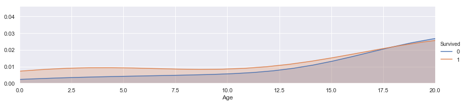


```python
facet=sns.FacetGrid(train,hue="Survived",aspect=4)
facet.map(sns.kdeplot,'Age',shade=True)
facet.set(xlim=(0,train['Age'].max()))
facet.add_legend()
plt.xlim(20,30)
```


    (20, 30)


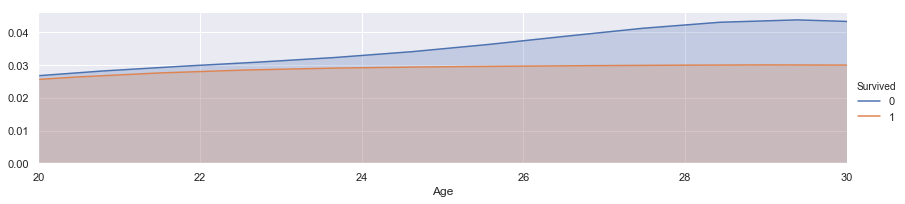


```python
for dataset in train_test_data:
    dataset.loc[ dataset['Age'] <= 16, 'Age'] = 0,
    dataset.loc[(dataset['Age'] > 16) & (dataset['Age'] <= 26), 'Age'] = 1,
    dataset.loc[(dataset['Age'] > 26) & (dataset['Age'] <= 36), 'Age'] = 2,
    dataset.loc[(dataset['Age'] > 36) & (dataset['Age'] <= 62), 'Age'] = 3,
    dataset.loc[ dataset['Age'] > 62, 'Age'] = 4
```


```python
train.head()
```


<div>
<style scoped>
    .dataframe tbody tr th:only-of-type {
        vertical-align: middle;
    }

    .dataframe tbody tr th {
        vertical-align: top;
    }

    .dataframe thead th {
        text-align: right;
    }
</style>
<table border="1" class="dataframe">
  <thead>
    <tr style="text-align: right;">
      <th></th>
      <th>PassengerId</th>
      <th>Survived</th>
      <th>Pclass</th>
      <th>Sex</th>
      <th>Age</th>
      <th>SibSp</th>
      <th>Parch</th>
      <th>Ticket</th>
      <th>Fare</th>
      <th>Cabin</th>
      <th>Embarked</th>
      <th>Title</th>
    </tr>
  </thead>
  <tbody>
    <tr>
      <th>0</th>
      <td>1</td>
      <td>0</td>
      <td>3</td>
      <td>0</td>
      <td>1.0</td>
      <td>1</td>
      <td>0</td>
      <td>A/5 21171</td>
      <td>7.2500</td>
      <td>NaN</td>
      <td>S</td>
      <td>0</td>
    </tr>
    <tr>
      <th>1</th>
      <td>2</td>
      <td>1</td>
      <td>1</td>
      <td>1</td>
      <td>3.0</td>
      <td>1</td>
      <td>0</td>
      <td>PC 17599</td>
      <td>71.2833</td>
      <td>C85</td>
      <td>C</td>
      <td>2</td>
    </tr>
    <tr>
      <th>2</th>
      <td>3</td>
      <td>1</td>
      <td>3</td>
      <td>1</td>
      <td>1.0</td>
      <td>0</td>
      <td>0</td>
      <td>STON/O2. 3101282</td>
      <td>7.9250</td>
      <td>NaN</td>
      <td>S</td>
      <td>1</td>
    </tr>
    <tr>
      <th>3</th>
      <td>4</td>
      <td>1</td>
      <td>1</td>
      <td>1</td>
      <td>2.0</td>
      <td>1</td>
      <td>0</td>
      <td>113803</td>
      <td>53.1000</td>
      <td>C123</td>
      <td>S</td>
      <td>2</td>
    </tr>
    <tr>
      <th>4</th>
      <td>5</td>
      <td>0</td>
      <td>3</td>
      <td>0</td>
      <td>2.0</td>
      <td>0</td>
      <td>0</td>
      <td>373450</td>
      <td>8.0500</td>
      <td>NaN</td>
      <td>S</td>
      <td>0</td>
    </tr>
  </tbody>
</table>
</div>


```python
bar_chart('Age')
```


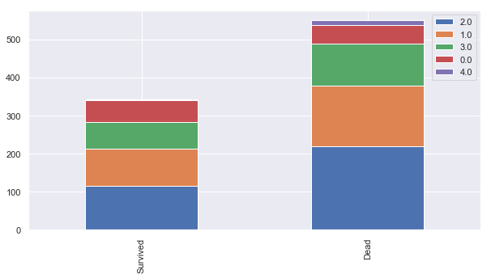


```python
bar_chart_t('Age')
```


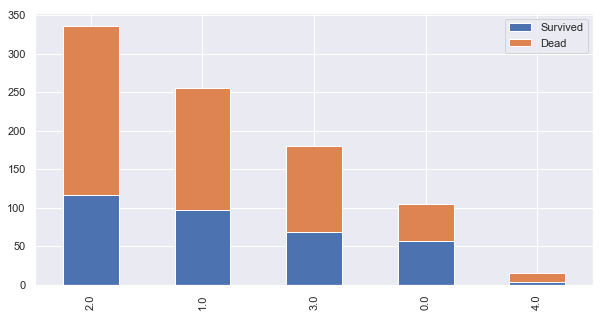


```python
Pclass1=train[train['Pclass']==1]['Embarked'].value_counts()
Pclass2=train[train['Pclass']==2]['Embarked'].value_counts()
Pclass3=train[train['Pclass']==3]['Embarked'].value_counts()
df=pd.DataFrame([Pclass1,Pclass2,Pclass3])
```


```python
df
```


<div>
<style scoped>
    .dataframe tbody tr th:only-of-type {
        vertical-align: middle;
    }

    .dataframe tbody tr th {
        vertical-align: top;
    }

    .dataframe thead th {
        text-align: right;
    }
</style>
<table border="1" class="dataframe">
  <thead>
    <tr style="text-align: right;">
      <th></th>
      <th>C</th>
      <th>Q</th>
      <th>S</th>
    </tr>
  </thead>
  <tbody>
    <tr>
      <th>Embarked</th>
      <td>85</td>
      <td>2</td>
      <td>127</td>
    </tr>
    <tr>
      <th>Embarked</th>
      <td>17</td>
      <td>3</td>
      <td>164</td>
    </tr>
    <tr>
      <th>Embarked</th>
      <td>66</td>
      <td>72</td>
      <td>353</td>
    </tr>
  </tbody>
</table>
</div>


```python
df.index=['1st class','2nd class','3rd class']
```


```python
df
```


<div>
<style scoped>
    .dataframe tbody tr th:only-of-type {
        vertical-align: middle;
    }

    .dataframe tbody tr th {
        vertical-align: top;
    }

    .dataframe thead th {
        text-align: right;
    }
</style>
<table border="1" class="dataframe">
  <thead>
    <tr style="text-align: right;">
      <th></th>
      <th>C</th>
      <th>Q</th>
      <th>S</th>
    </tr>
  </thead>
  <tbody>
    <tr>
      <th>1st class</th>
      <td>85</td>
      <td>2</td>
      <td>127</td>
    </tr>
    <tr>
      <th>2nd class</th>
      <td>17</td>
      <td>3</td>
      <td>164</td>
    </tr>
    <tr>
      <th>3rd class</th>
      <td>66</td>
      <td>72</td>
      <td>353</td>
    </tr>
  </tbody>
</table>
</div>


```python
df.plot(kind='bar',stacked=True,figsize=(10,5))
```


    <matplotlib.axes._subplots.AxesSubplot at 0x2437f79d908>


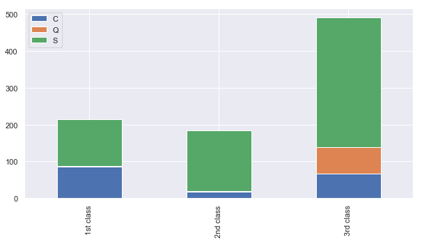


```python
for dataset in train_test_data:
    dataset['Embarked']=dataset['Embarked'].fillna('S')
```


```python
train.head()
```


<div>
<style scoped>
    .dataframe tbody tr th:only-of-type {
        vertical-align: middle;
    }

    .dataframe tbody tr th {
        vertical-align: top;
    }

    .dataframe thead th {
        text-align: right;
    }
</style>
<table border="1" class="dataframe">
  <thead>
    <tr style="text-align: right;">
      <th></th>
      <th>PassengerId</th>
      <th>Survived</th>
      <th>Pclass</th>
      <th>Sex</th>
      <th>Age</th>
      <th>SibSp</th>
      <th>Parch</th>
      <th>Ticket</th>
      <th>Fare</th>
      <th>Cabin</th>
      <th>Embarked</th>
      <th>Title</th>
    </tr>
  </thead>
  <tbody>
    <tr>
      <th>0</th>
      <td>1</td>
      <td>0</td>
      <td>3</td>
      <td>0</td>
      <td>1.0</td>
      <td>1</td>
      <td>0</td>
      <td>A/5 21171</td>
      <td>7.2500</td>
      <td>NaN</td>
      <td>S</td>
      <td>0</td>
    </tr>
    <tr>
      <th>1</th>
      <td>2</td>
      <td>1</td>
      <td>1</td>
      <td>1</td>
      <td>3.0</td>
      <td>1</td>
      <td>0</td>
      <td>PC 17599</td>
      <td>71.2833</td>
      <td>C85</td>
      <td>C</td>
      <td>2</td>
    </tr>
    <tr>
      <th>2</th>
      <td>3</td>
      <td>1</td>
      <td>3</td>
      <td>1</td>
      <td>1.0</td>
      <td>0</td>
      <td>0</td>
      <td>STON/O2. 3101282</td>
      <td>7.9250</td>
      <td>NaN</td>
      <td>S</td>
      <td>1</td>
    </tr>
    <tr>
      <th>3</th>
      <td>4</td>
      <td>1</td>
      <td>1</td>
      <td>1</td>
      <td>2.0</td>
      <td>1</td>
      <td>0</td>
      <td>113803</td>
      <td>53.1000</td>
      <td>C123</td>
      <td>S</td>
      <td>2</td>
    </tr>
    <tr>
      <th>4</th>
      <td>5</td>
      <td>0</td>
      <td>3</td>
      <td>0</td>
      <td>2.0</td>
      <td>0</td>
      <td>0</td>
      <td>373450</td>
      <td>8.0500</td>
      <td>NaN</td>
      <td>S</td>
      <td>0</td>
    </tr>
  </tbody>
</table>
</div>


```python
embarked_mapping={"S":0,"C":1,"Q":2}
for dataset in train_test_data:
    dataset['Embarked']=dataset['Embarked'].map(embarked_mapping)
```


```python
train["Fare"].fillna(train.groupby("Pclass")["Fare"].transform("median"),inplace=True)
test["Fare"].fillna(test.groupby("Pclass")["Fare"].transform("median"),inplace=True)
```


```python
facet=sns.FacetGrid(train,hue="Survived",aspect=4)
facet.map(sns.kdeplot,'Fare',shade=True)
facet.set(xlim=(0,train['Fare'].max()))
facet.add_legend()

plt.show()
```


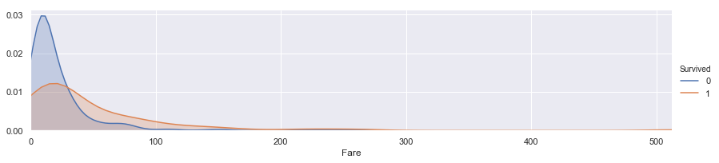


```python
for dataset in train_test_data:
    dataset.loc[dataset['Fare']<=17,'Fare']=0,
    dataset.loc[(dataset['Fare']>17)&(dataset['Fare']<=30),'Fare']=1,
    dataset.loc[(dataset['Fare']>30)&(dataset['Fare']<=100),'Fare']=2,
    dataset.loc[(dataset['Fare']>100),'Fare']=3
```


```python
train.head()
```


<div>
<style scoped>
    .dataframe tbody tr th:only-of-type {
        vertical-align: middle;
    }

    .dataframe tbody tr th {
        vertical-align: top;
    }

    .dataframe thead th {
        text-align: right;
    }
</style>
<table border="1" class="dataframe">
  <thead>
    <tr style="text-align: right;">
      <th></th>
      <th>PassengerId</th>
      <th>Survived</th>
      <th>Pclass</th>
      <th>Sex</th>
      <th>Age</th>
      <th>SibSp</th>
      <th>Parch</th>
      <th>Ticket</th>
      <th>Fare</th>
      <th>Cabin</th>
      <th>Embarked</th>
      <th>Title</th>
    </tr>
  </thead>
  <tbody>
    <tr>
      <th>0</th>
      <td>1</td>
      <td>0</td>
      <td>3</td>
      <td>0</td>
      <td>1.0</td>
      <td>1</td>
      <td>0</td>
      <td>A/5 21171</td>
      <td>0.0</td>
      <td>NaN</td>
      <td>0</td>
      <td>0</td>
    </tr>
    <tr>
      <th>1</th>
      <td>2</td>
      <td>1</td>
      <td>1</td>
      <td>1</td>
      <td>3.0</td>
      <td>1</td>
      <td>0</td>
      <td>PC 17599</td>
      <td>2.0</td>
      <td>C85</td>
      <td>1</td>
      <td>2</td>
    </tr>
    <tr>
      <th>2</th>
      <td>3</td>
      <td>1</td>
      <td>3</td>
      <td>1</td>
      <td>1.0</td>
      <td>0</td>
      <td>0</td>
      <td>STON/O2. 3101282</td>
      <td>0.0</td>
      <td>NaN</td>
      <td>0</td>
      <td>1</td>
    </tr>
    <tr>
      <th>3</th>
      <td>4</td>
      <td>1</td>
      <td>1</td>
      <td>1</td>
      <td>2.0</td>
      <td>1</td>
      <td>0</td>
      <td>113803</td>
      <td>2.0</td>
      <td>C123</td>
      <td>0</td>
      <td>2</td>
    </tr>
    <tr>
      <th>4</th>
      <td>5</td>
      <td>0</td>
      <td>3</td>
      <td>0</td>
      <td>2.0</td>
      <td>0</td>
      <td>0</td>
      <td>373450</td>
      <td>0.0</td>
      <td>NaN</td>
      <td>0</td>
      <td>0</td>
    </tr>
  </tbody>
</table>
</div>


```python
train.Cabin.value_counts()
```


    C23 C25 C27        4
    B96 B98            4
    G6                 4
    E101               3
    F33                3
    F2                 3
    C22 C26            3
    D                  3
    C126               2
    C92                2
    D36                2
    C52                2
    B77                2
    C93                2
    C124               2
    C78                2
    B49                2
    C65                2
    B22                2
    F G73              2
    C83                2
    F4                 2
    E24                2
    B28                2
    E121               2
    E67                2
    C123               2
    B57 B59 B63 B66    2
    B51 B53 B55        2
    B35                2
                      ..
    F G63              1
    C49                1
    E50                1
    E17                1
    C103               1
    C148               1
    D50                1
    D15                1
    A5                 1
    A23                1
    A14                1
    E10                1
    C95                1
    D30                1
    A26                1
    A24                1
    B4                 1
    A32                1
    B80                1
    C82                1
    A19                1
    E34                1
    E58                1
    C85                1
    B86                1
    E77                1
    C45                1
    C32                1
    C101               1
    D11                1
    Name: Cabin, Length: 147, dtype: int64


```python
for dataset in train_test_data:
    dataset['Cabin']=dataset['Cabin'].str[:1]
```


```python
Pclass1=train[train['Pclass']==1]['Cabin'].value_counts()
Pclass2=train[train['Pclass']==2]['Cabin'].value_counts()
Pclass3=train[train['Pclass']==3]['Cabin'].value_counts()
df=pd.DataFrame([Pclass1,Pclass2,Pclass3])
df.index=['1st class','2nd class','3ir class']
df.plot(kind='bar',stacked=True,figsize=(10,5))
```


    <matplotlib.axes._subplots.AxesSubplot at 0x2437f37ccf8>


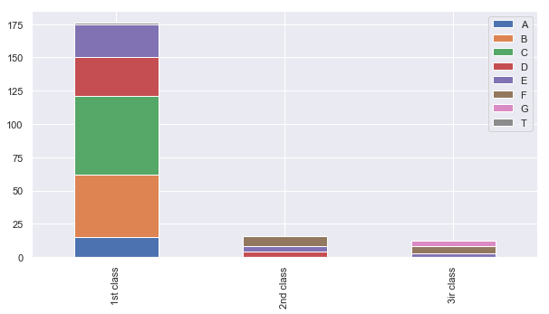


```python
cabin_mapping={"A":0,"B":0.4,"C":0.8,"D":1.2,"E":1.6,"F":2,"G":2.4,"T":2.8}
for dataset in train_test_data:
    dataset['Cabin']=dataset['Cabin'].map(cabin_mapping)
```


```python
train["Cabin"].fillna(train.groupby("Pclass")["Cabin"].transform("median"),inplace=True)
test["Cabin"].fillna(test.groupby("Pclass")["Cabin"].transform("median"),inplace=True)
```


```python
train.head()
```


<div>
<style scoped>
    .dataframe tbody tr th:only-of-type {
        vertical-align: middle;
    }

    .dataframe tbody tr th {
        vertical-align: top;
    }

    .dataframe thead th {
        text-align: right;
    }
</style>
<table border="1" class="dataframe">
  <thead>
    <tr style="text-align: right;">
      <th></th>
      <th>PassengerId</th>
      <th>Survived</th>
      <th>Pclass</th>
      <th>Sex</th>
      <th>Age</th>
      <th>SibSp</th>
      <th>Parch</th>
      <th>Ticket</th>
      <th>Fare</th>
      <th>Cabin</th>
      <th>Embarked</th>
      <th>Title</th>
    </tr>
  </thead>
  <tbody>
    <tr>
      <th>0</th>
      <td>1</td>
      <td>0</td>
      <td>3</td>
      <td>0</td>
      <td>1.0</td>
      <td>1</td>
      <td>0</td>
      <td>A/5 21171</td>
      <td>0.0</td>
      <td>2.0</td>
      <td>0</td>
      <td>0</td>
    </tr>
    <tr>
      <th>1</th>
      <td>2</td>
      <td>1</td>
      <td>1</td>
      <td>1</td>
      <td>3.0</td>
      <td>1</td>
      <td>0</td>
      <td>PC 17599</td>
      <td>2.0</td>
      <td>0.8</td>
      <td>1</td>
      <td>2</td>
    </tr>
    <tr>
      <th>2</th>
      <td>3</td>
      <td>1</td>
      <td>3</td>
      <td>1</td>
      <td>1.0</td>
      <td>0</td>
      <td>0</td>
      <td>STON/O2. 3101282</td>
      <td>0.0</td>
      <td>2.0</td>
      <td>0</td>
      <td>1</td>
    </tr>
    <tr>
      <th>3</th>
      <td>4</td>
      <td>1</td>
      <td>1</td>
      <td>1</td>
      <td>2.0</td>
      <td>1</td>
      <td>0</td>
      <td>113803</td>
      <td>2.0</td>
      <td>0.8</td>
      <td>0</td>
      <td>2</td>
    </tr>
    <tr>
      <th>4</th>
      <td>5</td>
      <td>0</td>
      <td>3</td>
      <td>0</td>
      <td>2.0</td>
      <td>0</td>
      <td>0</td>
      <td>373450</td>
      <td>0.0</td>
      <td>2.0</td>
      <td>0</td>
      <td>0</td>
    </tr>
  </tbody>
</table>
</div>


```python
train['FamilySize']=train['SibSp']+train['Parch']+1
test['FamilySize']=test['SibSp']+test['Parch']+1
```


```python
train.head()
```


<div>
<style scoped>
    .dataframe tbody tr th:only-of-type {
        vertical-align: middle;
    }

    .dataframe tbody tr th {
        vertical-align: top;
    }

    .dataframe thead th {
        text-align: right;
    }
</style>
<table border="1" class="dataframe">
  <thead>
    <tr style="text-align: right;">
      <th></th>
      <th>PassengerId</th>
      <th>Survived</th>
      <th>Pclass</th>
      <th>Sex</th>
      <th>Age</th>
      <th>SibSp</th>
      <th>Parch</th>
      <th>Ticket</th>
      <th>Fare</th>
      <th>Cabin</th>
      <th>Embarked</th>
      <th>Title</th>
      <th>FamilySize</th>
    </tr>
  </thead>
  <tbody>
    <tr>
      <th>0</th>
      <td>1</td>
      <td>0</td>
      <td>3</td>
      <td>0</td>
      <td>1.0</td>
      <td>1</td>
      <td>0</td>
      <td>A/5 21171</td>
      <td>0.0</td>
      <td>2.0</td>
      <td>0</td>
      <td>0</td>
      <td>2</td>
    </tr>
    <tr>
      <th>1</th>
      <td>2</td>
      <td>1</td>
      <td>1</td>
      <td>1</td>
      <td>3.0</td>
      <td>1</td>
      <td>0</td>
      <td>PC 17599</td>
      <td>2.0</td>
      <td>0.8</td>
      <td>1</td>
      <td>2</td>
      <td>2</td>
    </tr>
    <tr>
      <th>2</th>
      <td>3</td>
      <td>1</td>
      <td>3</td>
      <td>1</td>
      <td>1.0</td>
      <td>0</td>
      <td>0</td>
      <td>STON/O2. 3101282</td>
      <td>0.0</td>
      <td>2.0</td>
      <td>0</td>
      <td>1</td>
      <td>1</td>
    </tr>
    <tr>
      <th>3</th>
      <td>4</td>
      <td>1</td>
      <td>1</td>
      <td>1</td>
      <td>2.0</td>
      <td>1</td>
      <td>0</td>
      <td>113803</td>
      <td>2.0</td>
      <td>0.8</td>
      <td>0</td>
      <td>2</td>
      <td>2</td>
    </tr>
    <tr>
      <th>4</th>
      <td>5</td>
      <td>0</td>
      <td>3</td>
      <td>0</td>
      <td>2.0</td>
      <td>0</td>
      <td>0</td>
      <td>373450</td>
      <td>0.0</td>
      <td>2.0</td>
      <td>0</td>
      <td>0</td>
      <td>1</td>
    </tr>
  </tbody>
</table>
</div>


```python
facet=sns.FacetGrid(train, hue="Survived",aspect=4)
facet.map(sns.kdeplot,'FamilySize',shade= True)
facet.set(xlim=(0, train['FamilySize'].max()))
facet.add_legend()
plt.xlim(0)
```


    (0, 11.0)


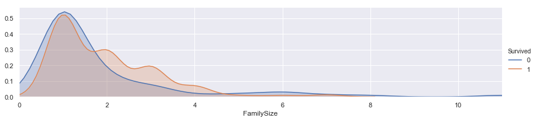


```python
family_mapping={1:0,2:0.4,3:0.8,4:1.2,5:1.6,6:2.0,7:2.4,8:2.8,9:3.2,10:3.6,11:4.0}
for dataset in train_test_data:
    dataset['FamilySize']=dataset["FamilySize"].map(family_mapping)
```


```python
train.head()
```


<div>
<style scoped>
    .dataframe tbody tr th:only-of-type {
        vertical-align: middle;
    }

    .dataframe tbody tr th {
        vertical-align: top;
    }

    .dataframe thead th {
        text-align: right;
    }
</style>
<table border="1" class="dataframe">
  <thead>
    <tr style="text-align: right;">
      <th></th>
      <th>PassengerId</th>
      <th>Survived</th>
      <th>Pclass</th>
      <th>Sex</th>
      <th>Age</th>
      <th>SibSp</th>
      <th>Parch</th>
      <th>Ticket</th>
      <th>Fare</th>
      <th>Cabin</th>
      <th>Embarked</th>
      <th>Title</th>
      <th>FamilySize</th>
    </tr>
  </thead>
  <tbody>
    <tr>
      <th>0</th>
      <td>1</td>
      <td>0</td>
      <td>3</td>
      <td>0</td>
      <td>1.0</td>
      <td>1</td>
      <td>0</td>
      <td>A/5 21171</td>
      <td>0.0</td>
      <td>2.0</td>
      <td>0</td>
      <td>0</td>
      <td>0.4</td>
    </tr>
    <tr>
      <th>1</th>
      <td>2</td>
      <td>1</td>
      <td>1</td>
      <td>1</td>
      <td>3.0</td>
      <td>1</td>
      <td>0</td>
      <td>PC 17599</td>
      <td>2.0</td>
      <td>0.8</td>
      <td>1</td>
      <td>2</td>
      <td>0.4</td>
    </tr>
    <tr>
      <th>2</th>
      <td>3</td>
      <td>1</td>
      <td>3</td>
      <td>1</td>
      <td>1.0</td>
      <td>0</td>
      <td>0</td>
      <td>STON/O2. 3101282</td>
      <td>0.0</td>
      <td>2.0</td>
      <td>0</td>
      <td>1</td>
      <td>0.0</td>
    </tr>
    <tr>
      <th>3</th>
      <td>4</td>
      <td>1</td>
      <td>1</td>
      <td>1</td>
      <td>2.0</td>
      <td>1</td>
      <td>0</td>
      <td>113803</td>
      <td>2.0</td>
      <td>0.8</td>
      <td>0</td>
      <td>2</td>
      <td>0.4</td>
    </tr>
    <tr>
      <th>4</th>
      <td>5</td>
      <td>0</td>
      <td>3</td>
      <td>0</td>
      <td>2.0</td>
      <td>0</td>
      <td>0</td>
      <td>373450</td>
      <td>0.0</td>
      <td>2.0</td>
      <td>0</td>
      <td>0</td>
      <td>0.0</td>
    </tr>
  </tbody>
</table>
</div>


```python
features_drop=['Ticket','SibSp','Parch']
train=train.drop(features_drop,axis=1)
test=test.drop(features_drop,axis=1)
train=train.drop(['PassengerId'],axis=1)
```


```python
train_data=train.drop('Survived',axis=1)
target=train['Survived']

train_data.shape,target.shape
```


    ((891, 8), (891,))


```python
train_data.head(10)
```


<div>
<style scoped>
    .dataframe tbody tr th:only-of-type {
        vertical-align: middle;
    }

    .dataframe tbody tr th {
        vertical-align: top;
    }

    .dataframe thead th {
        text-align: right;
    }
</style>
<table border="1" class="dataframe">
  <thead>
    <tr style="text-align: right;">
      <th></th>
      <th>Pclass</th>
      <th>Sex</th>
      <th>Age</th>
      <th>Fare</th>
      <th>Cabin</th>
      <th>Embarked</th>
      <th>Title</th>
      <th>FamilySize</th>
    </tr>
  </thead>
  <tbody>
    <tr>
      <th>0</th>
      <td>3</td>
      <td>0</td>
      <td>1.0</td>
      <td>0.0</td>
      <td>2.0</td>
      <td>0</td>
      <td>0</td>
      <td>0.4</td>
    </tr>
    <tr>
      <th>1</th>
      <td>1</td>
      <td>1</td>
      <td>3.0</td>
      <td>2.0</td>
      <td>0.8</td>
      <td>1</td>
      <td>2</td>
      <td>0.4</td>
    </tr>
    <tr>
      <th>2</th>
      <td>3</td>
      <td>1</td>
      <td>1.0</td>
      <td>0.0</td>
      <td>2.0</td>
      <td>0</td>
      <td>1</td>
      <td>0.0</td>
    </tr>
    <tr>
      <th>3</th>
      <td>1</td>
      <td>1</td>
      <td>2.0</td>
      <td>2.0</td>
      <td>0.8</td>
      <td>0</td>
      <td>2</td>
      <td>0.4</td>
    </tr>
    <tr>
      <th>4</th>
      <td>3</td>
      <td>0</td>
      <td>2.0</td>
      <td>0.0</td>
      <td>2.0</td>
      <td>0</td>
      <td>0</td>
      <td>0.0</td>
    </tr>
    <tr>
      <th>5</th>
      <td>3</td>
      <td>0</td>
      <td>2.0</td>
      <td>0.0</td>
      <td>2.0</td>
      <td>2</td>
      <td>0</td>
      <td>0.0</td>
    </tr>
    <tr>
      <th>6</th>
      <td>1</td>
      <td>0</td>
      <td>3.0</td>
      <td>2.0</td>
      <td>1.6</td>
      <td>0</td>
      <td>0</td>
      <td>0.0</td>
    </tr>
    <tr>
      <th>7</th>
      <td>3</td>
      <td>0</td>
      <td>0.0</td>
      <td>1.0</td>
      <td>2.0</td>
      <td>0</td>
      <td>3</td>
      <td>1.6</td>
    </tr>
    <tr>
      <th>8</th>
      <td>3</td>
      <td>1</td>
      <td>2.0</td>
      <td>0.0</td>
      <td>2.0</td>
      <td>0</td>
      <td>2</td>
      <td>0.8</td>
    </tr>
    <tr>
      <th>9</th>
      <td>2</td>
      <td>1</td>
      <td>0.0</td>
      <td>2.0</td>
      <td>1.8</td>
      <td>1</td>
      <td>2</td>
      <td>0.4</td>
    </tr>
  </tbody>
</table>
</div>


```python
from sklearn.neighbors import KNeighborsClassifier
from sklearn.tree import DecisionTreeClassifier
from sklearn.ensemble import RandomForestClassifier
from sklearn.naive_bayes import GaussianNB
from sklearn.svm import SVC

import numpy as np
```


```python
train.info()
```

    <class 'pandas.core.frame.DataFrame'>
    RangeIndex: 891 entries, 0 to 890
    Data columns (total 9 columns):
    Survived      891 non-null int64
    Pclass        891 non-null int64
    Sex           891 non-null int64
    Age           891 non-null float64
    Fare          891 non-null float64
    Cabin         891 non-null float64
    Embarked      891 non-null int64
    Title         891 non-null int64
    FamilySize    891 non-null float64
    dtypes: float64(4), int64(5)
    memory usage: 62.7 KB
    


```python
from sklearn.model_selection import KFold
from sklearn.model_selection import cross_val_score
k_fold=KFold(n_splits=10,shuffle=True,random_state=0)
```


```python
clf=KNeighborsClassifier(n_neighbors=13)
```


```python
scoring='accuracy'
```


```python
score=cross_val_score(clf,train_data,target,cv=k_fold,n_jobs=1,scoring=scoring)
```


```python
print(score)
```

    [0.82222222 0.76404494 0.80898876 0.83146067 0.87640449 0.82022472
     0.85393258 0.79775281 0.84269663 0.84269663]
    


```python
round(np.mean(score)*100,2)
```


    82.6


```python
clf=DecisionTreeClassifier()
scoring='accuracy'
score=cross_val_score(clf,train_data,target,cv=k_fold,n_jobs=1,scoring=scoring)
print(score)
```

    [0.76666667 0.80898876 0.76404494 0.76404494 0.87640449 0.75280899
     0.83146067 0.82022472 0.74157303 0.78651685]
    


```python
round(np.mean(score)*100,2)
```


    79.13


```python
clf=RandomForestClassifier()
scoring='accuracy'
score=cross_val_score(clf,train_data,target,cv=k_fold,n_jobs=1,scoring=scoring)
print(score)
```

    [0.8        0.86516854 0.83146067 0.7752809  0.84269663 0.78651685
     0.78651685 0.80898876 0.75280899 0.80898876]
    


```python
round(np.mean(score)*100,2)
```


    80.58


```python
clf=GaussianNB()
scoring='accuracy'
score=cross_val_score(clf,train_data,target,cv=k_fold,n_jobs=1,scoring=scoring)
print(score)
```

    [0.85555556 0.73033708 0.75280899 0.75280899 0.70786517 0.80898876
     0.76404494 0.80898876 0.86516854 0.83146067]
    


```python
round(np.mean(score)*100,2)
```


    78.78


```python
clf=SVC()
scoring='accuracy'
score=cross_val_score(clf,train_data,target,cv=k_fold,n_jobs=1,scoring=scoring)
print(score)
```

    [0.83333333 0.80898876 0.83146067 0.82022472 0.84269663 0.82022472
     0.84269663 0.85393258 0.83146067 0.86516854]
    


```python
round(np.mean(score)*100,2)
```


    83.5


```python
clf=SVC()
clf.fit(train_data,target)
```


    SVC(C=1.0, cache_size=200, class_weight=None, coef0=0.0,
      decision_function_shape='ovr', degree=3, gamma='auto', kernel='rbf',
      max_iter=-1, probability=False, random_state=None, shrinking=True,
      tol=0.001, verbose=False)


```python
test_data=test.drop("PassengerId",axis=1).copy()
```


```python
prediction=clf.predict(test_data)
```


```python
submission=pd.DataFrame({"PassengerId":test["PassengerId"],"Survived":prediction})
```


```python
submission.to_csv('submission.csv',index=False)
```


```python
submission=pd.read_csv('submission.csv')
```


```python
submission.head()
```


<div>
<style scoped>
    .dataframe tbody tr th:only-of-type {
        vertical-align: middle;
    }

    .dataframe tbody tr th {
        vertical-align: top;
    }

    .dataframe thead th {
        text-align: right;
    }
</style>
<table border="1" class="dataframe">
  <thead>
    <tr style="text-align: right;">
      <th></th>
      <th>PassengerId</th>
      <th>Survived</th>
    </tr>
  </thead>
  <tbody>
    <tr>
      <th>0</th>
      <td>892</td>
      <td>0</td>
    </tr>
    <tr>
      <th>1</th>
      <td>893</td>
      <td>1</td>
    </tr>
    <tr>
      <th>2</th>
      <td>894</td>
      <td>0</td>
    </tr>
    <tr>
      <th>3</th>
      <td>895</td>
      <td>0</td>
    </tr>
    <tr>
      <th>4</th>
      <td>896</td>
      <td>1</td>
    </tr>
  </tbody>
</table>
</div>


