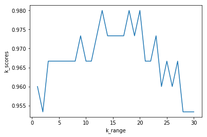
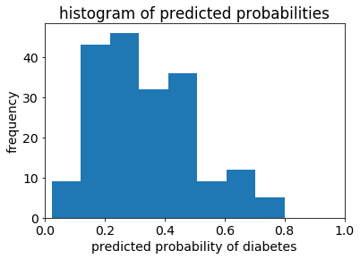
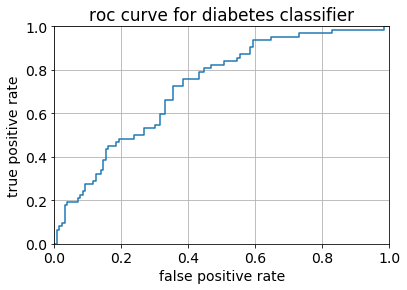

```python
from sklearn import datasets
```


```python
from sklearn.datasets import load_iris
from sklearn.cross_validation import train_test_split
from sklearn.neighbors import KNeighborsClassifier
from sklearn import metrics
```

    c:\users\tom\appdata\local\programs\python\python36\lib\site-packages\sklearn\cross_validation.py:41: DeprecationWarning: This module was deprecated in version 0.18 in favor of the model_selection module into which all the refactored classes and functions are moved. Also note that the interface of the new CV iterators are different from that of this module. This module will be removed in 0.20.
      "This module will be removed in 0.20.", DeprecationWarning)
    


```python
iris=load_iris()
X=iris.data
y=iris.target
```


```python
X_train,X_test,y_train,y_test=train_test_split(X,y,random_state=2)
```


```python
knn=KNeighborsClassifier(n_neighbors=5)
knn.fit(X_train,y_train)
print(metrics.accuracy_score(y_test,knn.predict(X_test)))
```

    1.0
    


```python
from sklearn.cross_validation import KFold
kf=KFold(25,n_folds=5,shuffle=False)
```


```python
print('{}{:^61}{}'.format('Iteration','Training set observations','Testing set observations'))
for iteration,data in enumerate(kf,start=1):
    print('{:^9}{}{:^25}'.format(iteration,data[0],str(data[1])))
```

    Iteration                  Training set observations                  Testing set observations
        1    [ 5  6  7  8  9 10 11 12 13 14 15 16 17 18 19 20 21 22 23 24]       [0 1 2 3 4]       
        2    [ 0  1  2  3  4 10 11 12 13 14 15 16 17 18 19 20 21 22 23 24]       [5 6 7 8 9]       
        3    [ 0  1  2  3  4  5  6  7  8  9 15 16 17 18 19 20 21 22 23 24]    [10 11 12 13 14]     
        4    [ 0  1  2  3  4  5  6  7  8  9 10 11 12 13 14 20 21 22 23 24]    [15 16 17 18 19]     
        5    [ 0  1  2  3  4  5  6  7  8  9 10 11 12 13 14 15 16 17 18 19]    [20 21 22 23 24]     
    


```python
from sklearn.cross_validation import cross_val_score
```


```python
knn=KNeighborsClassifier(n_neighbors=5)
```


```python
scores=cross_val_score(knn,X,y,cv=10,scoring='accuracy')
print(scores)
```

    [ 1.          0.93333333  1.          1.          0.86666667  0.93333333
      0.93333333  1.          1.          1.        ]
    


```python
print(scores.mean())
```

    0.966666666667
    


```python
k_range=range(1,31)
```


```python
k_scores=[]
```


```python
for k in k_range:
    knn=KNeighborsClassifier(n_neighbors=k)
    scores=cross_val_score(knn,X,y,cv=10,scoring='accuracy')
    k_scores.append(scores.mean())
```


```python
import matplotlib.pyplot as plt
```


```python
plt.plot(k_range,k_scores)
plt.xlabel('k_range')
plt.ylabel('k_scores')
```


    Text(0,0.5,'k_scores')





```python
knn=KNeighborsClassifier(n_neighbors=20)
```


```python
print(cross_val_score(knn,X,y,cv=10,scoring='accuracy').mean())
```

    0.98
    


```python
from sklearn.linear_model import LogisticRegression
```


```python
logreg=LogisticRegression()
```


```python
print(cross_val_score(logreg,X,y,cv=10,scoring='accuracy').mean())
```

    0.953333333333
    


```python
import pandas as pd
import numpy as np
from sklearn.linear_model import LinearRegression
```


```python
data = pd.read_csv('http://www-bcf.usc.edu/~gareth/ISL/Advertising.csv', index_col=0)
```


```python
data.head()
```


<div>
<style scoped>
    .dataframe tbody tr th:only-of-type {
        vertical-align: middle;
    }

    .dataframe tbody tr th {
        vertical-align: top;
    }

    .dataframe thead th {
        text-align: right;
    }
</style>
<table border="1" class="dataframe">
  <thead>
    <tr style="text-align: right;">
      <th></th>
      <th>TV</th>
      <th>radio</th>
      <th>newspaper</th>
      <th>sales</th>
    </tr>
  </thead>
  <tbody>
    <tr>
      <th>1</th>
      <td>230.1</td>
      <td>37.8</td>
      <td>69.2</td>
      <td>22.1</td>
    </tr>
    <tr>
      <th>2</th>
      <td>44.5</td>
      <td>39.3</td>
      <td>45.1</td>
      <td>10.4</td>
    </tr>
    <tr>
      <th>3</th>
      <td>17.2</td>
      <td>45.9</td>
      <td>69.3</td>
      <td>9.3</td>
    </tr>
    <tr>
      <th>4</th>
      <td>151.5</td>
      <td>41.3</td>
      <td>58.5</td>
      <td>18.5</td>
    </tr>
    <tr>
      <th>5</th>
      <td>180.8</td>
      <td>10.8</td>
      <td>58.4</td>
      <td>12.9</td>
    </tr>
  </tbody>
</table>
</div>


```python
feature_cols=['TV','radio','newspaper']
```


```python
X=data[feature_cols]
```


```python
y=data.sales
```


```python
lm=LinearRegression()
```


```python
scores=cross_val_score(lm,X,y,cv=10,scoring='mean_squared_error')
scores
```

    c:\users\tom\appdata\local\programs\python\python36\lib\site-packages\sklearn\metrics\scorer.py:100: DeprecationWarning: Scoring method mean_squared_error was renamed to neg_mean_squared_error in version 0.18 and will be removed in 0.20.
      sample_weight=sample_weight)
    c:\users\tom\appdata\local\programs\python\python36\lib\site-packages\sklearn\metrics\scorer.py:100: DeprecationWarning: Scoring method mean_squared_error was renamed to neg_mean_squared_error in version 0.18 and will be removed in 0.20.
      sample_weight=sample_weight)
    c:\users\tom\appdata\local\programs\python\python36\lib\site-packages\sklearn\metrics\scorer.py:100: DeprecationWarning: Scoring method mean_squared_error was renamed to neg_mean_squared_error in version 0.18 and will be removed in 0.20.
      sample_weight=sample_weight)
    c:\users\tom\appdata\local\programs\python\python36\lib\site-packages\sklearn\metrics\scorer.py:100: DeprecationWarning: Scoring method mean_squared_error was renamed to neg_mean_squared_error in version 0.18 and will be removed in 0.20.
      sample_weight=sample_weight)
    c:\users\tom\appdata\local\programs\python\python36\lib\site-packages\sklearn\metrics\scorer.py:100: DeprecationWarning: Scoring method mean_squared_error was renamed to neg_mean_squared_error in version 0.18 and will be removed in 0.20.
      sample_weight=sample_weight)
    c:\users\tom\appdata\local\programs\python\python36\lib\site-packages\sklearn\metrics\scorer.py:100: DeprecationWarning: Scoring method mean_squared_error was renamed to neg_mean_squared_error in version 0.18 and will be removed in 0.20.
      sample_weight=sample_weight)
    c:\users\tom\appdata\local\programs\python\python36\lib\site-packages\sklearn\metrics\scorer.py:100: DeprecationWarning: Scoring method mean_squared_error was renamed to neg_mean_squared_error in version 0.18 and will be removed in 0.20.
      sample_weight=sample_weight)
    c:\users\tom\appdata\local\programs\python\python36\lib\site-packages\sklearn\metrics\scorer.py:100: DeprecationWarning: Scoring method mean_squared_error was renamed to neg_mean_squared_error in version 0.18 and will be removed in 0.20.
      sample_weight=sample_weight)
    c:\users\tom\appdata\local\programs\python\python36\lib\site-packages\sklearn\metrics\scorer.py:100: DeprecationWarning: Scoring method mean_squared_error was renamed to neg_mean_squared_error in version 0.18 and will be removed in 0.20.
      sample_weight=sample_weight)
    c:\users\tom\appdata\local\programs\python\python36\lib\site-packages\sklearn\metrics\scorer.py:100: DeprecationWarning: Scoring method mean_squared_error was renamed to neg_mean_squared_error in version 0.18 and will be removed in 0.20.
      sample_weight=sample_weight)
    


    array([-3.56038438, -3.29767522, -2.08943356, -2.82474283, -1.3027754 ,
           -1.74163618, -8.17338214, -2.11409746, -3.04273109, -2.45281793])


```python
mse_scores=-scores
mse_scores
```


    array([ 3.56038438,  3.29767522,  2.08943356,  2.82474283,  1.3027754 ,
            1.74163618,  8.17338214,  2.11409746,  3.04273109,  2.45281793])


```python
rmse_scores=np.sqrt(mse_scores)
rmse_scores
```


    array([ 1.88689808,  1.81595022,  1.44548731,  1.68069713,  1.14139187,
            1.31971064,  2.85891276,  1.45399362,  1.7443426 ,  1.56614748])


```python
rmse_scores.mean()
```


    1.6913531708051797


```python
feature_cols=['TV','radio']
```


```python
X=data[feature_cols]
y=data.sales
scores=cross_val_score(lm,X,y,cv=10,scoring='mean_squared_error')
mse_scores=-scores
rmse_scores=np.sqrt(mse_scores)
rmse_scores.mean()
```

    c:\users\tom\appdata\local\programs\python\python36\lib\site-packages\sklearn\metrics\scorer.py:100: DeprecationWarning: Scoring method mean_squared_error was renamed to neg_mean_squared_error in version 0.18 and will be removed in 0.20.
      sample_weight=sample_weight)
    c:\users\tom\appdata\local\programs\python\python36\lib\site-packages\sklearn\metrics\scorer.py:100: DeprecationWarning: Scoring method mean_squared_error was renamed to neg_mean_squared_error in version 0.18 and will be removed in 0.20.
      sample_weight=sample_weight)
    c:\users\tom\appdata\local\programs\python\python36\lib\site-packages\sklearn\metrics\scorer.py:100: DeprecationWarning: Scoring method mean_squared_error was renamed to neg_mean_squared_error in version 0.18 and will be removed in 0.20.
      sample_weight=sample_weight)
    c:\users\tom\appdata\local\programs\python\python36\lib\site-packages\sklearn\metrics\scorer.py:100: DeprecationWarning: Scoring method mean_squared_error was renamed to neg_mean_squared_error in version 0.18 and will be removed in 0.20.
      sample_weight=sample_weight)
    c:\users\tom\appdata\local\programs\python\python36\lib\site-packages\sklearn\metrics\scorer.py:100: DeprecationWarning: Scoring method mean_squared_error was renamed to neg_mean_squared_error in version 0.18 and will be removed in 0.20.
      sample_weight=sample_weight)
    c:\users\tom\appdata\local\programs\python\python36\lib\site-packages\sklearn\metrics\scorer.py:100: DeprecationWarning: Scoring method mean_squared_error was renamed to neg_mean_squared_error in version 0.18 and will be removed in 0.20.
      sample_weight=sample_weight)
    c:\users\tom\appdata\local\programs\python\python36\lib\site-packages\sklearn\metrics\scorer.py:100: DeprecationWarning: Scoring method mean_squared_error was renamed to neg_mean_squared_error in version 0.18 and will be removed in 0.20.
      sample_weight=sample_weight)
    c:\users\tom\appdata\local\programs\python\python36\lib\site-packages\sklearn\metrics\scorer.py:100: DeprecationWarning: Scoring method mean_squared_error was renamed to neg_mean_squared_error in version 0.18 and will be removed in 0.20.
      sample_weight=sample_weight)
    c:\users\tom\appdata\local\programs\python\python36\lib\site-packages\sklearn\metrics\scorer.py:100: DeprecationWarning: Scoring method mean_squared_error was renamed to neg_mean_squared_error in version 0.18 and will be removed in 0.20.
      sample_weight=sample_weight)
    c:\users\tom\appdata\local\programs\python\python36\lib\site-packages\sklearn\metrics\scorer.py:100: DeprecationWarning: Scoring method mean_squared_error was renamed to neg_mean_squared_error in version 0.18 and will be removed in 0.20.
      sample_weight=sample_weight)
    


    1.6796748419090766


```python
path='diabetes.csv'
```


```python
col_names=['pregnant','glucose','bp','skin','insulin','bmi','pedigree','age','label']
```


```python
pima=pd.read_csv(path)
```


```python
pima.head()
```


<div>
<style scoped>
    .dataframe tbody tr th:only-of-type {
        vertical-align: middle;
    }

    .dataframe tbody tr th {
        vertical-align: top;
    }

    .dataframe thead th {
        text-align: right;
    }
</style>
<table border="1" class="dataframe">
  <thead>
    <tr style="text-align: right;">
      <th></th>
      <th>Pregnancies</th>
      <th>Glucose</th>
      <th>BloodPressure</th>
      <th>SkinThickness</th>
      <th>Insulin</th>
      <th>BMI</th>
      <th>DiabetesPedigreeFunction</th>
      <th>Age</th>
      <th>Outcome</th>
    </tr>
  </thead>
  <tbody>
    <tr>
      <th>0</th>
      <td>6</td>
      <td>148</td>
      <td>72</td>
      <td>35</td>
      <td>0</td>
      <td>33.6</td>
      <td>0.627</td>
      <td>50</td>
      <td>1</td>
    </tr>
    <tr>
      <th>1</th>
      <td>1</td>
      <td>85</td>
      <td>66</td>
      <td>29</td>
      <td>0</td>
      <td>26.6</td>
      <td>0.351</td>
      <td>31</td>
      <td>0</td>
    </tr>
    <tr>
      <th>2</th>
      <td>8</td>
      <td>183</td>
      <td>64</td>
      <td>0</td>
      <td>0</td>
      <td>23.3</td>
      <td>0.672</td>
      <td>32</td>
      <td>1</td>
    </tr>
    <tr>
      <th>3</th>
      <td>1</td>
      <td>89</td>
      <td>66</td>
      <td>23</td>
      <td>94</td>
      <td>28.1</td>
      <td>0.167</td>
      <td>21</td>
      <td>0</td>
    </tr>
    <tr>
      <th>4</th>
      <td>0</td>
      <td>137</td>
      <td>40</td>
      <td>35</td>
      <td>168</td>
      <td>43.1</td>
      <td>2.288</td>
      <td>33</td>
      <td>1</td>
    </tr>
  </tbody>
</table>
</div>


```python
pima.columns=col_names
```


```python
pima.head()
```


<div>
<style scoped>
    .dataframe tbody tr th:only-of-type {
        vertical-align: middle;
    }

    .dataframe tbody tr th {
        vertical-align: top;
    }

    .dataframe thead th {
        text-align: right;
    }
</style>
<table border="1" class="dataframe">
  <thead>
    <tr style="text-align: right;">
      <th></th>
      <th>pregnant</th>
      <th>glucose</th>
      <th>bp</th>
      <th>skin</th>
      <th>insulin</th>
      <th>bmi</th>
      <th>pedigree</th>
      <th>age</th>
      <th>label</th>
    </tr>
  </thead>
  <tbody>
    <tr>
      <th>0</th>
      <td>6</td>
      <td>148</td>
      <td>72</td>
      <td>35</td>
      <td>0</td>
      <td>33.6</td>
      <td>0.627</td>
      <td>50</td>
      <td>1</td>
    </tr>
    <tr>
      <th>1</th>
      <td>1</td>
      <td>85</td>
      <td>66</td>
      <td>29</td>
      <td>0</td>
      <td>26.6</td>
      <td>0.351</td>
      <td>31</td>
      <td>0</td>
    </tr>
    <tr>
      <th>2</th>
      <td>8</td>
      <td>183</td>
      <td>64</td>
      <td>0</td>
      <td>0</td>
      <td>23.3</td>
      <td>0.672</td>
      <td>32</td>
      <td>1</td>
    </tr>
    <tr>
      <th>3</th>
      <td>1</td>
      <td>89</td>
      <td>66</td>
      <td>23</td>
      <td>94</td>
      <td>28.1</td>
      <td>0.167</td>
      <td>21</td>
      <td>0</td>
    </tr>
    <tr>
      <th>4</th>
      <td>0</td>
      <td>137</td>
      <td>40</td>
      <td>35</td>
      <td>168</td>
      <td>43.1</td>
      <td>2.288</td>
      <td>33</td>
      <td>1</td>
    </tr>
  </tbody>
</table>
</div>


```python
feature_cols=['pregnant','insulin','bmi','age']
```


```python
X=pima[feature_cols]
y=pima.label
```


```python
X_train,X_test,y_train,y_test=train_test_split(X,y,random_state=0)
```


```python
logreg.fit(X_train,y_train)
```


    LogisticRegression(C=1.0, class_weight=None, dual=False, fit_intercept=True,
              intercept_scaling=1, max_iter=100, multi_class='ovr', n_jobs=1,
              penalty='l2', random_state=None, solver='liblinear', tol=0.0001,
              verbose=0, warm_start=False)


```python
logreg.predict(X_test)[0:10]
```


    array([0, 0, 0, 0, 0, 0, 0, 1, 0, 1], dtype=int64)


```python
logreg.predict_proba(X_test)[0:10,:]
```


    array([[ 0.63247571,  0.36752429],
           [ 0.71643656,  0.28356344],
           [ 0.71104114,  0.28895886],
           [ 0.5858938 ,  0.4141062 ],
           [ 0.84103973,  0.15896027],
           [ 0.82934844,  0.17065156],
           [ 0.50110974,  0.49889026],
           [ 0.48658459,  0.51341541],
           [ 0.72321388,  0.27678612],
           [ 0.32810562,  0.67189438]])


```python
logreg.predict_proba(X_test)[0:10,1]
```


    array([ 0.36752429,  0.28356344,  0.28895886,  0.4141062 ,  0.15896027,
            0.17065156,  0.49889026,  0.51341541,  0.27678612,  0.67189438])


```python
y_pred_prob=logreg.predict_proba(X_test)[:,1]
```


```python
%matplotlib inline
import matplotlib.pyplot as plt
plt.rcParams['font.size']=14
```


```python
plt.hist(y_pred_prob,bins=8)
plt.xlim(0,1)
plt.title('histogram of predicted probabilities')
plt.xlabel('predicted probability of diabetes')
plt.ylabel('frequency')
```


    Text(0,0.5,'frequency')





```python
from sklearn.preprocessing import binarize
y_pred_class=binarize([y_pred_prob],0.3)[0]
```


```python
y_pred_prob[0:10]
```


    array([ 0.36752429,  0.28356344,  0.28895886,  0.4141062 ,  0.15896027,
            0.17065156,  0.49889026,  0.51341541,  0.27678612,  0.67189438])


```python
y_pred_class[0:10]
```


    array([ 1.,  0.,  0.,  1.,  0.,  0.,  1.,  1.,  0.,  1.])


```python
print(metrics.confusion_matrix(y_test,logreg.predict(X_test)))
```

    [[118  12]
     [ 47  15]]
    


```python
print(metrics.confusion_matrix(y_test,y_pred_class))
```

    [[80 50]
     [16 46]]
    

下面是roc曲线和area under the curve（AUC)曲线


```python
fpr,tpr,thresholds=metrics.roc_curve(y_test,y_pred_prob)
```


```python
metrics.roc_curve(y_test,y_pred_prob)
```


    (array([ 0.        ,  0.00769231,  0.00769231,  0.01538462,  0.01538462,
             0.02307692,  0.02307692,  0.03076923,  0.03076923,  0.03846154,
             0.03846154,  0.06923077,  0.06923077,  0.07692308,  0.07692308,
             0.08461538,  0.08461538,  0.09230769,  0.09230769,  0.11538462,
             0.11538462,  0.12307692,  0.12307692,  0.13846154,  0.13846154,
             0.14615385,  0.14615385,  0.15384615,  0.15384615,  0.16153846,
             0.16153846,  0.18461538,  0.18461538,  0.19230769,  0.19230769,
             0.23846154,  0.23846154,  0.26923077,  0.26923077,  0.3       ,
             0.3       ,  0.31538462,  0.31538462,  0.33076923,  0.33076923,
             0.35384615,  0.35384615,  0.38461538,  0.38461538,  0.43076923,
             0.43076923,  0.44615385,  0.44615385,  0.46923077,  0.46923077,
             0.50769231,  0.50769231,  0.54615385,  0.54615385,  0.55384615,
             0.55384615,  0.58461538,  0.58461538,  0.59230769,  0.59230769,
             0.64615385,  0.64615385,  0.73076923,  0.73076923,  0.83076923,
             0.83076923,  0.98461538,  0.98461538,  1.        ]),
     array([ 0.        ,  0.        ,  0.06451613,  0.06451613,  0.08064516,
             0.08064516,  0.09677419,  0.09677419,  0.17741935,  0.17741935,
             0.19354839,  0.19354839,  0.20967742,  0.20967742,  0.22580645,
             0.22580645,  0.24193548,  0.24193548,  0.27419355,  0.27419355,
             0.29032258,  0.29032258,  0.32258065,  0.32258065,  0.33870968,
             0.33870968,  0.38709677,  0.38709677,  0.43548387,  0.43548387,
             0.4516129 ,  0.4516129 ,  0.46774194,  0.46774194,  0.48387097,
             0.48387097,  0.5       ,  0.5       ,  0.53225806,  0.53225806,
             0.5483871 ,  0.5483871 ,  0.59677419,  0.59677419,  0.66129032,
             0.66129032,  0.72580645,  0.72580645,  0.75806452,  0.75806452,
             0.79032258,  0.79032258,  0.80645161,  0.80645161,  0.82258065,
             0.82258065,  0.83870968,  0.83870968,  0.85483871,  0.85483871,
             0.87096774,  0.87096774,  0.90322581,  0.90322581,  0.93548387,
             0.93548387,  0.9516129 ,  0.9516129 ,  0.96774194,  0.96774194,
             0.98387097,  0.98387097,  1.        ,  1.        ]),
     array([ 1.80071498,  0.80071498,  0.74087965,  0.69633712,  0.69606825,
             0.67189438,  0.66716947,  0.6645454 ,  0.63230508,  0.61736228,
             0.61111541,  0.54263427,  0.54124529,  0.53564034,  0.52224649,
             0.51498521,  0.51341541,  0.50169902,  0.49325079,  0.48716526,
             0.48715682,  0.47865069,  0.47049703,  0.46500093,  0.46376224,
             0.46352874,  0.45467041,  0.45101363,  0.44080614,  0.43928953,
             0.43350689,  0.42654231,  0.42460858,  0.42098599,  0.41744473,
             0.41413913,  0.4141062 ,  0.38816583,  0.38409318,  0.3778741 ,
             0.37611662,  0.36961151,  0.36488735,  0.36050235,  0.3484593 ,
             0.34099223,  0.33519541,  0.30918161,  0.29969894,  0.28895886,
             0.28881041,  0.28333693,  0.27954552,  0.27678612,  0.27580041,
             0.27022911,  0.26957602,  0.2531671 ,  0.24919104,  0.24880596,
             0.24691412,  0.23738524,  0.23216721,  0.23162338,  0.23014102,
             0.21324812,  0.21320525,  0.19103515,  0.18922131,  0.16122494,
             0.16036979,  0.09743077,  0.05685904,  0.02365251]))


```python
plt.plot(fpr,tpr)
plt.xlim(0.0,1.0)
plt.ylim(0.0,1.0)
plt.title('roc curve for diabetes classifier')
plt.xlabel('false positive rate')
plt.ylabel('true positive rate')
plt.grid(True)
```





```python
def evaluate_threshold(threshold):
    print('sensitivity:',tpr[thresholds>threshold][-1])
    print('specificity:',1-fpr[thresholds>threshold][-1])
```


```python
evaluate_threshold(0.5)
```

    sensitivity: 0.241935483871
    specificity: 0.907692307692
    


```python
evaluate_threshold(0.3)
```

    sensitivity: 0.725806451613
    specificity: 0.615384615385
    


```python
print(metrics.roc_auc_score(y_test,y_pred_prob))
```

    0.724565756824
    


```python
from sklearn.model_selection import cross_val_score
```


```python
cross_val_score(logreg,X,y,cv=10,scoring='roc_auc').mean()
```


    0.73782336182336183


