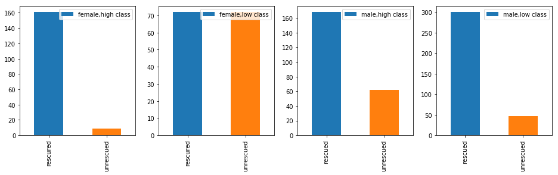

```python
import pandas as pd
import numpy as np
```


```python
pwd
```


    'C:\\Users\\DELL\\testing and learning\\selfize\\kaggle\\titanic'


```python
from pandas import Series,DataFrame
```


```python
import matplotlib.pyplot as plt
%matplotlib inline 
```


```python
data_train=pd.read_csv('train.csv')
```


```python
data_train
```


<div>
<style scoped>
    .dataframe tbody tr th:only-of-type {
        vertical-align: middle;
    }

    .dataframe tbody tr th {
        vertical-align: top;
    }

    .dataframe thead th {
        text-align: right;
    }
</style>
<table border="1" class="dataframe">
  <thead>
    <tr style="text-align: right;">
      <th></th>
      <th>PassengerId</th>
      <th>Survived</th>
      <th>Pclass</th>
      <th>Name</th>
      <th>Sex</th>
      <th>Age</th>
      <th>SibSp</th>
      <th>Parch</th>
      <th>Ticket</th>
      <th>Fare</th>
      <th>Cabin</th>
      <th>Embarked</th>
    </tr>
  </thead>
  <tbody>
    <tr>
      <th>0</th>
      <td>1</td>
      <td>0</td>
      <td>3</td>
      <td>Braund, Mr. Owen Harris</td>
      <td>male</td>
      <td>22.0</td>
      <td>1</td>
      <td>0</td>
      <td>A/5 21171</td>
      <td>7.2500</td>
      <td>NaN</td>
      <td>S</td>
    </tr>
    <tr>
      <th>1</th>
      <td>2</td>
      <td>1</td>
      <td>1</td>
      <td>Cumings, Mrs. John Bradley (Florence Briggs Th...</td>
      <td>female</td>
      <td>38.0</td>
      <td>1</td>
      <td>0</td>
      <td>PC 17599</td>
      <td>71.2833</td>
      <td>C85</td>
      <td>C</td>
    </tr>
    <tr>
      <th>2</th>
      <td>3</td>
      <td>1</td>
      <td>3</td>
      <td>Heikkinen, Miss. Laina</td>
      <td>female</td>
      <td>26.0</td>
      <td>0</td>
      <td>0</td>
      <td>STON/O2. 3101282</td>
      <td>7.9250</td>
      <td>NaN</td>
      <td>S</td>
    </tr>
    <tr>
      <th>3</th>
      <td>4</td>
      <td>1</td>
      <td>1</td>
      <td>Futrelle, Mrs. Jacques Heath (Lily May Peel)</td>
      <td>female</td>
      <td>35.0</td>
      <td>1</td>
      <td>0</td>
      <td>113803</td>
      <td>53.1000</td>
      <td>C123</td>
      <td>S</td>
    </tr>
    <tr>
      <th>4</th>
      <td>5</td>
      <td>0</td>
      <td>3</td>
      <td>Allen, Mr. William Henry</td>
      <td>male</td>
      <td>35.0</td>
      <td>0</td>
      <td>0</td>
      <td>373450</td>
      <td>8.0500</td>
      <td>NaN</td>
      <td>S</td>
    </tr>
    <tr>
      <th>5</th>
      <td>6</td>
      <td>0</td>
      <td>3</td>
      <td>Moran, Mr. James</td>
      <td>male</td>
      <td>NaN</td>
      <td>0</td>
      <td>0</td>
      <td>330877</td>
      <td>8.4583</td>
      <td>NaN</td>
      <td>Q</td>
    </tr>
    <tr>
      <th>6</th>
      <td>7</td>
      <td>0</td>
      <td>1</td>
      <td>McCarthy, Mr. Timothy J</td>
      <td>male</td>
      <td>54.0</td>
      <td>0</td>
      <td>0</td>
      <td>17463</td>
      <td>51.8625</td>
      <td>E46</td>
      <td>S</td>
    </tr>
    <tr>
      <th>7</th>
      <td>8</td>
      <td>0</td>
      <td>3</td>
      <td>Palsson, Master. Gosta Leonard</td>
      <td>male</td>
      <td>2.0</td>
      <td>3</td>
      <td>1</td>
      <td>349909</td>
      <td>21.0750</td>
      <td>NaN</td>
      <td>S</td>
    </tr>
    <tr>
      <th>8</th>
      <td>9</td>
      <td>1</td>
      <td>3</td>
      <td>Johnson, Mrs. Oscar W (Elisabeth Vilhelmina Berg)</td>
      <td>female</td>
      <td>27.0</td>
      <td>0</td>
      <td>2</td>
      <td>347742</td>
      <td>11.1333</td>
      <td>NaN</td>
      <td>S</td>
    </tr>
    <tr>
      <th>9</th>
      <td>10</td>
      <td>1</td>
      <td>2</td>
      <td>Nasser, Mrs. Nicholas (Adele Achem)</td>
      <td>female</td>
      <td>14.0</td>
      <td>1</td>
      <td>0</td>
      <td>237736</td>
      <td>30.0708</td>
      <td>NaN</td>
      <td>C</td>
    </tr>
    <tr>
      <th>10</th>
      <td>11</td>
      <td>1</td>
      <td>3</td>
      <td>Sandstrom, Miss. Marguerite Rut</td>
      <td>female</td>
      <td>4.0</td>
      <td>1</td>
      <td>1</td>
      <td>PP 9549</td>
      <td>16.7000</td>
      <td>G6</td>
      <td>S</td>
    </tr>
    <tr>
      <th>11</th>
      <td>12</td>
      <td>1</td>
      <td>1</td>
      <td>Bonnell, Miss. Elizabeth</td>
      <td>female</td>
      <td>58.0</td>
      <td>0</td>
      <td>0</td>
      <td>113783</td>
      <td>26.5500</td>
      <td>C103</td>
      <td>S</td>
    </tr>
    <tr>
      <th>12</th>
      <td>13</td>
      <td>0</td>
      <td>3</td>
      <td>Saundercock, Mr. William Henry</td>
      <td>male</td>
      <td>20.0</td>
      <td>0</td>
      <td>0</td>
      <td>A/5. 2151</td>
      <td>8.0500</td>
      <td>NaN</td>
      <td>S</td>
    </tr>
    <tr>
      <th>13</th>
      <td>14</td>
      <td>0</td>
      <td>3</td>
      <td>Andersson, Mr. Anders Johan</td>
      <td>male</td>
      <td>39.0</td>
      <td>1</td>
      <td>5</td>
      <td>347082</td>
      <td>31.2750</td>
      <td>NaN</td>
      <td>S</td>
    </tr>
    <tr>
      <th>14</th>
      <td>15</td>
      <td>0</td>
      <td>3</td>
      <td>Vestrom, Miss. Hulda Amanda Adolfina</td>
      <td>female</td>
      <td>14.0</td>
      <td>0</td>
      <td>0</td>
      <td>350406</td>
      <td>7.8542</td>
      <td>NaN</td>
      <td>S</td>
    </tr>
    <tr>
      <th>15</th>
      <td>16</td>
      <td>1</td>
      <td>2</td>
      <td>Hewlett, Mrs. (Mary D Kingcome)</td>
      <td>female</td>
      <td>55.0</td>
      <td>0</td>
      <td>0</td>
      <td>248706</td>
      <td>16.0000</td>
      <td>NaN</td>
      <td>S</td>
    </tr>
    <tr>
      <th>16</th>
      <td>17</td>
      <td>0</td>
      <td>3</td>
      <td>Rice, Master. Eugene</td>
      <td>male</td>
      <td>2.0</td>
      <td>4</td>
      <td>1</td>
      <td>382652</td>
      <td>29.1250</td>
      <td>NaN</td>
      <td>Q</td>
    </tr>
    <tr>
      <th>17</th>
      <td>18</td>
      <td>1</td>
      <td>2</td>
      <td>Williams, Mr. Charles Eugene</td>
      <td>male</td>
      <td>NaN</td>
      <td>0</td>
      <td>0</td>
      <td>244373</td>
      <td>13.0000</td>
      <td>NaN</td>
      <td>S</td>
    </tr>
    <tr>
      <th>18</th>
      <td>19</td>
      <td>0</td>
      <td>3</td>
      <td>Vander Planke, Mrs. Julius (Emelia Maria Vande...</td>
      <td>female</td>
      <td>31.0</td>
      <td>1</td>
      <td>0</td>
      <td>345763</td>
      <td>18.0000</td>
      <td>NaN</td>
      <td>S</td>
    </tr>
    <tr>
      <th>19</th>
      <td>20</td>
      <td>1</td>
      <td>3</td>
      <td>Masselmani, Mrs. Fatima</td>
      <td>female</td>
      <td>NaN</td>
      <td>0</td>
      <td>0</td>
      <td>2649</td>
      <td>7.2250</td>
      <td>NaN</td>
      <td>C</td>
    </tr>
    <tr>
      <th>20</th>
      <td>21</td>
      <td>0</td>
      <td>2</td>
      <td>Fynney, Mr. Joseph J</td>
      <td>male</td>
      <td>35.0</td>
      <td>0</td>
      <td>0</td>
      <td>239865</td>
      <td>26.0000</td>
      <td>NaN</td>
      <td>S</td>
    </tr>
    <tr>
      <th>21</th>
      <td>22</td>
      <td>1</td>
      <td>2</td>
      <td>Beesley, Mr. Lawrence</td>
      <td>male</td>
      <td>34.0</td>
      <td>0</td>
      <td>0</td>
      <td>248698</td>
      <td>13.0000</td>
      <td>D56</td>
      <td>S</td>
    </tr>
    <tr>
      <th>22</th>
      <td>23</td>
      <td>1</td>
      <td>3</td>
      <td>McGowan, Miss. Anna "Annie"</td>
      <td>female</td>
      <td>15.0</td>
      <td>0</td>
      <td>0</td>
      <td>330923</td>
      <td>8.0292</td>
      <td>NaN</td>
      <td>Q</td>
    </tr>
    <tr>
      <th>23</th>
      <td>24</td>
      <td>1</td>
      <td>1</td>
      <td>Sloper, Mr. William Thompson</td>
      <td>male</td>
      <td>28.0</td>
      <td>0</td>
      <td>0</td>
      <td>113788</td>
      <td>35.5000</td>
      <td>A6</td>
      <td>S</td>
    </tr>
    <tr>
      <th>24</th>
      <td>25</td>
      <td>0</td>
      <td>3</td>
      <td>Palsson, Miss. Torborg Danira</td>
      <td>female</td>
      <td>8.0</td>
      <td>3</td>
      <td>1</td>
      <td>349909</td>
      <td>21.0750</td>
      <td>NaN</td>
      <td>S</td>
    </tr>
    <tr>
      <th>25</th>
      <td>26</td>
      <td>1</td>
      <td>3</td>
      <td>Asplund, Mrs. Carl Oscar (Selma Augusta Emilia...</td>
      <td>female</td>
      <td>38.0</td>
      <td>1</td>
      <td>5</td>
      <td>347077</td>
      <td>31.3875</td>
      <td>NaN</td>
      <td>S</td>
    </tr>
    <tr>
      <th>26</th>
      <td>27</td>
      <td>0</td>
      <td>3</td>
      <td>Emir, Mr. Farred Chehab</td>
      <td>male</td>
      <td>NaN</td>
      <td>0</td>
      <td>0</td>
      <td>2631</td>
      <td>7.2250</td>
      <td>NaN</td>
      <td>C</td>
    </tr>
    <tr>
      <th>27</th>
      <td>28</td>
      <td>0</td>
      <td>1</td>
      <td>Fortune, Mr. Charles Alexander</td>
      <td>male</td>
      <td>19.0</td>
      <td>3</td>
      <td>2</td>
      <td>19950</td>
      <td>263.0000</td>
      <td>C23 C25 C27</td>
      <td>S</td>
    </tr>
    <tr>
      <th>28</th>
      <td>29</td>
      <td>1</td>
      <td>3</td>
      <td>O'Dwyer, Miss. Ellen "Nellie"</td>
      <td>female</td>
      <td>NaN</td>
      <td>0</td>
      <td>0</td>
      <td>330959</td>
      <td>7.8792</td>
      <td>NaN</td>
      <td>Q</td>
    </tr>
    <tr>
      <th>29</th>
      <td>30</td>
      <td>0</td>
      <td>3</td>
      <td>Todoroff, Mr. Lalio</td>
      <td>male</td>
      <td>NaN</td>
      <td>0</td>
      <td>0</td>
      <td>349216</td>
      <td>7.8958</td>
      <td>NaN</td>
      <td>S</td>
    </tr>
    <tr>
      <th>...</th>
      <td>...</td>
      <td>...</td>
      <td>...</td>
      <td>...</td>
      <td>...</td>
      <td>...</td>
      <td>...</td>
      <td>...</td>
      <td>...</td>
      <td>...</td>
      <td>...</td>
      <td>...</td>
    </tr>
    <tr>
      <th>861</th>
      <td>862</td>
      <td>0</td>
      <td>2</td>
      <td>Giles, Mr. Frederick Edward</td>
      <td>male</td>
      <td>21.0</td>
      <td>1</td>
      <td>0</td>
      <td>28134</td>
      <td>11.5000</td>
      <td>NaN</td>
      <td>S</td>
    </tr>
    <tr>
      <th>862</th>
      <td>863</td>
      <td>1</td>
      <td>1</td>
      <td>Swift, Mrs. Frederick Joel (Margaret Welles Ba...</td>
      <td>female</td>
      <td>48.0</td>
      <td>0</td>
      <td>0</td>
      <td>17466</td>
      <td>25.9292</td>
      <td>D17</td>
      <td>S</td>
    </tr>
    <tr>
      <th>863</th>
      <td>864</td>
      <td>0</td>
      <td>3</td>
      <td>Sage, Miss. Dorothy Edith "Dolly"</td>
      <td>female</td>
      <td>NaN</td>
      <td>8</td>
      <td>2</td>
      <td>CA. 2343</td>
      <td>69.5500</td>
      <td>NaN</td>
      <td>S</td>
    </tr>
    <tr>
      <th>864</th>
      <td>865</td>
      <td>0</td>
      <td>2</td>
      <td>Gill, Mr. John William</td>
      <td>male</td>
      <td>24.0</td>
      <td>0</td>
      <td>0</td>
      <td>233866</td>
      <td>13.0000</td>
      <td>NaN</td>
      <td>S</td>
    </tr>
    <tr>
      <th>865</th>
      <td>866</td>
      <td>1</td>
      <td>2</td>
      <td>Bystrom, Mrs. (Karolina)</td>
      <td>female</td>
      <td>42.0</td>
      <td>0</td>
      <td>0</td>
      <td>236852</td>
      <td>13.0000</td>
      <td>NaN</td>
      <td>S</td>
    </tr>
    <tr>
      <th>866</th>
      <td>867</td>
      <td>1</td>
      <td>2</td>
      <td>Duran y More, Miss. Asuncion</td>
      <td>female</td>
      <td>27.0</td>
      <td>1</td>
      <td>0</td>
      <td>SC/PARIS 2149</td>
      <td>13.8583</td>
      <td>NaN</td>
      <td>C</td>
    </tr>
    <tr>
      <th>867</th>
      <td>868</td>
      <td>0</td>
      <td>1</td>
      <td>Roebling, Mr. Washington Augustus II</td>
      <td>male</td>
      <td>31.0</td>
      <td>0</td>
      <td>0</td>
      <td>PC 17590</td>
      <td>50.4958</td>
      <td>A24</td>
      <td>S</td>
    </tr>
    <tr>
      <th>868</th>
      <td>869</td>
      <td>0</td>
      <td>3</td>
      <td>van Melkebeke, Mr. Philemon</td>
      <td>male</td>
      <td>NaN</td>
      <td>0</td>
      <td>0</td>
      <td>345777</td>
      <td>9.5000</td>
      <td>NaN</td>
      <td>S</td>
    </tr>
    <tr>
      <th>869</th>
      <td>870</td>
      <td>1</td>
      <td>3</td>
      <td>Johnson, Master. Harold Theodor</td>
      <td>male</td>
      <td>4.0</td>
      <td>1</td>
      <td>1</td>
      <td>347742</td>
      <td>11.1333</td>
      <td>NaN</td>
      <td>S</td>
    </tr>
    <tr>
      <th>870</th>
      <td>871</td>
      <td>0</td>
      <td>3</td>
      <td>Balkic, Mr. Cerin</td>
      <td>male</td>
      <td>26.0</td>
      <td>0</td>
      <td>0</td>
      <td>349248</td>
      <td>7.8958</td>
      <td>NaN</td>
      <td>S</td>
    </tr>
    <tr>
      <th>871</th>
      <td>872</td>
      <td>1</td>
      <td>1</td>
      <td>Beckwith, Mrs. Richard Leonard (Sallie Monypeny)</td>
      <td>female</td>
      <td>47.0</td>
      <td>1</td>
      <td>1</td>
      <td>11751</td>
      <td>52.5542</td>
      <td>D35</td>
      <td>S</td>
    </tr>
    <tr>
      <th>872</th>
      <td>873</td>
      <td>0</td>
      <td>1</td>
      <td>Carlsson, Mr. Frans Olof</td>
      <td>male</td>
      <td>33.0</td>
      <td>0</td>
      <td>0</td>
      <td>695</td>
      <td>5.0000</td>
      <td>B51 B53 B55</td>
      <td>S</td>
    </tr>
    <tr>
      <th>873</th>
      <td>874</td>
      <td>0</td>
      <td>3</td>
      <td>Vander Cruyssen, Mr. Victor</td>
      <td>male</td>
      <td>47.0</td>
      <td>0</td>
      <td>0</td>
      <td>345765</td>
      <td>9.0000</td>
      <td>NaN</td>
      <td>S</td>
    </tr>
    <tr>
      <th>874</th>
      <td>875</td>
      <td>1</td>
      <td>2</td>
      <td>Abelson, Mrs. Samuel (Hannah Wizosky)</td>
      <td>female</td>
      <td>28.0</td>
      <td>1</td>
      <td>0</td>
      <td>P/PP 3381</td>
      <td>24.0000</td>
      <td>NaN</td>
      <td>C</td>
    </tr>
    <tr>
      <th>875</th>
      <td>876</td>
      <td>1</td>
      <td>3</td>
      <td>Najib, Miss. Adele Kiamie "Jane"</td>
      <td>female</td>
      <td>15.0</td>
      <td>0</td>
      <td>0</td>
      <td>2667</td>
      <td>7.2250</td>
      <td>NaN</td>
      <td>C</td>
    </tr>
    <tr>
      <th>876</th>
      <td>877</td>
      <td>0</td>
      <td>3</td>
      <td>Gustafsson, Mr. Alfred Ossian</td>
      <td>male</td>
      <td>20.0</td>
      <td>0</td>
      <td>0</td>
      <td>7534</td>
      <td>9.8458</td>
      <td>NaN</td>
      <td>S</td>
    </tr>
    <tr>
      <th>877</th>
      <td>878</td>
      <td>0</td>
      <td>3</td>
      <td>Petroff, Mr. Nedelio</td>
      <td>male</td>
      <td>19.0</td>
      <td>0</td>
      <td>0</td>
      <td>349212</td>
      <td>7.8958</td>
      <td>NaN</td>
      <td>S</td>
    </tr>
    <tr>
      <th>878</th>
      <td>879</td>
      <td>0</td>
      <td>3</td>
      <td>Laleff, Mr. Kristo</td>
      <td>male</td>
      <td>NaN</td>
      <td>0</td>
      <td>0</td>
      <td>349217</td>
      <td>7.8958</td>
      <td>NaN</td>
      <td>S</td>
    </tr>
    <tr>
      <th>879</th>
      <td>880</td>
      <td>1</td>
      <td>1</td>
      <td>Potter, Mrs. Thomas Jr (Lily Alexenia Wilson)</td>
      <td>female</td>
      <td>56.0</td>
      <td>0</td>
      <td>1</td>
      <td>11767</td>
      <td>83.1583</td>
      <td>C50</td>
      <td>C</td>
    </tr>
    <tr>
      <th>880</th>
      <td>881</td>
      <td>1</td>
      <td>2</td>
      <td>Shelley, Mrs. William (Imanita Parrish Hall)</td>
      <td>female</td>
      <td>25.0</td>
      <td>0</td>
      <td>1</td>
      <td>230433</td>
      <td>26.0000</td>
      <td>NaN</td>
      <td>S</td>
    </tr>
    <tr>
      <th>881</th>
      <td>882</td>
      <td>0</td>
      <td>3</td>
      <td>Markun, Mr. Johann</td>
      <td>male</td>
      <td>33.0</td>
      <td>0</td>
      <td>0</td>
      <td>349257</td>
      <td>7.8958</td>
      <td>NaN</td>
      <td>S</td>
    </tr>
    <tr>
      <th>882</th>
      <td>883</td>
      <td>0</td>
      <td>3</td>
      <td>Dahlberg, Miss. Gerda Ulrika</td>
      <td>female</td>
      <td>22.0</td>
      <td>0</td>
      <td>0</td>
      <td>7552</td>
      <td>10.5167</td>
      <td>NaN</td>
      <td>S</td>
    </tr>
    <tr>
      <th>883</th>
      <td>884</td>
      <td>0</td>
      <td>2</td>
      <td>Banfield, Mr. Frederick James</td>
      <td>male</td>
      <td>28.0</td>
      <td>0</td>
      <td>0</td>
      <td>C.A./SOTON 34068</td>
      <td>10.5000</td>
      <td>NaN</td>
      <td>S</td>
    </tr>
    <tr>
      <th>884</th>
      <td>885</td>
      <td>0</td>
      <td>3</td>
      <td>Sutehall, Mr. Henry Jr</td>
      <td>male</td>
      <td>25.0</td>
      <td>0</td>
      <td>0</td>
      <td>SOTON/OQ 392076</td>
      <td>7.0500</td>
      <td>NaN</td>
      <td>S</td>
    </tr>
    <tr>
      <th>885</th>
      <td>886</td>
      <td>0</td>
      <td>3</td>
      <td>Rice, Mrs. William (Margaret Norton)</td>
      <td>female</td>
      <td>39.0</td>
      <td>0</td>
      <td>5</td>
      <td>382652</td>
      <td>29.1250</td>
      <td>NaN</td>
      <td>Q</td>
    </tr>
    <tr>
      <th>886</th>
      <td>887</td>
      <td>0</td>
      <td>2</td>
      <td>Montvila, Rev. Juozas</td>
      <td>male</td>
      <td>27.0</td>
      <td>0</td>
      <td>0</td>
      <td>211536</td>
      <td>13.0000</td>
      <td>NaN</td>
      <td>S</td>
    </tr>
    <tr>
      <th>887</th>
      <td>888</td>
      <td>1</td>
      <td>1</td>
      <td>Graham, Miss. Margaret Edith</td>
      <td>female</td>
      <td>19.0</td>
      <td>0</td>
      <td>0</td>
      <td>112053</td>
      <td>30.0000</td>
      <td>B42</td>
      <td>S</td>
    </tr>
    <tr>
      <th>888</th>
      <td>889</td>
      <td>0</td>
      <td>3</td>
      <td>Johnston, Miss. Catherine Helen "Carrie"</td>
      <td>female</td>
      <td>NaN</td>
      <td>1</td>
      <td>2</td>
      <td>W./C. 6607</td>
      <td>23.4500</td>
      <td>NaN</td>
      <td>S</td>
    </tr>
    <tr>
      <th>889</th>
      <td>890</td>
      <td>1</td>
      <td>1</td>
      <td>Behr, Mr. Karl Howell</td>
      <td>male</td>
      <td>26.0</td>
      <td>0</td>
      <td>0</td>
      <td>111369</td>
      <td>30.0000</td>
      <td>C148</td>
      <td>C</td>
    </tr>
    <tr>
      <th>890</th>
      <td>891</td>
      <td>0</td>
      <td>3</td>
      <td>Dooley, Mr. Patrick</td>
      <td>male</td>
      <td>32.0</td>
      <td>0</td>
      <td>0</td>
      <td>370376</td>
      <td>7.7500</td>
      <td>NaN</td>
      <td>Q</td>
    </tr>
  </tbody>
</table>
<p>891 rows × 12 columns</p>
</div>


```python
data_train.info()
```

    <class 'pandas.core.frame.DataFrame'>
    RangeIndex: 891 entries, 0 to 890
    Data columns (total 12 columns):
    PassengerId    891 non-null int64
    Survived       891 non-null int64
    Pclass         891 non-null int64
    Name           891 non-null object
    Sex            891 non-null object
    Age            714 non-null float64
    SibSp          891 non-null int64
    Parch          891 non-null int64
    Ticket         891 non-null object
    Fare           891 non-null float64
    Cabin          204 non-null object
    Embarked       889 non-null object
    dtypes: float64(2), int64(5), object(5)
    memory usage: 83.6+ KB
    


```python
data_train.describe()
```


<div>
<style scoped>
    .dataframe tbody tr th:only-of-type {
        vertical-align: middle;
    }

    .dataframe tbody tr th {
        vertical-align: top;
    }

    .dataframe thead th {
        text-align: right;
    }
</style>
<table border="1" class="dataframe">
  <thead>
    <tr style="text-align: right;">
      <th></th>
      <th>PassengerId</th>
      <th>Survived</th>
      <th>Pclass</th>
      <th>Age</th>
      <th>SibSp</th>
      <th>Parch</th>
      <th>Fare</th>
    </tr>
  </thead>
  <tbody>
    <tr>
      <th>count</th>
      <td>891.000000</td>
      <td>891.000000</td>
      <td>891.000000</td>
      <td>714.000000</td>
      <td>891.000000</td>
      <td>891.000000</td>
      <td>891.000000</td>
    </tr>
    <tr>
      <th>mean</th>
      <td>446.000000</td>
      <td>0.383838</td>
      <td>2.308642</td>
      <td>29.699118</td>
      <td>0.523008</td>
      <td>0.381594</td>
      <td>32.204208</td>
    </tr>
    <tr>
      <th>std</th>
      <td>257.353842</td>
      <td>0.486592</td>
      <td>0.836071</td>
      <td>14.526497</td>
      <td>1.102743</td>
      <td>0.806057</td>
      <td>49.693429</td>
    </tr>
    <tr>
      <th>min</th>
      <td>1.000000</td>
      <td>0.000000</td>
      <td>1.000000</td>
      <td>0.420000</td>
      <td>0.000000</td>
      <td>0.000000</td>
      <td>0.000000</td>
    </tr>
    <tr>
      <th>25%</th>
      <td>223.500000</td>
      <td>0.000000</td>
      <td>2.000000</td>
      <td>20.125000</td>
      <td>0.000000</td>
      <td>0.000000</td>
      <td>7.910400</td>
    </tr>
    <tr>
      <th>50%</th>
      <td>446.000000</td>
      <td>0.000000</td>
      <td>3.000000</td>
      <td>28.000000</td>
      <td>0.000000</td>
      <td>0.000000</td>
      <td>14.454200</td>
    </tr>
    <tr>
      <th>75%</th>
      <td>668.500000</td>
      <td>1.000000</td>
      <td>3.000000</td>
      <td>38.000000</td>
      <td>1.000000</td>
      <td>0.000000</td>
      <td>31.000000</td>
    </tr>
    <tr>
      <th>max</th>
      <td>891.000000</td>
      <td>1.000000</td>
      <td>3.000000</td>
      <td>80.000000</td>
      <td>8.000000</td>
      <td>6.000000</td>
      <td>512.329200</td>
    </tr>
  </tbody>
</table>
</div>


```python
fig,ax=plt.subplots(figsize=(6,6))
data_train.Survived.value_counts().plot(kind='bar')
ax.set_title('numbers(1 means alive)')
ax.set_ylabel('num')
plt.show()
```


```python
fig=plt.figure(figsize=(15,8))

ax1=fig.add_subplot(2,3,1)
data_train.Survived.value_counts().plot(kind='bar')
ax1.grid()
ax1.set_title('numbers(1 means alive)')
ax1.set_ylabel('num')

ax2=fig.add_subplot(232)
data_train.Pclass.value_counts().plot(kind='bar')
ax2.grid()
ax2.set_title('passenger class')
ax2.set_ylabel('numbers')

ax3=fig.add_subplot(233)
plt.scatter(data_train.Survived,data_train.Age)
ax3.set_title('rescured vs age(1 means rescured)')
ax3.set_ylabel('age')
ax3.grid(b=True,which='major',axis='y')

ax4=plt.subplot2grid((2,3),(1,0),colspan=2)
data_train.Age[data_train.Pclass==1].plot(kind='kde')
data_train.Age[data_train.Pclass==2].plot(kind='kde')
data_train.Age[data_train.Pclass==3].plot(kind='kde')
ax4.set_title('passenger age distribution')
ax4.set_xlabel('age')
ax4.set_ylabel('desity')
plt.legend(('1 class','2 class','3 class'))

ax5=plt.subplot2grid((2,3),(1,2))
data_train.Embarked.value_counts().plot(kind='bar')
ax5.grid()
ax5.set_title('embarked numbers')
ax5.set_ylabel('numbers')
plt.show()
```


```python
survived=data_train.Pclass[data_train.Survived==1].value_counts()
unsurvived=data_train.Pclass[data_train.Survived==0].value_counts()
```


```python
survived
```


    1    136
    3    119
    2     87
    Name: Pclass, dtype: int64


```python
type(survived)
```


    pandas.core.series.Series


```python
df=pd.DataFrame({'rescued':survived,'unrescued':unsurvived})
```


```python
df
```


<div>
<style scoped>
    .dataframe tbody tr th:only-of-type {
        vertical-align: middle;
    }

    .dataframe tbody tr th {
        vertical-align: top;
    }

    .dataframe thead th {
        text-align: right;
    }
</style>
<table border="1" class="dataframe">
  <thead>
    <tr style="text-align: right;">
      <th></th>
      <th>rescued</th>
      <th>unrescued</th>
    </tr>
  </thead>
  <tbody>
    <tr>
      <th>1</th>
      <td>136</td>
      <td>80</td>
    </tr>
    <tr>
      <th>2</th>
      <td>87</td>
      <td>97</td>
    </tr>
    <tr>
      <th>3</th>
      <td>119</td>
      <td>372</td>
    </tr>
  </tbody>
</table>
</div>


```python
fig,ax=plt.subplots()
ax=plt.subplot2grid((1,1),(0,0))
df.plot(kind='bar',stacked=True)
plt.grid()
ax.set_title('rescued by class')
ax.set_xlabel('class')
ax.set_ylabel('num')
plt.show()
```


```python
survived_m=data_train.Survived[data_train.Sex=='male'].value_counts()
survived_f=data_train.Survived[data_train.Sex=='female'].value_counts()
```


```python
survived_m
```


    0    468
    1    109
    Name: Survived, dtype: int64


```python
fig,ax=plt.subplots()
df_sex=pd.DataFrame({'male':survived_m,'famle':survived_f})
df_sex.plot(kind='bar',stacked='True')
```


    <matplotlib.axes._subplots.AxesSubplot at 0x24d11b0e240>


```python
fig,ax=plt.subplots()
df_sex_2=df_sex.T
df_sex_2.plot(kind='bar',stacked='True')
```


    <matplotlib.axes._subplots.AxesSubplot at 0x24d119aa7b8>


```python
fig=plt.figure(figsize=(16,4))

ax1=fig.add_subplot(141)
data_train.Survived[data_train.Pclass!=3][data_train.Sex=='female'].value_counts().plot(kind='bar',label='female high class')
ax1.set_xticklabels(['rescured','unrescued'])
ax1.legend(['female,high class'])

ax2=fig.add_subplot(142)
data_train.Survived[data_train.Pclass==3][data_train.Sex=='female'].value_counts().plot(kind='bar',label='female low class')
ax2.set_xticklabels(['rescured','unrescued'])
ax2.legend(['female,low class'])

ax3=fig.add_subplot(143)
data_train.Survived[data_train.Pclass!=3][data_train.Sex=='male'].value_counts().plot(kind='bar',label='male high class')
ax3.set_xticklabels(['rescued','unrescued'])
ax3.legend(['male,high class'])

ax4=fig.add_subplot(144)
data_train.Survived[data_train.Pclass==3][data_train.Sex=='male'].value_counts().plot(kind='bar',label='male low class')
ax4.set_xticklabels(['rescued','unrescued'])
ax4.legend(['male,low class'])

plt.show()
```





```python
survived_port_s=data_train.Survived[data_train.Embarked=='S'].value_counts()
survived_port_s
```


    0    427
    1    217
    Name: Survived, dtype: int64


```python
survived_port_c=data_train.Survived[data_train.Embarked=='C'].value_counts()
survived_port_q=data_train.Survived[data_train.Embarked=='Q'].value_counts()
```


```python
survived_port_c,survived_port_q
```


    (1    93
     0    75
     Name: Survived, dtype: int64, 0    47
     1    30
     Name: Survived, dtype: int64)


```python
df_port=pd.DataFrame({"port_s":survived_port_s,"port_c":survived_port_c,"port_q":survived_port_q})
df_port
```


<div>
<style scoped>
    .dataframe tbody tr th:only-of-type {
        vertical-align: middle;
    }

    .dataframe tbody tr th {
        vertical-align: top;
    }

    .dataframe thead th {
        text-align: right;
    }
</style>
<table border="1" class="dataframe">
  <thead>
    <tr style="text-align: right;">
      <th></th>
      <th>port_c</th>
      <th>port_q</th>
      <th>port_s</th>
    </tr>
  </thead>
  <tbody>
    <tr>
      <th>0</th>
      <td>75</td>
      <td>47</td>
      <td>427</td>
    </tr>
    <tr>
      <th>1</th>
      <td>93</td>
      <td>30</td>
      <td>217</td>
    </tr>
  </tbody>
</table>
</div>


```python
fig=plt.figure()
df_port.T.plot(kind='bar',stacked=True)
```


    <matplotlib.axes._subplots.AxesSubplot at 0x24d11a138d0>


    <Figure size 432x288 with 0 Axes>


```python
g=data_train.groupby(['SibSp','Survived'])
df_g=pd.DataFrame(g.count()['PassengerId'])
print(df_g)
fig=plt.figure()
df_g.plot(kind='bar')
```

                    PassengerId
    SibSp Survived             
    0     0                 398
          1                 210
    1     0                  97
          1                 112
    2     0                  15
          1                  13
    3     0                  12
          1                   4
    4     0                  15
          1                   3
    5     0                   5
    8     0                   7
    


    <matplotlib.axes._subplots.AxesSubplot at 0x24d11e468d0>


    <Figure size 432x288 with 0 Axes>


```python
g = data_train.groupby(['Parch','Survived'])
df_g_2 = pd.DataFrame(g.count()['PassengerId'])
print(df_g_2)
```

                    PassengerId
    Parch Survived             
    0     0                 445
          1                 233
    1     0                  53
          1                  65
    2     0                  40
          1                  40
    3     0                   2
          1                   3
    4     0                   4
    5     0                   4
          1                   1
    6     0                   1
    


```python
data_train.Cabin.value_counts()
```


    B96 B98        4
    C23 C25 C27    4
    G6             4
    D              3
    F33            3
    C22 C26        3
    F2             3
    E101           3
    F4             2
    C68            2
    B22            2
    E8             2
    D33            2
    B5             2
    E44            2
    C123           2
    E25            2
    C92            2
    E24            2
    F G73          2
    D17            2
    B58 B60        2
    C78            2
    B20            2
    C52            2
    B28            2
    E33            2
    C83            2
    E67            2
    C124           2
                  ..
    B4             1
    E10            1
    D45            1
    E50            1
    E12            1
    F38            1
    D28            1
    B78            1
    C86            1
    A7             1
    D46            1
    E34            1
    B86            1
    D19            1
    D10 D12        1
    B50            1
    C148           1
    C45            1
    C32            1
    F E69          1
    B94            1
    B80            1
    C7             1
    E38            1
    C103           1
    D9             1
    C70            1
    A19            1
    T              1
    A20            1
    Name: Cabin, Length: 147, dtype: int64


```python
survived_cabin=data_train.Survived[pd.notnull(data_train.Cabin)].value_counts()
survived_nocabin=data_train.Survived[pd.isnull(data_train.Cabin)].value_counts()
```


```python
survived_cabin
```


    1    136
    0     68
    Name: Survived, dtype: int64


```python
df_cabin=pd.DataFrame({'cabin':survived_cabin,'no_cabin':survived_nocabin})
df_cabin
```


<div>
<style scoped>
    .dataframe tbody tr th:only-of-type {
        vertical-align: middle;
    }

    .dataframe tbody tr th {
        vertical-align: top;
    }

    .dataframe thead th {
        text-align: right;
    }
</style>
<table border="1" class="dataframe">
  <thead>
    <tr style="text-align: right;">
      <th></th>
      <th>cabin</th>
      <th>no_cabin</th>
    </tr>
  </thead>
  <tbody>
    <tr>
      <th>0</th>
      <td>68</td>
      <td>481</td>
    </tr>
    <tr>
      <th>1</th>
      <td>136</td>
      <td>206</td>
    </tr>
  </tbody>
</table>
</div>


```python
fig=plt.figure()
ax_cabin=fig.add_subplot(111)
df_cabin.T.plot(kind='bar')
ax_cabin.set_ylabel('numbers')
ax_cabin.set_title('with and no cabin')
plt.show()
```


```python
age_df=data_train[['Age','Pclass','SibSp','Parch','Fare']]
```


```python
known_age=age_df[age_df.Age.notnull()].as_matrix()
unknown_age=age_df[age_df.Age.isnull()].as_matrix()
```


```python
from sklearn.ensemble import RandomForestRegressor
```


```python
rfr=RandomForestRegressor(random_state=0,n_estimators=2000,n_jobs=-1)
```


```python
y=known_age[:,0]
x=known_age[:,1:]
```


```python
rfr.fit(x,y)
```


    RandomForestRegressor(bootstrap=True, criterion='mse', max_depth=None,
               max_features='auto', max_leaf_nodes=None,
               min_impurity_decrease=0.0, min_impurity_split=None,
               min_samples_leaf=1, min_samples_split=2,
               min_weight_fraction_leaf=0.0, n_estimators=2000, n_jobs=-1,
               oob_score=False, random_state=0, verbose=0, warm_start=False)


```python
predicted_age=rfr.predict(unknown_age[:,1:])
```


```python
data_train.loc[(data_train.Age.isnull(),'Age')]=predicted_age
```


```python
data_train
```


<div>
<style scoped>
    .dataframe tbody tr th:only-of-type {
        vertical-align: middle;
    }

    .dataframe tbody tr th {
        vertical-align: top;
    }

    .dataframe thead th {
        text-align: right;
    }
</style>
<table border="1" class="dataframe">
  <thead>
    <tr style="text-align: right;">
      <th></th>
      <th>PassengerId</th>
      <th>Survived</th>
      <th>Pclass</th>
      <th>Name</th>
      <th>Sex</th>
      <th>Age</th>
      <th>SibSp</th>
      <th>Parch</th>
      <th>Ticket</th>
      <th>Fare</th>
      <th>Cabin</th>
      <th>Embarked</th>
    </tr>
  </thead>
  <tbody>
    <tr>
      <th>0</th>
      <td>1</td>
      <td>0</td>
      <td>3</td>
      <td>Braund, Mr. Owen Harris</td>
      <td>male</td>
      <td>22.000000</td>
      <td>1</td>
      <td>0</td>
      <td>A/5 21171</td>
      <td>7.2500</td>
      <td>NaN</td>
      <td>S</td>
    </tr>
    <tr>
      <th>1</th>
      <td>2</td>
      <td>1</td>
      <td>1</td>
      <td>Cumings, Mrs. John Bradley (Florence Briggs Th...</td>
      <td>female</td>
      <td>38.000000</td>
      <td>1</td>
      <td>0</td>
      <td>PC 17599</td>
      <td>71.2833</td>
      <td>C85</td>
      <td>C</td>
    </tr>
    <tr>
      <th>2</th>
      <td>3</td>
      <td>1</td>
      <td>3</td>
      <td>Heikkinen, Miss. Laina</td>
      <td>female</td>
      <td>26.000000</td>
      <td>0</td>
      <td>0</td>
      <td>STON/O2. 3101282</td>
      <td>7.9250</td>
      <td>NaN</td>
      <td>S</td>
    </tr>
    <tr>
      <th>3</th>
      <td>4</td>
      <td>1</td>
      <td>1</td>
      <td>Futrelle, Mrs. Jacques Heath (Lily May Peel)</td>
      <td>female</td>
      <td>35.000000</td>
      <td>1</td>
      <td>0</td>
      <td>113803</td>
      <td>53.1000</td>
      <td>C123</td>
      <td>S</td>
    </tr>
    <tr>
      <th>4</th>
      <td>5</td>
      <td>0</td>
      <td>3</td>
      <td>Allen, Mr. William Henry</td>
      <td>male</td>
      <td>35.000000</td>
      <td>0</td>
      <td>0</td>
      <td>373450</td>
      <td>8.0500</td>
      <td>NaN</td>
      <td>S</td>
    </tr>
    <tr>
      <th>5</th>
      <td>6</td>
      <td>0</td>
      <td>3</td>
      <td>Moran, Mr. James</td>
      <td>male</td>
      <td>23.838953</td>
      <td>0</td>
      <td>0</td>
      <td>330877</td>
      <td>8.4583</td>
      <td>NaN</td>
      <td>Q</td>
    </tr>
    <tr>
      <th>6</th>
      <td>7</td>
      <td>0</td>
      <td>1</td>
      <td>McCarthy, Mr. Timothy J</td>
      <td>male</td>
      <td>54.000000</td>
      <td>0</td>
      <td>0</td>
      <td>17463</td>
      <td>51.8625</td>
      <td>E46</td>
      <td>S</td>
    </tr>
    <tr>
      <th>7</th>
      <td>8</td>
      <td>0</td>
      <td>3</td>
      <td>Palsson, Master. Gosta Leonard</td>
      <td>male</td>
      <td>2.000000</td>
      <td>3</td>
      <td>1</td>
      <td>349909</td>
      <td>21.0750</td>
      <td>NaN</td>
      <td>S</td>
    </tr>
    <tr>
      <th>8</th>
      <td>9</td>
      <td>1</td>
      <td>3</td>
      <td>Johnson, Mrs. Oscar W (Elisabeth Vilhelmina Berg)</td>
      <td>female</td>
      <td>27.000000</td>
      <td>0</td>
      <td>2</td>
      <td>347742</td>
      <td>11.1333</td>
      <td>NaN</td>
      <td>S</td>
    </tr>
    <tr>
      <th>9</th>
      <td>10</td>
      <td>1</td>
      <td>2</td>
      <td>Nasser, Mrs. Nicholas (Adele Achem)</td>
      <td>female</td>
      <td>14.000000</td>
      <td>1</td>
      <td>0</td>
      <td>237736</td>
      <td>30.0708</td>
      <td>NaN</td>
      <td>C</td>
    </tr>
    <tr>
      <th>10</th>
      <td>11</td>
      <td>1</td>
      <td>3</td>
      <td>Sandstrom, Miss. Marguerite Rut</td>
      <td>female</td>
      <td>4.000000</td>
      <td>1</td>
      <td>1</td>
      <td>PP 9549</td>
      <td>16.7000</td>
      <td>G6</td>
      <td>S</td>
    </tr>
    <tr>
      <th>11</th>
      <td>12</td>
      <td>1</td>
      <td>1</td>
      <td>Bonnell, Miss. Elizabeth</td>
      <td>female</td>
      <td>58.000000</td>
      <td>0</td>
      <td>0</td>
      <td>113783</td>
      <td>26.5500</td>
      <td>C103</td>
      <td>S</td>
    </tr>
    <tr>
      <th>12</th>
      <td>13</td>
      <td>0</td>
      <td>3</td>
      <td>Saundercock, Mr. William Henry</td>
      <td>male</td>
      <td>20.000000</td>
      <td>0</td>
      <td>0</td>
      <td>A/5. 2151</td>
      <td>8.0500</td>
      <td>NaN</td>
      <td>S</td>
    </tr>
    <tr>
      <th>13</th>
      <td>14</td>
      <td>0</td>
      <td>3</td>
      <td>Andersson, Mr. Anders Johan</td>
      <td>male</td>
      <td>39.000000</td>
      <td>1</td>
      <td>5</td>
      <td>347082</td>
      <td>31.2750</td>
      <td>NaN</td>
      <td>S</td>
    </tr>
    <tr>
      <th>14</th>
      <td>15</td>
      <td>0</td>
      <td>3</td>
      <td>Vestrom, Miss. Hulda Amanda Adolfina</td>
      <td>female</td>
      <td>14.000000</td>
      <td>0</td>
      <td>0</td>
      <td>350406</td>
      <td>7.8542</td>
      <td>NaN</td>
      <td>S</td>
    </tr>
    <tr>
      <th>15</th>
      <td>16</td>
      <td>1</td>
      <td>2</td>
      <td>Hewlett, Mrs. (Mary D Kingcome)</td>
      <td>female</td>
      <td>55.000000</td>
      <td>0</td>
      <td>0</td>
      <td>248706</td>
      <td>16.0000</td>
      <td>NaN</td>
      <td>S</td>
    </tr>
    <tr>
      <th>16</th>
      <td>17</td>
      <td>0</td>
      <td>3</td>
      <td>Rice, Master. Eugene</td>
      <td>male</td>
      <td>2.000000</td>
      <td>4</td>
      <td>1</td>
      <td>382652</td>
      <td>29.1250</td>
      <td>NaN</td>
      <td>Q</td>
    </tr>
    <tr>
      <th>17</th>
      <td>18</td>
      <td>1</td>
      <td>2</td>
      <td>Williams, Mr. Charles Eugene</td>
      <td>male</td>
      <td>32.066493</td>
      <td>0</td>
      <td>0</td>
      <td>244373</td>
      <td>13.0000</td>
      <td>NaN</td>
      <td>S</td>
    </tr>
    <tr>
      <th>18</th>
      <td>19</td>
      <td>0</td>
      <td>3</td>
      <td>Vander Planke, Mrs. Julius (Emelia Maria Vande...</td>
      <td>female</td>
      <td>31.000000</td>
      <td>1</td>
      <td>0</td>
      <td>345763</td>
      <td>18.0000</td>
      <td>NaN</td>
      <td>S</td>
    </tr>
    <tr>
      <th>19</th>
      <td>20</td>
      <td>1</td>
      <td>3</td>
      <td>Masselmani, Mrs. Fatima</td>
      <td>female</td>
      <td>29.518205</td>
      <td>0</td>
      <td>0</td>
      <td>2649</td>
      <td>7.2250</td>
      <td>NaN</td>
      <td>C</td>
    </tr>
    <tr>
      <th>20</th>
      <td>21</td>
      <td>0</td>
      <td>2</td>
      <td>Fynney, Mr. Joseph J</td>
      <td>male</td>
      <td>35.000000</td>
      <td>0</td>
      <td>0</td>
      <td>239865</td>
      <td>26.0000</td>
      <td>NaN</td>
      <td>S</td>
    </tr>
    <tr>
      <th>21</th>
      <td>22</td>
      <td>1</td>
      <td>2</td>
      <td>Beesley, Mr. Lawrence</td>
      <td>male</td>
      <td>34.000000</td>
      <td>0</td>
      <td>0</td>
      <td>248698</td>
      <td>13.0000</td>
      <td>D56</td>
      <td>S</td>
    </tr>
    <tr>
      <th>22</th>
      <td>23</td>
      <td>1</td>
      <td>3</td>
      <td>McGowan, Miss. Anna "Annie"</td>
      <td>female</td>
      <td>15.000000</td>
      <td>0</td>
      <td>0</td>
      <td>330923</td>
      <td>8.0292</td>
      <td>NaN</td>
      <td>Q</td>
    </tr>
    <tr>
      <th>23</th>
      <td>24</td>
      <td>1</td>
      <td>1</td>
      <td>Sloper, Mr. William Thompson</td>
      <td>male</td>
      <td>28.000000</td>
      <td>0</td>
      <td>0</td>
      <td>113788</td>
      <td>35.5000</td>
      <td>A6</td>
      <td>S</td>
    </tr>
    <tr>
      <th>24</th>
      <td>25</td>
      <td>0</td>
      <td>3</td>
      <td>Palsson, Miss. Torborg Danira</td>
      <td>female</td>
      <td>8.000000</td>
      <td>3</td>
      <td>1</td>
      <td>349909</td>
      <td>21.0750</td>
      <td>NaN</td>
      <td>S</td>
    </tr>
    <tr>
      <th>25</th>
      <td>26</td>
      <td>1</td>
      <td>3</td>
      <td>Asplund, Mrs. Carl Oscar (Selma Augusta Emilia...</td>
      <td>female</td>
      <td>38.000000</td>
      <td>1</td>
      <td>5</td>
      <td>347077</td>
      <td>31.3875</td>
      <td>NaN</td>
      <td>S</td>
    </tr>
    <tr>
      <th>26</th>
      <td>27</td>
      <td>0</td>
      <td>3</td>
      <td>Emir, Mr. Farred Chehab</td>
      <td>male</td>
      <td>29.518205</td>
      <td>0</td>
      <td>0</td>
      <td>2631</td>
      <td>7.2250</td>
      <td>NaN</td>
      <td>C</td>
    </tr>
    <tr>
      <th>27</th>
      <td>28</td>
      <td>0</td>
      <td>1</td>
      <td>Fortune, Mr. Charles Alexander</td>
      <td>male</td>
      <td>19.000000</td>
      <td>3</td>
      <td>2</td>
      <td>19950</td>
      <td>263.0000</td>
      <td>C23 C25 C27</td>
      <td>S</td>
    </tr>
    <tr>
      <th>28</th>
      <td>29</td>
      <td>1</td>
      <td>3</td>
      <td>O'Dwyer, Miss. Ellen "Nellie"</td>
      <td>female</td>
      <td>22.380113</td>
      <td>0</td>
      <td>0</td>
      <td>330959</td>
      <td>7.8792</td>
      <td>NaN</td>
      <td>Q</td>
    </tr>
    <tr>
      <th>29</th>
      <td>30</td>
      <td>0</td>
      <td>3</td>
      <td>Todoroff, Mr. Lalio</td>
      <td>male</td>
      <td>27.947206</td>
      <td>0</td>
      <td>0</td>
      <td>349216</td>
      <td>7.8958</td>
      <td>NaN</td>
      <td>S</td>
    </tr>
    <tr>
      <th>...</th>
      <td>...</td>
      <td>...</td>
      <td>...</td>
      <td>...</td>
      <td>...</td>
      <td>...</td>
      <td>...</td>
      <td>...</td>
      <td>...</td>
      <td>...</td>
      <td>...</td>
      <td>...</td>
    </tr>
    <tr>
      <th>861</th>
      <td>862</td>
      <td>0</td>
      <td>2</td>
      <td>Giles, Mr. Frederick Edward</td>
      <td>male</td>
      <td>21.000000</td>
      <td>1</td>
      <td>0</td>
      <td>28134</td>
      <td>11.5000</td>
      <td>NaN</td>
      <td>S</td>
    </tr>
    <tr>
      <th>862</th>
      <td>863</td>
      <td>1</td>
      <td>1</td>
      <td>Swift, Mrs. Frederick Joel (Margaret Welles Ba...</td>
      <td>female</td>
      <td>48.000000</td>
      <td>0</td>
      <td>0</td>
      <td>17466</td>
      <td>25.9292</td>
      <td>D17</td>
      <td>S</td>
    </tr>
    <tr>
      <th>863</th>
      <td>864</td>
      <td>0</td>
      <td>3</td>
      <td>Sage, Miss. Dorothy Edith "Dolly"</td>
      <td>female</td>
      <td>10.869867</td>
      <td>8</td>
      <td>2</td>
      <td>CA. 2343</td>
      <td>69.5500</td>
      <td>NaN</td>
      <td>S</td>
    </tr>
    <tr>
      <th>864</th>
      <td>865</td>
      <td>0</td>
      <td>2</td>
      <td>Gill, Mr. John William</td>
      <td>male</td>
      <td>24.000000</td>
      <td>0</td>
      <td>0</td>
      <td>233866</td>
      <td>13.0000</td>
      <td>NaN</td>
      <td>S</td>
    </tr>
    <tr>
      <th>865</th>
      <td>866</td>
      <td>1</td>
      <td>2</td>
      <td>Bystrom, Mrs. (Karolina)</td>
      <td>female</td>
      <td>42.000000</td>
      <td>0</td>
      <td>0</td>
      <td>236852</td>
      <td>13.0000</td>
      <td>NaN</td>
      <td>S</td>
    </tr>
    <tr>
      <th>866</th>
      <td>867</td>
      <td>1</td>
      <td>2</td>
      <td>Duran y More, Miss. Asuncion</td>
      <td>female</td>
      <td>27.000000</td>
      <td>1</td>
      <td>0</td>
      <td>SC/PARIS 2149</td>
      <td>13.8583</td>
      <td>NaN</td>
      <td>C</td>
    </tr>
    <tr>
      <th>867</th>
      <td>868</td>
      <td>0</td>
      <td>1</td>
      <td>Roebling, Mr. Washington Augustus II</td>
      <td>male</td>
      <td>31.000000</td>
      <td>0</td>
      <td>0</td>
      <td>PC 17590</td>
      <td>50.4958</td>
      <td>A24</td>
      <td>S</td>
    </tr>
    <tr>
      <th>868</th>
      <td>869</td>
      <td>0</td>
      <td>3</td>
      <td>van Melkebeke, Mr. Philemon</td>
      <td>male</td>
      <td>25.977889</td>
      <td>0</td>
      <td>0</td>
      <td>345777</td>
      <td>9.5000</td>
      <td>NaN</td>
      <td>S</td>
    </tr>
    <tr>
      <th>869</th>
      <td>870</td>
      <td>1</td>
      <td>3</td>
      <td>Johnson, Master. Harold Theodor</td>
      <td>male</td>
      <td>4.000000</td>
      <td>1</td>
      <td>1</td>
      <td>347742</td>
      <td>11.1333</td>
      <td>NaN</td>
      <td>S</td>
    </tr>
    <tr>
      <th>870</th>
      <td>871</td>
      <td>0</td>
      <td>3</td>
      <td>Balkic, Mr. Cerin</td>
      <td>male</td>
      <td>26.000000</td>
      <td>0</td>
      <td>0</td>
      <td>349248</td>
      <td>7.8958</td>
      <td>NaN</td>
      <td>S</td>
    </tr>
    <tr>
      <th>871</th>
      <td>872</td>
      <td>1</td>
      <td>1</td>
      <td>Beckwith, Mrs. Richard Leonard (Sallie Monypeny)</td>
      <td>female</td>
      <td>47.000000</td>
      <td>1</td>
      <td>1</td>
      <td>11751</td>
      <td>52.5542</td>
      <td>D35</td>
      <td>S</td>
    </tr>
    <tr>
      <th>872</th>
      <td>873</td>
      <td>0</td>
      <td>1</td>
      <td>Carlsson, Mr. Frans Olof</td>
      <td>male</td>
      <td>33.000000</td>
      <td>0</td>
      <td>0</td>
      <td>695</td>
      <td>5.0000</td>
      <td>B51 B53 B55</td>
      <td>S</td>
    </tr>
    <tr>
      <th>873</th>
      <td>874</td>
      <td>0</td>
      <td>3</td>
      <td>Vander Cruyssen, Mr. Victor</td>
      <td>male</td>
      <td>47.000000</td>
      <td>0</td>
      <td>0</td>
      <td>345765</td>
      <td>9.0000</td>
      <td>NaN</td>
      <td>S</td>
    </tr>
    <tr>
      <th>874</th>
      <td>875</td>
      <td>1</td>
      <td>2</td>
      <td>Abelson, Mrs. Samuel (Hannah Wizosky)</td>
      <td>female</td>
      <td>28.000000</td>
      <td>1</td>
      <td>0</td>
      <td>P/PP 3381</td>
      <td>24.0000</td>
      <td>NaN</td>
      <td>C</td>
    </tr>
    <tr>
      <th>875</th>
      <td>876</td>
      <td>1</td>
      <td>3</td>
      <td>Najib, Miss. Adele Kiamie "Jane"</td>
      <td>female</td>
      <td>15.000000</td>
      <td>0</td>
      <td>0</td>
      <td>2667</td>
      <td>7.2250</td>
      <td>NaN</td>
      <td>C</td>
    </tr>
    <tr>
      <th>876</th>
      <td>877</td>
      <td>0</td>
      <td>3</td>
      <td>Gustafsson, Mr. Alfred Ossian</td>
      <td>male</td>
      <td>20.000000</td>
      <td>0</td>
      <td>0</td>
      <td>7534</td>
      <td>9.8458</td>
      <td>NaN</td>
      <td>S</td>
    </tr>
    <tr>
      <th>877</th>
      <td>878</td>
      <td>0</td>
      <td>3</td>
      <td>Petroff, Mr. Nedelio</td>
      <td>male</td>
      <td>19.000000</td>
      <td>0</td>
      <td>0</td>
      <td>349212</td>
      <td>7.8958</td>
      <td>NaN</td>
      <td>S</td>
    </tr>
    <tr>
      <th>878</th>
      <td>879</td>
      <td>0</td>
      <td>3</td>
      <td>Laleff, Mr. Kristo</td>
      <td>male</td>
      <td>27.947206</td>
      <td>0</td>
      <td>0</td>
      <td>349217</td>
      <td>7.8958</td>
      <td>NaN</td>
      <td>S</td>
    </tr>
    <tr>
      <th>879</th>
      <td>880</td>
      <td>1</td>
      <td>1</td>
      <td>Potter, Mrs. Thomas Jr (Lily Alexenia Wilson)</td>
      <td>female</td>
      <td>56.000000</td>
      <td>0</td>
      <td>1</td>
      <td>11767</td>
      <td>83.1583</td>
      <td>C50</td>
      <td>C</td>
    </tr>
    <tr>
      <th>880</th>
      <td>881</td>
      <td>1</td>
      <td>2</td>
      <td>Shelley, Mrs. William (Imanita Parrish Hall)</td>
      <td>female</td>
      <td>25.000000</td>
      <td>0</td>
      <td>1</td>
      <td>230433</td>
      <td>26.0000</td>
      <td>NaN</td>
      <td>S</td>
    </tr>
    <tr>
      <th>881</th>
      <td>882</td>
      <td>0</td>
      <td>3</td>
      <td>Markun, Mr. Johann</td>
      <td>male</td>
      <td>33.000000</td>
      <td>0</td>
      <td>0</td>
      <td>349257</td>
      <td>7.8958</td>
      <td>NaN</td>
      <td>S</td>
    </tr>
    <tr>
      <th>882</th>
      <td>883</td>
      <td>0</td>
      <td>3</td>
      <td>Dahlberg, Miss. Gerda Ulrika</td>
      <td>female</td>
      <td>22.000000</td>
      <td>0</td>
      <td>0</td>
      <td>7552</td>
      <td>10.5167</td>
      <td>NaN</td>
      <td>S</td>
    </tr>
    <tr>
      <th>883</th>
      <td>884</td>
      <td>0</td>
      <td>2</td>
      <td>Banfield, Mr. Frederick James</td>
      <td>male</td>
      <td>28.000000</td>
      <td>0</td>
      <td>0</td>
      <td>C.A./SOTON 34068</td>
      <td>10.5000</td>
      <td>NaN</td>
      <td>S</td>
    </tr>
    <tr>
      <th>884</th>
      <td>885</td>
      <td>0</td>
      <td>3</td>
      <td>Sutehall, Mr. Henry Jr</td>
      <td>male</td>
      <td>25.000000</td>
      <td>0</td>
      <td>0</td>
      <td>SOTON/OQ 392076</td>
      <td>7.0500</td>
      <td>NaN</td>
      <td>S</td>
    </tr>
    <tr>
      <th>885</th>
      <td>886</td>
      <td>0</td>
      <td>3</td>
      <td>Rice, Mrs. William (Margaret Norton)</td>
      <td>female</td>
      <td>39.000000</td>
      <td>0</td>
      <td>5</td>
      <td>382652</td>
      <td>29.1250</td>
      <td>NaN</td>
      <td>Q</td>
    </tr>
    <tr>
      <th>886</th>
      <td>887</td>
      <td>0</td>
      <td>2</td>
      <td>Montvila, Rev. Juozas</td>
      <td>male</td>
      <td>27.000000</td>
      <td>0</td>
      <td>0</td>
      <td>211536</td>
      <td>13.0000</td>
      <td>NaN</td>
      <td>S</td>
    </tr>
    <tr>
      <th>887</th>
      <td>888</td>
      <td>1</td>
      <td>1</td>
      <td>Graham, Miss. Margaret Edith</td>
      <td>female</td>
      <td>19.000000</td>
      <td>0</td>
      <td>0</td>
      <td>112053</td>
      <td>30.0000</td>
      <td>B42</td>
      <td>S</td>
    </tr>
    <tr>
      <th>888</th>
      <td>889</td>
      <td>0</td>
      <td>3</td>
      <td>Johnston, Miss. Catherine Helen "Carrie"</td>
      <td>female</td>
      <td>16.193950</td>
      <td>1</td>
      <td>2</td>
      <td>W./C. 6607</td>
      <td>23.4500</td>
      <td>NaN</td>
      <td>S</td>
    </tr>
    <tr>
      <th>889</th>
      <td>890</td>
      <td>1</td>
      <td>1</td>
      <td>Behr, Mr. Karl Howell</td>
      <td>male</td>
      <td>26.000000</td>
      <td>0</td>
      <td>0</td>
      <td>111369</td>
      <td>30.0000</td>
      <td>C148</td>
      <td>C</td>
    </tr>
    <tr>
      <th>890</th>
      <td>891</td>
      <td>0</td>
      <td>3</td>
      <td>Dooley, Mr. Patrick</td>
      <td>male</td>
      <td>32.000000</td>
      <td>0</td>
      <td>0</td>
      <td>370376</td>
      <td>7.7500</td>
      <td>NaN</td>
      <td>Q</td>
    </tr>
  </tbody>
</table>
<p>891 rows × 12 columns</p>
</div>


```python
data_train.loc[(data_train.Cabin.notnull()),'Cabin']='Yes'
data_train.loc[(data_train.Cabin.isnull()),'Cabin']='No'
```


```python
df=data_train
```


```python
df
```


<div>
<style scoped>
    .dataframe tbody tr th:only-of-type {
        vertical-align: middle;
    }

    .dataframe tbody tr th {
        vertical-align: top;
    }

    .dataframe thead th {
        text-align: right;
    }
</style>
<table border="1" class="dataframe">
  <thead>
    <tr style="text-align: right;">
      <th></th>
      <th>PassengerId</th>
      <th>Survived</th>
      <th>Pclass</th>
      <th>Name</th>
      <th>Sex</th>
      <th>Age</th>
      <th>SibSp</th>
      <th>Parch</th>
      <th>Ticket</th>
      <th>Fare</th>
      <th>Cabin</th>
      <th>Embarked</th>
    </tr>
  </thead>
  <tbody>
    <tr>
      <th>0</th>
      <td>1</td>
      <td>0</td>
      <td>3</td>
      <td>Braund, Mr. Owen Harris</td>
      <td>male</td>
      <td>22.000000</td>
      <td>1</td>
      <td>0</td>
      <td>A/5 21171</td>
      <td>7.2500</td>
      <td>No</td>
      <td>S</td>
    </tr>
    <tr>
      <th>1</th>
      <td>2</td>
      <td>1</td>
      <td>1</td>
      <td>Cumings, Mrs. John Bradley (Florence Briggs Th...</td>
      <td>female</td>
      <td>38.000000</td>
      <td>1</td>
      <td>0</td>
      <td>PC 17599</td>
      <td>71.2833</td>
      <td>Yes</td>
      <td>C</td>
    </tr>
    <tr>
      <th>2</th>
      <td>3</td>
      <td>1</td>
      <td>3</td>
      <td>Heikkinen, Miss. Laina</td>
      <td>female</td>
      <td>26.000000</td>
      <td>0</td>
      <td>0</td>
      <td>STON/O2. 3101282</td>
      <td>7.9250</td>
      <td>No</td>
      <td>S</td>
    </tr>
    <tr>
      <th>3</th>
      <td>4</td>
      <td>1</td>
      <td>1</td>
      <td>Futrelle, Mrs. Jacques Heath (Lily May Peel)</td>
      <td>female</td>
      <td>35.000000</td>
      <td>1</td>
      <td>0</td>
      <td>113803</td>
      <td>53.1000</td>
      <td>Yes</td>
      <td>S</td>
    </tr>
    <tr>
      <th>4</th>
      <td>5</td>
      <td>0</td>
      <td>3</td>
      <td>Allen, Mr. William Henry</td>
      <td>male</td>
      <td>35.000000</td>
      <td>0</td>
      <td>0</td>
      <td>373450</td>
      <td>8.0500</td>
      <td>No</td>
      <td>S</td>
    </tr>
    <tr>
      <th>5</th>
      <td>6</td>
      <td>0</td>
      <td>3</td>
      <td>Moran, Mr. James</td>
      <td>male</td>
      <td>23.838953</td>
      <td>0</td>
      <td>0</td>
      <td>330877</td>
      <td>8.4583</td>
      <td>No</td>
      <td>Q</td>
    </tr>
    <tr>
      <th>6</th>
      <td>7</td>
      <td>0</td>
      <td>1</td>
      <td>McCarthy, Mr. Timothy J</td>
      <td>male</td>
      <td>54.000000</td>
      <td>0</td>
      <td>0</td>
      <td>17463</td>
      <td>51.8625</td>
      <td>Yes</td>
      <td>S</td>
    </tr>
    <tr>
      <th>7</th>
      <td>8</td>
      <td>0</td>
      <td>3</td>
      <td>Palsson, Master. Gosta Leonard</td>
      <td>male</td>
      <td>2.000000</td>
      <td>3</td>
      <td>1</td>
      <td>349909</td>
      <td>21.0750</td>
      <td>No</td>
      <td>S</td>
    </tr>
    <tr>
      <th>8</th>
      <td>9</td>
      <td>1</td>
      <td>3</td>
      <td>Johnson, Mrs. Oscar W (Elisabeth Vilhelmina Berg)</td>
      <td>female</td>
      <td>27.000000</td>
      <td>0</td>
      <td>2</td>
      <td>347742</td>
      <td>11.1333</td>
      <td>No</td>
      <td>S</td>
    </tr>
    <tr>
      <th>9</th>
      <td>10</td>
      <td>1</td>
      <td>2</td>
      <td>Nasser, Mrs. Nicholas (Adele Achem)</td>
      <td>female</td>
      <td>14.000000</td>
      <td>1</td>
      <td>0</td>
      <td>237736</td>
      <td>30.0708</td>
      <td>No</td>
      <td>C</td>
    </tr>
    <tr>
      <th>10</th>
      <td>11</td>
      <td>1</td>
      <td>3</td>
      <td>Sandstrom, Miss. Marguerite Rut</td>
      <td>female</td>
      <td>4.000000</td>
      <td>1</td>
      <td>1</td>
      <td>PP 9549</td>
      <td>16.7000</td>
      <td>Yes</td>
      <td>S</td>
    </tr>
    <tr>
      <th>11</th>
      <td>12</td>
      <td>1</td>
      <td>1</td>
      <td>Bonnell, Miss. Elizabeth</td>
      <td>female</td>
      <td>58.000000</td>
      <td>0</td>
      <td>0</td>
      <td>113783</td>
      <td>26.5500</td>
      <td>Yes</td>
      <td>S</td>
    </tr>
    <tr>
      <th>12</th>
      <td>13</td>
      <td>0</td>
      <td>3</td>
      <td>Saundercock, Mr. William Henry</td>
      <td>male</td>
      <td>20.000000</td>
      <td>0</td>
      <td>0</td>
      <td>A/5. 2151</td>
      <td>8.0500</td>
      <td>No</td>
      <td>S</td>
    </tr>
    <tr>
      <th>13</th>
      <td>14</td>
      <td>0</td>
      <td>3</td>
      <td>Andersson, Mr. Anders Johan</td>
      <td>male</td>
      <td>39.000000</td>
      <td>1</td>
      <td>5</td>
      <td>347082</td>
      <td>31.2750</td>
      <td>No</td>
      <td>S</td>
    </tr>
    <tr>
      <th>14</th>
      <td>15</td>
      <td>0</td>
      <td>3</td>
      <td>Vestrom, Miss. Hulda Amanda Adolfina</td>
      <td>female</td>
      <td>14.000000</td>
      <td>0</td>
      <td>0</td>
      <td>350406</td>
      <td>7.8542</td>
      <td>No</td>
      <td>S</td>
    </tr>
    <tr>
      <th>15</th>
      <td>16</td>
      <td>1</td>
      <td>2</td>
      <td>Hewlett, Mrs. (Mary D Kingcome)</td>
      <td>female</td>
      <td>55.000000</td>
      <td>0</td>
      <td>0</td>
      <td>248706</td>
      <td>16.0000</td>
      <td>No</td>
      <td>S</td>
    </tr>
    <tr>
      <th>16</th>
      <td>17</td>
      <td>0</td>
      <td>3</td>
      <td>Rice, Master. Eugene</td>
      <td>male</td>
      <td>2.000000</td>
      <td>4</td>
      <td>1</td>
      <td>382652</td>
      <td>29.1250</td>
      <td>No</td>
      <td>Q</td>
    </tr>
    <tr>
      <th>17</th>
      <td>18</td>
      <td>1</td>
      <td>2</td>
      <td>Williams, Mr. Charles Eugene</td>
      <td>male</td>
      <td>32.066493</td>
      <td>0</td>
      <td>0</td>
      <td>244373</td>
      <td>13.0000</td>
      <td>No</td>
      <td>S</td>
    </tr>
    <tr>
      <th>18</th>
      <td>19</td>
      <td>0</td>
      <td>3</td>
      <td>Vander Planke, Mrs. Julius (Emelia Maria Vande...</td>
      <td>female</td>
      <td>31.000000</td>
      <td>1</td>
      <td>0</td>
      <td>345763</td>
      <td>18.0000</td>
      <td>No</td>
      <td>S</td>
    </tr>
    <tr>
      <th>19</th>
      <td>20</td>
      <td>1</td>
      <td>3</td>
      <td>Masselmani, Mrs. Fatima</td>
      <td>female</td>
      <td>29.518205</td>
      <td>0</td>
      <td>0</td>
      <td>2649</td>
      <td>7.2250</td>
      <td>No</td>
      <td>C</td>
    </tr>
    <tr>
      <th>20</th>
      <td>21</td>
      <td>0</td>
      <td>2</td>
      <td>Fynney, Mr. Joseph J</td>
      <td>male</td>
      <td>35.000000</td>
      <td>0</td>
      <td>0</td>
      <td>239865</td>
      <td>26.0000</td>
      <td>No</td>
      <td>S</td>
    </tr>
    <tr>
      <th>21</th>
      <td>22</td>
      <td>1</td>
      <td>2</td>
      <td>Beesley, Mr. Lawrence</td>
      <td>male</td>
      <td>34.000000</td>
      <td>0</td>
      <td>0</td>
      <td>248698</td>
      <td>13.0000</td>
      <td>Yes</td>
      <td>S</td>
    </tr>
    <tr>
      <th>22</th>
      <td>23</td>
      <td>1</td>
      <td>3</td>
      <td>McGowan, Miss. Anna "Annie"</td>
      <td>female</td>
      <td>15.000000</td>
      <td>0</td>
      <td>0</td>
      <td>330923</td>
      <td>8.0292</td>
      <td>No</td>
      <td>Q</td>
    </tr>
    <tr>
      <th>23</th>
      <td>24</td>
      <td>1</td>
      <td>1</td>
      <td>Sloper, Mr. William Thompson</td>
      <td>male</td>
      <td>28.000000</td>
      <td>0</td>
      <td>0</td>
      <td>113788</td>
      <td>35.5000</td>
      <td>Yes</td>
      <td>S</td>
    </tr>
    <tr>
      <th>24</th>
      <td>25</td>
      <td>0</td>
      <td>3</td>
      <td>Palsson, Miss. Torborg Danira</td>
      <td>female</td>
      <td>8.000000</td>
      <td>3</td>
      <td>1</td>
      <td>349909</td>
      <td>21.0750</td>
      <td>No</td>
      <td>S</td>
    </tr>
    <tr>
      <th>25</th>
      <td>26</td>
      <td>1</td>
      <td>3</td>
      <td>Asplund, Mrs. Carl Oscar (Selma Augusta Emilia...</td>
      <td>female</td>
      <td>38.000000</td>
      <td>1</td>
      <td>5</td>
      <td>347077</td>
      <td>31.3875</td>
      <td>No</td>
      <td>S</td>
    </tr>
    <tr>
      <th>26</th>
      <td>27</td>
      <td>0</td>
      <td>3</td>
      <td>Emir, Mr. Farred Chehab</td>
      <td>male</td>
      <td>29.518205</td>
      <td>0</td>
      <td>0</td>
      <td>2631</td>
      <td>7.2250</td>
      <td>No</td>
      <td>C</td>
    </tr>
    <tr>
      <th>27</th>
      <td>28</td>
      <td>0</td>
      <td>1</td>
      <td>Fortune, Mr. Charles Alexander</td>
      <td>male</td>
      <td>19.000000</td>
      <td>3</td>
      <td>2</td>
      <td>19950</td>
      <td>263.0000</td>
      <td>Yes</td>
      <td>S</td>
    </tr>
    <tr>
      <th>28</th>
      <td>29</td>
      <td>1</td>
      <td>3</td>
      <td>O'Dwyer, Miss. Ellen "Nellie"</td>
      <td>female</td>
      <td>22.380113</td>
      <td>0</td>
      <td>0</td>
      <td>330959</td>
      <td>7.8792</td>
      <td>No</td>
      <td>Q</td>
    </tr>
    <tr>
      <th>29</th>
      <td>30</td>
      <td>0</td>
      <td>3</td>
      <td>Todoroff, Mr. Lalio</td>
      <td>male</td>
      <td>27.947206</td>
      <td>0</td>
      <td>0</td>
      <td>349216</td>
      <td>7.8958</td>
      <td>No</td>
      <td>S</td>
    </tr>
    <tr>
      <th>...</th>
      <td>...</td>
      <td>...</td>
      <td>...</td>
      <td>...</td>
      <td>...</td>
      <td>...</td>
      <td>...</td>
      <td>...</td>
      <td>...</td>
      <td>...</td>
      <td>...</td>
      <td>...</td>
    </tr>
    <tr>
      <th>861</th>
      <td>862</td>
      <td>0</td>
      <td>2</td>
      <td>Giles, Mr. Frederick Edward</td>
      <td>male</td>
      <td>21.000000</td>
      <td>1</td>
      <td>0</td>
      <td>28134</td>
      <td>11.5000</td>
      <td>No</td>
      <td>S</td>
    </tr>
    <tr>
      <th>862</th>
      <td>863</td>
      <td>1</td>
      <td>1</td>
      <td>Swift, Mrs. Frederick Joel (Margaret Welles Ba...</td>
      <td>female</td>
      <td>48.000000</td>
      <td>0</td>
      <td>0</td>
      <td>17466</td>
      <td>25.9292</td>
      <td>Yes</td>
      <td>S</td>
    </tr>
    <tr>
      <th>863</th>
      <td>864</td>
      <td>0</td>
      <td>3</td>
      <td>Sage, Miss. Dorothy Edith "Dolly"</td>
      <td>female</td>
      <td>10.869867</td>
      <td>8</td>
      <td>2</td>
      <td>CA. 2343</td>
      <td>69.5500</td>
      <td>No</td>
      <td>S</td>
    </tr>
    <tr>
      <th>864</th>
      <td>865</td>
      <td>0</td>
      <td>2</td>
      <td>Gill, Mr. John William</td>
      <td>male</td>
      <td>24.000000</td>
      <td>0</td>
      <td>0</td>
      <td>233866</td>
      <td>13.0000</td>
      <td>No</td>
      <td>S</td>
    </tr>
    <tr>
      <th>865</th>
      <td>866</td>
      <td>1</td>
      <td>2</td>
      <td>Bystrom, Mrs. (Karolina)</td>
      <td>female</td>
      <td>42.000000</td>
      <td>0</td>
      <td>0</td>
      <td>236852</td>
      <td>13.0000</td>
      <td>No</td>
      <td>S</td>
    </tr>
    <tr>
      <th>866</th>
      <td>867</td>
      <td>1</td>
      <td>2</td>
      <td>Duran y More, Miss. Asuncion</td>
      <td>female</td>
      <td>27.000000</td>
      <td>1</td>
      <td>0</td>
      <td>SC/PARIS 2149</td>
      <td>13.8583</td>
      <td>No</td>
      <td>C</td>
    </tr>
    <tr>
      <th>867</th>
      <td>868</td>
      <td>0</td>
      <td>1</td>
      <td>Roebling, Mr. Washington Augustus II</td>
      <td>male</td>
      <td>31.000000</td>
      <td>0</td>
      <td>0</td>
      <td>PC 17590</td>
      <td>50.4958</td>
      <td>Yes</td>
      <td>S</td>
    </tr>
    <tr>
      <th>868</th>
      <td>869</td>
      <td>0</td>
      <td>3</td>
      <td>van Melkebeke, Mr. Philemon</td>
      <td>male</td>
      <td>25.977889</td>
      <td>0</td>
      <td>0</td>
      <td>345777</td>
      <td>9.5000</td>
      <td>No</td>
      <td>S</td>
    </tr>
    <tr>
      <th>869</th>
      <td>870</td>
      <td>1</td>
      <td>3</td>
      <td>Johnson, Master. Harold Theodor</td>
      <td>male</td>
      <td>4.000000</td>
      <td>1</td>
      <td>1</td>
      <td>347742</td>
      <td>11.1333</td>
      <td>No</td>
      <td>S</td>
    </tr>
    <tr>
      <th>870</th>
      <td>871</td>
      <td>0</td>
      <td>3</td>
      <td>Balkic, Mr. Cerin</td>
      <td>male</td>
      <td>26.000000</td>
      <td>0</td>
      <td>0</td>
      <td>349248</td>
      <td>7.8958</td>
      <td>No</td>
      <td>S</td>
    </tr>
    <tr>
      <th>871</th>
      <td>872</td>
      <td>1</td>
      <td>1</td>
      <td>Beckwith, Mrs. Richard Leonard (Sallie Monypeny)</td>
      <td>female</td>
      <td>47.000000</td>
      <td>1</td>
      <td>1</td>
      <td>11751</td>
      <td>52.5542</td>
      <td>Yes</td>
      <td>S</td>
    </tr>
    <tr>
      <th>872</th>
      <td>873</td>
      <td>0</td>
      <td>1</td>
      <td>Carlsson, Mr. Frans Olof</td>
      <td>male</td>
      <td>33.000000</td>
      <td>0</td>
      <td>0</td>
      <td>695</td>
      <td>5.0000</td>
      <td>Yes</td>
      <td>S</td>
    </tr>
    <tr>
      <th>873</th>
      <td>874</td>
      <td>0</td>
      <td>3</td>
      <td>Vander Cruyssen, Mr. Victor</td>
      <td>male</td>
      <td>47.000000</td>
      <td>0</td>
      <td>0</td>
      <td>345765</td>
      <td>9.0000</td>
      <td>No</td>
      <td>S</td>
    </tr>
    <tr>
      <th>874</th>
      <td>875</td>
      <td>1</td>
      <td>2</td>
      <td>Abelson, Mrs. Samuel (Hannah Wizosky)</td>
      <td>female</td>
      <td>28.000000</td>
      <td>1</td>
      <td>0</td>
      <td>P/PP 3381</td>
      <td>24.0000</td>
      <td>No</td>
      <td>C</td>
    </tr>
    <tr>
      <th>875</th>
      <td>876</td>
      <td>1</td>
      <td>3</td>
      <td>Najib, Miss. Adele Kiamie "Jane"</td>
      <td>female</td>
      <td>15.000000</td>
      <td>0</td>
      <td>0</td>
      <td>2667</td>
      <td>7.2250</td>
      <td>No</td>
      <td>C</td>
    </tr>
    <tr>
      <th>876</th>
      <td>877</td>
      <td>0</td>
      <td>3</td>
      <td>Gustafsson, Mr. Alfred Ossian</td>
      <td>male</td>
      <td>20.000000</td>
      <td>0</td>
      <td>0</td>
      <td>7534</td>
      <td>9.8458</td>
      <td>No</td>
      <td>S</td>
    </tr>
    <tr>
      <th>877</th>
      <td>878</td>
      <td>0</td>
      <td>3</td>
      <td>Petroff, Mr. Nedelio</td>
      <td>male</td>
      <td>19.000000</td>
      <td>0</td>
      <td>0</td>
      <td>349212</td>
      <td>7.8958</td>
      <td>No</td>
      <td>S</td>
    </tr>
    <tr>
      <th>878</th>
      <td>879</td>
      <td>0</td>
      <td>3</td>
      <td>Laleff, Mr. Kristo</td>
      <td>male</td>
      <td>27.947206</td>
      <td>0</td>
      <td>0</td>
      <td>349217</td>
      <td>7.8958</td>
      <td>No</td>
      <td>S</td>
    </tr>
    <tr>
      <th>879</th>
      <td>880</td>
      <td>1</td>
      <td>1</td>
      <td>Potter, Mrs. Thomas Jr (Lily Alexenia Wilson)</td>
      <td>female</td>
      <td>56.000000</td>
      <td>0</td>
      <td>1</td>
      <td>11767</td>
      <td>83.1583</td>
      <td>Yes</td>
      <td>C</td>
    </tr>
    <tr>
      <th>880</th>
      <td>881</td>
      <td>1</td>
      <td>2</td>
      <td>Shelley, Mrs. William (Imanita Parrish Hall)</td>
      <td>female</td>
      <td>25.000000</td>
      <td>0</td>
      <td>1</td>
      <td>230433</td>
      <td>26.0000</td>
      <td>No</td>
      <td>S</td>
    </tr>
    <tr>
      <th>881</th>
      <td>882</td>
      <td>0</td>
      <td>3</td>
      <td>Markun, Mr. Johann</td>
      <td>male</td>
      <td>33.000000</td>
      <td>0</td>
      <td>0</td>
      <td>349257</td>
      <td>7.8958</td>
      <td>No</td>
      <td>S</td>
    </tr>
    <tr>
      <th>882</th>
      <td>883</td>
      <td>0</td>
      <td>3</td>
      <td>Dahlberg, Miss. Gerda Ulrika</td>
      <td>female</td>
      <td>22.000000</td>
      <td>0</td>
      <td>0</td>
      <td>7552</td>
      <td>10.5167</td>
      <td>No</td>
      <td>S</td>
    </tr>
    <tr>
      <th>883</th>
      <td>884</td>
      <td>0</td>
      <td>2</td>
      <td>Banfield, Mr. Frederick James</td>
      <td>male</td>
      <td>28.000000</td>
      <td>0</td>
      <td>0</td>
      <td>C.A./SOTON 34068</td>
      <td>10.5000</td>
      <td>No</td>
      <td>S</td>
    </tr>
    <tr>
      <th>884</th>
      <td>885</td>
      <td>0</td>
      <td>3</td>
      <td>Sutehall, Mr. Henry Jr</td>
      <td>male</td>
      <td>25.000000</td>
      <td>0</td>
      <td>0</td>
      <td>SOTON/OQ 392076</td>
      <td>7.0500</td>
      <td>No</td>
      <td>S</td>
    </tr>
    <tr>
      <th>885</th>
      <td>886</td>
      <td>0</td>
      <td>3</td>
      <td>Rice, Mrs. William (Margaret Norton)</td>
      <td>female</td>
      <td>39.000000</td>
      <td>0</td>
      <td>5</td>
      <td>382652</td>
      <td>29.1250</td>
      <td>No</td>
      <td>Q</td>
    </tr>
    <tr>
      <th>886</th>
      <td>887</td>
      <td>0</td>
      <td>2</td>
      <td>Montvila, Rev. Juozas</td>
      <td>male</td>
      <td>27.000000</td>
      <td>0</td>
      <td>0</td>
      <td>211536</td>
      <td>13.0000</td>
      <td>No</td>
      <td>S</td>
    </tr>
    <tr>
      <th>887</th>
      <td>888</td>
      <td>1</td>
      <td>1</td>
      <td>Graham, Miss. Margaret Edith</td>
      <td>female</td>
      <td>19.000000</td>
      <td>0</td>
      <td>0</td>
      <td>112053</td>
      <td>30.0000</td>
      <td>Yes</td>
      <td>S</td>
    </tr>
    <tr>
      <th>888</th>
      <td>889</td>
      <td>0</td>
      <td>3</td>
      <td>Johnston, Miss. Catherine Helen "Carrie"</td>
      <td>female</td>
      <td>16.193950</td>
      <td>1</td>
      <td>2</td>
      <td>W./C. 6607</td>
      <td>23.4500</td>
      <td>No</td>
      <td>S</td>
    </tr>
    <tr>
      <th>889</th>
      <td>890</td>
      <td>1</td>
      <td>1</td>
      <td>Behr, Mr. Karl Howell</td>
      <td>male</td>
      <td>26.000000</td>
      <td>0</td>
      <td>0</td>
      <td>111369</td>
      <td>30.0000</td>
      <td>Yes</td>
      <td>C</td>
    </tr>
    <tr>
      <th>890</th>
      <td>891</td>
      <td>0</td>
      <td>3</td>
      <td>Dooley, Mr. Patrick</td>
      <td>male</td>
      <td>32.000000</td>
      <td>0</td>
      <td>0</td>
      <td>370376</td>
      <td>7.7500</td>
      <td>No</td>
      <td>Q</td>
    </tr>
  </tbody>
</table>
<p>891 rows × 12 columns</p>
</div>


```python
dummies_Pclass=pd.get_dummies(df['Pclass'],prefix='Pclass')
```


```python
dummies_Cabin=pd.get_dummies(df['Cabin'],prefix='Cabin')
dummies_Sex=pd.get_dummies(df['Sex'],prefix='Sex')
dummies_Embarked=pd.get_dummies(df['Embarked'],prefix='Embarked')
```


```python
df=pd.concat([data_train,dummies_Pclass,dummies_Cabin,dummies_Sex,dummies_Embarked],axis=1)
```


```python
df.info()
```

    <class 'pandas.core.frame.DataFrame'>
    RangeIndex: 891 entries, 0 to 890
    Data columns (total 22 columns):
    PassengerId    891 non-null int64
    Survived       891 non-null int64
    Pclass         891 non-null int64
    Name           891 non-null object
    Sex            891 non-null object
    Age            891 non-null float64
    SibSp          891 non-null int64
    Parch          891 non-null int64
    Ticket         891 non-null object
    Fare           891 non-null float64
    Cabin          891 non-null object
    Embarked       889 non-null object
    Pclass_1       891 non-null uint8
    Pclass_2       891 non-null uint8
    Pclass_3       891 non-null uint8
    Cabin_No       891 non-null uint8
    Cabin_Yes      891 non-null uint8
    Sex_female     891 non-null uint8
    Sex_male       891 non-null uint8
    Embarked_C     891 non-null uint8
    Embarked_Q     891 non-null uint8
    Embarked_S     891 non-null uint8
    dtypes: float64(2), int64(5), object(5), uint8(10)
    memory usage: 92.3+ KB
    


```python
df.drop(['Pclass','Name','Sex','Ticket','Cabin','Embarked'],axis=1,inplace=True)
```


```python
df
```


<div>
<style scoped>
    .dataframe tbody tr th:only-of-type {
        vertical-align: middle;
    }

    .dataframe tbody tr th {
        vertical-align: top;
    }

    .dataframe thead th {
        text-align: right;
    }
</style>
<table border="1" class="dataframe">
  <thead>
    <tr style="text-align: right;">
      <th></th>
      <th>PassengerId</th>
      <th>Survived</th>
      <th>Age</th>
      <th>SibSp</th>
      <th>Parch</th>
      <th>Fare</th>
      <th>Pclass_1</th>
      <th>Pclass_2</th>
      <th>Pclass_3</th>
      <th>Cabin_No</th>
      <th>Cabin_Yes</th>
      <th>Sex_female</th>
      <th>Sex_male</th>
      <th>Embarked_C</th>
      <th>Embarked_Q</th>
      <th>Embarked_S</th>
    </tr>
  </thead>
  <tbody>
    <tr>
      <th>0</th>
      <td>1</td>
      <td>0</td>
      <td>22.000000</td>
      <td>1</td>
      <td>0</td>
      <td>7.2500</td>
      <td>0</td>
      <td>0</td>
      <td>1</td>
      <td>1</td>
      <td>0</td>
      <td>0</td>
      <td>1</td>
      <td>0</td>
      <td>0</td>
      <td>1</td>
    </tr>
    <tr>
      <th>1</th>
      <td>2</td>
      <td>1</td>
      <td>38.000000</td>
      <td>1</td>
      <td>0</td>
      <td>71.2833</td>
      <td>1</td>
      <td>0</td>
      <td>0</td>
      <td>0</td>
      <td>1</td>
      <td>1</td>
      <td>0</td>
      <td>1</td>
      <td>0</td>
      <td>0</td>
    </tr>
    <tr>
      <th>2</th>
      <td>3</td>
      <td>1</td>
      <td>26.000000</td>
      <td>0</td>
      <td>0</td>
      <td>7.9250</td>
      <td>0</td>
      <td>0</td>
      <td>1</td>
      <td>1</td>
      <td>0</td>
      <td>1</td>
      <td>0</td>
      <td>0</td>
      <td>0</td>
      <td>1</td>
    </tr>
    <tr>
      <th>3</th>
      <td>4</td>
      <td>1</td>
      <td>35.000000</td>
      <td>1</td>
      <td>0</td>
      <td>53.1000</td>
      <td>1</td>
      <td>0</td>
      <td>0</td>
      <td>0</td>
      <td>1</td>
      <td>1</td>
      <td>0</td>
      <td>0</td>
      <td>0</td>
      <td>1</td>
    </tr>
    <tr>
      <th>4</th>
      <td>5</td>
      <td>0</td>
      <td>35.000000</td>
      <td>0</td>
      <td>0</td>
      <td>8.0500</td>
      <td>0</td>
      <td>0</td>
      <td>1</td>
      <td>1</td>
      <td>0</td>
      <td>0</td>
      <td>1</td>
      <td>0</td>
      <td>0</td>
      <td>1</td>
    </tr>
    <tr>
      <th>5</th>
      <td>6</td>
      <td>0</td>
      <td>23.838953</td>
      <td>0</td>
      <td>0</td>
      <td>8.4583</td>
      <td>0</td>
      <td>0</td>
      <td>1</td>
      <td>1</td>
      <td>0</td>
      <td>0</td>
      <td>1</td>
      <td>0</td>
      <td>1</td>
      <td>0</td>
    </tr>
    <tr>
      <th>6</th>
      <td>7</td>
      <td>0</td>
      <td>54.000000</td>
      <td>0</td>
      <td>0</td>
      <td>51.8625</td>
      <td>1</td>
      <td>0</td>
      <td>0</td>
      <td>0</td>
      <td>1</td>
      <td>0</td>
      <td>1</td>
      <td>0</td>
      <td>0</td>
      <td>1</td>
    </tr>
    <tr>
      <th>7</th>
      <td>8</td>
      <td>0</td>
      <td>2.000000</td>
      <td>3</td>
      <td>1</td>
      <td>21.0750</td>
      <td>0</td>
      <td>0</td>
      <td>1</td>
      <td>1</td>
      <td>0</td>
      <td>0</td>
      <td>1</td>
      <td>0</td>
      <td>0</td>
      <td>1</td>
    </tr>
    <tr>
      <th>8</th>
      <td>9</td>
      <td>1</td>
      <td>27.000000</td>
      <td>0</td>
      <td>2</td>
      <td>11.1333</td>
      <td>0</td>
      <td>0</td>
      <td>1</td>
      <td>1</td>
      <td>0</td>
      <td>1</td>
      <td>0</td>
      <td>0</td>
      <td>0</td>
      <td>1</td>
    </tr>
    <tr>
      <th>9</th>
      <td>10</td>
      <td>1</td>
      <td>14.000000</td>
      <td>1</td>
      <td>0</td>
      <td>30.0708</td>
      <td>0</td>
      <td>1</td>
      <td>0</td>
      <td>1</td>
      <td>0</td>
      <td>1</td>
      <td>0</td>
      <td>1</td>
      <td>0</td>
      <td>0</td>
    </tr>
    <tr>
      <th>10</th>
      <td>11</td>
      <td>1</td>
      <td>4.000000</td>
      <td>1</td>
      <td>1</td>
      <td>16.7000</td>
      <td>0</td>
      <td>0</td>
      <td>1</td>
      <td>0</td>
      <td>1</td>
      <td>1</td>
      <td>0</td>
      <td>0</td>
      <td>0</td>
      <td>1</td>
    </tr>
    <tr>
      <th>11</th>
      <td>12</td>
      <td>1</td>
      <td>58.000000</td>
      <td>0</td>
      <td>0</td>
      <td>26.5500</td>
      <td>1</td>
      <td>0</td>
      <td>0</td>
      <td>0</td>
      <td>1</td>
      <td>1</td>
      <td>0</td>
      <td>0</td>
      <td>0</td>
      <td>1</td>
    </tr>
    <tr>
      <th>12</th>
      <td>13</td>
      <td>0</td>
      <td>20.000000</td>
      <td>0</td>
      <td>0</td>
      <td>8.0500</td>
      <td>0</td>
      <td>0</td>
      <td>1</td>
      <td>1</td>
      <td>0</td>
      <td>0</td>
      <td>1</td>
      <td>0</td>
      <td>0</td>
      <td>1</td>
    </tr>
    <tr>
      <th>13</th>
      <td>14</td>
      <td>0</td>
      <td>39.000000</td>
      <td>1</td>
      <td>5</td>
      <td>31.2750</td>
      <td>0</td>
      <td>0</td>
      <td>1</td>
      <td>1</td>
      <td>0</td>
      <td>0</td>
      <td>1</td>
      <td>0</td>
      <td>0</td>
      <td>1</td>
    </tr>
    <tr>
      <th>14</th>
      <td>15</td>
      <td>0</td>
      <td>14.000000</td>
      <td>0</td>
      <td>0</td>
      <td>7.8542</td>
      <td>0</td>
      <td>0</td>
      <td>1</td>
      <td>1</td>
      <td>0</td>
      <td>1</td>
      <td>0</td>
      <td>0</td>
      <td>0</td>
      <td>1</td>
    </tr>
    <tr>
      <th>15</th>
      <td>16</td>
      <td>1</td>
      <td>55.000000</td>
      <td>0</td>
      <td>0</td>
      <td>16.0000</td>
      <td>0</td>
      <td>1</td>
      <td>0</td>
      <td>1</td>
      <td>0</td>
      <td>1</td>
      <td>0</td>
      <td>0</td>
      <td>0</td>
      <td>1</td>
    </tr>
    <tr>
      <th>16</th>
      <td>17</td>
      <td>0</td>
      <td>2.000000</td>
      <td>4</td>
      <td>1</td>
      <td>29.1250</td>
      <td>0</td>
      <td>0</td>
      <td>1</td>
      <td>1</td>
      <td>0</td>
      <td>0</td>
      <td>1</td>
      <td>0</td>
      <td>1</td>
      <td>0</td>
    </tr>
    <tr>
      <th>17</th>
      <td>18</td>
      <td>1</td>
      <td>32.066493</td>
      <td>0</td>
      <td>0</td>
      <td>13.0000</td>
      <td>0</td>
      <td>1</td>
      <td>0</td>
      <td>1</td>
      <td>0</td>
      <td>0</td>
      <td>1</td>
      <td>0</td>
      <td>0</td>
      <td>1</td>
    </tr>
    <tr>
      <th>18</th>
      <td>19</td>
      <td>0</td>
      <td>31.000000</td>
      <td>1</td>
      <td>0</td>
      <td>18.0000</td>
      <td>0</td>
      <td>0</td>
      <td>1</td>
      <td>1</td>
      <td>0</td>
      <td>1</td>
      <td>0</td>
      <td>0</td>
      <td>0</td>
      <td>1</td>
    </tr>
    <tr>
      <th>19</th>
      <td>20</td>
      <td>1</td>
      <td>29.518205</td>
      <td>0</td>
      <td>0</td>
      <td>7.2250</td>
      <td>0</td>
      <td>0</td>
      <td>1</td>
      <td>1</td>
      <td>0</td>
      <td>1</td>
      <td>0</td>
      <td>1</td>
      <td>0</td>
      <td>0</td>
    </tr>
    <tr>
      <th>20</th>
      <td>21</td>
      <td>0</td>
      <td>35.000000</td>
      <td>0</td>
      <td>0</td>
      <td>26.0000</td>
      <td>0</td>
      <td>1</td>
      <td>0</td>
      <td>1</td>
      <td>0</td>
      <td>0</td>
      <td>1</td>
      <td>0</td>
      <td>0</td>
      <td>1</td>
    </tr>
    <tr>
      <th>21</th>
      <td>22</td>
      <td>1</td>
      <td>34.000000</td>
      <td>0</td>
      <td>0</td>
      <td>13.0000</td>
      <td>0</td>
      <td>1</td>
      <td>0</td>
      <td>0</td>
      <td>1</td>
      <td>0</td>
      <td>1</td>
      <td>0</td>
      <td>0</td>
      <td>1</td>
    </tr>
    <tr>
      <th>22</th>
      <td>23</td>
      <td>1</td>
      <td>15.000000</td>
      <td>0</td>
      <td>0</td>
      <td>8.0292</td>
      <td>0</td>
      <td>0</td>
      <td>1</td>
      <td>1</td>
      <td>0</td>
      <td>1</td>
      <td>0</td>
      <td>0</td>
      <td>1</td>
      <td>0</td>
    </tr>
    <tr>
      <th>23</th>
      <td>24</td>
      <td>1</td>
      <td>28.000000</td>
      <td>0</td>
      <td>0</td>
      <td>35.5000</td>
      <td>1</td>
      <td>0</td>
      <td>0</td>
      <td>0</td>
      <td>1</td>
      <td>0</td>
      <td>1</td>
      <td>0</td>
      <td>0</td>
      <td>1</td>
    </tr>
    <tr>
      <th>24</th>
      <td>25</td>
      <td>0</td>
      <td>8.000000</td>
      <td>3</td>
      <td>1</td>
      <td>21.0750</td>
      <td>0</td>
      <td>0</td>
      <td>1</td>
      <td>1</td>
      <td>0</td>
      <td>1</td>
      <td>0</td>
      <td>0</td>
      <td>0</td>
      <td>1</td>
    </tr>
    <tr>
      <th>25</th>
      <td>26</td>
      <td>1</td>
      <td>38.000000</td>
      <td>1</td>
      <td>5</td>
      <td>31.3875</td>
      <td>0</td>
      <td>0</td>
      <td>1</td>
      <td>1</td>
      <td>0</td>
      <td>1</td>
      <td>0</td>
      <td>0</td>
      <td>0</td>
      <td>1</td>
    </tr>
    <tr>
      <th>26</th>
      <td>27</td>
      <td>0</td>
      <td>29.518205</td>
      <td>0</td>
      <td>0</td>
      <td>7.2250</td>
      <td>0</td>
      <td>0</td>
      <td>1</td>
      <td>1</td>
      <td>0</td>
      <td>0</td>
      <td>1</td>
      <td>1</td>
      <td>0</td>
      <td>0</td>
    </tr>
    <tr>
      <th>27</th>
      <td>28</td>
      <td>0</td>
      <td>19.000000</td>
      <td>3</td>
      <td>2</td>
      <td>263.0000</td>
      <td>1</td>
      <td>0</td>
      <td>0</td>
      <td>0</td>
      <td>1</td>
      <td>0</td>
      <td>1</td>
      <td>0</td>
      <td>0</td>
      <td>1</td>
    </tr>
    <tr>
      <th>28</th>
      <td>29</td>
      <td>1</td>
      <td>22.380113</td>
      <td>0</td>
      <td>0</td>
      <td>7.8792</td>
      <td>0</td>
      <td>0</td>
      <td>1</td>
      <td>1</td>
      <td>0</td>
      <td>1</td>
      <td>0</td>
      <td>0</td>
      <td>1</td>
      <td>0</td>
    </tr>
    <tr>
      <th>29</th>
      <td>30</td>
      <td>0</td>
      <td>27.947206</td>
      <td>0</td>
      <td>0</td>
      <td>7.8958</td>
      <td>0</td>
      <td>0</td>
      <td>1</td>
      <td>1</td>
      <td>0</td>
      <td>0</td>
      <td>1</td>
      <td>0</td>
      <td>0</td>
      <td>1</td>
    </tr>
    <tr>
      <th>...</th>
      <td>...</td>
      <td>...</td>
      <td>...</td>
      <td>...</td>
      <td>...</td>
      <td>...</td>
      <td>...</td>
      <td>...</td>
      <td>...</td>
      <td>...</td>
      <td>...</td>
      <td>...</td>
      <td>...</td>
      <td>...</td>
      <td>...</td>
      <td>...</td>
    </tr>
    <tr>
      <th>861</th>
      <td>862</td>
      <td>0</td>
      <td>21.000000</td>
      <td>1</td>
      <td>0</td>
      <td>11.5000</td>
      <td>0</td>
      <td>1</td>
      <td>0</td>
      <td>1</td>
      <td>0</td>
      <td>0</td>
      <td>1</td>
      <td>0</td>
      <td>0</td>
      <td>1</td>
    </tr>
    <tr>
      <th>862</th>
      <td>863</td>
      <td>1</td>
      <td>48.000000</td>
      <td>0</td>
      <td>0</td>
      <td>25.9292</td>
      <td>1</td>
      <td>0</td>
      <td>0</td>
      <td>0</td>
      <td>1</td>
      <td>1</td>
      <td>0</td>
      <td>0</td>
      <td>0</td>
      <td>1</td>
    </tr>
    <tr>
      <th>863</th>
      <td>864</td>
      <td>0</td>
      <td>10.869867</td>
      <td>8</td>
      <td>2</td>
      <td>69.5500</td>
      <td>0</td>
      <td>0</td>
      <td>1</td>
      <td>1</td>
      <td>0</td>
      <td>1</td>
      <td>0</td>
      <td>0</td>
      <td>0</td>
      <td>1</td>
    </tr>
    <tr>
      <th>864</th>
      <td>865</td>
      <td>0</td>
      <td>24.000000</td>
      <td>0</td>
      <td>0</td>
      <td>13.0000</td>
      <td>0</td>
      <td>1</td>
      <td>0</td>
      <td>1</td>
      <td>0</td>
      <td>0</td>
      <td>1</td>
      <td>0</td>
      <td>0</td>
      <td>1</td>
    </tr>
    <tr>
      <th>865</th>
      <td>866</td>
      <td>1</td>
      <td>42.000000</td>
      <td>0</td>
      <td>0</td>
      <td>13.0000</td>
      <td>0</td>
      <td>1</td>
      <td>0</td>
      <td>1</td>
      <td>0</td>
      <td>1</td>
      <td>0</td>
      <td>0</td>
      <td>0</td>
      <td>1</td>
    </tr>
    <tr>
      <th>866</th>
      <td>867</td>
      <td>1</td>
      <td>27.000000</td>
      <td>1</td>
      <td>0</td>
      <td>13.8583</td>
      <td>0</td>
      <td>1</td>
      <td>0</td>
      <td>1</td>
      <td>0</td>
      <td>1</td>
      <td>0</td>
      <td>1</td>
      <td>0</td>
      <td>0</td>
    </tr>
    <tr>
      <th>867</th>
      <td>868</td>
      <td>0</td>
      <td>31.000000</td>
      <td>0</td>
      <td>0</td>
      <td>50.4958</td>
      <td>1</td>
      <td>0</td>
      <td>0</td>
      <td>0</td>
      <td>1</td>
      <td>0</td>
      <td>1</td>
      <td>0</td>
      <td>0</td>
      <td>1</td>
    </tr>
    <tr>
      <th>868</th>
      <td>869</td>
      <td>0</td>
      <td>25.977889</td>
      <td>0</td>
      <td>0</td>
      <td>9.5000</td>
      <td>0</td>
      <td>0</td>
      <td>1</td>
      <td>1</td>
      <td>0</td>
      <td>0</td>
      <td>1</td>
      <td>0</td>
      <td>0</td>
      <td>1</td>
    </tr>
    <tr>
      <th>869</th>
      <td>870</td>
      <td>1</td>
      <td>4.000000</td>
      <td>1</td>
      <td>1</td>
      <td>11.1333</td>
      <td>0</td>
      <td>0</td>
      <td>1</td>
      <td>1</td>
      <td>0</td>
      <td>0</td>
      <td>1</td>
      <td>0</td>
      <td>0</td>
      <td>1</td>
    </tr>
    <tr>
      <th>870</th>
      <td>871</td>
      <td>0</td>
      <td>26.000000</td>
      <td>0</td>
      <td>0</td>
      <td>7.8958</td>
      <td>0</td>
      <td>0</td>
      <td>1</td>
      <td>1</td>
      <td>0</td>
      <td>0</td>
      <td>1</td>
      <td>0</td>
      <td>0</td>
      <td>1</td>
    </tr>
    <tr>
      <th>871</th>
      <td>872</td>
      <td>1</td>
      <td>47.000000</td>
      <td>1</td>
      <td>1</td>
      <td>52.5542</td>
      <td>1</td>
      <td>0</td>
      <td>0</td>
      <td>0</td>
      <td>1</td>
      <td>1</td>
      <td>0</td>
      <td>0</td>
      <td>0</td>
      <td>1</td>
    </tr>
    <tr>
      <th>872</th>
      <td>873</td>
      <td>0</td>
      <td>33.000000</td>
      <td>0</td>
      <td>0</td>
      <td>5.0000</td>
      <td>1</td>
      <td>0</td>
      <td>0</td>
      <td>0</td>
      <td>1</td>
      <td>0</td>
      <td>1</td>
      <td>0</td>
      <td>0</td>
      <td>1</td>
    </tr>
    <tr>
      <th>873</th>
      <td>874</td>
      <td>0</td>
      <td>47.000000</td>
      <td>0</td>
      <td>0</td>
      <td>9.0000</td>
      <td>0</td>
      <td>0</td>
      <td>1</td>
      <td>1</td>
      <td>0</td>
      <td>0</td>
      <td>1</td>
      <td>0</td>
      <td>0</td>
      <td>1</td>
    </tr>
    <tr>
      <th>874</th>
      <td>875</td>
      <td>1</td>
      <td>28.000000</td>
      <td>1</td>
      <td>0</td>
      <td>24.0000</td>
      <td>0</td>
      <td>1</td>
      <td>0</td>
      <td>1</td>
      <td>0</td>
      <td>1</td>
      <td>0</td>
      <td>1</td>
      <td>0</td>
      <td>0</td>
    </tr>
    <tr>
      <th>875</th>
      <td>876</td>
      <td>1</td>
      <td>15.000000</td>
      <td>0</td>
      <td>0</td>
      <td>7.2250</td>
      <td>0</td>
      <td>0</td>
      <td>1</td>
      <td>1</td>
      <td>0</td>
      <td>1</td>
      <td>0</td>
      <td>1</td>
      <td>0</td>
      <td>0</td>
    </tr>
    <tr>
      <th>876</th>
      <td>877</td>
      <td>0</td>
      <td>20.000000</td>
      <td>0</td>
      <td>0</td>
      <td>9.8458</td>
      <td>0</td>
      <td>0</td>
      <td>1</td>
      <td>1</td>
      <td>0</td>
      <td>0</td>
      <td>1</td>
      <td>0</td>
      <td>0</td>
      <td>1</td>
    </tr>
    <tr>
      <th>877</th>
      <td>878</td>
      <td>0</td>
      <td>19.000000</td>
      <td>0</td>
      <td>0</td>
      <td>7.8958</td>
      <td>0</td>
      <td>0</td>
      <td>1</td>
      <td>1</td>
      <td>0</td>
      <td>0</td>
      <td>1</td>
      <td>0</td>
      <td>0</td>
      <td>1</td>
    </tr>
    <tr>
      <th>878</th>
      <td>879</td>
      <td>0</td>
      <td>27.947206</td>
      <td>0</td>
      <td>0</td>
      <td>7.8958</td>
      <td>0</td>
      <td>0</td>
      <td>1</td>
      <td>1</td>
      <td>0</td>
      <td>0</td>
      <td>1</td>
      <td>0</td>
      <td>0</td>
      <td>1</td>
    </tr>
    <tr>
      <th>879</th>
      <td>880</td>
      <td>1</td>
      <td>56.000000</td>
      <td>0</td>
      <td>1</td>
      <td>83.1583</td>
      <td>1</td>
      <td>0</td>
      <td>0</td>
      <td>0</td>
      <td>1</td>
      <td>1</td>
      <td>0</td>
      <td>1</td>
      <td>0</td>
      <td>0</td>
    </tr>
    <tr>
      <th>880</th>
      <td>881</td>
      <td>1</td>
      <td>25.000000</td>
      <td>0</td>
      <td>1</td>
      <td>26.0000</td>
      <td>0</td>
      <td>1</td>
      <td>0</td>
      <td>1</td>
      <td>0</td>
      <td>1</td>
      <td>0</td>
      <td>0</td>
      <td>0</td>
      <td>1</td>
    </tr>
    <tr>
      <th>881</th>
      <td>882</td>
      <td>0</td>
      <td>33.000000</td>
      <td>0</td>
      <td>0</td>
      <td>7.8958</td>
      <td>0</td>
      <td>0</td>
      <td>1</td>
      <td>1</td>
      <td>0</td>
      <td>0</td>
      <td>1</td>
      <td>0</td>
      <td>0</td>
      <td>1</td>
    </tr>
    <tr>
      <th>882</th>
      <td>883</td>
      <td>0</td>
      <td>22.000000</td>
      <td>0</td>
      <td>0</td>
      <td>10.5167</td>
      <td>0</td>
      <td>0</td>
      <td>1</td>
      <td>1</td>
      <td>0</td>
      <td>1</td>
      <td>0</td>
      <td>0</td>
      <td>0</td>
      <td>1</td>
    </tr>
    <tr>
      <th>883</th>
      <td>884</td>
      <td>0</td>
      <td>28.000000</td>
      <td>0</td>
      <td>0</td>
      <td>10.5000</td>
      <td>0</td>
      <td>1</td>
      <td>0</td>
      <td>1</td>
      <td>0</td>
      <td>0</td>
      <td>1</td>
      <td>0</td>
      <td>0</td>
      <td>1</td>
    </tr>
    <tr>
      <th>884</th>
      <td>885</td>
      <td>0</td>
      <td>25.000000</td>
      <td>0</td>
      <td>0</td>
      <td>7.0500</td>
      <td>0</td>
      <td>0</td>
      <td>1</td>
      <td>1</td>
      <td>0</td>
      <td>0</td>
      <td>1</td>
      <td>0</td>
      <td>0</td>
      <td>1</td>
    </tr>
    <tr>
      <th>885</th>
      <td>886</td>
      <td>0</td>
      <td>39.000000</td>
      <td>0</td>
      <td>5</td>
      <td>29.1250</td>
      <td>0</td>
      <td>0</td>
      <td>1</td>
      <td>1</td>
      <td>0</td>
      <td>1</td>
      <td>0</td>
      <td>0</td>
      <td>1</td>
      <td>0</td>
    </tr>
    <tr>
      <th>886</th>
      <td>887</td>
      <td>0</td>
      <td>27.000000</td>
      <td>0</td>
      <td>0</td>
      <td>13.0000</td>
      <td>0</td>
      <td>1</td>
      <td>0</td>
      <td>1</td>
      <td>0</td>
      <td>0</td>
      <td>1</td>
      <td>0</td>
      <td>0</td>
      <td>1</td>
    </tr>
    <tr>
      <th>887</th>
      <td>888</td>
      <td>1</td>
      <td>19.000000</td>
      <td>0</td>
      <td>0</td>
      <td>30.0000</td>
      <td>1</td>
      <td>0</td>
      <td>0</td>
      <td>0</td>
      <td>1</td>
      <td>1</td>
      <td>0</td>
      <td>0</td>
      <td>0</td>
      <td>1</td>
    </tr>
    <tr>
      <th>888</th>
      <td>889</td>
      <td>0</td>
      <td>16.193950</td>
      <td>1</td>
      <td>2</td>
      <td>23.4500</td>
      <td>0</td>
      <td>0</td>
      <td>1</td>
      <td>1</td>
      <td>0</td>
      <td>1</td>
      <td>0</td>
      <td>0</td>
      <td>0</td>
      <td>1</td>
    </tr>
    <tr>
      <th>889</th>
      <td>890</td>
      <td>1</td>
      <td>26.000000</td>
      <td>0</td>
      <td>0</td>
      <td>30.0000</td>
      <td>1</td>
      <td>0</td>
      <td>0</td>
      <td>0</td>
      <td>1</td>
      <td>0</td>
      <td>1</td>
      <td>1</td>
      <td>0</td>
      <td>0</td>
    </tr>
    <tr>
      <th>890</th>
      <td>891</td>
      <td>0</td>
      <td>32.000000</td>
      <td>0</td>
      <td>0</td>
      <td>7.7500</td>
      <td>0</td>
      <td>0</td>
      <td>1</td>
      <td>1</td>
      <td>0</td>
      <td>0</td>
      <td>1</td>
      <td>0</td>
      <td>1</td>
      <td>0</td>
    </tr>
  </tbody>
</table>
<p>891 rows × 16 columns</p>
</div>


```python
import sklearn.preprocessing as preprocessing
```


```python
scaler=preprocessing.StandardScaler()
```


```python
age_scaler_params=scaler.fit(df['Age'].reshape(-1,1))
```

    c:\users\dell\appdata\local\programs\python\python36\lib\site-packages\ipykernel_launcher.py:1: FutureWarning: reshape is deprecated and will raise in a subsequent release. Please use .values.reshape(...) instead
      """Entry point for launching an IPython kernel.
    


```python
df['Age_scaled']=scaler.fit_transform(df['Age'].reshape(-1,1),age_scaler_params)
```

    c:\users\dell\appdata\local\programs\python\python36\lib\site-packages\ipykernel_launcher.py:1: FutureWarning: reshape is deprecated and will raise in a subsequent release. Please use .values.reshape(...) instead
      """Entry point for launching an IPython kernel.
    


```python
df
```


<div>
<style scoped>
    .dataframe tbody tr th:only-of-type {
        vertical-align: middle;
    }

    .dataframe tbody tr th {
        vertical-align: top;
    }

    .dataframe thead th {
        text-align: right;
    }
</style>
<table border="1" class="dataframe">
  <thead>
    <tr style="text-align: right;">
      <th></th>
      <th>PassengerId</th>
      <th>Survived</th>
      <th>Age</th>
      <th>SibSp</th>
      <th>Parch</th>
      <th>Fare</th>
      <th>Pclass_1</th>
      <th>Pclass_2</th>
      <th>Pclass_3</th>
      <th>Cabin_No</th>
      <th>Cabin_Yes</th>
      <th>Sex_female</th>
      <th>Sex_male</th>
      <th>Embarked_C</th>
      <th>Embarked_Q</th>
      <th>Embarked_S</th>
      <th>Age_scaled</th>
    </tr>
  </thead>
  <tbody>
    <tr>
      <th>0</th>
      <td>1</td>
      <td>0</td>
      <td>22.000000</td>
      <td>1</td>
      <td>0</td>
      <td>7.2500</td>
      <td>0</td>
      <td>0</td>
      <td>1</td>
      <td>1</td>
      <td>0</td>
      <td>0</td>
      <td>1</td>
      <td>0</td>
      <td>0</td>
      <td>1</td>
      <td>-0.561374</td>
    </tr>
    <tr>
      <th>1</th>
      <td>2</td>
      <td>1</td>
      <td>38.000000</td>
      <td>1</td>
      <td>0</td>
      <td>71.2833</td>
      <td>1</td>
      <td>0</td>
      <td>0</td>
      <td>0</td>
      <td>1</td>
      <td>1</td>
      <td>0</td>
      <td>1</td>
      <td>0</td>
      <td>0</td>
      <td>0.613191</td>
    </tr>
    <tr>
      <th>2</th>
      <td>3</td>
      <td>1</td>
      <td>26.000000</td>
      <td>0</td>
      <td>0</td>
      <td>7.9250</td>
      <td>0</td>
      <td>0</td>
      <td>1</td>
      <td>1</td>
      <td>0</td>
      <td>1</td>
      <td>0</td>
      <td>0</td>
      <td>0</td>
      <td>1</td>
      <td>-0.267732</td>
    </tr>
    <tr>
      <th>3</th>
      <td>4</td>
      <td>1</td>
      <td>35.000000</td>
      <td>1</td>
      <td>0</td>
      <td>53.1000</td>
      <td>1</td>
      <td>0</td>
      <td>0</td>
      <td>0</td>
      <td>1</td>
      <td>1</td>
      <td>0</td>
      <td>0</td>
      <td>0</td>
      <td>1</td>
      <td>0.392960</td>
    </tr>
    <tr>
      <th>4</th>
      <td>5</td>
      <td>0</td>
      <td>35.000000</td>
      <td>0</td>
      <td>0</td>
      <td>8.0500</td>
      <td>0</td>
      <td>0</td>
      <td>1</td>
      <td>1</td>
      <td>0</td>
      <td>0</td>
      <td>1</td>
      <td>0</td>
      <td>0</td>
      <td>1</td>
      <td>0.392960</td>
    </tr>
    <tr>
      <th>5</th>
      <td>6</td>
      <td>0</td>
      <td>23.838953</td>
      <td>0</td>
      <td>0</td>
      <td>8.4583</td>
      <td>0</td>
      <td>0</td>
      <td>1</td>
      <td>1</td>
      <td>0</td>
      <td>0</td>
      <td>1</td>
      <td>0</td>
      <td>1</td>
      <td>0</td>
      <td>-0.426375</td>
    </tr>
    <tr>
      <th>6</th>
      <td>7</td>
      <td>0</td>
      <td>54.000000</td>
      <td>0</td>
      <td>0</td>
      <td>51.8625</td>
      <td>1</td>
      <td>0</td>
      <td>0</td>
      <td>0</td>
      <td>1</td>
      <td>0</td>
      <td>1</td>
      <td>0</td>
      <td>0</td>
      <td>1</td>
      <td>1.787756</td>
    </tr>
    <tr>
      <th>7</th>
      <td>8</td>
      <td>0</td>
      <td>2.000000</td>
      <td>3</td>
      <td>1</td>
      <td>21.0750</td>
      <td>0</td>
      <td>0</td>
      <td>1</td>
      <td>1</td>
      <td>0</td>
      <td>0</td>
      <td>1</td>
      <td>0</td>
      <td>0</td>
      <td>1</td>
      <td>-2.029580</td>
    </tr>
    <tr>
      <th>8</th>
      <td>9</td>
      <td>1</td>
      <td>27.000000</td>
      <td>0</td>
      <td>2</td>
      <td>11.1333</td>
      <td>0</td>
      <td>0</td>
      <td>1</td>
      <td>1</td>
      <td>0</td>
      <td>1</td>
      <td>0</td>
      <td>0</td>
      <td>0</td>
      <td>1</td>
      <td>-0.194322</td>
    </tr>
    <tr>
      <th>9</th>
      <td>10</td>
      <td>1</td>
      <td>14.000000</td>
      <td>1</td>
      <td>0</td>
      <td>30.0708</td>
      <td>0</td>
      <td>1</td>
      <td>0</td>
      <td>1</td>
      <td>0</td>
      <td>1</td>
      <td>0</td>
      <td>1</td>
      <td>0</td>
      <td>0</td>
      <td>-1.148656</td>
    </tr>
    <tr>
      <th>10</th>
      <td>11</td>
      <td>1</td>
      <td>4.000000</td>
      <td>1</td>
      <td>1</td>
      <td>16.7000</td>
      <td>0</td>
      <td>0</td>
      <td>1</td>
      <td>0</td>
      <td>1</td>
      <td>1</td>
      <td>0</td>
      <td>0</td>
      <td>0</td>
      <td>1</td>
      <td>-1.882759</td>
    </tr>
    <tr>
      <th>11</th>
      <td>12</td>
      <td>1</td>
      <td>58.000000</td>
      <td>0</td>
      <td>0</td>
      <td>26.5500</td>
      <td>1</td>
      <td>0</td>
      <td>0</td>
      <td>0</td>
      <td>1</td>
      <td>1</td>
      <td>0</td>
      <td>0</td>
      <td>0</td>
      <td>1</td>
      <td>2.081397</td>
    </tr>
    <tr>
      <th>12</th>
      <td>13</td>
      <td>0</td>
      <td>20.000000</td>
      <td>0</td>
      <td>0</td>
      <td>8.0500</td>
      <td>0</td>
      <td>0</td>
      <td>1</td>
      <td>1</td>
      <td>0</td>
      <td>0</td>
      <td>1</td>
      <td>0</td>
      <td>0</td>
      <td>1</td>
      <td>-0.708194</td>
    </tr>
    <tr>
      <th>13</th>
      <td>14</td>
      <td>0</td>
      <td>39.000000</td>
      <td>1</td>
      <td>5</td>
      <td>31.2750</td>
      <td>0</td>
      <td>0</td>
      <td>1</td>
      <td>1</td>
      <td>0</td>
      <td>0</td>
      <td>1</td>
      <td>0</td>
      <td>0</td>
      <td>1</td>
      <td>0.686602</td>
    </tr>
    <tr>
      <th>14</th>
      <td>15</td>
      <td>0</td>
      <td>14.000000</td>
      <td>0</td>
      <td>0</td>
      <td>7.8542</td>
      <td>0</td>
      <td>0</td>
      <td>1</td>
      <td>1</td>
      <td>0</td>
      <td>1</td>
      <td>0</td>
      <td>0</td>
      <td>0</td>
      <td>1</td>
      <td>-1.148656</td>
    </tr>
    <tr>
      <th>15</th>
      <td>16</td>
      <td>1</td>
      <td>55.000000</td>
      <td>0</td>
      <td>0</td>
      <td>16.0000</td>
      <td>0</td>
      <td>1</td>
      <td>0</td>
      <td>1</td>
      <td>0</td>
      <td>1</td>
      <td>0</td>
      <td>0</td>
      <td>0</td>
      <td>1</td>
      <td>1.861167</td>
    </tr>
    <tr>
      <th>16</th>
      <td>17</td>
      <td>0</td>
      <td>2.000000</td>
      <td>4</td>
      <td>1</td>
      <td>29.1250</td>
      <td>0</td>
      <td>0</td>
      <td>1</td>
      <td>1</td>
      <td>0</td>
      <td>0</td>
      <td>1</td>
      <td>0</td>
      <td>1</td>
      <td>0</td>
      <td>-2.029580</td>
    </tr>
    <tr>
      <th>17</th>
      <td>18</td>
      <td>1</td>
      <td>32.066493</td>
      <td>0</td>
      <td>0</td>
      <td>13.0000</td>
      <td>0</td>
      <td>1</td>
      <td>0</td>
      <td>1</td>
      <td>0</td>
      <td>0</td>
      <td>1</td>
      <td>0</td>
      <td>0</td>
      <td>1</td>
      <td>0.177611</td>
    </tr>
    <tr>
      <th>18</th>
      <td>19</td>
      <td>0</td>
      <td>31.000000</td>
      <td>1</td>
      <td>0</td>
      <td>18.0000</td>
      <td>0</td>
      <td>0</td>
      <td>1</td>
      <td>1</td>
      <td>0</td>
      <td>1</td>
      <td>0</td>
      <td>0</td>
      <td>0</td>
      <td>1</td>
      <td>0.099319</td>
    </tr>
    <tr>
      <th>19</th>
      <td>20</td>
      <td>1</td>
      <td>29.518205</td>
      <td>0</td>
      <td>0</td>
      <td>7.2250</td>
      <td>0</td>
      <td>0</td>
      <td>1</td>
      <td>1</td>
      <td>0</td>
      <td>1</td>
      <td>0</td>
      <td>1</td>
      <td>0</td>
      <td>0</td>
      <td>-0.009460</td>
    </tr>
    <tr>
      <th>20</th>
      <td>21</td>
      <td>0</td>
      <td>35.000000</td>
      <td>0</td>
      <td>0</td>
      <td>26.0000</td>
      <td>0</td>
      <td>1</td>
      <td>0</td>
      <td>1</td>
      <td>0</td>
      <td>0</td>
      <td>1</td>
      <td>0</td>
      <td>0</td>
      <td>1</td>
      <td>0.392960</td>
    </tr>
    <tr>
      <th>21</th>
      <td>22</td>
      <td>1</td>
      <td>34.000000</td>
      <td>0</td>
      <td>0</td>
      <td>13.0000</td>
      <td>0</td>
      <td>1</td>
      <td>0</td>
      <td>0</td>
      <td>1</td>
      <td>0</td>
      <td>1</td>
      <td>0</td>
      <td>0</td>
      <td>1</td>
      <td>0.319550</td>
    </tr>
    <tr>
      <th>22</th>
      <td>23</td>
      <td>1</td>
      <td>15.000000</td>
      <td>0</td>
      <td>0</td>
      <td>8.0292</td>
      <td>0</td>
      <td>0</td>
      <td>1</td>
      <td>1</td>
      <td>0</td>
      <td>1</td>
      <td>0</td>
      <td>0</td>
      <td>1</td>
      <td>0</td>
      <td>-1.075246</td>
    </tr>
    <tr>
      <th>23</th>
      <td>24</td>
      <td>1</td>
      <td>28.000000</td>
      <td>0</td>
      <td>0</td>
      <td>35.5000</td>
      <td>1</td>
      <td>0</td>
      <td>0</td>
      <td>0</td>
      <td>1</td>
      <td>0</td>
      <td>1</td>
      <td>0</td>
      <td>0</td>
      <td>1</td>
      <td>-0.120912</td>
    </tr>
    <tr>
      <th>24</th>
      <td>25</td>
      <td>0</td>
      <td>8.000000</td>
      <td>3</td>
      <td>1</td>
      <td>21.0750</td>
      <td>0</td>
      <td>0</td>
      <td>1</td>
      <td>1</td>
      <td>0</td>
      <td>1</td>
      <td>0</td>
      <td>0</td>
      <td>0</td>
      <td>1</td>
      <td>-1.589118</td>
    </tr>
    <tr>
      <th>25</th>
      <td>26</td>
      <td>1</td>
      <td>38.000000</td>
      <td>1</td>
      <td>5</td>
      <td>31.3875</td>
      <td>0</td>
      <td>0</td>
      <td>1</td>
      <td>1</td>
      <td>0</td>
      <td>1</td>
      <td>0</td>
      <td>0</td>
      <td>0</td>
      <td>1</td>
      <td>0.613191</td>
    </tr>
    <tr>
      <th>26</th>
      <td>27</td>
      <td>0</td>
      <td>29.518205</td>
      <td>0</td>
      <td>0</td>
      <td>7.2250</td>
      <td>0</td>
      <td>0</td>
      <td>1</td>
      <td>1</td>
      <td>0</td>
      <td>0</td>
      <td>1</td>
      <td>1</td>
      <td>0</td>
      <td>0</td>
      <td>-0.009460</td>
    </tr>
    <tr>
      <th>27</th>
      <td>28</td>
      <td>0</td>
      <td>19.000000</td>
      <td>3</td>
      <td>2</td>
      <td>263.0000</td>
      <td>1</td>
      <td>0</td>
      <td>0</td>
      <td>0</td>
      <td>1</td>
      <td>0</td>
      <td>1</td>
      <td>0</td>
      <td>0</td>
      <td>1</td>
      <td>-0.781604</td>
    </tr>
    <tr>
      <th>28</th>
      <td>29</td>
      <td>1</td>
      <td>22.380113</td>
      <td>0</td>
      <td>0</td>
      <td>7.8792</td>
      <td>0</td>
      <td>0</td>
      <td>1</td>
      <td>1</td>
      <td>0</td>
      <td>1</td>
      <td>0</td>
      <td>0</td>
      <td>1</td>
      <td>0</td>
      <td>-0.533469</td>
    </tr>
    <tr>
      <th>29</th>
      <td>30</td>
      <td>0</td>
      <td>27.947206</td>
      <td>0</td>
      <td>0</td>
      <td>7.8958</td>
      <td>0</td>
      <td>0</td>
      <td>1</td>
      <td>1</td>
      <td>0</td>
      <td>0</td>
      <td>1</td>
      <td>0</td>
      <td>0</td>
      <td>1</td>
      <td>-0.124787</td>
    </tr>
    <tr>
      <th>...</th>
      <td>...</td>
      <td>...</td>
      <td>...</td>
      <td>...</td>
      <td>...</td>
      <td>...</td>
      <td>...</td>
      <td>...</td>
      <td>...</td>
      <td>...</td>
      <td>...</td>
      <td>...</td>
      <td>...</td>
      <td>...</td>
      <td>...</td>
      <td>...</td>
      <td>...</td>
    </tr>
    <tr>
      <th>861</th>
      <td>862</td>
      <td>0</td>
      <td>21.000000</td>
      <td>1</td>
      <td>0</td>
      <td>11.5000</td>
      <td>0</td>
      <td>1</td>
      <td>0</td>
      <td>1</td>
      <td>0</td>
      <td>0</td>
      <td>1</td>
      <td>0</td>
      <td>0</td>
      <td>1</td>
      <td>-0.634784</td>
    </tr>
    <tr>
      <th>862</th>
      <td>863</td>
      <td>1</td>
      <td>48.000000</td>
      <td>0</td>
      <td>0</td>
      <td>25.9292</td>
      <td>1</td>
      <td>0</td>
      <td>0</td>
      <td>0</td>
      <td>1</td>
      <td>1</td>
      <td>0</td>
      <td>0</td>
      <td>0</td>
      <td>1</td>
      <td>1.347294</td>
    </tr>
    <tr>
      <th>863</th>
      <td>864</td>
      <td>0</td>
      <td>10.869867</td>
      <td>8</td>
      <td>2</td>
      <td>69.5500</td>
      <td>0</td>
      <td>0</td>
      <td>1</td>
      <td>1</td>
      <td>0</td>
      <td>1</td>
      <td>0</td>
      <td>0</td>
      <td>0</td>
      <td>1</td>
      <td>-1.378440</td>
    </tr>
    <tr>
      <th>864</th>
      <td>865</td>
      <td>0</td>
      <td>24.000000</td>
      <td>0</td>
      <td>0</td>
      <td>13.0000</td>
      <td>0</td>
      <td>1</td>
      <td>0</td>
      <td>1</td>
      <td>0</td>
      <td>0</td>
      <td>1</td>
      <td>0</td>
      <td>0</td>
      <td>1</td>
      <td>-0.414553</td>
    </tr>
    <tr>
      <th>865</th>
      <td>866</td>
      <td>1</td>
      <td>42.000000</td>
      <td>0</td>
      <td>0</td>
      <td>13.0000</td>
      <td>0</td>
      <td>1</td>
      <td>0</td>
      <td>1</td>
      <td>0</td>
      <td>1</td>
      <td>0</td>
      <td>0</td>
      <td>0</td>
      <td>1</td>
      <td>0.906833</td>
    </tr>
    <tr>
      <th>866</th>
      <td>867</td>
      <td>1</td>
      <td>27.000000</td>
      <td>1</td>
      <td>0</td>
      <td>13.8583</td>
      <td>0</td>
      <td>1</td>
      <td>0</td>
      <td>1</td>
      <td>0</td>
      <td>1</td>
      <td>0</td>
      <td>1</td>
      <td>0</td>
      <td>0</td>
      <td>-0.194322</td>
    </tr>
    <tr>
      <th>867</th>
      <td>868</td>
      <td>0</td>
      <td>31.000000</td>
      <td>0</td>
      <td>0</td>
      <td>50.4958</td>
      <td>1</td>
      <td>0</td>
      <td>0</td>
      <td>0</td>
      <td>1</td>
      <td>0</td>
      <td>1</td>
      <td>0</td>
      <td>0</td>
      <td>1</td>
      <td>0.099319</td>
    </tr>
    <tr>
      <th>868</th>
      <td>869</td>
      <td>0</td>
      <td>25.977889</td>
      <td>0</td>
      <td>0</td>
      <td>9.5000</td>
      <td>0</td>
      <td>0</td>
      <td>1</td>
      <td>1</td>
      <td>0</td>
      <td>0</td>
      <td>1</td>
      <td>0</td>
      <td>0</td>
      <td>1</td>
      <td>-0.269355</td>
    </tr>
    <tr>
      <th>869</th>
      <td>870</td>
      <td>1</td>
      <td>4.000000</td>
      <td>1</td>
      <td>1</td>
      <td>11.1333</td>
      <td>0</td>
      <td>0</td>
      <td>1</td>
      <td>1</td>
      <td>0</td>
      <td>0</td>
      <td>1</td>
      <td>0</td>
      <td>0</td>
      <td>1</td>
      <td>-1.882759</td>
    </tr>
    <tr>
      <th>870</th>
      <td>871</td>
      <td>0</td>
      <td>26.000000</td>
      <td>0</td>
      <td>0</td>
      <td>7.8958</td>
      <td>0</td>
      <td>0</td>
      <td>1</td>
      <td>1</td>
      <td>0</td>
      <td>0</td>
      <td>1</td>
      <td>0</td>
      <td>0</td>
      <td>1</td>
      <td>-0.267732</td>
    </tr>
    <tr>
      <th>871</th>
      <td>872</td>
      <td>1</td>
      <td>47.000000</td>
      <td>1</td>
      <td>1</td>
      <td>52.5542</td>
      <td>1</td>
      <td>0</td>
      <td>0</td>
      <td>0</td>
      <td>1</td>
      <td>1</td>
      <td>0</td>
      <td>0</td>
      <td>0</td>
      <td>1</td>
      <td>1.273884</td>
    </tr>
    <tr>
      <th>872</th>
      <td>873</td>
      <td>0</td>
      <td>33.000000</td>
      <td>0</td>
      <td>0</td>
      <td>5.0000</td>
      <td>1</td>
      <td>0</td>
      <td>0</td>
      <td>0</td>
      <td>1</td>
      <td>0</td>
      <td>1</td>
      <td>0</td>
      <td>0</td>
      <td>1</td>
      <td>0.246140</td>
    </tr>
    <tr>
      <th>873</th>
      <td>874</td>
      <td>0</td>
      <td>47.000000</td>
      <td>0</td>
      <td>0</td>
      <td>9.0000</td>
      <td>0</td>
      <td>0</td>
      <td>1</td>
      <td>1</td>
      <td>0</td>
      <td>0</td>
      <td>1</td>
      <td>0</td>
      <td>0</td>
      <td>1</td>
      <td>1.273884</td>
    </tr>
    <tr>
      <th>874</th>
      <td>875</td>
      <td>1</td>
      <td>28.000000</td>
      <td>1</td>
      <td>0</td>
      <td>24.0000</td>
      <td>0</td>
      <td>1</td>
      <td>0</td>
      <td>1</td>
      <td>0</td>
      <td>1</td>
      <td>0</td>
      <td>1</td>
      <td>0</td>
      <td>0</td>
      <td>-0.120912</td>
    </tr>
    <tr>
      <th>875</th>
      <td>876</td>
      <td>1</td>
      <td>15.000000</td>
      <td>0</td>
      <td>0</td>
      <td>7.2250</td>
      <td>0</td>
      <td>0</td>
      <td>1</td>
      <td>1</td>
      <td>0</td>
      <td>1</td>
      <td>0</td>
      <td>1</td>
      <td>0</td>
      <td>0</td>
      <td>-1.075246</td>
    </tr>
    <tr>
      <th>876</th>
      <td>877</td>
      <td>0</td>
      <td>20.000000</td>
      <td>0</td>
      <td>0</td>
      <td>9.8458</td>
      <td>0</td>
      <td>0</td>
      <td>1</td>
      <td>1</td>
      <td>0</td>
      <td>0</td>
      <td>1</td>
      <td>0</td>
      <td>0</td>
      <td>1</td>
      <td>-0.708194</td>
    </tr>
    <tr>
      <th>877</th>
      <td>878</td>
      <td>0</td>
      <td>19.000000</td>
      <td>0</td>
      <td>0</td>
      <td>7.8958</td>
      <td>0</td>
      <td>0</td>
      <td>1</td>
      <td>1</td>
      <td>0</td>
      <td>0</td>
      <td>1</td>
      <td>0</td>
      <td>0</td>
      <td>1</td>
      <td>-0.781604</td>
    </tr>
    <tr>
      <th>878</th>
      <td>879</td>
      <td>0</td>
      <td>27.947206</td>
      <td>0</td>
      <td>0</td>
      <td>7.8958</td>
      <td>0</td>
      <td>0</td>
      <td>1</td>
      <td>1</td>
      <td>0</td>
      <td>0</td>
      <td>1</td>
      <td>0</td>
      <td>0</td>
      <td>1</td>
      <td>-0.124787</td>
    </tr>
    <tr>
      <th>879</th>
      <td>880</td>
      <td>1</td>
      <td>56.000000</td>
      <td>0</td>
      <td>1</td>
      <td>83.1583</td>
      <td>1</td>
      <td>0</td>
      <td>0</td>
      <td>0</td>
      <td>1</td>
      <td>1</td>
      <td>0</td>
      <td>1</td>
      <td>0</td>
      <td>0</td>
      <td>1.934577</td>
    </tr>
    <tr>
      <th>880</th>
      <td>881</td>
      <td>1</td>
      <td>25.000000</td>
      <td>0</td>
      <td>1</td>
      <td>26.0000</td>
      <td>0</td>
      <td>1</td>
      <td>0</td>
      <td>1</td>
      <td>0</td>
      <td>1</td>
      <td>0</td>
      <td>0</td>
      <td>0</td>
      <td>1</td>
      <td>-0.341143</td>
    </tr>
    <tr>
      <th>881</th>
      <td>882</td>
      <td>0</td>
      <td>33.000000</td>
      <td>0</td>
      <td>0</td>
      <td>7.8958</td>
      <td>0</td>
      <td>0</td>
      <td>1</td>
      <td>1</td>
      <td>0</td>
      <td>0</td>
      <td>1</td>
      <td>0</td>
      <td>0</td>
      <td>1</td>
      <td>0.246140</td>
    </tr>
    <tr>
      <th>882</th>
      <td>883</td>
      <td>0</td>
      <td>22.000000</td>
      <td>0</td>
      <td>0</td>
      <td>10.5167</td>
      <td>0</td>
      <td>0</td>
      <td>1</td>
      <td>1</td>
      <td>0</td>
      <td>1</td>
      <td>0</td>
      <td>0</td>
      <td>0</td>
      <td>1</td>
      <td>-0.561374</td>
    </tr>
    <tr>
      <th>883</th>
      <td>884</td>
      <td>0</td>
      <td>28.000000</td>
      <td>0</td>
      <td>0</td>
      <td>10.5000</td>
      <td>0</td>
      <td>1</td>
      <td>0</td>
      <td>1</td>
      <td>0</td>
      <td>0</td>
      <td>1</td>
      <td>0</td>
      <td>0</td>
      <td>1</td>
      <td>-0.120912</td>
    </tr>
    <tr>
      <th>884</th>
      <td>885</td>
      <td>0</td>
      <td>25.000000</td>
      <td>0</td>
      <td>0</td>
      <td>7.0500</td>
      <td>0</td>
      <td>0</td>
      <td>1</td>
      <td>1</td>
      <td>0</td>
      <td>0</td>
      <td>1</td>
      <td>0</td>
      <td>0</td>
      <td>1</td>
      <td>-0.341143</td>
    </tr>
    <tr>
      <th>885</th>
      <td>886</td>
      <td>0</td>
      <td>39.000000</td>
      <td>0</td>
      <td>5</td>
      <td>29.1250</td>
      <td>0</td>
      <td>0</td>
      <td>1</td>
      <td>1</td>
      <td>0</td>
      <td>1</td>
      <td>0</td>
      <td>0</td>
      <td>1</td>
      <td>0</td>
      <td>0.686602</td>
    </tr>
    <tr>
      <th>886</th>
      <td>887</td>
      <td>0</td>
      <td>27.000000</td>
      <td>0</td>
      <td>0</td>
      <td>13.0000</td>
      <td>0</td>
      <td>1</td>
      <td>0</td>
      <td>1</td>
      <td>0</td>
      <td>0</td>
      <td>1</td>
      <td>0</td>
      <td>0</td>
      <td>1</td>
      <td>-0.194322</td>
    </tr>
    <tr>
      <th>887</th>
      <td>888</td>
      <td>1</td>
      <td>19.000000</td>
      <td>0</td>
      <td>0</td>
      <td>30.0000</td>
      <td>1</td>
      <td>0</td>
      <td>0</td>
      <td>0</td>
      <td>1</td>
      <td>1</td>
      <td>0</td>
      <td>0</td>
      <td>0</td>
      <td>1</td>
      <td>-0.781604</td>
    </tr>
    <tr>
      <th>888</th>
      <td>889</td>
      <td>0</td>
      <td>16.193950</td>
      <td>1</td>
      <td>2</td>
      <td>23.4500</td>
      <td>0</td>
      <td>0</td>
      <td>1</td>
      <td>1</td>
      <td>0</td>
      <td>1</td>
      <td>0</td>
      <td>0</td>
      <td>0</td>
      <td>1</td>
      <td>-0.987597</td>
    </tr>
    <tr>
      <th>889</th>
      <td>890</td>
      <td>1</td>
      <td>26.000000</td>
      <td>0</td>
      <td>0</td>
      <td>30.0000</td>
      <td>1</td>
      <td>0</td>
      <td>0</td>
      <td>0</td>
      <td>1</td>
      <td>0</td>
      <td>1</td>
      <td>1</td>
      <td>0</td>
      <td>0</td>
      <td>-0.267732</td>
    </tr>
    <tr>
      <th>890</th>
      <td>891</td>
      <td>0</td>
      <td>32.000000</td>
      <td>0</td>
      <td>0</td>
      <td>7.7500</td>
      <td>0</td>
      <td>0</td>
      <td>1</td>
      <td>1</td>
      <td>0</td>
      <td>0</td>
      <td>1</td>
      <td>0</td>
      <td>1</td>
      <td>0</td>
      <td>0.172730</td>
    </tr>
  </tbody>
</table>
<p>891 rows × 17 columns</p>
</div>


```python
fare_scaler_params=scaler.fit(df['Fare'].reshape(-1,1))
```

    c:\users\dell\appdata\local\programs\python\python36\lib\site-packages\ipykernel_launcher.py:1: FutureWarning: reshape is deprecated and will raise in a subsequent release. Please use .values.reshape(...) instead
      """Entry point for launching an IPython kernel.
    


```python
df['Fare_scaled']=scaler.fit_transform(df['Fare'].reshape(-1,1),fare_scaler_params)
```

    c:\users\dell\appdata\local\programs\python\python36\lib\site-packages\ipykernel_launcher.py:1: FutureWarning: reshape is deprecated and will raise in a subsequent release. Please use .values.reshape(...) instead
      """Entry point for launching an IPython kernel.
    


```python
df
```


<div>
<style scoped>
    .dataframe tbody tr th:only-of-type {
        vertical-align: middle;
    }

    .dataframe tbody tr th {
        vertical-align: top;
    }

    .dataframe thead th {
        text-align: right;
    }
</style>
<table border="1" class="dataframe">
  <thead>
    <tr style="text-align: right;">
      <th></th>
      <th>PassengerId</th>
      <th>Survived</th>
      <th>Age</th>
      <th>SibSp</th>
      <th>Parch</th>
      <th>Fare</th>
      <th>Pclass_1</th>
      <th>Pclass_2</th>
      <th>Pclass_3</th>
      <th>Cabin_No</th>
      <th>Cabin_Yes</th>
      <th>Sex_female</th>
      <th>Sex_male</th>
      <th>Embarked_C</th>
      <th>Embarked_Q</th>
      <th>Embarked_S</th>
      <th>Age_scaled</th>
      <th>Fare_scaled</th>
    </tr>
  </thead>
  <tbody>
    <tr>
      <th>0</th>
      <td>1</td>
      <td>0</td>
      <td>22.000000</td>
      <td>1</td>
      <td>0</td>
      <td>7.2500</td>
      <td>0</td>
      <td>0</td>
      <td>1</td>
      <td>1</td>
      <td>0</td>
      <td>0</td>
      <td>1</td>
      <td>0</td>
      <td>0</td>
      <td>1</td>
      <td>-0.561374</td>
      <td>-0.502445</td>
    </tr>
    <tr>
      <th>1</th>
      <td>2</td>
      <td>1</td>
      <td>38.000000</td>
      <td>1</td>
      <td>0</td>
      <td>71.2833</td>
      <td>1</td>
      <td>0</td>
      <td>0</td>
      <td>0</td>
      <td>1</td>
      <td>1</td>
      <td>0</td>
      <td>1</td>
      <td>0</td>
      <td>0</td>
      <td>0.613191</td>
      <td>0.786845</td>
    </tr>
    <tr>
      <th>2</th>
      <td>3</td>
      <td>1</td>
      <td>26.000000</td>
      <td>0</td>
      <td>0</td>
      <td>7.9250</td>
      <td>0</td>
      <td>0</td>
      <td>1</td>
      <td>1</td>
      <td>0</td>
      <td>1</td>
      <td>0</td>
      <td>0</td>
      <td>0</td>
      <td>1</td>
      <td>-0.267732</td>
      <td>-0.488854</td>
    </tr>
    <tr>
      <th>3</th>
      <td>4</td>
      <td>1</td>
      <td>35.000000</td>
      <td>1</td>
      <td>0</td>
      <td>53.1000</td>
      <td>1</td>
      <td>0</td>
      <td>0</td>
      <td>0</td>
      <td>1</td>
      <td>1</td>
      <td>0</td>
      <td>0</td>
      <td>0</td>
      <td>1</td>
      <td>0.392960</td>
      <td>0.420730</td>
    </tr>
    <tr>
      <th>4</th>
      <td>5</td>
      <td>0</td>
      <td>35.000000</td>
      <td>0</td>
      <td>0</td>
      <td>8.0500</td>
      <td>0</td>
      <td>0</td>
      <td>1</td>
      <td>1</td>
      <td>0</td>
      <td>0</td>
      <td>1</td>
      <td>0</td>
      <td>0</td>
      <td>1</td>
      <td>0.392960</td>
      <td>-0.486337</td>
    </tr>
    <tr>
      <th>5</th>
      <td>6</td>
      <td>0</td>
      <td>23.838953</td>
      <td>0</td>
      <td>0</td>
      <td>8.4583</td>
      <td>0</td>
      <td>0</td>
      <td>1</td>
      <td>1</td>
      <td>0</td>
      <td>0</td>
      <td>1</td>
      <td>0</td>
      <td>1</td>
      <td>0</td>
      <td>-0.426375</td>
      <td>-0.478116</td>
    </tr>
    <tr>
      <th>6</th>
      <td>7</td>
      <td>0</td>
      <td>54.000000</td>
      <td>0</td>
      <td>0</td>
      <td>51.8625</td>
      <td>1</td>
      <td>0</td>
      <td>0</td>
      <td>0</td>
      <td>1</td>
      <td>0</td>
      <td>1</td>
      <td>0</td>
      <td>0</td>
      <td>1</td>
      <td>1.787756</td>
      <td>0.395814</td>
    </tr>
    <tr>
      <th>7</th>
      <td>8</td>
      <td>0</td>
      <td>2.000000</td>
      <td>3</td>
      <td>1</td>
      <td>21.0750</td>
      <td>0</td>
      <td>0</td>
      <td>1</td>
      <td>1</td>
      <td>0</td>
      <td>0</td>
      <td>1</td>
      <td>0</td>
      <td>0</td>
      <td>1</td>
      <td>-2.029580</td>
      <td>-0.224083</td>
    </tr>
    <tr>
      <th>8</th>
      <td>9</td>
      <td>1</td>
      <td>27.000000</td>
      <td>0</td>
      <td>2</td>
      <td>11.1333</td>
      <td>0</td>
      <td>0</td>
      <td>1</td>
      <td>1</td>
      <td>0</td>
      <td>1</td>
      <td>0</td>
      <td>0</td>
      <td>0</td>
      <td>1</td>
      <td>-0.194322</td>
      <td>-0.424256</td>
    </tr>
    <tr>
      <th>9</th>
      <td>10</td>
      <td>1</td>
      <td>14.000000</td>
      <td>1</td>
      <td>0</td>
      <td>30.0708</td>
      <td>0</td>
      <td>1</td>
      <td>0</td>
      <td>1</td>
      <td>0</td>
      <td>1</td>
      <td>0</td>
      <td>1</td>
      <td>0</td>
      <td>0</td>
      <td>-1.148656</td>
      <td>-0.042956</td>
    </tr>
    <tr>
      <th>10</th>
      <td>11</td>
      <td>1</td>
      <td>4.000000</td>
      <td>1</td>
      <td>1</td>
      <td>16.7000</td>
      <td>0</td>
      <td>0</td>
      <td>1</td>
      <td>0</td>
      <td>1</td>
      <td>1</td>
      <td>0</td>
      <td>0</td>
      <td>0</td>
      <td>1</td>
      <td>-1.882759</td>
      <td>-0.312172</td>
    </tr>
    <tr>
      <th>11</th>
      <td>12</td>
      <td>1</td>
      <td>58.000000</td>
      <td>0</td>
      <td>0</td>
      <td>26.5500</td>
      <td>1</td>
      <td>0</td>
      <td>0</td>
      <td>0</td>
      <td>1</td>
      <td>1</td>
      <td>0</td>
      <td>0</td>
      <td>0</td>
      <td>1</td>
      <td>2.081397</td>
      <td>-0.113846</td>
    </tr>
    <tr>
      <th>12</th>
      <td>13</td>
      <td>0</td>
      <td>20.000000</td>
      <td>0</td>
      <td>0</td>
      <td>8.0500</td>
      <td>0</td>
      <td>0</td>
      <td>1</td>
      <td>1</td>
      <td>0</td>
      <td>0</td>
      <td>1</td>
      <td>0</td>
      <td>0</td>
      <td>1</td>
      <td>-0.708194</td>
      <td>-0.486337</td>
    </tr>
    <tr>
      <th>13</th>
      <td>14</td>
      <td>0</td>
      <td>39.000000</td>
      <td>1</td>
      <td>5</td>
      <td>31.2750</td>
      <td>0</td>
      <td>0</td>
      <td>1</td>
      <td>1</td>
      <td>0</td>
      <td>0</td>
      <td>1</td>
      <td>0</td>
      <td>0</td>
      <td>1</td>
      <td>0.686602</td>
      <td>-0.018709</td>
    </tr>
    <tr>
      <th>14</th>
      <td>15</td>
      <td>0</td>
      <td>14.000000</td>
      <td>0</td>
      <td>0</td>
      <td>7.8542</td>
      <td>0</td>
      <td>0</td>
      <td>1</td>
      <td>1</td>
      <td>0</td>
      <td>1</td>
      <td>0</td>
      <td>0</td>
      <td>0</td>
      <td>1</td>
      <td>-1.148656</td>
      <td>-0.490280</td>
    </tr>
    <tr>
      <th>15</th>
      <td>16</td>
      <td>1</td>
      <td>55.000000</td>
      <td>0</td>
      <td>0</td>
      <td>16.0000</td>
      <td>0</td>
      <td>1</td>
      <td>0</td>
      <td>1</td>
      <td>0</td>
      <td>1</td>
      <td>0</td>
      <td>0</td>
      <td>0</td>
      <td>1</td>
      <td>1.861167</td>
      <td>-0.326267</td>
    </tr>
    <tr>
      <th>16</th>
      <td>17</td>
      <td>0</td>
      <td>2.000000</td>
      <td>4</td>
      <td>1</td>
      <td>29.1250</td>
      <td>0</td>
      <td>0</td>
      <td>1</td>
      <td>1</td>
      <td>0</td>
      <td>0</td>
      <td>1</td>
      <td>0</td>
      <td>1</td>
      <td>0</td>
      <td>-2.029580</td>
      <td>-0.061999</td>
    </tr>
    <tr>
      <th>17</th>
      <td>18</td>
      <td>1</td>
      <td>32.066493</td>
      <td>0</td>
      <td>0</td>
      <td>13.0000</td>
      <td>0</td>
      <td>1</td>
      <td>0</td>
      <td>1</td>
      <td>0</td>
      <td>0</td>
      <td>1</td>
      <td>0</td>
      <td>0</td>
      <td>1</td>
      <td>0.177611</td>
      <td>-0.386671</td>
    </tr>
    <tr>
      <th>18</th>
      <td>19</td>
      <td>0</td>
      <td>31.000000</td>
      <td>1</td>
      <td>0</td>
      <td>18.0000</td>
      <td>0</td>
      <td>0</td>
      <td>1</td>
      <td>1</td>
      <td>0</td>
      <td>1</td>
      <td>0</td>
      <td>0</td>
      <td>0</td>
      <td>1</td>
      <td>0.099319</td>
      <td>-0.285997</td>
    </tr>
    <tr>
      <th>19</th>
      <td>20</td>
      <td>1</td>
      <td>29.518205</td>
      <td>0</td>
      <td>0</td>
      <td>7.2250</td>
      <td>0</td>
      <td>0</td>
      <td>1</td>
      <td>1</td>
      <td>0</td>
      <td>1</td>
      <td>0</td>
      <td>1</td>
      <td>0</td>
      <td>0</td>
      <td>-0.009460</td>
      <td>-0.502949</td>
    </tr>
    <tr>
      <th>20</th>
      <td>21</td>
      <td>0</td>
      <td>35.000000</td>
      <td>0</td>
      <td>0</td>
      <td>26.0000</td>
      <td>0</td>
      <td>1</td>
      <td>0</td>
      <td>1</td>
      <td>0</td>
      <td>0</td>
      <td>1</td>
      <td>0</td>
      <td>0</td>
      <td>1</td>
      <td>0.392960</td>
      <td>-0.124920</td>
    </tr>
    <tr>
      <th>21</th>
      <td>22</td>
      <td>1</td>
      <td>34.000000</td>
      <td>0</td>
      <td>0</td>
      <td>13.0000</td>
      <td>0</td>
      <td>1</td>
      <td>0</td>
      <td>0</td>
      <td>1</td>
      <td>0</td>
      <td>1</td>
      <td>0</td>
      <td>0</td>
      <td>1</td>
      <td>0.319550</td>
      <td>-0.386671</td>
    </tr>
    <tr>
      <th>22</th>
      <td>23</td>
      <td>1</td>
      <td>15.000000</td>
      <td>0</td>
      <td>0</td>
      <td>8.0292</td>
      <td>0</td>
      <td>0</td>
      <td>1</td>
      <td>1</td>
      <td>0</td>
      <td>1</td>
      <td>0</td>
      <td>0</td>
      <td>1</td>
      <td>0</td>
      <td>-1.075246</td>
      <td>-0.486756</td>
    </tr>
    <tr>
      <th>23</th>
      <td>24</td>
      <td>1</td>
      <td>28.000000</td>
      <td>0</td>
      <td>0</td>
      <td>35.5000</td>
      <td>1</td>
      <td>0</td>
      <td>0</td>
      <td>0</td>
      <td>1</td>
      <td>0</td>
      <td>1</td>
      <td>0</td>
      <td>0</td>
      <td>1</td>
      <td>-0.120912</td>
      <td>0.066360</td>
    </tr>
    <tr>
      <th>24</th>
      <td>25</td>
      <td>0</td>
      <td>8.000000</td>
      <td>3</td>
      <td>1</td>
      <td>21.0750</td>
      <td>0</td>
      <td>0</td>
      <td>1</td>
      <td>1</td>
      <td>0</td>
      <td>1</td>
      <td>0</td>
      <td>0</td>
      <td>0</td>
      <td>1</td>
      <td>-1.589118</td>
      <td>-0.224083</td>
    </tr>
    <tr>
      <th>25</th>
      <td>26</td>
      <td>1</td>
      <td>38.000000</td>
      <td>1</td>
      <td>5</td>
      <td>31.3875</td>
      <td>0</td>
      <td>0</td>
      <td>1</td>
      <td>1</td>
      <td>0</td>
      <td>1</td>
      <td>0</td>
      <td>0</td>
      <td>0</td>
      <td>1</td>
      <td>0.613191</td>
      <td>-0.016444</td>
    </tr>
    <tr>
      <th>26</th>
      <td>27</td>
      <td>0</td>
      <td>29.518205</td>
      <td>0</td>
      <td>0</td>
      <td>7.2250</td>
      <td>0</td>
      <td>0</td>
      <td>1</td>
      <td>1</td>
      <td>0</td>
      <td>0</td>
      <td>1</td>
      <td>1</td>
      <td>0</td>
      <td>0</td>
      <td>-0.009460</td>
      <td>-0.502949</td>
    </tr>
    <tr>
      <th>27</th>
      <td>28</td>
      <td>0</td>
      <td>19.000000</td>
      <td>3</td>
      <td>2</td>
      <td>263.0000</td>
      <td>1</td>
      <td>0</td>
      <td>0</td>
      <td>0</td>
      <td>1</td>
      <td>0</td>
      <td>1</td>
      <td>0</td>
      <td>0</td>
      <td>1</td>
      <td>-0.781604</td>
      <td>4.647001</td>
    </tr>
    <tr>
      <th>28</th>
      <td>29</td>
      <td>1</td>
      <td>22.380113</td>
      <td>0</td>
      <td>0</td>
      <td>7.8792</td>
      <td>0</td>
      <td>0</td>
      <td>1</td>
      <td>1</td>
      <td>0</td>
      <td>1</td>
      <td>0</td>
      <td>0</td>
      <td>1</td>
      <td>0</td>
      <td>-0.533469</td>
      <td>-0.489776</td>
    </tr>
    <tr>
      <th>29</th>
      <td>30</td>
      <td>0</td>
      <td>27.947206</td>
      <td>0</td>
      <td>0</td>
      <td>7.8958</td>
      <td>0</td>
      <td>0</td>
      <td>1</td>
      <td>1</td>
      <td>0</td>
      <td>0</td>
      <td>1</td>
      <td>0</td>
      <td>0</td>
      <td>1</td>
      <td>-0.124787</td>
      <td>-0.489442</td>
    </tr>
    <tr>
      <th>...</th>
      <td>...</td>
      <td>...</td>
      <td>...</td>
      <td>...</td>
      <td>...</td>
      <td>...</td>
      <td>...</td>
      <td>...</td>
      <td>...</td>
      <td>...</td>
      <td>...</td>
      <td>...</td>
      <td>...</td>
      <td>...</td>
      <td>...</td>
      <td>...</td>
      <td>...</td>
      <td>...</td>
    </tr>
    <tr>
      <th>861</th>
      <td>862</td>
      <td>0</td>
      <td>21.000000</td>
      <td>1</td>
      <td>0</td>
      <td>11.5000</td>
      <td>0</td>
      <td>1</td>
      <td>0</td>
      <td>1</td>
      <td>0</td>
      <td>0</td>
      <td>1</td>
      <td>0</td>
      <td>0</td>
      <td>1</td>
      <td>-0.634784</td>
      <td>-0.416873</td>
    </tr>
    <tr>
      <th>862</th>
      <td>863</td>
      <td>1</td>
      <td>48.000000</td>
      <td>0</td>
      <td>0</td>
      <td>25.9292</td>
      <td>1</td>
      <td>0</td>
      <td>0</td>
      <td>0</td>
      <td>1</td>
      <td>1</td>
      <td>0</td>
      <td>0</td>
      <td>0</td>
      <td>1</td>
      <td>1.347294</td>
      <td>-0.126345</td>
    </tr>
    <tr>
      <th>863</th>
      <td>864</td>
      <td>0</td>
      <td>10.869867</td>
      <td>8</td>
      <td>2</td>
      <td>69.5500</td>
      <td>0</td>
      <td>0</td>
      <td>1</td>
      <td>1</td>
      <td>0</td>
      <td>1</td>
      <td>0</td>
      <td>0</td>
      <td>0</td>
      <td>1</td>
      <td>-1.378440</td>
      <td>0.751946</td>
    </tr>
    <tr>
      <th>864</th>
      <td>865</td>
      <td>0</td>
      <td>24.000000</td>
      <td>0</td>
      <td>0</td>
      <td>13.0000</td>
      <td>0</td>
      <td>1</td>
      <td>0</td>
      <td>1</td>
      <td>0</td>
      <td>0</td>
      <td>1</td>
      <td>0</td>
      <td>0</td>
      <td>1</td>
      <td>-0.414553</td>
      <td>-0.386671</td>
    </tr>
    <tr>
      <th>865</th>
      <td>866</td>
      <td>1</td>
      <td>42.000000</td>
      <td>0</td>
      <td>0</td>
      <td>13.0000</td>
      <td>0</td>
      <td>1</td>
      <td>0</td>
      <td>1</td>
      <td>0</td>
      <td>1</td>
      <td>0</td>
      <td>0</td>
      <td>0</td>
      <td>1</td>
      <td>0.906833</td>
      <td>-0.386671</td>
    </tr>
    <tr>
      <th>866</th>
      <td>867</td>
      <td>1</td>
      <td>27.000000</td>
      <td>1</td>
      <td>0</td>
      <td>13.8583</td>
      <td>0</td>
      <td>1</td>
      <td>0</td>
      <td>1</td>
      <td>0</td>
      <td>1</td>
      <td>0</td>
      <td>1</td>
      <td>0</td>
      <td>0</td>
      <td>-0.194322</td>
      <td>-0.369389</td>
    </tr>
    <tr>
      <th>867</th>
      <td>868</td>
      <td>0</td>
      <td>31.000000</td>
      <td>0</td>
      <td>0</td>
      <td>50.4958</td>
      <td>1</td>
      <td>0</td>
      <td>0</td>
      <td>0</td>
      <td>1</td>
      <td>0</td>
      <td>1</td>
      <td>0</td>
      <td>0</td>
      <td>1</td>
      <td>0.099319</td>
      <td>0.368295</td>
    </tr>
    <tr>
      <th>868</th>
      <td>869</td>
      <td>0</td>
      <td>25.977889</td>
      <td>0</td>
      <td>0</td>
      <td>9.5000</td>
      <td>0</td>
      <td>0</td>
      <td>1</td>
      <td>1</td>
      <td>0</td>
      <td>0</td>
      <td>1</td>
      <td>0</td>
      <td>0</td>
      <td>1</td>
      <td>-0.269355</td>
      <td>-0.457142</td>
    </tr>
    <tr>
      <th>869</th>
      <td>870</td>
      <td>1</td>
      <td>4.000000</td>
      <td>1</td>
      <td>1</td>
      <td>11.1333</td>
      <td>0</td>
      <td>0</td>
      <td>1</td>
      <td>1</td>
      <td>0</td>
      <td>0</td>
      <td>1</td>
      <td>0</td>
      <td>0</td>
      <td>1</td>
      <td>-1.882759</td>
      <td>-0.424256</td>
    </tr>
    <tr>
      <th>870</th>
      <td>871</td>
      <td>0</td>
      <td>26.000000</td>
      <td>0</td>
      <td>0</td>
      <td>7.8958</td>
      <td>0</td>
      <td>0</td>
      <td>1</td>
      <td>1</td>
      <td>0</td>
      <td>0</td>
      <td>1</td>
      <td>0</td>
      <td>0</td>
      <td>1</td>
      <td>-0.267732</td>
      <td>-0.489442</td>
    </tr>
    <tr>
      <th>871</th>
      <td>872</td>
      <td>1</td>
      <td>47.000000</td>
      <td>1</td>
      <td>1</td>
      <td>52.5542</td>
      <td>1</td>
      <td>0</td>
      <td>0</td>
      <td>0</td>
      <td>1</td>
      <td>1</td>
      <td>0</td>
      <td>0</td>
      <td>0</td>
      <td>1</td>
      <td>1.273884</td>
      <td>0.409741</td>
    </tr>
    <tr>
      <th>872</th>
      <td>873</td>
      <td>0</td>
      <td>33.000000</td>
      <td>0</td>
      <td>0</td>
      <td>5.0000</td>
      <td>1</td>
      <td>0</td>
      <td>0</td>
      <td>0</td>
      <td>1</td>
      <td>0</td>
      <td>1</td>
      <td>0</td>
      <td>0</td>
      <td>1</td>
      <td>0.246140</td>
      <td>-0.547748</td>
    </tr>
    <tr>
      <th>873</th>
      <td>874</td>
      <td>0</td>
      <td>47.000000</td>
      <td>0</td>
      <td>0</td>
      <td>9.0000</td>
      <td>0</td>
      <td>0</td>
      <td>1</td>
      <td>1</td>
      <td>0</td>
      <td>0</td>
      <td>1</td>
      <td>0</td>
      <td>0</td>
      <td>1</td>
      <td>1.273884</td>
      <td>-0.467209</td>
    </tr>
    <tr>
      <th>874</th>
      <td>875</td>
      <td>1</td>
      <td>28.000000</td>
      <td>1</td>
      <td>0</td>
      <td>24.0000</td>
      <td>0</td>
      <td>1</td>
      <td>0</td>
      <td>1</td>
      <td>0</td>
      <td>1</td>
      <td>0</td>
      <td>1</td>
      <td>0</td>
      <td>0</td>
      <td>-0.120912</td>
      <td>-0.165189</td>
    </tr>
    <tr>
      <th>875</th>
      <td>876</td>
      <td>1</td>
      <td>15.000000</td>
      <td>0</td>
      <td>0</td>
      <td>7.2250</td>
      <td>0</td>
      <td>0</td>
      <td>1</td>
      <td>1</td>
      <td>0</td>
      <td>1</td>
      <td>0</td>
      <td>1</td>
      <td>0</td>
      <td>0</td>
      <td>-1.075246</td>
      <td>-0.502949</td>
    </tr>
    <tr>
      <th>876</th>
      <td>877</td>
      <td>0</td>
      <td>20.000000</td>
      <td>0</td>
      <td>0</td>
      <td>9.8458</td>
      <td>0</td>
      <td>0</td>
      <td>1</td>
      <td>1</td>
      <td>0</td>
      <td>0</td>
      <td>1</td>
      <td>0</td>
      <td>0</td>
      <td>1</td>
      <td>-0.708194</td>
      <td>-0.450180</td>
    </tr>
    <tr>
      <th>877</th>
      <td>878</td>
      <td>0</td>
      <td>19.000000</td>
      <td>0</td>
      <td>0</td>
      <td>7.8958</td>
      <td>0</td>
      <td>0</td>
      <td>1</td>
      <td>1</td>
      <td>0</td>
      <td>0</td>
      <td>1</td>
      <td>0</td>
      <td>0</td>
      <td>1</td>
      <td>-0.781604</td>
      <td>-0.489442</td>
    </tr>
    <tr>
      <th>878</th>
      <td>879</td>
      <td>0</td>
      <td>27.947206</td>
      <td>0</td>
      <td>0</td>
      <td>7.8958</td>
      <td>0</td>
      <td>0</td>
      <td>1</td>
      <td>1</td>
      <td>0</td>
      <td>0</td>
      <td>1</td>
      <td>0</td>
      <td>0</td>
      <td>1</td>
      <td>-0.124787</td>
      <td>-0.489442</td>
    </tr>
    <tr>
      <th>879</th>
      <td>880</td>
      <td>1</td>
      <td>56.000000</td>
      <td>0</td>
      <td>1</td>
      <td>83.1583</td>
      <td>1</td>
      <td>0</td>
      <td>0</td>
      <td>0</td>
      <td>1</td>
      <td>1</td>
      <td>0</td>
      <td>1</td>
      <td>0</td>
      <td>0</td>
      <td>1.934577</td>
      <td>1.025945</td>
    </tr>
    <tr>
      <th>880</th>
      <td>881</td>
      <td>1</td>
      <td>25.000000</td>
      <td>0</td>
      <td>1</td>
      <td>26.0000</td>
      <td>0</td>
      <td>1</td>
      <td>0</td>
      <td>1</td>
      <td>0</td>
      <td>1</td>
      <td>0</td>
      <td>0</td>
      <td>0</td>
      <td>1</td>
      <td>-0.341143</td>
      <td>-0.124920</td>
    </tr>
    <tr>
      <th>881</th>
      <td>882</td>
      <td>0</td>
      <td>33.000000</td>
      <td>0</td>
      <td>0</td>
      <td>7.8958</td>
      <td>0</td>
      <td>0</td>
      <td>1</td>
      <td>1</td>
      <td>0</td>
      <td>0</td>
      <td>1</td>
      <td>0</td>
      <td>0</td>
      <td>1</td>
      <td>0.246140</td>
      <td>-0.489442</td>
    </tr>
    <tr>
      <th>882</th>
      <td>883</td>
      <td>0</td>
      <td>22.000000</td>
      <td>0</td>
      <td>0</td>
      <td>10.5167</td>
      <td>0</td>
      <td>0</td>
      <td>1</td>
      <td>1</td>
      <td>0</td>
      <td>1</td>
      <td>0</td>
      <td>0</td>
      <td>0</td>
      <td>1</td>
      <td>-0.561374</td>
      <td>-0.436671</td>
    </tr>
    <tr>
      <th>883</th>
      <td>884</td>
      <td>0</td>
      <td>28.000000</td>
      <td>0</td>
      <td>0</td>
      <td>10.5000</td>
      <td>0</td>
      <td>1</td>
      <td>0</td>
      <td>1</td>
      <td>0</td>
      <td>0</td>
      <td>1</td>
      <td>0</td>
      <td>0</td>
      <td>1</td>
      <td>-0.120912</td>
      <td>-0.437007</td>
    </tr>
    <tr>
      <th>884</th>
      <td>885</td>
      <td>0</td>
      <td>25.000000</td>
      <td>0</td>
      <td>0</td>
      <td>7.0500</td>
      <td>0</td>
      <td>0</td>
      <td>1</td>
      <td>1</td>
      <td>0</td>
      <td>0</td>
      <td>1</td>
      <td>0</td>
      <td>0</td>
      <td>1</td>
      <td>-0.341143</td>
      <td>-0.506472</td>
    </tr>
    <tr>
      <th>885</th>
      <td>886</td>
      <td>0</td>
      <td>39.000000</td>
      <td>0</td>
      <td>5</td>
      <td>29.1250</td>
      <td>0</td>
      <td>0</td>
      <td>1</td>
      <td>1</td>
      <td>0</td>
      <td>1</td>
      <td>0</td>
      <td>0</td>
      <td>1</td>
      <td>0</td>
      <td>0.686602</td>
      <td>-0.061999</td>
    </tr>
    <tr>
      <th>886</th>
      <td>887</td>
      <td>0</td>
      <td>27.000000</td>
      <td>0</td>
      <td>0</td>
      <td>13.0000</td>
      <td>0</td>
      <td>1</td>
      <td>0</td>
      <td>1</td>
      <td>0</td>
      <td>0</td>
      <td>1</td>
      <td>0</td>
      <td>0</td>
      <td>1</td>
      <td>-0.194322</td>
      <td>-0.386671</td>
    </tr>
    <tr>
      <th>887</th>
      <td>888</td>
      <td>1</td>
      <td>19.000000</td>
      <td>0</td>
      <td>0</td>
      <td>30.0000</td>
      <td>1</td>
      <td>0</td>
      <td>0</td>
      <td>0</td>
      <td>1</td>
      <td>1</td>
      <td>0</td>
      <td>0</td>
      <td>0</td>
      <td>1</td>
      <td>-0.781604</td>
      <td>-0.044381</td>
    </tr>
    <tr>
      <th>888</th>
      <td>889</td>
      <td>0</td>
      <td>16.193950</td>
      <td>1</td>
      <td>2</td>
      <td>23.4500</td>
      <td>0</td>
      <td>0</td>
      <td>1</td>
      <td>1</td>
      <td>0</td>
      <td>1</td>
      <td>0</td>
      <td>0</td>
      <td>0</td>
      <td>1</td>
      <td>-0.987597</td>
      <td>-0.176263</td>
    </tr>
    <tr>
      <th>889</th>
      <td>890</td>
      <td>1</td>
      <td>26.000000</td>
      <td>0</td>
      <td>0</td>
      <td>30.0000</td>
      <td>1</td>
      <td>0</td>
      <td>0</td>
      <td>0</td>
      <td>1</td>
      <td>0</td>
      <td>1</td>
      <td>1</td>
      <td>0</td>
      <td>0</td>
      <td>-0.267732</td>
      <td>-0.044381</td>
    </tr>
    <tr>
      <th>890</th>
      <td>891</td>
      <td>0</td>
      <td>32.000000</td>
      <td>0</td>
      <td>0</td>
      <td>7.7500</td>
      <td>0</td>
      <td>0</td>
      <td>1</td>
      <td>1</td>
      <td>0</td>
      <td>0</td>
      <td>1</td>
      <td>0</td>
      <td>1</td>
      <td>0</td>
      <td>0.172730</td>
      <td>-0.492378</td>
    </tr>
  </tbody>
</table>
<p>891 rows × 18 columns</p>
</div>


```python
from sklearn import linear_model
```


```python
train_df=df.filter(regex='Survived|Age_.*|SibSp|Parch|Fare_.*|Cabin_.*|Embarked_.*|Sex_.*|Pclass_.*')
```


```python
train_df
```


<div>
<style scoped>
    .dataframe tbody tr th:only-of-type {
        vertical-align: middle;
    }

    .dataframe tbody tr th {
        vertical-align: top;
    }

    .dataframe thead th {
        text-align: right;
    }
</style>
<table border="1" class="dataframe">
  <thead>
    <tr style="text-align: right;">
      <th></th>
      <th>Survived</th>
      <th>SibSp</th>
      <th>Parch</th>
      <th>Pclass_1</th>
      <th>Pclass_2</th>
      <th>Pclass_3</th>
      <th>Cabin_No</th>
      <th>Cabin_Yes</th>
      <th>Sex_female</th>
      <th>Sex_male</th>
      <th>Embarked_C</th>
      <th>Embarked_Q</th>
      <th>Embarked_S</th>
      <th>Age_scaled</th>
      <th>Fare_scaled</th>
    </tr>
  </thead>
  <tbody>
    <tr>
      <th>0</th>
      <td>0</td>
      <td>1</td>
      <td>0</td>
      <td>0</td>
      <td>0</td>
      <td>1</td>
      <td>1</td>
      <td>0</td>
      <td>0</td>
      <td>1</td>
      <td>0</td>
      <td>0</td>
      <td>1</td>
      <td>-0.561374</td>
      <td>-0.502445</td>
    </tr>
    <tr>
      <th>1</th>
      <td>1</td>
      <td>1</td>
      <td>0</td>
      <td>1</td>
      <td>0</td>
      <td>0</td>
      <td>0</td>
      <td>1</td>
      <td>1</td>
      <td>0</td>
      <td>1</td>
      <td>0</td>
      <td>0</td>
      <td>0.613191</td>
      <td>0.786845</td>
    </tr>
    <tr>
      <th>2</th>
      <td>1</td>
      <td>0</td>
      <td>0</td>
      <td>0</td>
      <td>0</td>
      <td>1</td>
      <td>1</td>
      <td>0</td>
      <td>1</td>
      <td>0</td>
      <td>0</td>
      <td>0</td>
      <td>1</td>
      <td>-0.267732</td>
      <td>-0.488854</td>
    </tr>
    <tr>
      <th>3</th>
      <td>1</td>
      <td>1</td>
      <td>0</td>
      <td>1</td>
      <td>0</td>
      <td>0</td>
      <td>0</td>
      <td>1</td>
      <td>1</td>
      <td>0</td>
      <td>0</td>
      <td>0</td>
      <td>1</td>
      <td>0.392960</td>
      <td>0.420730</td>
    </tr>
    <tr>
      <th>4</th>
      <td>0</td>
      <td>0</td>
      <td>0</td>
      <td>0</td>
      <td>0</td>
      <td>1</td>
      <td>1</td>
      <td>0</td>
      <td>0</td>
      <td>1</td>
      <td>0</td>
      <td>0</td>
      <td>1</td>
      <td>0.392960</td>
      <td>-0.486337</td>
    </tr>
    <tr>
      <th>5</th>
      <td>0</td>
      <td>0</td>
      <td>0</td>
      <td>0</td>
      <td>0</td>
      <td>1</td>
      <td>1</td>
      <td>0</td>
      <td>0</td>
      <td>1</td>
      <td>0</td>
      <td>1</td>
      <td>0</td>
      <td>-0.426375</td>
      <td>-0.478116</td>
    </tr>
    <tr>
      <th>6</th>
      <td>0</td>
      <td>0</td>
      <td>0</td>
      <td>1</td>
      <td>0</td>
      <td>0</td>
      <td>0</td>
      <td>1</td>
      <td>0</td>
      <td>1</td>
      <td>0</td>
      <td>0</td>
      <td>1</td>
      <td>1.787756</td>
      <td>0.395814</td>
    </tr>
    <tr>
      <th>7</th>
      <td>0</td>
      <td>3</td>
      <td>1</td>
      <td>0</td>
      <td>0</td>
      <td>1</td>
      <td>1</td>
      <td>0</td>
      <td>0</td>
      <td>1</td>
      <td>0</td>
      <td>0</td>
      <td>1</td>
      <td>-2.029580</td>
      <td>-0.224083</td>
    </tr>
    <tr>
      <th>8</th>
      <td>1</td>
      <td>0</td>
      <td>2</td>
      <td>0</td>
      <td>0</td>
      <td>1</td>
      <td>1</td>
      <td>0</td>
      <td>1</td>
      <td>0</td>
      <td>0</td>
      <td>0</td>
      <td>1</td>
      <td>-0.194322</td>
      <td>-0.424256</td>
    </tr>
    <tr>
      <th>9</th>
      <td>1</td>
      <td>1</td>
      <td>0</td>
      <td>0</td>
      <td>1</td>
      <td>0</td>
      <td>1</td>
      <td>0</td>
      <td>1</td>
      <td>0</td>
      <td>1</td>
      <td>0</td>
      <td>0</td>
      <td>-1.148656</td>
      <td>-0.042956</td>
    </tr>
    <tr>
      <th>10</th>
      <td>1</td>
      <td>1</td>
      <td>1</td>
      <td>0</td>
      <td>0</td>
      <td>1</td>
      <td>0</td>
      <td>1</td>
      <td>1</td>
      <td>0</td>
      <td>0</td>
      <td>0</td>
      <td>1</td>
      <td>-1.882759</td>
      <td>-0.312172</td>
    </tr>
    <tr>
      <th>11</th>
      <td>1</td>
      <td>0</td>
      <td>0</td>
      <td>1</td>
      <td>0</td>
      <td>0</td>
      <td>0</td>
      <td>1</td>
      <td>1</td>
      <td>0</td>
      <td>0</td>
      <td>0</td>
      <td>1</td>
      <td>2.081397</td>
      <td>-0.113846</td>
    </tr>
    <tr>
      <th>12</th>
      <td>0</td>
      <td>0</td>
      <td>0</td>
      <td>0</td>
      <td>0</td>
      <td>1</td>
      <td>1</td>
      <td>0</td>
      <td>0</td>
      <td>1</td>
      <td>0</td>
      <td>0</td>
      <td>1</td>
      <td>-0.708194</td>
      <td>-0.486337</td>
    </tr>
    <tr>
      <th>13</th>
      <td>0</td>
      <td>1</td>
      <td>5</td>
      <td>0</td>
      <td>0</td>
      <td>1</td>
      <td>1</td>
      <td>0</td>
      <td>0</td>
      <td>1</td>
      <td>0</td>
      <td>0</td>
      <td>1</td>
      <td>0.686602</td>
      <td>-0.018709</td>
    </tr>
    <tr>
      <th>14</th>
      <td>0</td>
      <td>0</td>
      <td>0</td>
      <td>0</td>
      <td>0</td>
      <td>1</td>
      <td>1</td>
      <td>0</td>
      <td>1</td>
      <td>0</td>
      <td>0</td>
      <td>0</td>
      <td>1</td>
      <td>-1.148656</td>
      <td>-0.490280</td>
    </tr>
    <tr>
      <th>15</th>
      <td>1</td>
      <td>0</td>
      <td>0</td>
      <td>0</td>
      <td>1</td>
      <td>0</td>
      <td>1</td>
      <td>0</td>
      <td>1</td>
      <td>0</td>
      <td>0</td>
      <td>0</td>
      <td>1</td>
      <td>1.861167</td>
      <td>-0.326267</td>
    </tr>
    <tr>
      <th>16</th>
      <td>0</td>
      <td>4</td>
      <td>1</td>
      <td>0</td>
      <td>0</td>
      <td>1</td>
      <td>1</td>
      <td>0</td>
      <td>0</td>
      <td>1</td>
      <td>0</td>
      <td>1</td>
      <td>0</td>
      <td>-2.029580</td>
      <td>-0.061999</td>
    </tr>
    <tr>
      <th>17</th>
      <td>1</td>
      <td>0</td>
      <td>0</td>
      <td>0</td>
      <td>1</td>
      <td>0</td>
      <td>1</td>
      <td>0</td>
      <td>0</td>
      <td>1</td>
      <td>0</td>
      <td>0</td>
      <td>1</td>
      <td>0.177611</td>
      <td>-0.386671</td>
    </tr>
    <tr>
      <th>18</th>
      <td>0</td>
      <td>1</td>
      <td>0</td>
      <td>0</td>
      <td>0</td>
      <td>1</td>
      <td>1</td>
      <td>0</td>
      <td>1</td>
      <td>0</td>
      <td>0</td>
      <td>0</td>
      <td>1</td>
      <td>0.099319</td>
      <td>-0.285997</td>
    </tr>
    <tr>
      <th>19</th>
      <td>1</td>
      <td>0</td>
      <td>0</td>
      <td>0</td>
      <td>0</td>
      <td>1</td>
      <td>1</td>
      <td>0</td>
      <td>1</td>
      <td>0</td>
      <td>1</td>
      <td>0</td>
      <td>0</td>
      <td>-0.009460</td>
      <td>-0.502949</td>
    </tr>
    <tr>
      <th>20</th>
      <td>0</td>
      <td>0</td>
      <td>0</td>
      <td>0</td>
      <td>1</td>
      <td>0</td>
      <td>1</td>
      <td>0</td>
      <td>0</td>
      <td>1</td>
      <td>0</td>
      <td>0</td>
      <td>1</td>
      <td>0.392960</td>
      <td>-0.124920</td>
    </tr>
    <tr>
      <th>21</th>
      <td>1</td>
      <td>0</td>
      <td>0</td>
      <td>0</td>
      <td>1</td>
      <td>0</td>
      <td>0</td>
      <td>1</td>
      <td>0</td>
      <td>1</td>
      <td>0</td>
      <td>0</td>
      <td>1</td>
      <td>0.319550</td>
      <td>-0.386671</td>
    </tr>
    <tr>
      <th>22</th>
      <td>1</td>
      <td>0</td>
      <td>0</td>
      <td>0</td>
      <td>0</td>
      <td>1</td>
      <td>1</td>
      <td>0</td>
      <td>1</td>
      <td>0</td>
      <td>0</td>
      <td>1</td>
      <td>0</td>
      <td>-1.075246</td>
      <td>-0.486756</td>
    </tr>
    <tr>
      <th>23</th>
      <td>1</td>
      <td>0</td>
      <td>0</td>
      <td>1</td>
      <td>0</td>
      <td>0</td>
      <td>0</td>
      <td>1</td>
      <td>0</td>
      <td>1</td>
      <td>0</td>
      <td>0</td>
      <td>1</td>
      <td>-0.120912</td>
      <td>0.066360</td>
    </tr>
    <tr>
      <th>24</th>
      <td>0</td>
      <td>3</td>
      <td>1</td>
      <td>0</td>
      <td>0</td>
      <td>1</td>
      <td>1</td>
      <td>0</td>
      <td>1</td>
      <td>0</td>
      <td>0</td>
      <td>0</td>
      <td>1</td>
      <td>-1.589118</td>
      <td>-0.224083</td>
    </tr>
    <tr>
      <th>25</th>
      <td>1</td>
      <td>1</td>
      <td>5</td>
      <td>0</td>
      <td>0</td>
      <td>1</td>
      <td>1</td>
      <td>0</td>
      <td>1</td>
      <td>0</td>
      <td>0</td>
      <td>0</td>
      <td>1</td>
      <td>0.613191</td>
      <td>-0.016444</td>
    </tr>
    <tr>
      <th>26</th>
      <td>0</td>
      <td>0</td>
      <td>0</td>
      <td>0</td>
      <td>0</td>
      <td>1</td>
      <td>1</td>
      <td>0</td>
      <td>0</td>
      <td>1</td>
      <td>1</td>
      <td>0</td>
      <td>0</td>
      <td>-0.009460</td>
      <td>-0.502949</td>
    </tr>
    <tr>
      <th>27</th>
      <td>0</td>
      <td>3</td>
      <td>2</td>
      <td>1</td>
      <td>0</td>
      <td>0</td>
      <td>0</td>
      <td>1</td>
      <td>0</td>
      <td>1</td>
      <td>0</td>
      <td>0</td>
      <td>1</td>
      <td>-0.781604</td>
      <td>4.647001</td>
    </tr>
    <tr>
      <th>28</th>
      <td>1</td>
      <td>0</td>
      <td>0</td>
      <td>0</td>
      <td>0</td>
      <td>1</td>
      <td>1</td>
      <td>0</td>
      <td>1</td>
      <td>0</td>
      <td>0</td>
      <td>1</td>
      <td>0</td>
      <td>-0.533469</td>
      <td>-0.489776</td>
    </tr>
    <tr>
      <th>29</th>
      <td>0</td>
      <td>0</td>
      <td>0</td>
      <td>0</td>
      <td>0</td>
      <td>1</td>
      <td>1</td>
      <td>0</td>
      <td>0</td>
      <td>1</td>
      <td>0</td>
      <td>0</td>
      <td>1</td>
      <td>-0.124787</td>
      <td>-0.489442</td>
    </tr>
    <tr>
      <th>...</th>
      <td>...</td>
      <td>...</td>
      <td>...</td>
      <td>...</td>
      <td>...</td>
      <td>...</td>
      <td>...</td>
      <td>...</td>
      <td>...</td>
      <td>...</td>
      <td>...</td>
      <td>...</td>
      <td>...</td>
      <td>...</td>
      <td>...</td>
    </tr>
    <tr>
      <th>861</th>
      <td>0</td>
      <td>1</td>
      <td>0</td>
      <td>0</td>
      <td>1</td>
      <td>0</td>
      <td>1</td>
      <td>0</td>
      <td>0</td>
      <td>1</td>
      <td>0</td>
      <td>0</td>
      <td>1</td>
      <td>-0.634784</td>
      <td>-0.416873</td>
    </tr>
    <tr>
      <th>862</th>
      <td>1</td>
      <td>0</td>
      <td>0</td>
      <td>1</td>
      <td>0</td>
      <td>0</td>
      <td>0</td>
      <td>1</td>
      <td>1</td>
      <td>0</td>
      <td>0</td>
      <td>0</td>
      <td>1</td>
      <td>1.347294</td>
      <td>-0.126345</td>
    </tr>
    <tr>
      <th>863</th>
      <td>0</td>
      <td>8</td>
      <td>2</td>
      <td>0</td>
      <td>0</td>
      <td>1</td>
      <td>1</td>
      <td>0</td>
      <td>1</td>
      <td>0</td>
      <td>0</td>
      <td>0</td>
      <td>1</td>
      <td>-1.378440</td>
      <td>0.751946</td>
    </tr>
    <tr>
      <th>864</th>
      <td>0</td>
      <td>0</td>
      <td>0</td>
      <td>0</td>
      <td>1</td>
      <td>0</td>
      <td>1</td>
      <td>0</td>
      <td>0</td>
      <td>1</td>
      <td>0</td>
      <td>0</td>
      <td>1</td>
      <td>-0.414553</td>
      <td>-0.386671</td>
    </tr>
    <tr>
      <th>865</th>
      <td>1</td>
      <td>0</td>
      <td>0</td>
      <td>0</td>
      <td>1</td>
      <td>0</td>
      <td>1</td>
      <td>0</td>
      <td>1</td>
      <td>0</td>
      <td>0</td>
      <td>0</td>
      <td>1</td>
      <td>0.906833</td>
      <td>-0.386671</td>
    </tr>
    <tr>
      <th>866</th>
      <td>1</td>
      <td>1</td>
      <td>0</td>
      <td>0</td>
      <td>1</td>
      <td>0</td>
      <td>1</td>
      <td>0</td>
      <td>1</td>
      <td>0</td>
      <td>1</td>
      <td>0</td>
      <td>0</td>
      <td>-0.194322</td>
      <td>-0.369389</td>
    </tr>
    <tr>
      <th>867</th>
      <td>0</td>
      <td>0</td>
      <td>0</td>
      <td>1</td>
      <td>0</td>
      <td>0</td>
      <td>0</td>
      <td>1</td>
      <td>0</td>
      <td>1</td>
      <td>0</td>
      <td>0</td>
      <td>1</td>
      <td>0.099319</td>
      <td>0.368295</td>
    </tr>
    <tr>
      <th>868</th>
      <td>0</td>
      <td>0</td>
      <td>0</td>
      <td>0</td>
      <td>0</td>
      <td>1</td>
      <td>1</td>
      <td>0</td>
      <td>0</td>
      <td>1</td>
      <td>0</td>
      <td>0</td>
      <td>1</td>
      <td>-0.269355</td>
      <td>-0.457142</td>
    </tr>
    <tr>
      <th>869</th>
      <td>1</td>
      <td>1</td>
      <td>1</td>
      <td>0</td>
      <td>0</td>
      <td>1</td>
      <td>1</td>
      <td>0</td>
      <td>0</td>
      <td>1</td>
      <td>0</td>
      <td>0</td>
      <td>1</td>
      <td>-1.882759</td>
      <td>-0.424256</td>
    </tr>
    <tr>
      <th>870</th>
      <td>0</td>
      <td>0</td>
      <td>0</td>
      <td>0</td>
      <td>0</td>
      <td>1</td>
      <td>1</td>
      <td>0</td>
      <td>0</td>
      <td>1</td>
      <td>0</td>
      <td>0</td>
      <td>1</td>
      <td>-0.267732</td>
      <td>-0.489442</td>
    </tr>
    <tr>
      <th>871</th>
      <td>1</td>
      <td>1</td>
      <td>1</td>
      <td>1</td>
      <td>0</td>
      <td>0</td>
      <td>0</td>
      <td>1</td>
      <td>1</td>
      <td>0</td>
      <td>0</td>
      <td>0</td>
      <td>1</td>
      <td>1.273884</td>
      <td>0.409741</td>
    </tr>
    <tr>
      <th>872</th>
      <td>0</td>
      <td>0</td>
      <td>0</td>
      <td>1</td>
      <td>0</td>
      <td>0</td>
      <td>0</td>
      <td>1</td>
      <td>0</td>
      <td>1</td>
      <td>0</td>
      <td>0</td>
      <td>1</td>
      <td>0.246140</td>
      <td>-0.547748</td>
    </tr>
    <tr>
      <th>873</th>
      <td>0</td>
      <td>0</td>
      <td>0</td>
      <td>0</td>
      <td>0</td>
      <td>1</td>
      <td>1</td>
      <td>0</td>
      <td>0</td>
      <td>1</td>
      <td>0</td>
      <td>0</td>
      <td>1</td>
      <td>1.273884</td>
      <td>-0.467209</td>
    </tr>
    <tr>
      <th>874</th>
      <td>1</td>
      <td>1</td>
      <td>0</td>
      <td>0</td>
      <td>1</td>
      <td>0</td>
      <td>1</td>
      <td>0</td>
      <td>1</td>
      <td>0</td>
      <td>1</td>
      <td>0</td>
      <td>0</td>
      <td>-0.120912</td>
      <td>-0.165189</td>
    </tr>
    <tr>
      <th>875</th>
      <td>1</td>
      <td>0</td>
      <td>0</td>
      <td>0</td>
      <td>0</td>
      <td>1</td>
      <td>1</td>
      <td>0</td>
      <td>1</td>
      <td>0</td>
      <td>1</td>
      <td>0</td>
      <td>0</td>
      <td>-1.075246</td>
      <td>-0.502949</td>
    </tr>
    <tr>
      <th>876</th>
      <td>0</td>
      <td>0</td>
      <td>0</td>
      <td>0</td>
      <td>0</td>
      <td>1</td>
      <td>1</td>
      <td>0</td>
      <td>0</td>
      <td>1</td>
      <td>0</td>
      <td>0</td>
      <td>1</td>
      <td>-0.708194</td>
      <td>-0.450180</td>
    </tr>
    <tr>
      <th>877</th>
      <td>0</td>
      <td>0</td>
      <td>0</td>
      <td>0</td>
      <td>0</td>
      <td>1</td>
      <td>1</td>
      <td>0</td>
      <td>0</td>
      <td>1</td>
      <td>0</td>
      <td>0</td>
      <td>1</td>
      <td>-0.781604</td>
      <td>-0.489442</td>
    </tr>
    <tr>
      <th>878</th>
      <td>0</td>
      <td>0</td>
      <td>0</td>
      <td>0</td>
      <td>0</td>
      <td>1</td>
      <td>1</td>
      <td>0</td>
      <td>0</td>
      <td>1</td>
      <td>0</td>
      <td>0</td>
      <td>1</td>
      <td>-0.124787</td>
      <td>-0.489442</td>
    </tr>
    <tr>
      <th>879</th>
      <td>1</td>
      <td>0</td>
      <td>1</td>
      <td>1</td>
      <td>0</td>
      <td>0</td>
      <td>0</td>
      <td>1</td>
      <td>1</td>
      <td>0</td>
      <td>1</td>
      <td>0</td>
      <td>0</td>
      <td>1.934577</td>
      <td>1.025945</td>
    </tr>
    <tr>
      <th>880</th>
      <td>1</td>
      <td>0</td>
      <td>1</td>
      <td>0</td>
      <td>1</td>
      <td>0</td>
      <td>1</td>
      <td>0</td>
      <td>1</td>
      <td>0</td>
      <td>0</td>
      <td>0</td>
      <td>1</td>
      <td>-0.341143</td>
      <td>-0.124920</td>
    </tr>
    <tr>
      <th>881</th>
      <td>0</td>
      <td>0</td>
      <td>0</td>
      <td>0</td>
      <td>0</td>
      <td>1</td>
      <td>1</td>
      <td>0</td>
      <td>0</td>
      <td>1</td>
      <td>0</td>
      <td>0</td>
      <td>1</td>
      <td>0.246140</td>
      <td>-0.489442</td>
    </tr>
    <tr>
      <th>882</th>
      <td>0</td>
      <td>0</td>
      <td>0</td>
      <td>0</td>
      <td>0</td>
      <td>1</td>
      <td>1</td>
      <td>0</td>
      <td>1</td>
      <td>0</td>
      <td>0</td>
      <td>0</td>
      <td>1</td>
      <td>-0.561374</td>
      <td>-0.436671</td>
    </tr>
    <tr>
      <th>883</th>
      <td>0</td>
      <td>0</td>
      <td>0</td>
      <td>0</td>
      <td>1</td>
      <td>0</td>
      <td>1</td>
      <td>0</td>
      <td>0</td>
      <td>1</td>
      <td>0</td>
      <td>0</td>
      <td>1</td>
      <td>-0.120912</td>
      <td>-0.437007</td>
    </tr>
    <tr>
      <th>884</th>
      <td>0</td>
      <td>0</td>
      <td>0</td>
      <td>0</td>
      <td>0</td>
      <td>1</td>
      <td>1</td>
      <td>0</td>
      <td>0</td>
      <td>1</td>
      <td>0</td>
      <td>0</td>
      <td>1</td>
      <td>-0.341143</td>
      <td>-0.506472</td>
    </tr>
    <tr>
      <th>885</th>
      <td>0</td>
      <td>0</td>
      <td>5</td>
      <td>0</td>
      <td>0</td>
      <td>1</td>
      <td>1</td>
      <td>0</td>
      <td>1</td>
      <td>0</td>
      <td>0</td>
      <td>1</td>
      <td>0</td>
      <td>0.686602</td>
      <td>-0.061999</td>
    </tr>
    <tr>
      <th>886</th>
      <td>0</td>
      <td>0</td>
      <td>0</td>
      <td>0</td>
      <td>1</td>
      <td>0</td>
      <td>1</td>
      <td>0</td>
      <td>0</td>
      <td>1</td>
      <td>0</td>
      <td>0</td>
      <td>1</td>
      <td>-0.194322</td>
      <td>-0.386671</td>
    </tr>
    <tr>
      <th>887</th>
      <td>1</td>
      <td>0</td>
      <td>0</td>
      <td>1</td>
      <td>0</td>
      <td>0</td>
      <td>0</td>
      <td>1</td>
      <td>1</td>
      <td>0</td>
      <td>0</td>
      <td>0</td>
      <td>1</td>
      <td>-0.781604</td>
      <td>-0.044381</td>
    </tr>
    <tr>
      <th>888</th>
      <td>0</td>
      <td>1</td>
      <td>2</td>
      <td>0</td>
      <td>0</td>
      <td>1</td>
      <td>1</td>
      <td>0</td>
      <td>1</td>
      <td>0</td>
      <td>0</td>
      <td>0</td>
      <td>1</td>
      <td>-0.987597</td>
      <td>-0.176263</td>
    </tr>
    <tr>
      <th>889</th>
      <td>1</td>
      <td>0</td>
      <td>0</td>
      <td>1</td>
      <td>0</td>
      <td>0</td>
      <td>0</td>
      <td>1</td>
      <td>0</td>
      <td>1</td>
      <td>1</td>
      <td>0</td>
      <td>0</td>
      <td>-0.267732</td>
      <td>-0.044381</td>
    </tr>
    <tr>
      <th>890</th>
      <td>0</td>
      <td>0</td>
      <td>0</td>
      <td>0</td>
      <td>0</td>
      <td>1</td>
      <td>1</td>
      <td>0</td>
      <td>0</td>
      <td>1</td>
      <td>0</td>
      <td>1</td>
      <td>0</td>
      <td>0.172730</td>
      <td>-0.492378</td>
    </tr>
  </tbody>
</table>
<p>891 rows × 15 columns</p>
</div>


```python
train_np=train_df.as_matrix()
```


```python
y=train_np[:,0]
```


```python
x=train_np[:,1:]
```


```python
clf=linear_model.LogisticRegression(C=1.0,penalty='l1',tol=1e-6)
```


```python
clf.fit(x,y)
```


    LogisticRegression(C=1.0, class_weight=None, dual=False, fit_intercept=True,
              intercept_scaling=1, max_iter=100, multi_class='ovr', n_jobs=1,
              penalty='l1', random_state=None, solver='liblinear', tol=1e-06,
              verbose=0, warm_start=False)


```python
clf
```


    LogisticRegression(C=1.0, class_weight=None, dual=False, fit_intercept=True,
              intercept_scaling=1, max_iter=100, multi_class='ovr', n_jobs=1,
              penalty='l1', random_state=None, solver='liblinear', tol=1e-06,
              verbose=0, warm_start=False)


```python
data_test=pd.read_csv('test.csv')
```


```python
data_test
```


<div>
<style scoped>
    .dataframe tbody tr th:only-of-type {
        vertical-align: middle;
    }

    .dataframe tbody tr th {
        vertical-align: top;
    }

    .dataframe thead th {
        text-align: right;
    }
</style>
<table border="1" class="dataframe">
  <thead>
    <tr style="text-align: right;">
      <th></th>
      <th>PassengerId</th>
      <th>Pclass</th>
      <th>Name</th>
      <th>Sex</th>
      <th>Age</th>
      <th>SibSp</th>
      <th>Parch</th>
      <th>Ticket</th>
      <th>Fare</th>
      <th>Cabin</th>
      <th>Embarked</th>
    </tr>
  </thead>
  <tbody>
    <tr>
      <th>0</th>
      <td>892</td>
      <td>3</td>
      <td>Kelly, Mr. James</td>
      <td>male</td>
      <td>34.5</td>
      <td>0</td>
      <td>0</td>
      <td>330911</td>
      <td>7.8292</td>
      <td>NaN</td>
      <td>Q</td>
    </tr>
    <tr>
      <th>1</th>
      <td>893</td>
      <td>3</td>
      <td>Wilkes, Mrs. James (Ellen Needs)</td>
      <td>female</td>
      <td>47.0</td>
      <td>1</td>
      <td>0</td>
      <td>363272</td>
      <td>7.0000</td>
      <td>NaN</td>
      <td>S</td>
    </tr>
    <tr>
      <th>2</th>
      <td>894</td>
      <td>2</td>
      <td>Myles, Mr. Thomas Francis</td>
      <td>male</td>
      <td>62.0</td>
      <td>0</td>
      <td>0</td>
      <td>240276</td>
      <td>9.6875</td>
      <td>NaN</td>
      <td>Q</td>
    </tr>
    <tr>
      <th>3</th>
      <td>895</td>
      <td>3</td>
      <td>Wirz, Mr. Albert</td>
      <td>male</td>
      <td>27.0</td>
      <td>0</td>
      <td>0</td>
      <td>315154</td>
      <td>8.6625</td>
      <td>NaN</td>
      <td>S</td>
    </tr>
    <tr>
      <th>4</th>
      <td>896</td>
      <td>3</td>
      <td>Hirvonen, Mrs. Alexander (Helga E Lindqvist)</td>
      <td>female</td>
      <td>22.0</td>
      <td>1</td>
      <td>1</td>
      <td>3101298</td>
      <td>12.2875</td>
      <td>NaN</td>
      <td>S</td>
    </tr>
    <tr>
      <th>5</th>
      <td>897</td>
      <td>3</td>
      <td>Svensson, Mr. Johan Cervin</td>
      <td>male</td>
      <td>14.0</td>
      <td>0</td>
      <td>0</td>
      <td>7538</td>
      <td>9.2250</td>
      <td>NaN</td>
      <td>S</td>
    </tr>
    <tr>
      <th>6</th>
      <td>898</td>
      <td>3</td>
      <td>Connolly, Miss. Kate</td>
      <td>female</td>
      <td>30.0</td>
      <td>0</td>
      <td>0</td>
      <td>330972</td>
      <td>7.6292</td>
      <td>NaN</td>
      <td>Q</td>
    </tr>
    <tr>
      <th>7</th>
      <td>899</td>
      <td>2</td>
      <td>Caldwell, Mr. Albert Francis</td>
      <td>male</td>
      <td>26.0</td>
      <td>1</td>
      <td>1</td>
      <td>248738</td>
      <td>29.0000</td>
      <td>NaN</td>
      <td>S</td>
    </tr>
    <tr>
      <th>8</th>
      <td>900</td>
      <td>3</td>
      <td>Abrahim, Mrs. Joseph (Sophie Halaut Easu)</td>
      <td>female</td>
      <td>18.0</td>
      <td>0</td>
      <td>0</td>
      <td>2657</td>
      <td>7.2292</td>
      <td>NaN</td>
      <td>C</td>
    </tr>
    <tr>
      <th>9</th>
      <td>901</td>
      <td>3</td>
      <td>Davies, Mr. John Samuel</td>
      <td>male</td>
      <td>21.0</td>
      <td>2</td>
      <td>0</td>
      <td>A/4 48871</td>
      <td>24.1500</td>
      <td>NaN</td>
      <td>S</td>
    </tr>
    <tr>
      <th>10</th>
      <td>902</td>
      <td>3</td>
      <td>Ilieff, Mr. Ylio</td>
      <td>male</td>
      <td>NaN</td>
      <td>0</td>
      <td>0</td>
      <td>349220</td>
      <td>7.8958</td>
      <td>NaN</td>
      <td>S</td>
    </tr>
    <tr>
      <th>11</th>
      <td>903</td>
      <td>1</td>
      <td>Jones, Mr. Charles Cresson</td>
      <td>male</td>
      <td>46.0</td>
      <td>0</td>
      <td>0</td>
      <td>694</td>
      <td>26.0000</td>
      <td>NaN</td>
      <td>S</td>
    </tr>
    <tr>
      <th>12</th>
      <td>904</td>
      <td>1</td>
      <td>Snyder, Mrs. John Pillsbury (Nelle Stevenson)</td>
      <td>female</td>
      <td>23.0</td>
      <td>1</td>
      <td>0</td>
      <td>21228</td>
      <td>82.2667</td>
      <td>B45</td>
      <td>S</td>
    </tr>
    <tr>
      <th>13</th>
      <td>905</td>
      <td>2</td>
      <td>Howard, Mr. Benjamin</td>
      <td>male</td>
      <td>63.0</td>
      <td>1</td>
      <td>0</td>
      <td>24065</td>
      <td>26.0000</td>
      <td>NaN</td>
      <td>S</td>
    </tr>
    <tr>
      <th>14</th>
      <td>906</td>
      <td>1</td>
      <td>Chaffee, Mrs. Herbert Fuller (Carrie Constance...</td>
      <td>female</td>
      <td>47.0</td>
      <td>1</td>
      <td>0</td>
      <td>W.E.P. 5734</td>
      <td>61.1750</td>
      <td>E31</td>
      <td>S</td>
    </tr>
    <tr>
      <th>15</th>
      <td>907</td>
      <td>2</td>
      <td>del Carlo, Mrs. Sebastiano (Argenia Genovesi)</td>
      <td>female</td>
      <td>24.0</td>
      <td>1</td>
      <td>0</td>
      <td>SC/PARIS 2167</td>
      <td>27.7208</td>
      <td>NaN</td>
      <td>C</td>
    </tr>
    <tr>
      <th>16</th>
      <td>908</td>
      <td>2</td>
      <td>Keane, Mr. Daniel</td>
      <td>male</td>
      <td>35.0</td>
      <td>0</td>
      <td>0</td>
      <td>233734</td>
      <td>12.3500</td>
      <td>NaN</td>
      <td>Q</td>
    </tr>
    <tr>
      <th>17</th>
      <td>909</td>
      <td>3</td>
      <td>Assaf, Mr. Gerios</td>
      <td>male</td>
      <td>21.0</td>
      <td>0</td>
      <td>0</td>
      <td>2692</td>
      <td>7.2250</td>
      <td>NaN</td>
      <td>C</td>
    </tr>
    <tr>
      <th>18</th>
      <td>910</td>
      <td>3</td>
      <td>Ilmakangas, Miss. Ida Livija</td>
      <td>female</td>
      <td>27.0</td>
      <td>1</td>
      <td>0</td>
      <td>STON/O2. 3101270</td>
      <td>7.9250</td>
      <td>NaN</td>
      <td>S</td>
    </tr>
    <tr>
      <th>19</th>
      <td>911</td>
      <td>3</td>
      <td>Assaf Khalil, Mrs. Mariana (Miriam")"</td>
      <td>female</td>
      <td>45.0</td>
      <td>0</td>
      <td>0</td>
      <td>2696</td>
      <td>7.2250</td>
      <td>NaN</td>
      <td>C</td>
    </tr>
    <tr>
      <th>20</th>
      <td>912</td>
      <td>1</td>
      <td>Rothschild, Mr. Martin</td>
      <td>male</td>
      <td>55.0</td>
      <td>1</td>
      <td>0</td>
      <td>PC 17603</td>
      <td>59.4000</td>
      <td>NaN</td>
      <td>C</td>
    </tr>
    <tr>
      <th>21</th>
      <td>913</td>
      <td>3</td>
      <td>Olsen, Master. Artur Karl</td>
      <td>male</td>
      <td>9.0</td>
      <td>0</td>
      <td>1</td>
      <td>C 17368</td>
      <td>3.1708</td>
      <td>NaN</td>
      <td>S</td>
    </tr>
    <tr>
      <th>22</th>
      <td>914</td>
      <td>1</td>
      <td>Flegenheim, Mrs. Alfred (Antoinette)</td>
      <td>female</td>
      <td>NaN</td>
      <td>0</td>
      <td>0</td>
      <td>PC 17598</td>
      <td>31.6833</td>
      <td>NaN</td>
      <td>S</td>
    </tr>
    <tr>
      <th>23</th>
      <td>915</td>
      <td>1</td>
      <td>Williams, Mr. Richard Norris II</td>
      <td>male</td>
      <td>21.0</td>
      <td>0</td>
      <td>1</td>
      <td>PC 17597</td>
      <td>61.3792</td>
      <td>NaN</td>
      <td>C</td>
    </tr>
    <tr>
      <th>24</th>
      <td>916</td>
      <td>1</td>
      <td>Ryerson, Mrs. Arthur Larned (Emily Maria Borie)</td>
      <td>female</td>
      <td>48.0</td>
      <td>1</td>
      <td>3</td>
      <td>PC 17608</td>
      <td>262.3750</td>
      <td>B57 B59 B63 B66</td>
      <td>C</td>
    </tr>
    <tr>
      <th>25</th>
      <td>917</td>
      <td>3</td>
      <td>Robins, Mr. Alexander A</td>
      <td>male</td>
      <td>50.0</td>
      <td>1</td>
      <td>0</td>
      <td>A/5. 3337</td>
      <td>14.5000</td>
      <td>NaN</td>
      <td>S</td>
    </tr>
    <tr>
      <th>26</th>
      <td>918</td>
      <td>1</td>
      <td>Ostby, Miss. Helene Ragnhild</td>
      <td>female</td>
      <td>22.0</td>
      <td>0</td>
      <td>1</td>
      <td>113509</td>
      <td>61.9792</td>
      <td>B36</td>
      <td>C</td>
    </tr>
    <tr>
      <th>27</th>
      <td>919</td>
      <td>3</td>
      <td>Daher, Mr. Shedid</td>
      <td>male</td>
      <td>22.5</td>
      <td>0</td>
      <td>0</td>
      <td>2698</td>
      <td>7.2250</td>
      <td>NaN</td>
      <td>C</td>
    </tr>
    <tr>
      <th>28</th>
      <td>920</td>
      <td>1</td>
      <td>Brady, Mr. John Bertram</td>
      <td>male</td>
      <td>41.0</td>
      <td>0</td>
      <td>0</td>
      <td>113054</td>
      <td>30.5000</td>
      <td>A21</td>
      <td>S</td>
    </tr>
    <tr>
      <th>29</th>
      <td>921</td>
      <td>3</td>
      <td>Samaan, Mr. Elias</td>
      <td>male</td>
      <td>NaN</td>
      <td>2</td>
      <td>0</td>
      <td>2662</td>
      <td>21.6792</td>
      <td>NaN</td>
      <td>C</td>
    </tr>
    <tr>
      <th>...</th>
      <td>...</td>
      <td>...</td>
      <td>...</td>
      <td>...</td>
      <td>...</td>
      <td>...</td>
      <td>...</td>
      <td>...</td>
      <td>...</td>
      <td>...</td>
      <td>...</td>
    </tr>
    <tr>
      <th>388</th>
      <td>1280</td>
      <td>3</td>
      <td>Canavan, Mr. Patrick</td>
      <td>male</td>
      <td>21.0</td>
      <td>0</td>
      <td>0</td>
      <td>364858</td>
      <td>7.7500</td>
      <td>NaN</td>
      <td>Q</td>
    </tr>
    <tr>
      <th>389</th>
      <td>1281</td>
      <td>3</td>
      <td>Palsson, Master. Paul Folke</td>
      <td>male</td>
      <td>6.0</td>
      <td>3</td>
      <td>1</td>
      <td>349909</td>
      <td>21.0750</td>
      <td>NaN</td>
      <td>S</td>
    </tr>
    <tr>
      <th>390</th>
      <td>1282</td>
      <td>1</td>
      <td>Payne, Mr. Vivian Ponsonby</td>
      <td>male</td>
      <td>23.0</td>
      <td>0</td>
      <td>0</td>
      <td>12749</td>
      <td>93.5000</td>
      <td>B24</td>
      <td>S</td>
    </tr>
    <tr>
      <th>391</th>
      <td>1283</td>
      <td>1</td>
      <td>Lines, Mrs. Ernest H (Elizabeth Lindsey James)</td>
      <td>female</td>
      <td>51.0</td>
      <td>0</td>
      <td>1</td>
      <td>PC 17592</td>
      <td>39.4000</td>
      <td>D28</td>
      <td>S</td>
    </tr>
    <tr>
      <th>392</th>
      <td>1284</td>
      <td>3</td>
      <td>Abbott, Master. Eugene Joseph</td>
      <td>male</td>
      <td>13.0</td>
      <td>0</td>
      <td>2</td>
      <td>C.A. 2673</td>
      <td>20.2500</td>
      <td>NaN</td>
      <td>S</td>
    </tr>
    <tr>
      <th>393</th>
      <td>1285</td>
      <td>2</td>
      <td>Gilbert, Mr. William</td>
      <td>male</td>
      <td>47.0</td>
      <td>0</td>
      <td>0</td>
      <td>C.A. 30769</td>
      <td>10.5000</td>
      <td>NaN</td>
      <td>S</td>
    </tr>
    <tr>
      <th>394</th>
      <td>1286</td>
      <td>3</td>
      <td>Kink-Heilmann, Mr. Anton</td>
      <td>male</td>
      <td>29.0</td>
      <td>3</td>
      <td>1</td>
      <td>315153</td>
      <td>22.0250</td>
      <td>NaN</td>
      <td>S</td>
    </tr>
    <tr>
      <th>395</th>
      <td>1287</td>
      <td>1</td>
      <td>Smith, Mrs. Lucien Philip (Mary Eloise Hughes)</td>
      <td>female</td>
      <td>18.0</td>
      <td>1</td>
      <td>0</td>
      <td>13695</td>
      <td>60.0000</td>
      <td>C31</td>
      <td>S</td>
    </tr>
    <tr>
      <th>396</th>
      <td>1288</td>
      <td>3</td>
      <td>Colbert, Mr. Patrick</td>
      <td>male</td>
      <td>24.0</td>
      <td>0</td>
      <td>0</td>
      <td>371109</td>
      <td>7.2500</td>
      <td>NaN</td>
      <td>Q</td>
    </tr>
    <tr>
      <th>397</th>
      <td>1289</td>
      <td>1</td>
      <td>Frolicher-Stehli, Mrs. Maxmillian (Margaretha ...</td>
      <td>female</td>
      <td>48.0</td>
      <td>1</td>
      <td>1</td>
      <td>13567</td>
      <td>79.2000</td>
      <td>B41</td>
      <td>C</td>
    </tr>
    <tr>
      <th>398</th>
      <td>1290</td>
      <td>3</td>
      <td>Larsson-Rondberg, Mr. Edvard A</td>
      <td>male</td>
      <td>22.0</td>
      <td>0</td>
      <td>0</td>
      <td>347065</td>
      <td>7.7750</td>
      <td>NaN</td>
      <td>S</td>
    </tr>
    <tr>
      <th>399</th>
      <td>1291</td>
      <td>3</td>
      <td>Conlon, Mr. Thomas Henry</td>
      <td>male</td>
      <td>31.0</td>
      <td>0</td>
      <td>0</td>
      <td>21332</td>
      <td>7.7333</td>
      <td>NaN</td>
      <td>Q</td>
    </tr>
    <tr>
      <th>400</th>
      <td>1292</td>
      <td>1</td>
      <td>Bonnell, Miss. Caroline</td>
      <td>female</td>
      <td>30.0</td>
      <td>0</td>
      <td>0</td>
      <td>36928</td>
      <td>164.8667</td>
      <td>C7</td>
      <td>S</td>
    </tr>
    <tr>
      <th>401</th>
      <td>1293</td>
      <td>2</td>
      <td>Gale, Mr. Harry</td>
      <td>male</td>
      <td>38.0</td>
      <td>1</td>
      <td>0</td>
      <td>28664</td>
      <td>21.0000</td>
      <td>NaN</td>
      <td>S</td>
    </tr>
    <tr>
      <th>402</th>
      <td>1294</td>
      <td>1</td>
      <td>Gibson, Miss. Dorothy Winifred</td>
      <td>female</td>
      <td>22.0</td>
      <td>0</td>
      <td>1</td>
      <td>112378</td>
      <td>59.4000</td>
      <td>NaN</td>
      <td>C</td>
    </tr>
    <tr>
      <th>403</th>
      <td>1295</td>
      <td>1</td>
      <td>Carrau, Mr. Jose Pedro</td>
      <td>male</td>
      <td>17.0</td>
      <td>0</td>
      <td>0</td>
      <td>113059</td>
      <td>47.1000</td>
      <td>NaN</td>
      <td>S</td>
    </tr>
    <tr>
      <th>404</th>
      <td>1296</td>
      <td>1</td>
      <td>Frauenthal, Mr. Isaac Gerald</td>
      <td>male</td>
      <td>43.0</td>
      <td>1</td>
      <td>0</td>
      <td>17765</td>
      <td>27.7208</td>
      <td>D40</td>
      <td>C</td>
    </tr>
    <tr>
      <th>405</th>
      <td>1297</td>
      <td>2</td>
      <td>Nourney, Mr. Alfred (Baron von Drachstedt")"</td>
      <td>male</td>
      <td>20.0</td>
      <td>0</td>
      <td>0</td>
      <td>SC/PARIS 2166</td>
      <td>13.8625</td>
      <td>D38</td>
      <td>C</td>
    </tr>
    <tr>
      <th>406</th>
      <td>1298</td>
      <td>2</td>
      <td>Ware, Mr. William Jeffery</td>
      <td>male</td>
      <td>23.0</td>
      <td>1</td>
      <td>0</td>
      <td>28666</td>
      <td>10.5000</td>
      <td>NaN</td>
      <td>S</td>
    </tr>
    <tr>
      <th>407</th>
      <td>1299</td>
      <td>1</td>
      <td>Widener, Mr. George Dunton</td>
      <td>male</td>
      <td>50.0</td>
      <td>1</td>
      <td>1</td>
      <td>113503</td>
      <td>211.5000</td>
      <td>C80</td>
      <td>C</td>
    </tr>
    <tr>
      <th>408</th>
      <td>1300</td>
      <td>3</td>
      <td>Riordan, Miss. Johanna Hannah""</td>
      <td>female</td>
      <td>NaN</td>
      <td>0</td>
      <td>0</td>
      <td>334915</td>
      <td>7.7208</td>
      <td>NaN</td>
      <td>Q</td>
    </tr>
    <tr>
      <th>409</th>
      <td>1301</td>
      <td>3</td>
      <td>Peacock, Miss. Treasteall</td>
      <td>female</td>
      <td>3.0</td>
      <td>1</td>
      <td>1</td>
      <td>SOTON/O.Q. 3101315</td>
      <td>13.7750</td>
      <td>NaN</td>
      <td>S</td>
    </tr>
    <tr>
      <th>410</th>
      <td>1302</td>
      <td>3</td>
      <td>Naughton, Miss. Hannah</td>
      <td>female</td>
      <td>NaN</td>
      <td>0</td>
      <td>0</td>
      <td>365237</td>
      <td>7.7500</td>
      <td>NaN</td>
      <td>Q</td>
    </tr>
    <tr>
      <th>411</th>
      <td>1303</td>
      <td>1</td>
      <td>Minahan, Mrs. William Edward (Lillian E Thorpe)</td>
      <td>female</td>
      <td>37.0</td>
      <td>1</td>
      <td>0</td>
      <td>19928</td>
      <td>90.0000</td>
      <td>C78</td>
      <td>Q</td>
    </tr>
    <tr>
      <th>412</th>
      <td>1304</td>
      <td>3</td>
      <td>Henriksson, Miss. Jenny Lovisa</td>
      <td>female</td>
      <td>28.0</td>
      <td>0</td>
      <td>0</td>
      <td>347086</td>
      <td>7.7750</td>
      <td>NaN</td>
      <td>S</td>
    </tr>
    <tr>
      <th>413</th>
      <td>1305</td>
      <td>3</td>
      <td>Spector, Mr. Woolf</td>
      <td>male</td>
      <td>NaN</td>
      <td>0</td>
      <td>0</td>
      <td>A.5. 3236</td>
      <td>8.0500</td>
      <td>NaN</td>
      <td>S</td>
    </tr>
    <tr>
      <th>414</th>
      <td>1306</td>
      <td>1</td>
      <td>Oliva y Ocana, Dona. Fermina</td>
      <td>female</td>
      <td>39.0</td>
      <td>0</td>
      <td>0</td>
      <td>PC 17758</td>
      <td>108.9000</td>
      <td>C105</td>
      <td>C</td>
    </tr>
    <tr>
      <th>415</th>
      <td>1307</td>
      <td>3</td>
      <td>Saether, Mr. Simon Sivertsen</td>
      <td>male</td>
      <td>38.5</td>
      <td>0</td>
      <td>0</td>
      <td>SOTON/O.Q. 3101262</td>
      <td>7.2500</td>
      <td>NaN</td>
      <td>S</td>
    </tr>
    <tr>
      <th>416</th>
      <td>1308</td>
      <td>3</td>
      <td>Ware, Mr. Frederick</td>
      <td>male</td>
      <td>NaN</td>
      <td>0</td>
      <td>0</td>
      <td>359309</td>
      <td>8.0500</td>
      <td>NaN</td>
      <td>S</td>
    </tr>
    <tr>
      <th>417</th>
      <td>1309</td>
      <td>3</td>
      <td>Peter, Master. Michael J</td>
      <td>male</td>
      <td>NaN</td>
      <td>1</td>
      <td>1</td>
      <td>2668</td>
      <td>22.3583</td>
      <td>NaN</td>
      <td>C</td>
    </tr>
  </tbody>
</table>
<p>418 rows × 11 columns</p>
</div>


```python
data_test.loc[(data_test.Fare.isnull()),'Fare']=0
```


```python
tmp_df=data_test[['Age','Pclass','SibSp','Parch','Fare']]
```


```python
tmp_df_2 = data_test[['Age','Fare', 'Parch', 'SibSp', 'Pclass']]
```


```python
tmp_df
```


<div>
<style scoped>
    .dataframe tbody tr th:only-of-type {
        vertical-align: middle;
    }

    .dataframe tbody tr th {
        vertical-align: top;
    }

    .dataframe thead th {
        text-align: right;
    }
</style>
<table border="1" class="dataframe">
  <thead>
    <tr style="text-align: right;">
      <th></th>
      <th>Age</th>
      <th>Pclass</th>
      <th>SibSp</th>
      <th>Parch</th>
      <th>Fare</th>
    </tr>
  </thead>
  <tbody>
    <tr>
      <th>0</th>
      <td>34.5</td>
      <td>3</td>
      <td>0</td>
      <td>0</td>
      <td>7.8292</td>
    </tr>
    <tr>
      <th>1</th>
      <td>47.0</td>
      <td>3</td>
      <td>1</td>
      <td>0</td>
      <td>7.0000</td>
    </tr>
    <tr>
      <th>2</th>
      <td>62.0</td>
      <td>2</td>
      <td>0</td>
      <td>0</td>
      <td>9.6875</td>
    </tr>
    <tr>
      <th>3</th>
      <td>27.0</td>
      <td>3</td>
      <td>0</td>
      <td>0</td>
      <td>8.6625</td>
    </tr>
    <tr>
      <th>4</th>
      <td>22.0</td>
      <td>3</td>
      <td>1</td>
      <td>1</td>
      <td>12.2875</td>
    </tr>
    <tr>
      <th>5</th>
      <td>14.0</td>
      <td>3</td>
      <td>0</td>
      <td>0</td>
      <td>9.2250</td>
    </tr>
    <tr>
      <th>6</th>
      <td>30.0</td>
      <td>3</td>
      <td>0</td>
      <td>0</td>
      <td>7.6292</td>
    </tr>
    <tr>
      <th>7</th>
      <td>26.0</td>
      <td>2</td>
      <td>1</td>
      <td>1</td>
      <td>29.0000</td>
    </tr>
    <tr>
      <th>8</th>
      <td>18.0</td>
      <td>3</td>
      <td>0</td>
      <td>0</td>
      <td>7.2292</td>
    </tr>
    <tr>
      <th>9</th>
      <td>21.0</td>
      <td>3</td>
      <td>2</td>
      <td>0</td>
      <td>24.1500</td>
    </tr>
    <tr>
      <th>10</th>
      <td>NaN</td>
      <td>3</td>
      <td>0</td>
      <td>0</td>
      <td>7.8958</td>
    </tr>
    <tr>
      <th>11</th>
      <td>46.0</td>
      <td>1</td>
      <td>0</td>
      <td>0</td>
      <td>26.0000</td>
    </tr>
    <tr>
      <th>12</th>
      <td>23.0</td>
      <td>1</td>
      <td>1</td>
      <td>0</td>
      <td>82.2667</td>
    </tr>
    <tr>
      <th>13</th>
      <td>63.0</td>
      <td>2</td>
      <td>1</td>
      <td>0</td>
      <td>26.0000</td>
    </tr>
    <tr>
      <th>14</th>
      <td>47.0</td>
      <td>1</td>
      <td>1</td>
      <td>0</td>
      <td>61.1750</td>
    </tr>
    <tr>
      <th>15</th>
      <td>24.0</td>
      <td>2</td>
      <td>1</td>
      <td>0</td>
      <td>27.7208</td>
    </tr>
    <tr>
      <th>16</th>
      <td>35.0</td>
      <td>2</td>
      <td>0</td>
      <td>0</td>
      <td>12.3500</td>
    </tr>
    <tr>
      <th>17</th>
      <td>21.0</td>
      <td>3</td>
      <td>0</td>
      <td>0</td>
      <td>7.2250</td>
    </tr>
    <tr>
      <th>18</th>
      <td>27.0</td>
      <td>3</td>
      <td>1</td>
      <td>0</td>
      <td>7.9250</td>
    </tr>
    <tr>
      <th>19</th>
      <td>45.0</td>
      <td>3</td>
      <td>0</td>
      <td>0</td>
      <td>7.2250</td>
    </tr>
    <tr>
      <th>20</th>
      <td>55.0</td>
      <td>1</td>
      <td>1</td>
      <td>0</td>
      <td>59.4000</td>
    </tr>
    <tr>
      <th>21</th>
      <td>9.0</td>
      <td>3</td>
      <td>0</td>
      <td>1</td>
      <td>3.1708</td>
    </tr>
    <tr>
      <th>22</th>
      <td>NaN</td>
      <td>1</td>
      <td>0</td>
      <td>0</td>
      <td>31.6833</td>
    </tr>
    <tr>
      <th>23</th>
      <td>21.0</td>
      <td>1</td>
      <td>0</td>
      <td>1</td>
      <td>61.3792</td>
    </tr>
    <tr>
      <th>24</th>
      <td>48.0</td>
      <td>1</td>
      <td>1</td>
      <td>3</td>
      <td>262.3750</td>
    </tr>
    <tr>
      <th>25</th>
      <td>50.0</td>
      <td>3</td>
      <td>1</td>
      <td>0</td>
      <td>14.5000</td>
    </tr>
    <tr>
      <th>26</th>
      <td>22.0</td>
      <td>1</td>
      <td>0</td>
      <td>1</td>
      <td>61.9792</td>
    </tr>
    <tr>
      <th>27</th>
      <td>22.5</td>
      <td>3</td>
      <td>0</td>
      <td>0</td>
      <td>7.2250</td>
    </tr>
    <tr>
      <th>28</th>
      <td>41.0</td>
      <td>1</td>
      <td>0</td>
      <td>0</td>
      <td>30.5000</td>
    </tr>
    <tr>
      <th>29</th>
      <td>NaN</td>
      <td>3</td>
      <td>2</td>
      <td>0</td>
      <td>21.6792</td>
    </tr>
    <tr>
      <th>...</th>
      <td>...</td>
      <td>...</td>
      <td>...</td>
      <td>...</td>
      <td>...</td>
    </tr>
    <tr>
      <th>388</th>
      <td>21.0</td>
      <td>3</td>
      <td>0</td>
      <td>0</td>
      <td>7.7500</td>
    </tr>
    <tr>
      <th>389</th>
      <td>6.0</td>
      <td>3</td>
      <td>3</td>
      <td>1</td>
      <td>21.0750</td>
    </tr>
    <tr>
      <th>390</th>
      <td>23.0</td>
      <td>1</td>
      <td>0</td>
      <td>0</td>
      <td>93.5000</td>
    </tr>
    <tr>
      <th>391</th>
      <td>51.0</td>
      <td>1</td>
      <td>0</td>
      <td>1</td>
      <td>39.4000</td>
    </tr>
    <tr>
      <th>392</th>
      <td>13.0</td>
      <td>3</td>
      <td>0</td>
      <td>2</td>
      <td>20.2500</td>
    </tr>
    <tr>
      <th>393</th>
      <td>47.0</td>
      <td>2</td>
      <td>0</td>
      <td>0</td>
      <td>10.5000</td>
    </tr>
    <tr>
      <th>394</th>
      <td>29.0</td>
      <td>3</td>
      <td>3</td>
      <td>1</td>
      <td>22.0250</td>
    </tr>
    <tr>
      <th>395</th>
      <td>18.0</td>
      <td>1</td>
      <td>1</td>
      <td>0</td>
      <td>60.0000</td>
    </tr>
    <tr>
      <th>396</th>
      <td>24.0</td>
      <td>3</td>
      <td>0</td>
      <td>0</td>
      <td>7.2500</td>
    </tr>
    <tr>
      <th>397</th>
      <td>48.0</td>
      <td>1</td>
      <td>1</td>
      <td>1</td>
      <td>79.2000</td>
    </tr>
    <tr>
      <th>398</th>
      <td>22.0</td>
      <td>3</td>
      <td>0</td>
      <td>0</td>
      <td>7.7750</td>
    </tr>
    <tr>
      <th>399</th>
      <td>31.0</td>
      <td>3</td>
      <td>0</td>
      <td>0</td>
      <td>7.7333</td>
    </tr>
    <tr>
      <th>400</th>
      <td>30.0</td>
      <td>1</td>
      <td>0</td>
      <td>0</td>
      <td>164.8667</td>
    </tr>
    <tr>
      <th>401</th>
      <td>38.0</td>
      <td>2</td>
      <td>1</td>
      <td>0</td>
      <td>21.0000</td>
    </tr>
    <tr>
      <th>402</th>
      <td>22.0</td>
      <td>1</td>
      <td>0</td>
      <td>1</td>
      <td>59.4000</td>
    </tr>
    <tr>
      <th>403</th>
      <td>17.0</td>
      <td>1</td>
      <td>0</td>
      <td>0</td>
      <td>47.1000</td>
    </tr>
    <tr>
      <th>404</th>
      <td>43.0</td>
      <td>1</td>
      <td>1</td>
      <td>0</td>
      <td>27.7208</td>
    </tr>
    <tr>
      <th>405</th>
      <td>20.0</td>
      <td>2</td>
      <td>0</td>
      <td>0</td>
      <td>13.8625</td>
    </tr>
    <tr>
      <th>406</th>
      <td>23.0</td>
      <td>2</td>
      <td>1</td>
      <td>0</td>
      <td>10.5000</td>
    </tr>
    <tr>
      <th>407</th>
      <td>50.0</td>
      <td>1</td>
      <td>1</td>
      <td>1</td>
      <td>211.5000</td>
    </tr>
    <tr>
      <th>408</th>
      <td>NaN</td>
      <td>3</td>
      <td>0</td>
      <td>0</td>
      <td>7.7208</td>
    </tr>
    <tr>
      <th>409</th>
      <td>3.0</td>
      <td>3</td>
      <td>1</td>
      <td>1</td>
      <td>13.7750</td>
    </tr>
    <tr>
      <th>410</th>
      <td>NaN</td>
      <td>3</td>
      <td>0</td>
      <td>0</td>
      <td>7.7500</td>
    </tr>
    <tr>
      <th>411</th>
      <td>37.0</td>
      <td>1</td>
      <td>1</td>
      <td>0</td>
      <td>90.0000</td>
    </tr>
    <tr>
      <th>412</th>
      <td>28.0</td>
      <td>3</td>
      <td>0</td>
      <td>0</td>
      <td>7.7750</td>
    </tr>
    <tr>
      <th>413</th>
      <td>NaN</td>
      <td>3</td>
      <td>0</td>
      <td>0</td>
      <td>8.0500</td>
    </tr>
    <tr>
      <th>414</th>
      <td>39.0</td>
      <td>1</td>
      <td>0</td>
      <td>0</td>
      <td>108.9000</td>
    </tr>
    <tr>
      <th>415</th>
      <td>38.5</td>
      <td>3</td>
      <td>0</td>
      <td>0</td>
      <td>7.2500</td>
    </tr>
    <tr>
      <th>416</th>
      <td>NaN</td>
      <td>3</td>
      <td>0</td>
      <td>0</td>
      <td>8.0500</td>
    </tr>
    <tr>
      <th>417</th>
      <td>NaN</td>
      <td>3</td>
      <td>1</td>
      <td>1</td>
      <td>22.3583</td>
    </tr>
  </tbody>
</table>
<p>418 rows × 5 columns</p>
</div>


```python
null_age=tmp_df[data_test.Age.isnull()].as_matrix()
```


```python
null_age_2=tmp_df_2[data_test.Age.isnull()].as_matrix()
```


```python
x=null_age[:,1:]
```


```python
x_2=null_age_2[:,1:]
```


```python
x.shape
```


    (86, 4)


```python
x_2.shape
```


    (86, 4)


```python
null_age_2.shape
```


    (86, 5)


```python
predicted_age=rfr.predict(x)
```


```python
predicted_age_2=rfr.predict(x_2)
```


```python
data_test.loc[(data_test.Age.isnull()),'Age']=predicted_age_2
```


```python
data_test.loc[(data_test.Cabin.notnull()),'Cabin']='Yes'
data_test.loc[(data_test.Cabin.isnull()),'Cabin']='No'
```


```python
dummies_Cabin=pd.get_dummies(data_test['Cabin'],prefix='Cabin')
dummies_Embarked=pd.get_dummies(data_test['Embarked'],prefix='Embarked')
dummies_Sex=pd.get_dummies(data_test['Sex'],prefix='Sex')
dummies_Pclass=pd.get_dummies(data_test['Pclass'],prefix='Pclass')
```


```python
data_test
```


<div>
<style scoped>
    .dataframe tbody tr th:only-of-type {
        vertical-align: middle;
    }

    .dataframe tbody tr th {
        vertical-align: top;
    }

    .dataframe thead th {
        text-align: right;
    }
</style>
<table border="1" class="dataframe">
  <thead>
    <tr style="text-align: right;">
      <th></th>
      <th>PassengerId</th>
      <th>Pclass</th>
      <th>Name</th>
      <th>Sex</th>
      <th>Age</th>
      <th>SibSp</th>
      <th>Parch</th>
      <th>Ticket</th>
      <th>Fare</th>
      <th>Cabin</th>
      <th>Embarked</th>
    </tr>
  </thead>
  <tbody>
    <tr>
      <th>0</th>
      <td>892</td>
      <td>3</td>
      <td>Kelly, Mr. James</td>
      <td>male</td>
      <td>34.500000</td>
      <td>0</td>
      <td>0</td>
      <td>330911</td>
      <td>7.8292</td>
      <td>No</td>
      <td>Q</td>
    </tr>
    <tr>
      <th>1</th>
      <td>893</td>
      <td>3</td>
      <td>Wilkes, Mrs. James (Ellen Needs)</td>
      <td>female</td>
      <td>47.000000</td>
      <td>1</td>
      <td>0</td>
      <td>363272</td>
      <td>7.0000</td>
      <td>No</td>
      <td>S</td>
    </tr>
    <tr>
      <th>2</th>
      <td>894</td>
      <td>2</td>
      <td>Myles, Mr. Thomas Francis</td>
      <td>male</td>
      <td>62.000000</td>
      <td>0</td>
      <td>0</td>
      <td>240276</td>
      <td>9.6875</td>
      <td>No</td>
      <td>Q</td>
    </tr>
    <tr>
      <th>3</th>
      <td>895</td>
      <td>3</td>
      <td>Wirz, Mr. Albert</td>
      <td>male</td>
      <td>27.000000</td>
      <td>0</td>
      <td>0</td>
      <td>315154</td>
      <td>8.6625</td>
      <td>No</td>
      <td>S</td>
    </tr>
    <tr>
      <th>4</th>
      <td>896</td>
      <td>3</td>
      <td>Hirvonen, Mrs. Alexander (Helga E Lindqvist)</td>
      <td>female</td>
      <td>22.000000</td>
      <td>1</td>
      <td>1</td>
      <td>3101298</td>
      <td>12.2875</td>
      <td>No</td>
      <td>S</td>
    </tr>
    <tr>
      <th>5</th>
      <td>897</td>
      <td>3</td>
      <td>Svensson, Mr. Johan Cervin</td>
      <td>male</td>
      <td>14.000000</td>
      <td>0</td>
      <td>0</td>
      <td>7538</td>
      <td>9.2250</td>
      <td>No</td>
      <td>S</td>
    </tr>
    <tr>
      <th>6</th>
      <td>898</td>
      <td>3</td>
      <td>Connolly, Miss. Kate</td>
      <td>female</td>
      <td>30.000000</td>
      <td>0</td>
      <td>0</td>
      <td>330972</td>
      <td>7.6292</td>
      <td>No</td>
      <td>Q</td>
    </tr>
    <tr>
      <th>7</th>
      <td>899</td>
      <td>2</td>
      <td>Caldwell, Mr. Albert Francis</td>
      <td>male</td>
      <td>26.000000</td>
      <td>1</td>
      <td>1</td>
      <td>248738</td>
      <td>29.0000</td>
      <td>No</td>
      <td>S</td>
    </tr>
    <tr>
      <th>8</th>
      <td>900</td>
      <td>3</td>
      <td>Abrahim, Mrs. Joseph (Sophie Halaut Easu)</td>
      <td>female</td>
      <td>18.000000</td>
      <td>0</td>
      <td>0</td>
      <td>2657</td>
      <td>7.2292</td>
      <td>No</td>
      <td>C</td>
    </tr>
    <tr>
      <th>9</th>
      <td>901</td>
      <td>3</td>
      <td>Davies, Mr. John Samuel</td>
      <td>male</td>
      <td>21.000000</td>
      <td>2</td>
      <td>0</td>
      <td>A/4 48871</td>
      <td>24.1500</td>
      <td>No</td>
      <td>S</td>
    </tr>
    <tr>
      <th>10</th>
      <td>902</td>
      <td>3</td>
      <td>Ilieff, Mr. Ylio</td>
      <td>male</td>
      <td>24.708428</td>
      <td>0</td>
      <td>0</td>
      <td>349220</td>
      <td>7.8958</td>
      <td>No</td>
      <td>S</td>
    </tr>
    <tr>
      <th>11</th>
      <td>903</td>
      <td>1</td>
      <td>Jones, Mr. Charles Cresson</td>
      <td>male</td>
      <td>46.000000</td>
      <td>0</td>
      <td>0</td>
      <td>694</td>
      <td>26.0000</td>
      <td>No</td>
      <td>S</td>
    </tr>
    <tr>
      <th>12</th>
      <td>904</td>
      <td>1</td>
      <td>Snyder, Mrs. John Pillsbury (Nelle Stevenson)</td>
      <td>female</td>
      <td>23.000000</td>
      <td>1</td>
      <td>0</td>
      <td>21228</td>
      <td>82.2667</td>
      <td>Yes</td>
      <td>S</td>
    </tr>
    <tr>
      <th>13</th>
      <td>905</td>
      <td>2</td>
      <td>Howard, Mr. Benjamin</td>
      <td>male</td>
      <td>63.000000</td>
      <td>1</td>
      <td>0</td>
      <td>24065</td>
      <td>26.0000</td>
      <td>No</td>
      <td>S</td>
    </tr>
    <tr>
      <th>14</th>
      <td>906</td>
      <td>1</td>
      <td>Chaffee, Mrs. Herbert Fuller (Carrie Constance...</td>
      <td>female</td>
      <td>47.000000</td>
      <td>1</td>
      <td>0</td>
      <td>W.E.P. 5734</td>
      <td>61.1750</td>
      <td>Yes</td>
      <td>S</td>
    </tr>
    <tr>
      <th>15</th>
      <td>907</td>
      <td>2</td>
      <td>del Carlo, Mrs. Sebastiano (Argenia Genovesi)</td>
      <td>female</td>
      <td>24.000000</td>
      <td>1</td>
      <td>0</td>
      <td>SC/PARIS 2167</td>
      <td>27.7208</td>
      <td>No</td>
      <td>C</td>
    </tr>
    <tr>
      <th>16</th>
      <td>908</td>
      <td>2</td>
      <td>Keane, Mr. Daniel</td>
      <td>male</td>
      <td>35.000000</td>
      <td>0</td>
      <td>0</td>
      <td>233734</td>
      <td>12.3500</td>
      <td>No</td>
      <td>Q</td>
    </tr>
    <tr>
      <th>17</th>
      <td>909</td>
      <td>3</td>
      <td>Assaf, Mr. Gerios</td>
      <td>male</td>
      <td>21.000000</td>
      <td>0</td>
      <td>0</td>
      <td>2692</td>
      <td>7.2250</td>
      <td>No</td>
      <td>C</td>
    </tr>
    <tr>
      <th>18</th>
      <td>910</td>
      <td>3</td>
      <td>Ilmakangas, Miss. Ida Livija</td>
      <td>female</td>
      <td>27.000000</td>
      <td>1</td>
      <td>0</td>
      <td>STON/O2. 3101270</td>
      <td>7.9250</td>
      <td>No</td>
      <td>S</td>
    </tr>
    <tr>
      <th>19</th>
      <td>911</td>
      <td>3</td>
      <td>Assaf Khalil, Mrs. Mariana (Miriam")"</td>
      <td>female</td>
      <td>45.000000</td>
      <td>0</td>
      <td>0</td>
      <td>2696</td>
      <td>7.2250</td>
      <td>No</td>
      <td>C</td>
    </tr>
    <tr>
      <th>20</th>
      <td>912</td>
      <td>1</td>
      <td>Rothschild, Mr. Martin</td>
      <td>male</td>
      <td>55.000000</td>
      <td>1</td>
      <td>0</td>
      <td>PC 17603</td>
      <td>59.4000</td>
      <td>No</td>
      <td>C</td>
    </tr>
    <tr>
      <th>21</th>
      <td>913</td>
      <td>3</td>
      <td>Olsen, Master. Artur Karl</td>
      <td>male</td>
      <td>9.000000</td>
      <td>0</td>
      <td>1</td>
      <td>C 17368</td>
      <td>3.1708</td>
      <td>No</td>
      <td>S</td>
    </tr>
    <tr>
      <th>22</th>
      <td>914</td>
      <td>1</td>
      <td>Flegenheim, Mrs. Alfred (Antoinette)</td>
      <td>female</td>
      <td>32.471304</td>
      <td>0</td>
      <td>0</td>
      <td>PC 17598</td>
      <td>31.6833</td>
      <td>No</td>
      <td>S</td>
    </tr>
    <tr>
      <th>23</th>
      <td>915</td>
      <td>1</td>
      <td>Williams, Mr. Richard Norris II</td>
      <td>male</td>
      <td>21.000000</td>
      <td>0</td>
      <td>1</td>
      <td>PC 17597</td>
      <td>61.3792</td>
      <td>No</td>
      <td>C</td>
    </tr>
    <tr>
      <th>24</th>
      <td>916</td>
      <td>1</td>
      <td>Ryerson, Mrs. Arthur Larned (Emily Maria Borie)</td>
      <td>female</td>
      <td>48.000000</td>
      <td>1</td>
      <td>3</td>
      <td>PC 17608</td>
      <td>262.3750</td>
      <td>Yes</td>
      <td>C</td>
    </tr>
    <tr>
      <th>25</th>
      <td>917</td>
      <td>3</td>
      <td>Robins, Mr. Alexander A</td>
      <td>male</td>
      <td>50.000000</td>
      <td>1</td>
      <td>0</td>
      <td>A/5. 3337</td>
      <td>14.5000</td>
      <td>No</td>
      <td>S</td>
    </tr>
    <tr>
      <th>26</th>
      <td>918</td>
      <td>1</td>
      <td>Ostby, Miss. Helene Ragnhild</td>
      <td>female</td>
      <td>22.000000</td>
      <td>0</td>
      <td>1</td>
      <td>113509</td>
      <td>61.9792</td>
      <td>Yes</td>
      <td>C</td>
    </tr>
    <tr>
      <th>27</th>
      <td>919</td>
      <td>3</td>
      <td>Daher, Mr. Shedid</td>
      <td>male</td>
      <td>22.500000</td>
      <td>0</td>
      <td>0</td>
      <td>2698</td>
      <td>7.2250</td>
      <td>No</td>
      <td>C</td>
    </tr>
    <tr>
      <th>28</th>
      <td>920</td>
      <td>1</td>
      <td>Brady, Mr. John Bertram</td>
      <td>male</td>
      <td>41.000000</td>
      <td>0</td>
      <td>0</td>
      <td>113054</td>
      <td>30.5000</td>
      <td>Yes</td>
      <td>S</td>
    </tr>
    <tr>
      <th>29</th>
      <td>921</td>
      <td>3</td>
      <td>Samaan, Mr. Elias</td>
      <td>male</td>
      <td>26.635575</td>
      <td>2</td>
      <td>0</td>
      <td>2662</td>
      <td>21.6792</td>
      <td>No</td>
      <td>C</td>
    </tr>
    <tr>
      <th>...</th>
      <td>...</td>
      <td>...</td>
      <td>...</td>
      <td>...</td>
      <td>...</td>
      <td>...</td>
      <td>...</td>
      <td>...</td>
      <td>...</td>
      <td>...</td>
      <td>...</td>
    </tr>
    <tr>
      <th>388</th>
      <td>1280</td>
      <td>3</td>
      <td>Canavan, Mr. Patrick</td>
      <td>male</td>
      <td>21.000000</td>
      <td>0</td>
      <td>0</td>
      <td>364858</td>
      <td>7.7500</td>
      <td>No</td>
      <td>Q</td>
    </tr>
    <tr>
      <th>389</th>
      <td>1281</td>
      <td>3</td>
      <td>Palsson, Master. Paul Folke</td>
      <td>male</td>
      <td>6.000000</td>
      <td>3</td>
      <td>1</td>
      <td>349909</td>
      <td>21.0750</td>
      <td>No</td>
      <td>S</td>
    </tr>
    <tr>
      <th>390</th>
      <td>1282</td>
      <td>1</td>
      <td>Payne, Mr. Vivian Ponsonby</td>
      <td>male</td>
      <td>23.000000</td>
      <td>0</td>
      <td>0</td>
      <td>12749</td>
      <td>93.5000</td>
      <td>Yes</td>
      <td>S</td>
    </tr>
    <tr>
      <th>391</th>
      <td>1283</td>
      <td>1</td>
      <td>Lines, Mrs. Ernest H (Elizabeth Lindsey James)</td>
      <td>female</td>
      <td>51.000000</td>
      <td>0</td>
      <td>1</td>
      <td>PC 17592</td>
      <td>39.4000</td>
      <td>Yes</td>
      <td>S</td>
    </tr>
    <tr>
      <th>392</th>
      <td>1284</td>
      <td>3</td>
      <td>Abbott, Master. Eugene Joseph</td>
      <td>male</td>
      <td>13.000000</td>
      <td>0</td>
      <td>2</td>
      <td>C.A. 2673</td>
      <td>20.2500</td>
      <td>No</td>
      <td>S</td>
    </tr>
    <tr>
      <th>393</th>
      <td>1285</td>
      <td>2</td>
      <td>Gilbert, Mr. William</td>
      <td>male</td>
      <td>47.000000</td>
      <td>0</td>
      <td>0</td>
      <td>C.A. 30769</td>
      <td>10.5000</td>
      <td>No</td>
      <td>S</td>
    </tr>
    <tr>
      <th>394</th>
      <td>1286</td>
      <td>3</td>
      <td>Kink-Heilmann, Mr. Anton</td>
      <td>male</td>
      <td>29.000000</td>
      <td>3</td>
      <td>1</td>
      <td>315153</td>
      <td>22.0250</td>
      <td>No</td>
      <td>S</td>
    </tr>
    <tr>
      <th>395</th>
      <td>1287</td>
      <td>1</td>
      <td>Smith, Mrs. Lucien Philip (Mary Eloise Hughes)</td>
      <td>female</td>
      <td>18.000000</td>
      <td>1</td>
      <td>0</td>
      <td>13695</td>
      <td>60.0000</td>
      <td>Yes</td>
      <td>S</td>
    </tr>
    <tr>
      <th>396</th>
      <td>1288</td>
      <td>3</td>
      <td>Colbert, Mr. Patrick</td>
      <td>male</td>
      <td>24.000000</td>
      <td>0</td>
      <td>0</td>
      <td>371109</td>
      <td>7.2500</td>
      <td>No</td>
      <td>Q</td>
    </tr>
    <tr>
      <th>397</th>
      <td>1289</td>
      <td>1</td>
      <td>Frolicher-Stehli, Mrs. Maxmillian (Margaretha ...</td>
      <td>female</td>
      <td>48.000000</td>
      <td>1</td>
      <td>1</td>
      <td>13567</td>
      <td>79.2000</td>
      <td>Yes</td>
      <td>C</td>
    </tr>
    <tr>
      <th>398</th>
      <td>1290</td>
      <td>3</td>
      <td>Larsson-Rondberg, Mr. Edvard A</td>
      <td>male</td>
      <td>22.000000</td>
      <td>0</td>
      <td>0</td>
      <td>347065</td>
      <td>7.7750</td>
      <td>No</td>
      <td>S</td>
    </tr>
    <tr>
      <th>399</th>
      <td>1291</td>
      <td>3</td>
      <td>Conlon, Mr. Thomas Henry</td>
      <td>male</td>
      <td>31.000000</td>
      <td>0</td>
      <td>0</td>
      <td>21332</td>
      <td>7.7333</td>
      <td>No</td>
      <td>Q</td>
    </tr>
    <tr>
      <th>400</th>
      <td>1292</td>
      <td>1</td>
      <td>Bonnell, Miss. Caroline</td>
      <td>female</td>
      <td>30.000000</td>
      <td>0</td>
      <td>0</td>
      <td>36928</td>
      <td>164.8667</td>
      <td>Yes</td>
      <td>S</td>
    </tr>
    <tr>
      <th>401</th>
      <td>1293</td>
      <td>2</td>
      <td>Gale, Mr. Harry</td>
      <td>male</td>
      <td>38.000000</td>
      <td>1</td>
      <td>0</td>
      <td>28664</td>
      <td>21.0000</td>
      <td>No</td>
      <td>S</td>
    </tr>
    <tr>
      <th>402</th>
      <td>1294</td>
      <td>1</td>
      <td>Gibson, Miss. Dorothy Winifred</td>
      <td>female</td>
      <td>22.000000</td>
      <td>0</td>
      <td>1</td>
      <td>112378</td>
      <td>59.4000</td>
      <td>No</td>
      <td>C</td>
    </tr>
    <tr>
      <th>403</th>
      <td>1295</td>
      <td>1</td>
      <td>Carrau, Mr. Jose Pedro</td>
      <td>male</td>
      <td>17.000000</td>
      <td>0</td>
      <td>0</td>
      <td>113059</td>
      <td>47.1000</td>
      <td>No</td>
      <td>S</td>
    </tr>
    <tr>
      <th>404</th>
      <td>1296</td>
      <td>1</td>
      <td>Frauenthal, Mr. Isaac Gerald</td>
      <td>male</td>
      <td>43.000000</td>
      <td>1</td>
      <td>0</td>
      <td>17765</td>
      <td>27.7208</td>
      <td>Yes</td>
      <td>C</td>
    </tr>
    <tr>
      <th>405</th>
      <td>1297</td>
      <td>2</td>
      <td>Nourney, Mr. Alfred (Baron von Drachstedt")"</td>
      <td>male</td>
      <td>20.000000</td>
      <td>0</td>
      <td>0</td>
      <td>SC/PARIS 2166</td>
      <td>13.8625</td>
      <td>Yes</td>
      <td>C</td>
    </tr>
    <tr>
      <th>406</th>
      <td>1298</td>
      <td>2</td>
      <td>Ware, Mr. William Jeffery</td>
      <td>male</td>
      <td>23.000000</td>
      <td>1</td>
      <td>0</td>
      <td>28666</td>
      <td>10.5000</td>
      <td>No</td>
      <td>S</td>
    </tr>
    <tr>
      <th>407</th>
      <td>1299</td>
      <td>1</td>
      <td>Widener, Mr. George Dunton</td>
      <td>male</td>
      <td>50.000000</td>
      <td>1</td>
      <td>1</td>
      <td>113503</td>
      <td>211.5000</td>
      <td>Yes</td>
      <td>C</td>
    </tr>
    <tr>
      <th>408</th>
      <td>1300</td>
      <td>3</td>
      <td>Riordan, Miss. Johanna Hannah""</td>
      <td>female</td>
      <td>24.708428</td>
      <td>0</td>
      <td>0</td>
      <td>334915</td>
      <td>7.7208</td>
      <td>No</td>
      <td>Q</td>
    </tr>
    <tr>
      <th>409</th>
      <td>1301</td>
      <td>3</td>
      <td>Peacock, Miss. Treasteall</td>
      <td>female</td>
      <td>3.000000</td>
      <td>1</td>
      <td>1</td>
      <td>SOTON/O.Q. 3101315</td>
      <td>13.7750</td>
      <td>No</td>
      <td>S</td>
    </tr>
    <tr>
      <th>410</th>
      <td>1302</td>
      <td>3</td>
      <td>Naughton, Miss. Hannah</td>
      <td>female</td>
      <td>24.708428</td>
      <td>0</td>
      <td>0</td>
      <td>365237</td>
      <td>7.7500</td>
      <td>No</td>
      <td>Q</td>
    </tr>
    <tr>
      <th>411</th>
      <td>1303</td>
      <td>1</td>
      <td>Minahan, Mrs. William Edward (Lillian E Thorpe)</td>
      <td>female</td>
      <td>37.000000</td>
      <td>1</td>
      <td>0</td>
      <td>19928</td>
      <td>90.0000</td>
      <td>Yes</td>
      <td>Q</td>
    </tr>
    <tr>
      <th>412</th>
      <td>1304</td>
      <td>3</td>
      <td>Henriksson, Miss. Jenny Lovisa</td>
      <td>female</td>
      <td>28.000000</td>
      <td>0</td>
      <td>0</td>
      <td>347086</td>
      <td>7.7750</td>
      <td>No</td>
      <td>S</td>
    </tr>
    <tr>
      <th>413</th>
      <td>1305</td>
      <td>3</td>
      <td>Spector, Mr. Woolf</td>
      <td>male</td>
      <td>24.708428</td>
      <td>0</td>
      <td>0</td>
      <td>A.5. 3236</td>
      <td>8.0500</td>
      <td>No</td>
      <td>S</td>
    </tr>
    <tr>
      <th>414</th>
      <td>1306</td>
      <td>1</td>
      <td>Oliva y Ocana, Dona. Fermina</td>
      <td>female</td>
      <td>39.000000</td>
      <td>0</td>
      <td>0</td>
      <td>PC 17758</td>
      <td>108.9000</td>
      <td>Yes</td>
      <td>C</td>
    </tr>
    <tr>
      <th>415</th>
      <td>1307</td>
      <td>3</td>
      <td>Saether, Mr. Simon Sivertsen</td>
      <td>male</td>
      <td>38.500000</td>
      <td>0</td>
      <td>0</td>
      <td>SOTON/O.Q. 3101262</td>
      <td>7.2500</td>
      <td>No</td>
      <td>S</td>
    </tr>
    <tr>
      <th>416</th>
      <td>1308</td>
      <td>3</td>
      <td>Ware, Mr. Frederick</td>
      <td>male</td>
      <td>24.708428</td>
      <td>0</td>
      <td>0</td>
      <td>359309</td>
      <td>8.0500</td>
      <td>No</td>
      <td>S</td>
    </tr>
    <tr>
      <th>417</th>
      <td>1309</td>
      <td>3</td>
      <td>Peter, Master. Michael J</td>
      <td>male</td>
      <td>17.412200</td>
      <td>1</td>
      <td>1</td>
      <td>2668</td>
      <td>22.3583</td>
      <td>No</td>
      <td>C</td>
    </tr>
  </tbody>
</table>
<p>418 rows × 11 columns</p>
</div>


```python
df_test=pd.concat([data_test,dummies_Cabin,dummies_Embarked,dummies_Sex,dummies_Pclass],axis=1)
```


```python
df_test.drop(['Pclass','Name','Sex','Ticket','Cabin','Embarked'],axis=1,inplace=True)
```


```python
df_test['Age_scaled']=scaler.fit_transform(data_test['Age'].reshape(-1,1),age_scaler_params)
```

    c:\users\dell\appdata\local\programs\python\python36\lib\site-packages\ipykernel_launcher.py:1: FutureWarning: reshape is deprecated and will raise in a subsequent release. Please use .values.reshape(...) instead
      """Entry point for launching an IPython kernel.
    


```python
df_test['Fare_scaled']=scaler.fit_transform(data_test['Fare'].reshape(-1,1),fare_scaler_params)
```

    c:\users\dell\appdata\local\programs\python\python36\lib\site-packages\ipykernel_launcher.py:1: FutureWarning: reshape is deprecated and will raise in a subsequent release. Please use .values.reshape(...) instead
      """Entry point for launching an IPython kernel.
    


```python
df_test
```


<div>
<style scoped>
    .dataframe tbody tr th:only-of-type {
        vertical-align: middle;
    }

    .dataframe tbody tr th {
        vertical-align: top;
    }

    .dataframe thead th {
        text-align: right;
    }
</style>
<table border="1" class="dataframe">
  <thead>
    <tr style="text-align: right;">
      <th></th>
      <th>PassengerId</th>
      <th>Age</th>
      <th>SibSp</th>
      <th>Parch</th>
      <th>Fare</th>
      <th>Cabin_No</th>
      <th>Cabin_Yes</th>
      <th>Embarked_C</th>
      <th>Embarked_Q</th>
      <th>Embarked_S</th>
      <th>Sex_female</th>
      <th>Sex_male</th>
      <th>Pclass_1</th>
      <th>Pclass_2</th>
      <th>Pclass_3</th>
      <th>Age_scaled</th>
      <th>Fare_scaled</th>
    </tr>
  </thead>
  <tbody>
    <tr>
      <th>0</th>
      <td>892</td>
      <td>34.500000</td>
      <td>0</td>
      <td>0</td>
      <td>7.8292</td>
      <td>1</td>
      <td>0</td>
      <td>0</td>
      <td>1</td>
      <td>0</td>
      <td>0</td>
      <td>1</td>
      <td>0</td>
      <td>0</td>
      <td>1</td>
      <td>0.404648</td>
      <td>-0.496637</td>
    </tr>
    <tr>
      <th>1</th>
      <td>893</td>
      <td>47.000000</td>
      <td>1</td>
      <td>0</td>
      <td>7.0000</td>
      <td>1</td>
      <td>0</td>
      <td>0</td>
      <td>0</td>
      <td>1</td>
      <td>1</td>
      <td>0</td>
      <td>0</td>
      <td>0</td>
      <td>1</td>
      <td>1.373580</td>
      <td>-0.511497</td>
    </tr>
    <tr>
      <th>2</th>
      <td>894</td>
      <td>62.000000</td>
      <td>0</td>
      <td>0</td>
      <td>9.6875</td>
      <td>1</td>
      <td>0</td>
      <td>0</td>
      <td>1</td>
      <td>0</td>
      <td>0</td>
      <td>1</td>
      <td>0</td>
      <td>1</td>
      <td>0</td>
      <td>2.536298</td>
      <td>-0.463335</td>
    </tr>
    <tr>
      <th>3</th>
      <td>895</td>
      <td>27.000000</td>
      <td>0</td>
      <td>0</td>
      <td>8.6625</td>
      <td>1</td>
      <td>0</td>
      <td>0</td>
      <td>0</td>
      <td>1</td>
      <td>0</td>
      <td>1</td>
      <td>0</td>
      <td>0</td>
      <td>1</td>
      <td>-0.176711</td>
      <td>-0.481704</td>
    </tr>
    <tr>
      <th>4</th>
      <td>896</td>
      <td>22.000000</td>
      <td>1</td>
      <td>1</td>
      <td>12.2875</td>
      <td>1</td>
      <td>0</td>
      <td>0</td>
      <td>0</td>
      <td>1</td>
      <td>1</td>
      <td>0</td>
      <td>0</td>
      <td>0</td>
      <td>1</td>
      <td>-0.564284</td>
      <td>-0.416740</td>
    </tr>
    <tr>
      <th>5</th>
      <td>897</td>
      <td>14.000000</td>
      <td>0</td>
      <td>0</td>
      <td>9.2250</td>
      <td>1</td>
      <td>0</td>
      <td>0</td>
      <td>0</td>
      <td>1</td>
      <td>0</td>
      <td>1</td>
      <td>0</td>
      <td>0</td>
      <td>1</td>
      <td>-1.184400</td>
      <td>-0.471623</td>
    </tr>
    <tr>
      <th>6</th>
      <td>898</td>
      <td>30.000000</td>
      <td>0</td>
      <td>0</td>
      <td>7.6292</td>
      <td>1</td>
      <td>0</td>
      <td>0</td>
      <td>1</td>
      <td>0</td>
      <td>1</td>
      <td>0</td>
      <td>0</td>
      <td>0</td>
      <td>1</td>
      <td>0.055832</td>
      <td>-0.500221</td>
    </tr>
    <tr>
      <th>7</th>
      <td>899</td>
      <td>26.000000</td>
      <td>1</td>
      <td>1</td>
      <td>29.0000</td>
      <td>1</td>
      <td>0</td>
      <td>0</td>
      <td>0</td>
      <td>1</td>
      <td>0</td>
      <td>1</td>
      <td>0</td>
      <td>1</td>
      <td>0</td>
      <td>-0.254226</td>
      <td>-0.117238</td>
    </tr>
    <tr>
      <th>8</th>
      <td>900</td>
      <td>18.000000</td>
      <td>0</td>
      <td>0</td>
      <td>7.2292</td>
      <td>1</td>
      <td>0</td>
      <td>1</td>
      <td>0</td>
      <td>0</td>
      <td>1</td>
      <td>0</td>
      <td>0</td>
      <td>0</td>
      <td>1</td>
      <td>-0.874342</td>
      <td>-0.507390</td>
    </tr>
    <tr>
      <th>9</th>
      <td>901</td>
      <td>21.000000</td>
      <td>2</td>
      <td>0</td>
      <td>24.1500</td>
      <td>1</td>
      <td>0</td>
      <td>0</td>
      <td>0</td>
      <td>1</td>
      <td>0</td>
      <td>1</td>
      <td>0</td>
      <td>0</td>
      <td>1</td>
      <td>-0.641799</td>
      <td>-0.204154</td>
    </tr>
    <tr>
      <th>10</th>
      <td>902</td>
      <td>24.708428</td>
      <td>0</td>
      <td>0</td>
      <td>7.8958</td>
      <td>1</td>
      <td>0</td>
      <td>0</td>
      <td>0</td>
      <td>1</td>
      <td>0</td>
      <td>1</td>
      <td>0</td>
      <td>0</td>
      <td>1</td>
      <td>-0.354342</td>
      <td>-0.495444</td>
    </tr>
    <tr>
      <th>11</th>
      <td>903</td>
      <td>46.000000</td>
      <td>0</td>
      <td>0</td>
      <td>26.0000</td>
      <td>1</td>
      <td>0</td>
      <td>0</td>
      <td>0</td>
      <td>1</td>
      <td>0</td>
      <td>1</td>
      <td>1</td>
      <td>0</td>
      <td>0</td>
      <td>1.296065</td>
      <td>-0.171000</td>
    </tr>
    <tr>
      <th>12</th>
      <td>904</td>
      <td>23.000000</td>
      <td>1</td>
      <td>0</td>
      <td>82.2667</td>
      <td>0</td>
      <td>1</td>
      <td>0</td>
      <td>0</td>
      <td>1</td>
      <td>1</td>
      <td>0</td>
      <td>1</td>
      <td>0</td>
      <td>0</td>
      <td>-0.486770</td>
      <td>0.837349</td>
    </tr>
    <tr>
      <th>13</th>
      <td>905</td>
      <td>63.000000</td>
      <td>1</td>
      <td>0</td>
      <td>26.0000</td>
      <td>1</td>
      <td>0</td>
      <td>0</td>
      <td>0</td>
      <td>1</td>
      <td>0</td>
      <td>1</td>
      <td>0</td>
      <td>1</td>
      <td>0</td>
      <td>2.613812</td>
      <td>-0.171000</td>
    </tr>
    <tr>
      <th>14</th>
      <td>906</td>
      <td>47.000000</td>
      <td>1</td>
      <td>0</td>
      <td>61.1750</td>
      <td>0</td>
      <td>1</td>
      <td>0</td>
      <td>0</td>
      <td>1</td>
      <td>1</td>
      <td>0</td>
      <td>1</td>
      <td>0</td>
      <td>0</td>
      <td>1.373580</td>
      <td>0.459367</td>
    </tr>
    <tr>
      <th>15</th>
      <td>907</td>
      <td>24.000000</td>
      <td>1</td>
      <td>0</td>
      <td>27.7208</td>
      <td>1</td>
      <td>0</td>
      <td>1</td>
      <td>0</td>
      <td>0</td>
      <td>1</td>
      <td>0</td>
      <td>0</td>
      <td>1</td>
      <td>0</td>
      <td>-0.409255</td>
      <td>-0.140162</td>
    </tr>
    <tr>
      <th>16</th>
      <td>908</td>
      <td>35.000000</td>
      <td>0</td>
      <td>0</td>
      <td>12.3500</td>
      <td>1</td>
      <td>0</td>
      <td>0</td>
      <td>1</td>
      <td>0</td>
      <td>0</td>
      <td>1</td>
      <td>0</td>
      <td>1</td>
      <td>0</td>
      <td>0.443405</td>
      <td>-0.415620</td>
    </tr>
    <tr>
      <th>17</th>
      <td>909</td>
      <td>21.000000</td>
      <td>0</td>
      <td>0</td>
      <td>7.2250</td>
      <td>1</td>
      <td>0</td>
      <td>1</td>
      <td>0</td>
      <td>0</td>
      <td>0</td>
      <td>1</td>
      <td>0</td>
      <td>0</td>
      <td>1</td>
      <td>-0.641799</td>
      <td>-0.507465</td>
    </tr>
    <tr>
      <th>18</th>
      <td>910</td>
      <td>27.000000</td>
      <td>1</td>
      <td>0</td>
      <td>7.9250</td>
      <td>1</td>
      <td>0</td>
      <td>0</td>
      <td>0</td>
      <td>1</td>
      <td>1</td>
      <td>0</td>
      <td>0</td>
      <td>0</td>
      <td>1</td>
      <td>-0.176711</td>
      <td>-0.494920</td>
    </tr>
    <tr>
      <th>19</th>
      <td>911</td>
      <td>45.000000</td>
      <td>0</td>
      <td>0</td>
      <td>7.2250</td>
      <td>1</td>
      <td>0</td>
      <td>1</td>
      <td>0</td>
      <td>0</td>
      <td>1</td>
      <td>0</td>
      <td>0</td>
      <td>0</td>
      <td>1</td>
      <td>1.218550</td>
      <td>-0.507465</td>
    </tr>
    <tr>
      <th>20</th>
      <td>912</td>
      <td>55.000000</td>
      <td>1</td>
      <td>0</td>
      <td>59.4000</td>
      <td>1</td>
      <td>0</td>
      <td>1</td>
      <td>0</td>
      <td>0</td>
      <td>0</td>
      <td>1</td>
      <td>1</td>
      <td>0</td>
      <td>0</td>
      <td>1.993696</td>
      <td>0.427557</td>
    </tr>
    <tr>
      <th>21</th>
      <td>913</td>
      <td>9.000000</td>
      <td>0</td>
      <td>1</td>
      <td>3.1708</td>
      <td>1</td>
      <td>0</td>
      <td>0</td>
      <td>0</td>
      <td>1</td>
      <td>0</td>
      <td>1</td>
      <td>0</td>
      <td>0</td>
      <td>1</td>
      <td>-1.571973</td>
      <td>-0.580120</td>
    </tr>
    <tr>
      <th>22</th>
      <td>914</td>
      <td>32.471304</td>
      <td>0</td>
      <td>0</td>
      <td>31.6833</td>
      <td>1</td>
      <td>0</td>
      <td>0</td>
      <td>0</td>
      <td>1</td>
      <td>1</td>
      <td>0</td>
      <td>1</td>
      <td>0</td>
      <td>0</td>
      <td>0.247394</td>
      <td>-0.069151</td>
    </tr>
    <tr>
      <th>23</th>
      <td>915</td>
      <td>21.000000</td>
      <td>0</td>
      <td>1</td>
      <td>61.3792</td>
      <td>1</td>
      <td>0</td>
      <td>1</td>
      <td>0</td>
      <td>0</td>
      <td>0</td>
      <td>1</td>
      <td>1</td>
      <td>0</td>
      <td>0</td>
      <td>-0.641799</td>
      <td>0.463026</td>
    </tr>
    <tr>
      <th>24</th>
      <td>916</td>
      <td>48.000000</td>
      <td>1</td>
      <td>3</td>
      <td>262.3750</td>
      <td>0</td>
      <td>1</td>
      <td>1</td>
      <td>0</td>
      <td>0</td>
      <td>1</td>
      <td>0</td>
      <td>1</td>
      <td>0</td>
      <td>0</td>
      <td>1.451094</td>
      <td>4.065049</td>
    </tr>
    <tr>
      <th>25</th>
      <td>917</td>
      <td>50.000000</td>
      <td>1</td>
      <td>0</td>
      <td>14.5000</td>
      <td>1</td>
      <td>0</td>
      <td>0</td>
      <td>0</td>
      <td>1</td>
      <td>0</td>
      <td>1</td>
      <td>0</td>
      <td>0</td>
      <td>1</td>
      <td>1.606123</td>
      <td>-0.377090</td>
    </tr>
    <tr>
      <th>26</th>
      <td>918</td>
      <td>22.000000</td>
      <td>0</td>
      <td>1</td>
      <td>61.9792</td>
      <td>0</td>
      <td>1</td>
      <td>1</td>
      <td>0</td>
      <td>0</td>
      <td>1</td>
      <td>0</td>
      <td>1</td>
      <td>0</td>
      <td>0</td>
      <td>-0.564284</td>
      <td>0.473779</td>
    </tr>
    <tr>
      <th>27</th>
      <td>919</td>
      <td>22.500000</td>
      <td>0</td>
      <td>0</td>
      <td>7.2250</td>
      <td>1</td>
      <td>0</td>
      <td>1</td>
      <td>0</td>
      <td>0</td>
      <td>0</td>
      <td>1</td>
      <td>0</td>
      <td>0</td>
      <td>1</td>
      <td>-0.525527</td>
      <td>-0.507465</td>
    </tr>
    <tr>
      <th>28</th>
      <td>920</td>
      <td>41.000000</td>
      <td>0</td>
      <td>0</td>
      <td>30.5000</td>
      <td>0</td>
      <td>1</td>
      <td>0</td>
      <td>0</td>
      <td>1</td>
      <td>0</td>
      <td>1</td>
      <td>1</td>
      <td>0</td>
      <td>0</td>
      <td>0.908492</td>
      <td>-0.090356</td>
    </tr>
    <tr>
      <th>29</th>
      <td>921</td>
      <td>26.635575</td>
      <td>2</td>
      <td>0</td>
      <td>21.6792</td>
      <td>1</td>
      <td>0</td>
      <td>1</td>
      <td>0</td>
      <td>0</td>
      <td>0</td>
      <td>1</td>
      <td>0</td>
      <td>0</td>
      <td>1</td>
      <td>-0.204960</td>
      <td>-0.248433</td>
    </tr>
    <tr>
      <th>...</th>
      <td>...</td>
      <td>...</td>
      <td>...</td>
      <td>...</td>
      <td>...</td>
      <td>...</td>
      <td>...</td>
      <td>...</td>
      <td>...</td>
      <td>...</td>
      <td>...</td>
      <td>...</td>
      <td>...</td>
      <td>...</td>
      <td>...</td>
      <td>...</td>
      <td>...</td>
    </tr>
    <tr>
      <th>388</th>
      <td>1280</td>
      <td>21.000000</td>
      <td>0</td>
      <td>0</td>
      <td>7.7500</td>
      <td>1</td>
      <td>0</td>
      <td>0</td>
      <td>1</td>
      <td>0</td>
      <td>0</td>
      <td>1</td>
      <td>0</td>
      <td>0</td>
      <td>1</td>
      <td>-0.641799</td>
      <td>-0.498056</td>
    </tr>
    <tr>
      <th>389</th>
      <td>1281</td>
      <td>6.000000</td>
      <td>3</td>
      <td>1</td>
      <td>21.0750</td>
      <td>1</td>
      <td>0</td>
      <td>0</td>
      <td>0</td>
      <td>1</td>
      <td>0</td>
      <td>1</td>
      <td>0</td>
      <td>0</td>
      <td>1</td>
      <td>-1.804517</td>
      <td>-0.259261</td>
    </tr>
    <tr>
      <th>390</th>
      <td>1282</td>
      <td>23.000000</td>
      <td>0</td>
      <td>0</td>
      <td>93.5000</td>
      <td>0</td>
      <td>1</td>
      <td>0</td>
      <td>0</td>
      <td>1</td>
      <td>0</td>
      <td>1</td>
      <td>1</td>
      <td>0</td>
      <td>0</td>
      <td>-0.486770</td>
      <td>1.038659</td>
    </tr>
    <tr>
      <th>391</th>
      <td>1283</td>
      <td>51.000000</td>
      <td>0</td>
      <td>1</td>
      <td>39.4000</td>
      <td>0</td>
      <td>1</td>
      <td>0</td>
      <td>0</td>
      <td>1</td>
      <td>1</td>
      <td>0</td>
      <td>1</td>
      <td>0</td>
      <td>0</td>
      <td>1.683638</td>
      <td>0.069140</td>
    </tr>
    <tr>
      <th>392</th>
      <td>1284</td>
      <td>13.000000</td>
      <td>0</td>
      <td>2</td>
      <td>20.2500</td>
      <td>1</td>
      <td>0</td>
      <td>0</td>
      <td>0</td>
      <td>1</td>
      <td>0</td>
      <td>1</td>
      <td>0</td>
      <td>0</td>
      <td>1</td>
      <td>-1.261915</td>
      <td>-0.274045</td>
    </tr>
    <tr>
      <th>393</th>
      <td>1285</td>
      <td>47.000000</td>
      <td>0</td>
      <td>0</td>
      <td>10.5000</td>
      <td>1</td>
      <td>0</td>
      <td>0</td>
      <td>0</td>
      <td>1</td>
      <td>0</td>
      <td>1</td>
      <td>0</td>
      <td>1</td>
      <td>0</td>
      <td>1.373580</td>
      <td>-0.448774</td>
    </tr>
    <tr>
      <th>394</th>
      <td>1286</td>
      <td>29.000000</td>
      <td>3</td>
      <td>1</td>
      <td>22.0250</td>
      <td>1</td>
      <td>0</td>
      <td>0</td>
      <td>0</td>
      <td>1</td>
      <td>0</td>
      <td>1</td>
      <td>0</td>
      <td>0</td>
      <td>1</td>
      <td>-0.021682</td>
      <td>-0.242236</td>
    </tr>
    <tr>
      <th>395</th>
      <td>1287</td>
      <td>18.000000</td>
      <td>1</td>
      <td>0</td>
      <td>60.0000</td>
      <td>0</td>
      <td>1</td>
      <td>0</td>
      <td>0</td>
      <td>1</td>
      <td>1</td>
      <td>0</td>
      <td>1</td>
      <td>0</td>
      <td>0</td>
      <td>-0.874342</td>
      <td>0.438310</td>
    </tr>
    <tr>
      <th>396</th>
      <td>1288</td>
      <td>24.000000</td>
      <td>0</td>
      <td>0</td>
      <td>7.2500</td>
      <td>1</td>
      <td>0</td>
      <td>0</td>
      <td>1</td>
      <td>0</td>
      <td>0</td>
      <td>1</td>
      <td>0</td>
      <td>0</td>
      <td>1</td>
      <td>-0.409255</td>
      <td>-0.507017</td>
    </tr>
    <tr>
      <th>397</th>
      <td>1289</td>
      <td>48.000000</td>
      <td>1</td>
      <td>1</td>
      <td>79.2000</td>
      <td>0</td>
      <td>1</td>
      <td>1</td>
      <td>0</td>
      <td>0</td>
      <td>1</td>
      <td>0</td>
      <td>1</td>
      <td>0</td>
      <td>0</td>
      <td>1.451094</td>
      <td>0.782391</td>
    </tr>
    <tr>
      <th>398</th>
      <td>1290</td>
      <td>22.000000</td>
      <td>0</td>
      <td>0</td>
      <td>7.7750</td>
      <td>1</td>
      <td>0</td>
      <td>0</td>
      <td>0</td>
      <td>1</td>
      <td>0</td>
      <td>1</td>
      <td>0</td>
      <td>0</td>
      <td>1</td>
      <td>-0.564284</td>
      <td>-0.497608</td>
    </tr>
    <tr>
      <th>399</th>
      <td>1291</td>
      <td>31.000000</td>
      <td>0</td>
      <td>0</td>
      <td>7.7333</td>
      <td>1</td>
      <td>0</td>
      <td>0</td>
      <td>1</td>
      <td>0</td>
      <td>0</td>
      <td>1</td>
      <td>0</td>
      <td>0</td>
      <td>1</td>
      <td>0.133347</td>
      <td>-0.498356</td>
    </tr>
    <tr>
      <th>400</th>
      <td>1292</td>
      <td>30.000000</td>
      <td>0</td>
      <td>0</td>
      <td>164.8667</td>
      <td>0</td>
      <td>1</td>
      <td>0</td>
      <td>0</td>
      <td>1</td>
      <td>1</td>
      <td>0</td>
      <td>1</td>
      <td>0</td>
      <td>0</td>
      <td>0.055832</td>
      <td>2.317614</td>
    </tr>
    <tr>
      <th>401</th>
      <td>1293</td>
      <td>38.000000</td>
      <td>1</td>
      <td>0</td>
      <td>21.0000</td>
      <td>1</td>
      <td>0</td>
      <td>0</td>
      <td>0</td>
      <td>1</td>
      <td>0</td>
      <td>1</td>
      <td>0</td>
      <td>1</td>
      <td>0</td>
      <td>0.675949</td>
      <td>-0.260605</td>
    </tr>
    <tr>
      <th>402</th>
      <td>1294</td>
      <td>22.000000</td>
      <td>0</td>
      <td>1</td>
      <td>59.4000</td>
      <td>1</td>
      <td>0</td>
      <td>1</td>
      <td>0</td>
      <td>0</td>
      <td>1</td>
      <td>0</td>
      <td>1</td>
      <td>0</td>
      <td>0</td>
      <td>-0.564284</td>
      <td>0.427557</td>
    </tr>
    <tr>
      <th>403</th>
      <td>1295</td>
      <td>17.000000</td>
      <td>0</td>
      <td>0</td>
      <td>47.1000</td>
      <td>1</td>
      <td>0</td>
      <td>0</td>
      <td>0</td>
      <td>1</td>
      <td>0</td>
      <td>1</td>
      <td>1</td>
      <td>0</td>
      <td>0</td>
      <td>-0.951857</td>
      <td>0.207130</td>
    </tr>
    <tr>
      <th>404</th>
      <td>1296</td>
      <td>43.000000</td>
      <td>1</td>
      <td>0</td>
      <td>27.7208</td>
      <td>0</td>
      <td>1</td>
      <td>1</td>
      <td>0</td>
      <td>0</td>
      <td>0</td>
      <td>1</td>
      <td>1</td>
      <td>0</td>
      <td>0</td>
      <td>1.063521</td>
      <td>-0.140162</td>
    </tr>
    <tr>
      <th>405</th>
      <td>1297</td>
      <td>20.000000</td>
      <td>0</td>
      <td>0</td>
      <td>13.8625</td>
      <td>0</td>
      <td>1</td>
      <td>1</td>
      <td>0</td>
      <td>0</td>
      <td>0</td>
      <td>1</td>
      <td>0</td>
      <td>1</td>
      <td>0</td>
      <td>-0.719313</td>
      <td>-0.388515</td>
    </tr>
    <tr>
      <th>406</th>
      <td>1298</td>
      <td>23.000000</td>
      <td>1</td>
      <td>0</td>
      <td>10.5000</td>
      <td>1</td>
      <td>0</td>
      <td>0</td>
      <td>0</td>
      <td>1</td>
      <td>0</td>
      <td>1</td>
      <td>0</td>
      <td>1</td>
      <td>0</td>
      <td>-0.486770</td>
      <td>-0.448774</td>
    </tr>
    <tr>
      <th>407</th>
      <td>1299</td>
      <td>50.000000</td>
      <td>1</td>
      <td>1</td>
      <td>211.5000</td>
      <td>0</td>
      <td>1</td>
      <td>1</td>
      <td>0</td>
      <td>0</td>
      <td>0</td>
      <td>1</td>
      <td>1</td>
      <td>0</td>
      <td>0</td>
      <td>1.606123</td>
      <td>3.153324</td>
    </tr>
    <tr>
      <th>408</th>
      <td>1300</td>
      <td>24.708428</td>
      <td>0</td>
      <td>0</td>
      <td>7.7208</td>
      <td>1</td>
      <td>0</td>
      <td>0</td>
      <td>1</td>
      <td>0</td>
      <td>1</td>
      <td>0</td>
      <td>0</td>
      <td>0</td>
      <td>1</td>
      <td>-0.354342</td>
      <td>-0.498580</td>
    </tr>
    <tr>
      <th>409</th>
      <td>1301</td>
      <td>3.000000</td>
      <td>1</td>
      <td>1</td>
      <td>13.7750</td>
      <td>1</td>
      <td>0</td>
      <td>0</td>
      <td>0</td>
      <td>1</td>
      <td>1</td>
      <td>0</td>
      <td>0</td>
      <td>0</td>
      <td>1</td>
      <td>-2.037060</td>
      <td>-0.390083</td>
    </tr>
    <tr>
      <th>410</th>
      <td>1302</td>
      <td>24.708428</td>
      <td>0</td>
      <td>0</td>
      <td>7.7500</td>
      <td>1</td>
      <td>0</td>
      <td>0</td>
      <td>1</td>
      <td>0</td>
      <td>1</td>
      <td>0</td>
      <td>0</td>
      <td>0</td>
      <td>1</td>
      <td>-0.354342</td>
      <td>-0.498056</td>
    </tr>
    <tr>
      <th>411</th>
      <td>1303</td>
      <td>37.000000</td>
      <td>1</td>
      <td>0</td>
      <td>90.0000</td>
      <td>0</td>
      <td>1</td>
      <td>0</td>
      <td>1</td>
      <td>0</td>
      <td>1</td>
      <td>0</td>
      <td>1</td>
      <td>0</td>
      <td>0</td>
      <td>0.598434</td>
      <td>0.975936</td>
    </tr>
    <tr>
      <th>412</th>
      <td>1304</td>
      <td>28.000000</td>
      <td>0</td>
      <td>0</td>
      <td>7.7750</td>
      <td>1</td>
      <td>0</td>
      <td>0</td>
      <td>0</td>
      <td>1</td>
      <td>1</td>
      <td>0</td>
      <td>0</td>
      <td>0</td>
      <td>1</td>
      <td>-0.099197</td>
      <td>-0.497608</td>
    </tr>
    <tr>
      <th>413</th>
      <td>1305</td>
      <td>24.708428</td>
      <td>0</td>
      <td>0</td>
      <td>8.0500</td>
      <td>1</td>
      <td>0</td>
      <td>0</td>
      <td>0</td>
      <td>1</td>
      <td>0</td>
      <td>1</td>
      <td>0</td>
      <td>0</td>
      <td>1</td>
      <td>-0.354342</td>
      <td>-0.492680</td>
    </tr>
    <tr>
      <th>414</th>
      <td>1306</td>
      <td>39.000000</td>
      <td>0</td>
      <td>0</td>
      <td>108.9000</td>
      <td>0</td>
      <td>1</td>
      <td>1</td>
      <td>0</td>
      <td>0</td>
      <td>1</td>
      <td>0</td>
      <td>1</td>
      <td>0</td>
      <td>0</td>
      <td>0.753463</td>
      <td>1.314641</td>
    </tr>
    <tr>
      <th>415</th>
      <td>1307</td>
      <td>38.500000</td>
      <td>0</td>
      <td>0</td>
      <td>7.2500</td>
      <td>1</td>
      <td>0</td>
      <td>0</td>
      <td>0</td>
      <td>1</td>
      <td>0</td>
      <td>1</td>
      <td>0</td>
      <td>0</td>
      <td>1</td>
      <td>0.714706</td>
      <td>-0.507017</td>
    </tr>
    <tr>
      <th>416</th>
      <td>1308</td>
      <td>24.708428</td>
      <td>0</td>
      <td>0</td>
      <td>8.0500</td>
      <td>1</td>
      <td>0</td>
      <td>0</td>
      <td>0</td>
      <td>1</td>
      <td>0</td>
      <td>1</td>
      <td>0</td>
      <td>0</td>
      <td>1</td>
      <td>-0.354342</td>
      <td>-0.492680</td>
    </tr>
    <tr>
      <th>417</th>
      <td>1309</td>
      <td>17.412200</td>
      <td>1</td>
      <td>1</td>
      <td>22.3583</td>
      <td>1</td>
      <td>0</td>
      <td>1</td>
      <td>0</td>
      <td>0</td>
      <td>0</td>
      <td>1</td>
      <td>0</td>
      <td>0</td>
      <td>1</td>
      <td>-0.919905</td>
      <td>-0.236263</td>
    </tr>
  </tbody>
</table>
<p>418 rows × 17 columns</p>
</div>


```python
test=df_test.filter(regex='Age_.*|SibSp|Parch|Fare_.*|Cabin_.*|Embarked_.*|Sex_.*|Pclass_.*')
```


```python
test
```


<div>
<style scoped>
    .dataframe tbody tr th:only-of-type {
        vertical-align: middle;
    }

    .dataframe tbody tr th {
        vertical-align: top;
    }

    .dataframe thead th {
        text-align: right;
    }
</style>
<table border="1" class="dataframe">
  <thead>
    <tr style="text-align: right;">
      <th></th>
      <th>SibSp</th>
      <th>Parch</th>
      <th>Cabin_No</th>
      <th>Cabin_Yes</th>
      <th>Embarked_C</th>
      <th>Embarked_Q</th>
      <th>Embarked_S</th>
      <th>Sex_female</th>
      <th>Sex_male</th>
      <th>Pclass_1</th>
      <th>Pclass_2</th>
      <th>Pclass_3</th>
      <th>Age_scaled</th>
      <th>Fare_scaled</th>
    </tr>
  </thead>
  <tbody>
    <tr>
      <th>0</th>
      <td>0</td>
      <td>0</td>
      <td>1</td>
      <td>0</td>
      <td>0</td>
      <td>1</td>
      <td>0</td>
      <td>0</td>
      <td>1</td>
      <td>0</td>
      <td>0</td>
      <td>1</td>
      <td>0.404648</td>
      <td>-0.496637</td>
    </tr>
    <tr>
      <th>1</th>
      <td>1</td>
      <td>0</td>
      <td>1</td>
      <td>0</td>
      <td>0</td>
      <td>0</td>
      <td>1</td>
      <td>1</td>
      <td>0</td>
      <td>0</td>
      <td>0</td>
      <td>1</td>
      <td>1.373580</td>
      <td>-0.511497</td>
    </tr>
    <tr>
      <th>2</th>
      <td>0</td>
      <td>0</td>
      <td>1</td>
      <td>0</td>
      <td>0</td>
      <td>1</td>
      <td>0</td>
      <td>0</td>
      <td>1</td>
      <td>0</td>
      <td>1</td>
      <td>0</td>
      <td>2.536298</td>
      <td>-0.463335</td>
    </tr>
    <tr>
      <th>3</th>
      <td>0</td>
      <td>0</td>
      <td>1</td>
      <td>0</td>
      <td>0</td>
      <td>0</td>
      <td>1</td>
      <td>0</td>
      <td>1</td>
      <td>0</td>
      <td>0</td>
      <td>1</td>
      <td>-0.176711</td>
      <td>-0.481704</td>
    </tr>
    <tr>
      <th>4</th>
      <td>1</td>
      <td>1</td>
      <td>1</td>
      <td>0</td>
      <td>0</td>
      <td>0</td>
      <td>1</td>
      <td>1</td>
      <td>0</td>
      <td>0</td>
      <td>0</td>
      <td>1</td>
      <td>-0.564284</td>
      <td>-0.416740</td>
    </tr>
    <tr>
      <th>5</th>
      <td>0</td>
      <td>0</td>
      <td>1</td>
      <td>0</td>
      <td>0</td>
      <td>0</td>
      <td>1</td>
      <td>0</td>
      <td>1</td>
      <td>0</td>
      <td>0</td>
      <td>1</td>
      <td>-1.184400</td>
      <td>-0.471623</td>
    </tr>
    <tr>
      <th>6</th>
      <td>0</td>
      <td>0</td>
      <td>1</td>
      <td>0</td>
      <td>0</td>
      <td>1</td>
      <td>0</td>
      <td>1</td>
      <td>0</td>
      <td>0</td>
      <td>0</td>
      <td>1</td>
      <td>0.055832</td>
      <td>-0.500221</td>
    </tr>
    <tr>
      <th>7</th>
      <td>1</td>
      <td>1</td>
      <td>1</td>
      <td>0</td>
      <td>0</td>
      <td>0</td>
      <td>1</td>
      <td>0</td>
      <td>1</td>
      <td>0</td>
      <td>1</td>
      <td>0</td>
      <td>-0.254226</td>
      <td>-0.117238</td>
    </tr>
    <tr>
      <th>8</th>
      <td>0</td>
      <td>0</td>
      <td>1</td>
      <td>0</td>
      <td>1</td>
      <td>0</td>
      <td>0</td>
      <td>1</td>
      <td>0</td>
      <td>0</td>
      <td>0</td>
      <td>1</td>
      <td>-0.874342</td>
      <td>-0.507390</td>
    </tr>
    <tr>
      <th>9</th>
      <td>2</td>
      <td>0</td>
      <td>1</td>
      <td>0</td>
      <td>0</td>
      <td>0</td>
      <td>1</td>
      <td>0</td>
      <td>1</td>
      <td>0</td>
      <td>0</td>
      <td>1</td>
      <td>-0.641799</td>
      <td>-0.204154</td>
    </tr>
    <tr>
      <th>10</th>
      <td>0</td>
      <td>0</td>
      <td>1</td>
      <td>0</td>
      <td>0</td>
      <td>0</td>
      <td>1</td>
      <td>0</td>
      <td>1</td>
      <td>0</td>
      <td>0</td>
      <td>1</td>
      <td>-0.354342</td>
      <td>-0.495444</td>
    </tr>
    <tr>
      <th>11</th>
      <td>0</td>
      <td>0</td>
      <td>1</td>
      <td>0</td>
      <td>0</td>
      <td>0</td>
      <td>1</td>
      <td>0</td>
      <td>1</td>
      <td>1</td>
      <td>0</td>
      <td>0</td>
      <td>1.296065</td>
      <td>-0.171000</td>
    </tr>
    <tr>
      <th>12</th>
      <td>1</td>
      <td>0</td>
      <td>0</td>
      <td>1</td>
      <td>0</td>
      <td>0</td>
      <td>1</td>
      <td>1</td>
      <td>0</td>
      <td>1</td>
      <td>0</td>
      <td>0</td>
      <td>-0.486770</td>
      <td>0.837349</td>
    </tr>
    <tr>
      <th>13</th>
      <td>1</td>
      <td>0</td>
      <td>1</td>
      <td>0</td>
      <td>0</td>
      <td>0</td>
      <td>1</td>
      <td>0</td>
      <td>1</td>
      <td>0</td>
      <td>1</td>
      <td>0</td>
      <td>2.613812</td>
      <td>-0.171000</td>
    </tr>
    <tr>
      <th>14</th>
      <td>1</td>
      <td>0</td>
      <td>0</td>
      <td>1</td>
      <td>0</td>
      <td>0</td>
      <td>1</td>
      <td>1</td>
      <td>0</td>
      <td>1</td>
      <td>0</td>
      <td>0</td>
      <td>1.373580</td>
      <td>0.459367</td>
    </tr>
    <tr>
      <th>15</th>
      <td>1</td>
      <td>0</td>
      <td>1</td>
      <td>0</td>
      <td>1</td>
      <td>0</td>
      <td>0</td>
      <td>1</td>
      <td>0</td>
      <td>0</td>
      <td>1</td>
      <td>0</td>
      <td>-0.409255</td>
      <td>-0.140162</td>
    </tr>
    <tr>
      <th>16</th>
      <td>0</td>
      <td>0</td>
      <td>1</td>
      <td>0</td>
      <td>0</td>
      <td>1</td>
      <td>0</td>
      <td>0</td>
      <td>1</td>
      <td>0</td>
      <td>1</td>
      <td>0</td>
      <td>0.443405</td>
      <td>-0.415620</td>
    </tr>
    <tr>
      <th>17</th>
      <td>0</td>
      <td>0</td>
      <td>1</td>
      <td>0</td>
      <td>1</td>
      <td>0</td>
      <td>0</td>
      <td>0</td>
      <td>1</td>
      <td>0</td>
      <td>0</td>
      <td>1</td>
      <td>-0.641799</td>
      <td>-0.507465</td>
    </tr>
    <tr>
      <th>18</th>
      <td>1</td>
      <td>0</td>
      <td>1</td>
      <td>0</td>
      <td>0</td>
      <td>0</td>
      <td>1</td>
      <td>1</td>
      <td>0</td>
      <td>0</td>
      <td>0</td>
      <td>1</td>
      <td>-0.176711</td>
      <td>-0.494920</td>
    </tr>
    <tr>
      <th>19</th>
      <td>0</td>
      <td>0</td>
      <td>1</td>
      <td>0</td>
      <td>1</td>
      <td>0</td>
      <td>0</td>
      <td>1</td>
      <td>0</td>
      <td>0</td>
      <td>0</td>
      <td>1</td>
      <td>1.218550</td>
      <td>-0.507465</td>
    </tr>
    <tr>
      <th>20</th>
      <td>1</td>
      <td>0</td>
      <td>1</td>
      <td>0</td>
      <td>1</td>
      <td>0</td>
      <td>0</td>
      <td>0</td>
      <td>1</td>
      <td>1</td>
      <td>0</td>
      <td>0</td>
      <td>1.993696</td>
      <td>0.427557</td>
    </tr>
    <tr>
      <th>21</th>
      <td>0</td>
      <td>1</td>
      <td>1</td>
      <td>0</td>
      <td>0</td>
      <td>0</td>
      <td>1</td>
      <td>0</td>
      <td>1</td>
      <td>0</td>
      <td>0</td>
      <td>1</td>
      <td>-1.571973</td>
      <td>-0.580120</td>
    </tr>
    <tr>
      <th>22</th>
      <td>0</td>
      <td>0</td>
      <td>1</td>
      <td>0</td>
      <td>0</td>
      <td>0</td>
      <td>1</td>
      <td>1</td>
      <td>0</td>
      <td>1</td>
      <td>0</td>
      <td>0</td>
      <td>0.247394</td>
      <td>-0.069151</td>
    </tr>
    <tr>
      <th>23</th>
      <td>0</td>
      <td>1</td>
      <td>1</td>
      <td>0</td>
      <td>1</td>
      <td>0</td>
      <td>0</td>
      <td>0</td>
      <td>1</td>
      <td>1</td>
      <td>0</td>
      <td>0</td>
      <td>-0.641799</td>
      <td>0.463026</td>
    </tr>
    <tr>
      <th>24</th>
      <td>1</td>
      <td>3</td>
      <td>0</td>
      <td>1</td>
      <td>1</td>
      <td>0</td>
      <td>0</td>
      <td>1</td>
      <td>0</td>
      <td>1</td>
      <td>0</td>
      <td>0</td>
      <td>1.451094</td>
      <td>4.065049</td>
    </tr>
    <tr>
      <th>25</th>
      <td>1</td>
      <td>0</td>
      <td>1</td>
      <td>0</td>
      <td>0</td>
      <td>0</td>
      <td>1</td>
      <td>0</td>
      <td>1</td>
      <td>0</td>
      <td>0</td>
      <td>1</td>
      <td>1.606123</td>
      <td>-0.377090</td>
    </tr>
    <tr>
      <th>26</th>
      <td>0</td>
      <td>1</td>
      <td>0</td>
      <td>1</td>
      <td>1</td>
      <td>0</td>
      <td>0</td>
      <td>1</td>
      <td>0</td>
      <td>1</td>
      <td>0</td>
      <td>0</td>
      <td>-0.564284</td>
      <td>0.473779</td>
    </tr>
    <tr>
      <th>27</th>
      <td>0</td>
      <td>0</td>
      <td>1</td>
      <td>0</td>
      <td>1</td>
      <td>0</td>
      <td>0</td>
      <td>0</td>
      <td>1</td>
      <td>0</td>
      <td>0</td>
      <td>1</td>
      <td>-0.525527</td>
      <td>-0.507465</td>
    </tr>
    <tr>
      <th>28</th>
      <td>0</td>
      <td>0</td>
      <td>0</td>
      <td>1</td>
      <td>0</td>
      <td>0</td>
      <td>1</td>
      <td>0</td>
      <td>1</td>
      <td>1</td>
      <td>0</td>
      <td>0</td>
      <td>0.908492</td>
      <td>-0.090356</td>
    </tr>
    <tr>
      <th>29</th>
      <td>2</td>
      <td>0</td>
      <td>1</td>
      <td>0</td>
      <td>1</td>
      <td>0</td>
      <td>0</td>
      <td>0</td>
      <td>1</td>
      <td>0</td>
      <td>0</td>
      <td>1</td>
      <td>-0.204960</td>
      <td>-0.248433</td>
    </tr>
    <tr>
      <th>...</th>
      <td>...</td>
      <td>...</td>
      <td>...</td>
      <td>...</td>
      <td>...</td>
      <td>...</td>
      <td>...</td>
      <td>...</td>
      <td>...</td>
      <td>...</td>
      <td>...</td>
      <td>...</td>
      <td>...</td>
      <td>...</td>
    </tr>
    <tr>
      <th>388</th>
      <td>0</td>
      <td>0</td>
      <td>1</td>
      <td>0</td>
      <td>0</td>
      <td>1</td>
      <td>0</td>
      <td>0</td>
      <td>1</td>
      <td>0</td>
      <td>0</td>
      <td>1</td>
      <td>-0.641799</td>
      <td>-0.498056</td>
    </tr>
    <tr>
      <th>389</th>
      <td>3</td>
      <td>1</td>
      <td>1</td>
      <td>0</td>
      <td>0</td>
      <td>0</td>
      <td>1</td>
      <td>0</td>
      <td>1</td>
      <td>0</td>
      <td>0</td>
      <td>1</td>
      <td>-1.804517</td>
      <td>-0.259261</td>
    </tr>
    <tr>
      <th>390</th>
      <td>0</td>
      <td>0</td>
      <td>0</td>
      <td>1</td>
      <td>0</td>
      <td>0</td>
      <td>1</td>
      <td>0</td>
      <td>1</td>
      <td>1</td>
      <td>0</td>
      <td>0</td>
      <td>-0.486770</td>
      <td>1.038659</td>
    </tr>
    <tr>
      <th>391</th>
      <td>0</td>
      <td>1</td>
      <td>0</td>
      <td>1</td>
      <td>0</td>
      <td>0</td>
      <td>1</td>
      <td>1</td>
      <td>0</td>
      <td>1</td>
      <td>0</td>
      <td>0</td>
      <td>1.683638</td>
      <td>0.069140</td>
    </tr>
    <tr>
      <th>392</th>
      <td>0</td>
      <td>2</td>
      <td>1</td>
      <td>0</td>
      <td>0</td>
      <td>0</td>
      <td>1</td>
      <td>0</td>
      <td>1</td>
      <td>0</td>
      <td>0</td>
      <td>1</td>
      <td>-1.261915</td>
      <td>-0.274045</td>
    </tr>
    <tr>
      <th>393</th>
      <td>0</td>
      <td>0</td>
      <td>1</td>
      <td>0</td>
      <td>0</td>
      <td>0</td>
      <td>1</td>
      <td>0</td>
      <td>1</td>
      <td>0</td>
      <td>1</td>
      <td>0</td>
      <td>1.373580</td>
      <td>-0.448774</td>
    </tr>
    <tr>
      <th>394</th>
      <td>3</td>
      <td>1</td>
      <td>1</td>
      <td>0</td>
      <td>0</td>
      <td>0</td>
      <td>1</td>
      <td>0</td>
      <td>1</td>
      <td>0</td>
      <td>0</td>
      <td>1</td>
      <td>-0.021682</td>
      <td>-0.242236</td>
    </tr>
    <tr>
      <th>395</th>
      <td>1</td>
      <td>0</td>
      <td>0</td>
      <td>1</td>
      <td>0</td>
      <td>0</td>
      <td>1</td>
      <td>1</td>
      <td>0</td>
      <td>1</td>
      <td>0</td>
      <td>0</td>
      <td>-0.874342</td>
      <td>0.438310</td>
    </tr>
    <tr>
      <th>396</th>
      <td>0</td>
      <td>0</td>
      <td>1</td>
      <td>0</td>
      <td>0</td>
      <td>1</td>
      <td>0</td>
      <td>0</td>
      <td>1</td>
      <td>0</td>
      <td>0</td>
      <td>1</td>
      <td>-0.409255</td>
      <td>-0.507017</td>
    </tr>
    <tr>
      <th>397</th>
      <td>1</td>
      <td>1</td>
      <td>0</td>
      <td>1</td>
      <td>1</td>
      <td>0</td>
      <td>0</td>
      <td>1</td>
      <td>0</td>
      <td>1</td>
      <td>0</td>
      <td>0</td>
      <td>1.451094</td>
      <td>0.782391</td>
    </tr>
    <tr>
      <th>398</th>
      <td>0</td>
      <td>0</td>
      <td>1</td>
      <td>0</td>
      <td>0</td>
      <td>0</td>
      <td>1</td>
      <td>0</td>
      <td>1</td>
      <td>0</td>
      <td>0</td>
      <td>1</td>
      <td>-0.564284</td>
      <td>-0.497608</td>
    </tr>
    <tr>
      <th>399</th>
      <td>0</td>
      <td>0</td>
      <td>1</td>
      <td>0</td>
      <td>0</td>
      <td>1</td>
      <td>0</td>
      <td>0</td>
      <td>1</td>
      <td>0</td>
      <td>0</td>
      <td>1</td>
      <td>0.133347</td>
      <td>-0.498356</td>
    </tr>
    <tr>
      <th>400</th>
      <td>0</td>
      <td>0</td>
      <td>0</td>
      <td>1</td>
      <td>0</td>
      <td>0</td>
      <td>1</td>
      <td>1</td>
      <td>0</td>
      <td>1</td>
      <td>0</td>
      <td>0</td>
      <td>0.055832</td>
      <td>2.317614</td>
    </tr>
    <tr>
      <th>401</th>
      <td>1</td>
      <td>0</td>
      <td>1</td>
      <td>0</td>
      <td>0</td>
      <td>0</td>
      <td>1</td>
      <td>0</td>
      <td>1</td>
      <td>0</td>
      <td>1</td>
      <td>0</td>
      <td>0.675949</td>
      <td>-0.260605</td>
    </tr>
    <tr>
      <th>402</th>
      <td>0</td>
      <td>1</td>
      <td>1</td>
      <td>0</td>
      <td>1</td>
      <td>0</td>
      <td>0</td>
      <td>1</td>
      <td>0</td>
      <td>1</td>
      <td>0</td>
      <td>0</td>
      <td>-0.564284</td>
      <td>0.427557</td>
    </tr>
    <tr>
      <th>403</th>
      <td>0</td>
      <td>0</td>
      <td>1</td>
      <td>0</td>
      <td>0</td>
      <td>0</td>
      <td>1</td>
      <td>0</td>
      <td>1</td>
      <td>1</td>
      <td>0</td>
      <td>0</td>
      <td>-0.951857</td>
      <td>0.207130</td>
    </tr>
    <tr>
      <th>404</th>
      <td>1</td>
      <td>0</td>
      <td>0</td>
      <td>1</td>
      <td>1</td>
      <td>0</td>
      <td>0</td>
      <td>0</td>
      <td>1</td>
      <td>1</td>
      <td>0</td>
      <td>0</td>
      <td>1.063521</td>
      <td>-0.140162</td>
    </tr>
    <tr>
      <th>405</th>
      <td>0</td>
      <td>0</td>
      <td>0</td>
      <td>1</td>
      <td>1</td>
      <td>0</td>
      <td>0</td>
      <td>0</td>
      <td>1</td>
      <td>0</td>
      <td>1</td>
      <td>0</td>
      <td>-0.719313</td>
      <td>-0.388515</td>
    </tr>
    <tr>
      <th>406</th>
      <td>1</td>
      <td>0</td>
      <td>1</td>
      <td>0</td>
      <td>0</td>
      <td>0</td>
      <td>1</td>
      <td>0</td>
      <td>1</td>
      <td>0</td>
      <td>1</td>
      <td>0</td>
      <td>-0.486770</td>
      <td>-0.448774</td>
    </tr>
    <tr>
      <th>407</th>
      <td>1</td>
      <td>1</td>
      <td>0</td>
      <td>1</td>
      <td>1</td>
      <td>0</td>
      <td>0</td>
      <td>0</td>
      <td>1</td>
      <td>1</td>
      <td>0</td>
      <td>0</td>
      <td>1.606123</td>
      <td>3.153324</td>
    </tr>
    <tr>
      <th>408</th>
      <td>0</td>
      <td>0</td>
      <td>1</td>
      <td>0</td>
      <td>0</td>
      <td>1</td>
      <td>0</td>
      <td>1</td>
      <td>0</td>
      <td>0</td>
      <td>0</td>
      <td>1</td>
      <td>-0.354342</td>
      <td>-0.498580</td>
    </tr>
    <tr>
      <th>409</th>
      <td>1</td>
      <td>1</td>
      <td>1</td>
      <td>0</td>
      <td>0</td>
      <td>0</td>
      <td>1</td>
      <td>1</td>
      <td>0</td>
      <td>0</td>
      <td>0</td>
      <td>1</td>
      <td>-2.037060</td>
      <td>-0.390083</td>
    </tr>
    <tr>
      <th>410</th>
      <td>0</td>
      <td>0</td>
      <td>1</td>
      <td>0</td>
      <td>0</td>
      <td>1</td>
      <td>0</td>
      <td>1</td>
      <td>0</td>
      <td>0</td>
      <td>0</td>
      <td>1</td>
      <td>-0.354342</td>
      <td>-0.498056</td>
    </tr>
    <tr>
      <th>411</th>
      <td>1</td>
      <td>0</td>
      <td>0</td>
      <td>1</td>
      <td>0</td>
      <td>1</td>
      <td>0</td>
      <td>1</td>
      <td>0</td>
      <td>1</td>
      <td>0</td>
      <td>0</td>
      <td>0.598434</td>
      <td>0.975936</td>
    </tr>
    <tr>
      <th>412</th>
      <td>0</td>
      <td>0</td>
      <td>1</td>
      <td>0</td>
      <td>0</td>
      <td>0</td>
      <td>1</td>
      <td>1</td>
      <td>0</td>
      <td>0</td>
      <td>0</td>
      <td>1</td>
      <td>-0.099197</td>
      <td>-0.497608</td>
    </tr>
    <tr>
      <th>413</th>
      <td>0</td>
      <td>0</td>
      <td>1</td>
      <td>0</td>
      <td>0</td>
      <td>0</td>
      <td>1</td>
      <td>0</td>
      <td>1</td>
      <td>0</td>
      <td>0</td>
      <td>1</td>
      <td>-0.354342</td>
      <td>-0.492680</td>
    </tr>
    <tr>
      <th>414</th>
      <td>0</td>
      <td>0</td>
      <td>0</td>
      <td>1</td>
      <td>1</td>
      <td>0</td>
      <td>0</td>
      <td>1</td>
      <td>0</td>
      <td>1</td>
      <td>0</td>
      <td>0</td>
      <td>0.753463</td>
      <td>1.314641</td>
    </tr>
    <tr>
      <th>415</th>
      <td>0</td>
      <td>0</td>
      <td>1</td>
      <td>0</td>
      <td>0</td>
      <td>0</td>
      <td>1</td>
      <td>0</td>
      <td>1</td>
      <td>0</td>
      <td>0</td>
      <td>1</td>
      <td>0.714706</td>
      <td>-0.507017</td>
    </tr>
    <tr>
      <th>416</th>
      <td>0</td>
      <td>0</td>
      <td>1</td>
      <td>0</td>
      <td>0</td>
      <td>0</td>
      <td>1</td>
      <td>0</td>
      <td>1</td>
      <td>0</td>
      <td>0</td>
      <td>1</td>
      <td>-0.354342</td>
      <td>-0.492680</td>
    </tr>
    <tr>
      <th>417</th>
      <td>1</td>
      <td>1</td>
      <td>1</td>
      <td>0</td>
      <td>1</td>
      <td>0</td>
      <td>0</td>
      <td>0</td>
      <td>1</td>
      <td>0</td>
      <td>0</td>
      <td>1</td>
      <td>-0.919905</td>
      <td>-0.236263</td>
    </tr>
  </tbody>
</table>
<p>418 rows × 14 columns</p>
</div>


```python
test_2=test[['SibSp','Parch','Cabin_No','Cabin_Yes','Embarked_C','Embarked_Q','Embarked_S','Sex_female','Sex_male','Pclass_1','Pclass_2','Pclass_3','Age_scaled','Fare_scaled']]
test_2
```


<div>
<style scoped>
    .dataframe tbody tr th:only-of-type {
        vertical-align: middle;
    }

    .dataframe tbody tr th {
        vertical-align: top;
    }

    .dataframe thead th {
        text-align: right;
    }
</style>
<table border="1" class="dataframe">
  <thead>
    <tr style="text-align: right;">
      <th></th>
      <th>SibSp</th>
      <th>Parch</th>
      <th>Cabin_No</th>
      <th>Cabin_Yes</th>
      <th>Embarked_C</th>
      <th>Embarked_Q</th>
      <th>Embarked_S</th>
      <th>Sex_female</th>
      <th>Sex_male</th>
      <th>Pclass_1</th>
      <th>Pclass_2</th>
      <th>Pclass_3</th>
      <th>Age_scaled</th>
      <th>Fare_scaled</th>
    </tr>
  </thead>
  <tbody>
    <tr>
      <th>0</th>
      <td>0</td>
      <td>0</td>
      <td>1</td>
      <td>0</td>
      <td>0</td>
      <td>1</td>
      <td>0</td>
      <td>0</td>
      <td>1</td>
      <td>0</td>
      <td>0</td>
      <td>1</td>
      <td>0.404648</td>
      <td>-0.496637</td>
    </tr>
    <tr>
      <th>1</th>
      <td>1</td>
      <td>0</td>
      <td>1</td>
      <td>0</td>
      <td>0</td>
      <td>0</td>
      <td>1</td>
      <td>1</td>
      <td>0</td>
      <td>0</td>
      <td>0</td>
      <td>1</td>
      <td>1.373580</td>
      <td>-0.511497</td>
    </tr>
    <tr>
      <th>2</th>
      <td>0</td>
      <td>0</td>
      <td>1</td>
      <td>0</td>
      <td>0</td>
      <td>1</td>
      <td>0</td>
      <td>0</td>
      <td>1</td>
      <td>0</td>
      <td>1</td>
      <td>0</td>
      <td>2.536298</td>
      <td>-0.463335</td>
    </tr>
    <tr>
      <th>3</th>
      <td>0</td>
      <td>0</td>
      <td>1</td>
      <td>0</td>
      <td>0</td>
      <td>0</td>
      <td>1</td>
      <td>0</td>
      <td>1</td>
      <td>0</td>
      <td>0</td>
      <td>1</td>
      <td>-0.176711</td>
      <td>-0.481704</td>
    </tr>
    <tr>
      <th>4</th>
      <td>1</td>
      <td>1</td>
      <td>1</td>
      <td>0</td>
      <td>0</td>
      <td>0</td>
      <td>1</td>
      <td>1</td>
      <td>0</td>
      <td>0</td>
      <td>0</td>
      <td>1</td>
      <td>-0.564284</td>
      <td>-0.416740</td>
    </tr>
    <tr>
      <th>5</th>
      <td>0</td>
      <td>0</td>
      <td>1</td>
      <td>0</td>
      <td>0</td>
      <td>0</td>
      <td>1</td>
      <td>0</td>
      <td>1</td>
      <td>0</td>
      <td>0</td>
      <td>1</td>
      <td>-1.184400</td>
      <td>-0.471623</td>
    </tr>
    <tr>
      <th>6</th>
      <td>0</td>
      <td>0</td>
      <td>1</td>
      <td>0</td>
      <td>0</td>
      <td>1</td>
      <td>0</td>
      <td>1</td>
      <td>0</td>
      <td>0</td>
      <td>0</td>
      <td>1</td>
      <td>0.055832</td>
      <td>-0.500221</td>
    </tr>
    <tr>
      <th>7</th>
      <td>1</td>
      <td>1</td>
      <td>1</td>
      <td>0</td>
      <td>0</td>
      <td>0</td>
      <td>1</td>
      <td>0</td>
      <td>1</td>
      <td>0</td>
      <td>1</td>
      <td>0</td>
      <td>-0.254226</td>
      <td>-0.117238</td>
    </tr>
    <tr>
      <th>8</th>
      <td>0</td>
      <td>0</td>
      <td>1</td>
      <td>0</td>
      <td>1</td>
      <td>0</td>
      <td>0</td>
      <td>1</td>
      <td>0</td>
      <td>0</td>
      <td>0</td>
      <td>1</td>
      <td>-0.874342</td>
      <td>-0.507390</td>
    </tr>
    <tr>
      <th>9</th>
      <td>2</td>
      <td>0</td>
      <td>1</td>
      <td>0</td>
      <td>0</td>
      <td>0</td>
      <td>1</td>
      <td>0</td>
      <td>1</td>
      <td>0</td>
      <td>0</td>
      <td>1</td>
      <td>-0.641799</td>
      <td>-0.204154</td>
    </tr>
    <tr>
      <th>10</th>
      <td>0</td>
      <td>0</td>
      <td>1</td>
      <td>0</td>
      <td>0</td>
      <td>0</td>
      <td>1</td>
      <td>0</td>
      <td>1</td>
      <td>0</td>
      <td>0</td>
      <td>1</td>
      <td>-0.354342</td>
      <td>-0.495444</td>
    </tr>
    <tr>
      <th>11</th>
      <td>0</td>
      <td>0</td>
      <td>1</td>
      <td>0</td>
      <td>0</td>
      <td>0</td>
      <td>1</td>
      <td>0</td>
      <td>1</td>
      <td>1</td>
      <td>0</td>
      <td>0</td>
      <td>1.296065</td>
      <td>-0.171000</td>
    </tr>
    <tr>
      <th>12</th>
      <td>1</td>
      <td>0</td>
      <td>0</td>
      <td>1</td>
      <td>0</td>
      <td>0</td>
      <td>1</td>
      <td>1</td>
      <td>0</td>
      <td>1</td>
      <td>0</td>
      <td>0</td>
      <td>-0.486770</td>
      <td>0.837349</td>
    </tr>
    <tr>
      <th>13</th>
      <td>1</td>
      <td>0</td>
      <td>1</td>
      <td>0</td>
      <td>0</td>
      <td>0</td>
      <td>1</td>
      <td>0</td>
      <td>1</td>
      <td>0</td>
      <td>1</td>
      <td>0</td>
      <td>2.613812</td>
      <td>-0.171000</td>
    </tr>
    <tr>
      <th>14</th>
      <td>1</td>
      <td>0</td>
      <td>0</td>
      <td>1</td>
      <td>0</td>
      <td>0</td>
      <td>1</td>
      <td>1</td>
      <td>0</td>
      <td>1</td>
      <td>0</td>
      <td>0</td>
      <td>1.373580</td>
      <td>0.459367</td>
    </tr>
    <tr>
      <th>15</th>
      <td>1</td>
      <td>0</td>
      <td>1</td>
      <td>0</td>
      <td>1</td>
      <td>0</td>
      <td>0</td>
      <td>1</td>
      <td>0</td>
      <td>0</td>
      <td>1</td>
      <td>0</td>
      <td>-0.409255</td>
      <td>-0.140162</td>
    </tr>
    <tr>
      <th>16</th>
      <td>0</td>
      <td>0</td>
      <td>1</td>
      <td>0</td>
      <td>0</td>
      <td>1</td>
      <td>0</td>
      <td>0</td>
      <td>1</td>
      <td>0</td>
      <td>1</td>
      <td>0</td>
      <td>0.443405</td>
      <td>-0.415620</td>
    </tr>
    <tr>
      <th>17</th>
      <td>0</td>
      <td>0</td>
      <td>1</td>
      <td>0</td>
      <td>1</td>
      <td>0</td>
      <td>0</td>
      <td>0</td>
      <td>1</td>
      <td>0</td>
      <td>0</td>
      <td>1</td>
      <td>-0.641799</td>
      <td>-0.507465</td>
    </tr>
    <tr>
      <th>18</th>
      <td>1</td>
      <td>0</td>
      <td>1</td>
      <td>0</td>
      <td>0</td>
      <td>0</td>
      <td>1</td>
      <td>1</td>
      <td>0</td>
      <td>0</td>
      <td>0</td>
      <td>1</td>
      <td>-0.176711</td>
      <td>-0.494920</td>
    </tr>
    <tr>
      <th>19</th>
      <td>0</td>
      <td>0</td>
      <td>1</td>
      <td>0</td>
      <td>1</td>
      <td>0</td>
      <td>0</td>
      <td>1</td>
      <td>0</td>
      <td>0</td>
      <td>0</td>
      <td>1</td>
      <td>1.218550</td>
      <td>-0.507465</td>
    </tr>
    <tr>
      <th>20</th>
      <td>1</td>
      <td>0</td>
      <td>1</td>
      <td>0</td>
      <td>1</td>
      <td>0</td>
      <td>0</td>
      <td>0</td>
      <td>1</td>
      <td>1</td>
      <td>0</td>
      <td>0</td>
      <td>1.993696</td>
      <td>0.427557</td>
    </tr>
    <tr>
      <th>21</th>
      <td>0</td>
      <td>1</td>
      <td>1</td>
      <td>0</td>
      <td>0</td>
      <td>0</td>
      <td>1</td>
      <td>0</td>
      <td>1</td>
      <td>0</td>
      <td>0</td>
      <td>1</td>
      <td>-1.571973</td>
      <td>-0.580120</td>
    </tr>
    <tr>
      <th>22</th>
      <td>0</td>
      <td>0</td>
      <td>1</td>
      <td>0</td>
      <td>0</td>
      <td>0</td>
      <td>1</td>
      <td>1</td>
      <td>0</td>
      <td>1</td>
      <td>0</td>
      <td>0</td>
      <td>0.247394</td>
      <td>-0.069151</td>
    </tr>
    <tr>
      <th>23</th>
      <td>0</td>
      <td>1</td>
      <td>1</td>
      <td>0</td>
      <td>1</td>
      <td>0</td>
      <td>0</td>
      <td>0</td>
      <td>1</td>
      <td>1</td>
      <td>0</td>
      <td>0</td>
      <td>-0.641799</td>
      <td>0.463026</td>
    </tr>
    <tr>
      <th>24</th>
      <td>1</td>
      <td>3</td>
      <td>0</td>
      <td>1</td>
      <td>1</td>
      <td>0</td>
      <td>0</td>
      <td>1</td>
      <td>0</td>
      <td>1</td>
      <td>0</td>
      <td>0</td>
      <td>1.451094</td>
      <td>4.065049</td>
    </tr>
    <tr>
      <th>25</th>
      <td>1</td>
      <td>0</td>
      <td>1</td>
      <td>0</td>
      <td>0</td>
      <td>0</td>
      <td>1</td>
      <td>0</td>
      <td>1</td>
      <td>0</td>
      <td>0</td>
      <td>1</td>
      <td>1.606123</td>
      <td>-0.377090</td>
    </tr>
    <tr>
      <th>26</th>
      <td>0</td>
      <td>1</td>
      <td>0</td>
      <td>1</td>
      <td>1</td>
      <td>0</td>
      <td>0</td>
      <td>1</td>
      <td>0</td>
      <td>1</td>
      <td>0</td>
      <td>0</td>
      <td>-0.564284</td>
      <td>0.473779</td>
    </tr>
    <tr>
      <th>27</th>
      <td>0</td>
      <td>0</td>
      <td>1</td>
      <td>0</td>
      <td>1</td>
      <td>0</td>
      <td>0</td>
      <td>0</td>
      <td>1</td>
      <td>0</td>
      <td>0</td>
      <td>1</td>
      <td>-0.525527</td>
      <td>-0.507465</td>
    </tr>
    <tr>
      <th>28</th>
      <td>0</td>
      <td>0</td>
      <td>0</td>
      <td>1</td>
      <td>0</td>
      <td>0</td>
      <td>1</td>
      <td>0</td>
      <td>1</td>
      <td>1</td>
      <td>0</td>
      <td>0</td>
      <td>0.908492</td>
      <td>-0.090356</td>
    </tr>
    <tr>
      <th>29</th>
      <td>2</td>
      <td>0</td>
      <td>1</td>
      <td>0</td>
      <td>1</td>
      <td>0</td>
      <td>0</td>
      <td>0</td>
      <td>1</td>
      <td>0</td>
      <td>0</td>
      <td>1</td>
      <td>-0.204960</td>
      <td>-0.248433</td>
    </tr>
    <tr>
      <th>...</th>
      <td>...</td>
      <td>...</td>
      <td>...</td>
      <td>...</td>
      <td>...</td>
      <td>...</td>
      <td>...</td>
      <td>...</td>
      <td>...</td>
      <td>...</td>
      <td>...</td>
      <td>...</td>
      <td>...</td>
      <td>...</td>
    </tr>
    <tr>
      <th>388</th>
      <td>0</td>
      <td>0</td>
      <td>1</td>
      <td>0</td>
      <td>0</td>
      <td>1</td>
      <td>0</td>
      <td>0</td>
      <td>1</td>
      <td>0</td>
      <td>0</td>
      <td>1</td>
      <td>-0.641799</td>
      <td>-0.498056</td>
    </tr>
    <tr>
      <th>389</th>
      <td>3</td>
      <td>1</td>
      <td>1</td>
      <td>0</td>
      <td>0</td>
      <td>0</td>
      <td>1</td>
      <td>0</td>
      <td>1</td>
      <td>0</td>
      <td>0</td>
      <td>1</td>
      <td>-1.804517</td>
      <td>-0.259261</td>
    </tr>
    <tr>
      <th>390</th>
      <td>0</td>
      <td>0</td>
      <td>0</td>
      <td>1</td>
      <td>0</td>
      <td>0</td>
      <td>1</td>
      <td>0</td>
      <td>1</td>
      <td>1</td>
      <td>0</td>
      <td>0</td>
      <td>-0.486770</td>
      <td>1.038659</td>
    </tr>
    <tr>
      <th>391</th>
      <td>0</td>
      <td>1</td>
      <td>0</td>
      <td>1</td>
      <td>0</td>
      <td>0</td>
      <td>1</td>
      <td>1</td>
      <td>0</td>
      <td>1</td>
      <td>0</td>
      <td>0</td>
      <td>1.683638</td>
      <td>0.069140</td>
    </tr>
    <tr>
      <th>392</th>
      <td>0</td>
      <td>2</td>
      <td>1</td>
      <td>0</td>
      <td>0</td>
      <td>0</td>
      <td>1</td>
      <td>0</td>
      <td>1</td>
      <td>0</td>
      <td>0</td>
      <td>1</td>
      <td>-1.261915</td>
      <td>-0.274045</td>
    </tr>
    <tr>
      <th>393</th>
      <td>0</td>
      <td>0</td>
      <td>1</td>
      <td>0</td>
      <td>0</td>
      <td>0</td>
      <td>1</td>
      <td>0</td>
      <td>1</td>
      <td>0</td>
      <td>1</td>
      <td>0</td>
      <td>1.373580</td>
      <td>-0.448774</td>
    </tr>
    <tr>
      <th>394</th>
      <td>3</td>
      <td>1</td>
      <td>1</td>
      <td>0</td>
      <td>0</td>
      <td>0</td>
      <td>1</td>
      <td>0</td>
      <td>1</td>
      <td>0</td>
      <td>0</td>
      <td>1</td>
      <td>-0.021682</td>
      <td>-0.242236</td>
    </tr>
    <tr>
      <th>395</th>
      <td>1</td>
      <td>0</td>
      <td>0</td>
      <td>1</td>
      <td>0</td>
      <td>0</td>
      <td>1</td>
      <td>1</td>
      <td>0</td>
      <td>1</td>
      <td>0</td>
      <td>0</td>
      <td>-0.874342</td>
      <td>0.438310</td>
    </tr>
    <tr>
      <th>396</th>
      <td>0</td>
      <td>0</td>
      <td>1</td>
      <td>0</td>
      <td>0</td>
      <td>1</td>
      <td>0</td>
      <td>0</td>
      <td>1</td>
      <td>0</td>
      <td>0</td>
      <td>1</td>
      <td>-0.409255</td>
      <td>-0.507017</td>
    </tr>
    <tr>
      <th>397</th>
      <td>1</td>
      <td>1</td>
      <td>0</td>
      <td>1</td>
      <td>1</td>
      <td>0</td>
      <td>0</td>
      <td>1</td>
      <td>0</td>
      <td>1</td>
      <td>0</td>
      <td>0</td>
      <td>1.451094</td>
      <td>0.782391</td>
    </tr>
    <tr>
      <th>398</th>
      <td>0</td>
      <td>0</td>
      <td>1</td>
      <td>0</td>
      <td>0</td>
      <td>0</td>
      <td>1</td>
      <td>0</td>
      <td>1</td>
      <td>0</td>
      <td>0</td>
      <td>1</td>
      <td>-0.564284</td>
      <td>-0.497608</td>
    </tr>
    <tr>
      <th>399</th>
      <td>0</td>
      <td>0</td>
      <td>1</td>
      <td>0</td>
      <td>0</td>
      <td>1</td>
      <td>0</td>
      <td>0</td>
      <td>1</td>
      <td>0</td>
      <td>0</td>
      <td>1</td>
      <td>0.133347</td>
      <td>-0.498356</td>
    </tr>
    <tr>
      <th>400</th>
      <td>0</td>
      <td>0</td>
      <td>0</td>
      <td>1</td>
      <td>0</td>
      <td>0</td>
      <td>1</td>
      <td>1</td>
      <td>0</td>
      <td>1</td>
      <td>0</td>
      <td>0</td>
      <td>0.055832</td>
      <td>2.317614</td>
    </tr>
    <tr>
      <th>401</th>
      <td>1</td>
      <td>0</td>
      <td>1</td>
      <td>0</td>
      <td>0</td>
      <td>0</td>
      <td>1</td>
      <td>0</td>
      <td>1</td>
      <td>0</td>
      <td>1</td>
      <td>0</td>
      <td>0.675949</td>
      <td>-0.260605</td>
    </tr>
    <tr>
      <th>402</th>
      <td>0</td>
      <td>1</td>
      <td>1</td>
      <td>0</td>
      <td>1</td>
      <td>0</td>
      <td>0</td>
      <td>1</td>
      <td>0</td>
      <td>1</td>
      <td>0</td>
      <td>0</td>
      <td>-0.564284</td>
      <td>0.427557</td>
    </tr>
    <tr>
      <th>403</th>
      <td>0</td>
      <td>0</td>
      <td>1</td>
      <td>0</td>
      <td>0</td>
      <td>0</td>
      <td>1</td>
      <td>0</td>
      <td>1</td>
      <td>1</td>
      <td>0</td>
      <td>0</td>
      <td>-0.951857</td>
      <td>0.207130</td>
    </tr>
    <tr>
      <th>404</th>
      <td>1</td>
      <td>0</td>
      <td>0</td>
      <td>1</td>
      <td>1</td>
      <td>0</td>
      <td>0</td>
      <td>0</td>
      <td>1</td>
      <td>1</td>
      <td>0</td>
      <td>0</td>
      <td>1.063521</td>
      <td>-0.140162</td>
    </tr>
    <tr>
      <th>405</th>
      <td>0</td>
      <td>0</td>
      <td>0</td>
      <td>1</td>
      <td>1</td>
      <td>0</td>
      <td>0</td>
      <td>0</td>
      <td>1</td>
      <td>0</td>
      <td>1</td>
      <td>0</td>
      <td>-0.719313</td>
      <td>-0.388515</td>
    </tr>
    <tr>
      <th>406</th>
      <td>1</td>
      <td>0</td>
      <td>1</td>
      <td>0</td>
      <td>0</td>
      <td>0</td>
      <td>1</td>
      <td>0</td>
      <td>1</td>
      <td>0</td>
      <td>1</td>
      <td>0</td>
      <td>-0.486770</td>
      <td>-0.448774</td>
    </tr>
    <tr>
      <th>407</th>
      <td>1</td>
      <td>1</td>
      <td>0</td>
      <td>1</td>
      <td>1</td>
      <td>0</td>
      <td>0</td>
      <td>0</td>
      <td>1</td>
      <td>1</td>
      <td>0</td>
      <td>0</td>
      <td>1.606123</td>
      <td>3.153324</td>
    </tr>
    <tr>
      <th>408</th>
      <td>0</td>
      <td>0</td>
      <td>1</td>
      <td>0</td>
      <td>0</td>
      <td>1</td>
      <td>0</td>
      <td>1</td>
      <td>0</td>
      <td>0</td>
      <td>0</td>
      <td>1</td>
      <td>-0.354342</td>
      <td>-0.498580</td>
    </tr>
    <tr>
      <th>409</th>
      <td>1</td>
      <td>1</td>
      <td>1</td>
      <td>0</td>
      <td>0</td>
      <td>0</td>
      <td>1</td>
      <td>1</td>
      <td>0</td>
      <td>0</td>
      <td>0</td>
      <td>1</td>
      <td>-2.037060</td>
      <td>-0.390083</td>
    </tr>
    <tr>
      <th>410</th>
      <td>0</td>
      <td>0</td>
      <td>1</td>
      <td>0</td>
      <td>0</td>
      <td>1</td>
      <td>0</td>
      <td>1</td>
      <td>0</td>
      <td>0</td>
      <td>0</td>
      <td>1</td>
      <td>-0.354342</td>
      <td>-0.498056</td>
    </tr>
    <tr>
      <th>411</th>
      <td>1</td>
      <td>0</td>
      <td>0</td>
      <td>1</td>
      <td>0</td>
      <td>1</td>
      <td>0</td>
      <td>1</td>
      <td>0</td>
      <td>1</td>
      <td>0</td>
      <td>0</td>
      <td>0.598434</td>
      <td>0.975936</td>
    </tr>
    <tr>
      <th>412</th>
      <td>0</td>
      <td>0</td>
      <td>1</td>
      <td>0</td>
      <td>0</td>
      <td>0</td>
      <td>1</td>
      <td>1</td>
      <td>0</td>
      <td>0</td>
      <td>0</td>
      <td>1</td>
      <td>-0.099197</td>
      <td>-0.497608</td>
    </tr>
    <tr>
      <th>413</th>
      <td>0</td>
      <td>0</td>
      <td>1</td>
      <td>0</td>
      <td>0</td>
      <td>0</td>
      <td>1</td>
      <td>0</td>
      <td>1</td>
      <td>0</td>
      <td>0</td>
      <td>1</td>
      <td>-0.354342</td>
      <td>-0.492680</td>
    </tr>
    <tr>
      <th>414</th>
      <td>0</td>
      <td>0</td>
      <td>0</td>
      <td>1</td>
      <td>1</td>
      <td>0</td>
      <td>0</td>
      <td>1</td>
      <td>0</td>
      <td>1</td>
      <td>0</td>
      <td>0</td>
      <td>0.753463</td>
      <td>1.314641</td>
    </tr>
    <tr>
      <th>415</th>
      <td>0</td>
      <td>0</td>
      <td>1</td>
      <td>0</td>
      <td>0</td>
      <td>0</td>
      <td>1</td>
      <td>0</td>
      <td>1</td>
      <td>0</td>
      <td>0</td>
      <td>1</td>
      <td>0.714706</td>
      <td>-0.507017</td>
    </tr>
    <tr>
      <th>416</th>
      <td>0</td>
      <td>0</td>
      <td>1</td>
      <td>0</td>
      <td>0</td>
      <td>0</td>
      <td>1</td>
      <td>0</td>
      <td>1</td>
      <td>0</td>
      <td>0</td>
      <td>1</td>
      <td>-0.354342</td>
      <td>-0.492680</td>
    </tr>
    <tr>
      <th>417</th>
      <td>1</td>
      <td>1</td>
      <td>1</td>
      <td>0</td>
      <td>1</td>
      <td>0</td>
      <td>0</td>
      <td>0</td>
      <td>1</td>
      <td>0</td>
      <td>0</td>
      <td>1</td>
      <td>-0.919905</td>
      <td>-0.236263</td>
    </tr>
  </tbody>
</table>
<p>418 rows × 14 columns</p>
</div>


```python
predictions=clf.predict(test)
```


```python
result=pd.DataFrame({'PassengerId':data_test['PassengerId'].as_matrix(),'Survived':predictions.astype(np.int32)})
```


```python
result.to_csv('logistic_regression_predictions.csv',index=False)
```


```python
pd.DataFrame({"columns":list(train_df.columns)[1:],"coef":list(clf.coef_.T)})
```


<div>
<style scoped>
    .dataframe tbody tr th:only-of-type {
        vertical-align: middle;
    }

    .dataframe tbody tr th {
        vertical-align: top;
    }

    .dataframe thead th {
        text-align: right;
    }
</style>
<table border="1" class="dataframe">
  <thead>
    <tr style="text-align: right;">
      <th></th>
      <th>coef</th>
      <th>columns</th>
    </tr>
  </thead>
  <tbody>
    <tr>
      <th>0</th>
      <td>[-0.34423583432294647]</td>
      <td>SibSp</td>
    </tr>
    <tr>
      <th>1</th>
      <td>[-0.10491906812811372]</td>
      <td>Parch</td>
    </tr>
    <tr>
      <th>2</th>
      <td>[0.3411007380335509]</td>
      <td>Pclass_1</td>
    </tr>
    <tr>
      <th>3</th>
      <td>[0.0]</td>
      <td>Pclass_2</td>
    </tr>
    <tr>
      <th>4</th>
      <td>[-1.1941211023503977]</td>
      <td>Pclass_3</td>
    </tr>
    <tr>
      <th>5</th>
      <td>[0.0]</td>
      <td>Cabin_No</td>
    </tr>
    <tr>
      <th>6</th>
      <td>[0.9021425667148726]</td>
      <td>Cabin_Yes</td>
    </tr>
    <tr>
      <th>7</th>
      <td>[1.9565633248208798]</td>
      <td>Sex_female</td>
    </tr>
    <tr>
      <th>8</th>
      <td>[-0.6774431761215793]</td>
      <td>Sex_male</td>
    </tr>
    <tr>
      <th>9</th>
      <td>[0.0]</td>
      <td>Embarked_C</td>
    </tr>
    <tr>
      <th>10</th>
      <td>[0.0]</td>
      <td>Embarked_Q</td>
    </tr>
    <tr>
      <th>11</th>
      <td>[-0.4172411022128526]</td>
      <td>Embarked_S</td>
    </tr>
    <tr>
      <th>12</th>
      <td>[-0.5237672583066004]</td>
      <td>Age_scaled</td>
    </tr>
    <tr>
      <th>13</th>
      <td>[0.08444746600950243]</td>
      <td>Fare_scaled</td>
    </tr>
  </tbody>
</table>
</div>


```python
from sklearn import cross_validation
```

    c:\users\dell\appdata\local\programs\python\python36\lib\site-packages\sklearn\cross_validation.py:41: DeprecationWarning: This module was deprecated in version 0.18 in favor of the model_selection module into which all the refactored classes and functions are moved. Also note that the interface of the new CV iterators are different from that of this module. This module will be removed in 0.20.
      "This module will be removed in 0.20.", DeprecationWarning)
    


```python
all_data = df.filter(regex='Survived|Age_.*|SibSp|Parch|Fare_.*|Cabin_.*|Embarked_.*|Sex_.*|Pclass_.*')
```


```python
clf = linear_model.LogisticRegression(C=1.0, penalty='l1', tol=1e-6)
```


```python
x=all_data.as_matrix()[:,1:]
y=all_data.as_matrix()[:,0]
```


```python
print(cross_validation.cross_val_score(clf,x,y,cv=5))
```

    [0.81564246 0.81564246 0.78651685 0.78651685 0.81355932]
    


```python
clf
```


    LogisticRegression(C=1.0, class_weight=None, dual=False, fit_intercept=True,
              intercept_scaling=1, max_iter=100, multi_class='ovr', n_jobs=1,
              penalty='l1', random_state=None, solver='liblinear', tol=1e-06,
              verbose=0, warm_start=False)


```python
df
```


<div>
<style scoped>
    .dataframe tbody tr th:only-of-type {
        vertical-align: middle;
    }

    .dataframe tbody tr th {
        vertical-align: top;
    }

    .dataframe thead th {
        text-align: right;
    }
</style>
<table border="1" class="dataframe">
  <thead>
    <tr style="text-align: right;">
      <th></th>
      <th>PassengerId</th>
      <th>Survived</th>
      <th>Age</th>
      <th>SibSp</th>
      <th>Parch</th>
      <th>Fare</th>
      <th>Pclass_1</th>
      <th>Pclass_2</th>
      <th>Pclass_3</th>
      <th>Cabin_No</th>
      <th>Cabin_Yes</th>
      <th>Sex_female</th>
      <th>Sex_male</th>
      <th>Embarked_C</th>
      <th>Embarked_Q</th>
      <th>Embarked_S</th>
      <th>Age_scaled</th>
      <th>Fare_scaled</th>
    </tr>
  </thead>
  <tbody>
    <tr>
      <th>0</th>
      <td>1</td>
      <td>0</td>
      <td>22.000000</td>
      <td>1</td>
      <td>0</td>
      <td>7.2500</td>
      <td>0</td>
      <td>0</td>
      <td>1</td>
      <td>1</td>
      <td>0</td>
      <td>0</td>
      <td>1</td>
      <td>0</td>
      <td>0</td>
      <td>1</td>
      <td>-0.561374</td>
      <td>-0.502445</td>
    </tr>
    <tr>
      <th>1</th>
      <td>2</td>
      <td>1</td>
      <td>38.000000</td>
      <td>1</td>
      <td>0</td>
      <td>71.2833</td>
      <td>1</td>
      <td>0</td>
      <td>0</td>
      <td>0</td>
      <td>1</td>
      <td>1</td>
      <td>0</td>
      <td>1</td>
      <td>0</td>
      <td>0</td>
      <td>0.613191</td>
      <td>0.786845</td>
    </tr>
    <tr>
      <th>2</th>
      <td>3</td>
      <td>1</td>
      <td>26.000000</td>
      <td>0</td>
      <td>0</td>
      <td>7.9250</td>
      <td>0</td>
      <td>0</td>
      <td>1</td>
      <td>1</td>
      <td>0</td>
      <td>1</td>
      <td>0</td>
      <td>0</td>
      <td>0</td>
      <td>1</td>
      <td>-0.267732</td>
      <td>-0.488854</td>
    </tr>
    <tr>
      <th>3</th>
      <td>4</td>
      <td>1</td>
      <td>35.000000</td>
      <td>1</td>
      <td>0</td>
      <td>53.1000</td>
      <td>1</td>
      <td>0</td>
      <td>0</td>
      <td>0</td>
      <td>1</td>
      <td>1</td>
      <td>0</td>
      <td>0</td>
      <td>0</td>
      <td>1</td>
      <td>0.392960</td>
      <td>0.420730</td>
    </tr>
    <tr>
      <th>4</th>
      <td>5</td>
      <td>0</td>
      <td>35.000000</td>
      <td>0</td>
      <td>0</td>
      <td>8.0500</td>
      <td>0</td>
      <td>0</td>
      <td>1</td>
      <td>1</td>
      <td>0</td>
      <td>0</td>
      <td>1</td>
      <td>0</td>
      <td>0</td>
      <td>1</td>
      <td>0.392960</td>
      <td>-0.486337</td>
    </tr>
    <tr>
      <th>5</th>
      <td>6</td>
      <td>0</td>
      <td>23.838953</td>
      <td>0</td>
      <td>0</td>
      <td>8.4583</td>
      <td>0</td>
      <td>0</td>
      <td>1</td>
      <td>1</td>
      <td>0</td>
      <td>0</td>
      <td>1</td>
      <td>0</td>
      <td>1</td>
      <td>0</td>
      <td>-0.426375</td>
      <td>-0.478116</td>
    </tr>
    <tr>
      <th>6</th>
      <td>7</td>
      <td>0</td>
      <td>54.000000</td>
      <td>0</td>
      <td>0</td>
      <td>51.8625</td>
      <td>1</td>
      <td>0</td>
      <td>0</td>
      <td>0</td>
      <td>1</td>
      <td>0</td>
      <td>1</td>
      <td>0</td>
      <td>0</td>
      <td>1</td>
      <td>1.787756</td>
      <td>0.395814</td>
    </tr>
    <tr>
      <th>7</th>
      <td>8</td>
      <td>0</td>
      <td>2.000000</td>
      <td>3</td>
      <td>1</td>
      <td>21.0750</td>
      <td>0</td>
      <td>0</td>
      <td>1</td>
      <td>1</td>
      <td>0</td>
      <td>0</td>
      <td>1</td>
      <td>0</td>
      <td>0</td>
      <td>1</td>
      <td>-2.029580</td>
      <td>-0.224083</td>
    </tr>
    <tr>
      <th>8</th>
      <td>9</td>
      <td>1</td>
      <td>27.000000</td>
      <td>0</td>
      <td>2</td>
      <td>11.1333</td>
      <td>0</td>
      <td>0</td>
      <td>1</td>
      <td>1</td>
      <td>0</td>
      <td>1</td>
      <td>0</td>
      <td>0</td>
      <td>0</td>
      <td>1</td>
      <td>-0.194322</td>
      <td>-0.424256</td>
    </tr>
    <tr>
      <th>9</th>
      <td>10</td>
      <td>1</td>
      <td>14.000000</td>
      <td>1</td>
      <td>0</td>
      <td>30.0708</td>
      <td>0</td>
      <td>1</td>
      <td>0</td>
      <td>1</td>
      <td>0</td>
      <td>1</td>
      <td>0</td>
      <td>1</td>
      <td>0</td>
      <td>0</td>
      <td>-1.148656</td>
      <td>-0.042956</td>
    </tr>
    <tr>
      <th>10</th>
      <td>11</td>
      <td>1</td>
      <td>4.000000</td>
      <td>1</td>
      <td>1</td>
      <td>16.7000</td>
      <td>0</td>
      <td>0</td>
      <td>1</td>
      <td>0</td>
      <td>1</td>
      <td>1</td>
      <td>0</td>
      <td>0</td>
      <td>0</td>
      <td>1</td>
      <td>-1.882759</td>
      <td>-0.312172</td>
    </tr>
    <tr>
      <th>11</th>
      <td>12</td>
      <td>1</td>
      <td>58.000000</td>
      <td>0</td>
      <td>0</td>
      <td>26.5500</td>
      <td>1</td>
      <td>0</td>
      <td>0</td>
      <td>0</td>
      <td>1</td>
      <td>1</td>
      <td>0</td>
      <td>0</td>
      <td>0</td>
      <td>1</td>
      <td>2.081397</td>
      <td>-0.113846</td>
    </tr>
    <tr>
      <th>12</th>
      <td>13</td>
      <td>0</td>
      <td>20.000000</td>
      <td>0</td>
      <td>0</td>
      <td>8.0500</td>
      <td>0</td>
      <td>0</td>
      <td>1</td>
      <td>1</td>
      <td>0</td>
      <td>0</td>
      <td>1</td>
      <td>0</td>
      <td>0</td>
      <td>1</td>
      <td>-0.708194</td>
      <td>-0.486337</td>
    </tr>
    <tr>
      <th>13</th>
      <td>14</td>
      <td>0</td>
      <td>39.000000</td>
      <td>1</td>
      <td>5</td>
      <td>31.2750</td>
      <td>0</td>
      <td>0</td>
      <td>1</td>
      <td>1</td>
      <td>0</td>
      <td>0</td>
      <td>1</td>
      <td>0</td>
      <td>0</td>
      <td>1</td>
      <td>0.686602</td>
      <td>-0.018709</td>
    </tr>
    <tr>
      <th>14</th>
      <td>15</td>
      <td>0</td>
      <td>14.000000</td>
      <td>0</td>
      <td>0</td>
      <td>7.8542</td>
      <td>0</td>
      <td>0</td>
      <td>1</td>
      <td>1</td>
      <td>0</td>
      <td>1</td>
      <td>0</td>
      <td>0</td>
      <td>0</td>
      <td>1</td>
      <td>-1.148656</td>
      <td>-0.490280</td>
    </tr>
    <tr>
      <th>15</th>
      <td>16</td>
      <td>1</td>
      <td>55.000000</td>
      <td>0</td>
      <td>0</td>
      <td>16.0000</td>
      <td>0</td>
      <td>1</td>
      <td>0</td>
      <td>1</td>
      <td>0</td>
      <td>1</td>
      <td>0</td>
      <td>0</td>
      <td>0</td>
      <td>1</td>
      <td>1.861167</td>
      <td>-0.326267</td>
    </tr>
    <tr>
      <th>16</th>
      <td>17</td>
      <td>0</td>
      <td>2.000000</td>
      <td>4</td>
      <td>1</td>
      <td>29.1250</td>
      <td>0</td>
      <td>0</td>
      <td>1</td>
      <td>1</td>
      <td>0</td>
      <td>0</td>
      <td>1</td>
      <td>0</td>
      <td>1</td>
      <td>0</td>
      <td>-2.029580</td>
      <td>-0.061999</td>
    </tr>
    <tr>
      <th>17</th>
      <td>18</td>
      <td>1</td>
      <td>32.066493</td>
      <td>0</td>
      <td>0</td>
      <td>13.0000</td>
      <td>0</td>
      <td>1</td>
      <td>0</td>
      <td>1</td>
      <td>0</td>
      <td>0</td>
      <td>1</td>
      <td>0</td>
      <td>0</td>
      <td>1</td>
      <td>0.177611</td>
      <td>-0.386671</td>
    </tr>
    <tr>
      <th>18</th>
      <td>19</td>
      <td>0</td>
      <td>31.000000</td>
      <td>1</td>
      <td>0</td>
      <td>18.0000</td>
      <td>0</td>
      <td>0</td>
      <td>1</td>
      <td>1</td>
      <td>0</td>
      <td>1</td>
      <td>0</td>
      <td>0</td>
      <td>0</td>
      <td>1</td>
      <td>0.099319</td>
      <td>-0.285997</td>
    </tr>
    <tr>
      <th>19</th>
      <td>20</td>
      <td>1</td>
      <td>29.518205</td>
      <td>0</td>
      <td>0</td>
      <td>7.2250</td>
      <td>0</td>
      <td>0</td>
      <td>1</td>
      <td>1</td>
      <td>0</td>
      <td>1</td>
      <td>0</td>
      <td>1</td>
      <td>0</td>
      <td>0</td>
      <td>-0.009460</td>
      <td>-0.502949</td>
    </tr>
    <tr>
      <th>20</th>
      <td>21</td>
      <td>0</td>
      <td>35.000000</td>
      <td>0</td>
      <td>0</td>
      <td>26.0000</td>
      <td>0</td>
      <td>1</td>
      <td>0</td>
      <td>1</td>
      <td>0</td>
      <td>0</td>
      <td>1</td>
      <td>0</td>
      <td>0</td>
      <td>1</td>
      <td>0.392960</td>
      <td>-0.124920</td>
    </tr>
    <tr>
      <th>21</th>
      <td>22</td>
      <td>1</td>
      <td>34.000000</td>
      <td>0</td>
      <td>0</td>
      <td>13.0000</td>
      <td>0</td>
      <td>1</td>
      <td>0</td>
      <td>0</td>
      <td>1</td>
      <td>0</td>
      <td>1</td>
      <td>0</td>
      <td>0</td>
      <td>1</td>
      <td>0.319550</td>
      <td>-0.386671</td>
    </tr>
    <tr>
      <th>22</th>
      <td>23</td>
      <td>1</td>
      <td>15.000000</td>
      <td>0</td>
      <td>0</td>
      <td>8.0292</td>
      <td>0</td>
      <td>0</td>
      <td>1</td>
      <td>1</td>
      <td>0</td>
      <td>1</td>
      <td>0</td>
      <td>0</td>
      <td>1</td>
      <td>0</td>
      <td>-1.075246</td>
      <td>-0.486756</td>
    </tr>
    <tr>
      <th>23</th>
      <td>24</td>
      <td>1</td>
      <td>28.000000</td>
      <td>0</td>
      <td>0</td>
      <td>35.5000</td>
      <td>1</td>
      <td>0</td>
      <td>0</td>
      <td>0</td>
      <td>1</td>
      <td>0</td>
      <td>1</td>
      <td>0</td>
      <td>0</td>
      <td>1</td>
      <td>-0.120912</td>
      <td>0.066360</td>
    </tr>
    <tr>
      <th>24</th>
      <td>25</td>
      <td>0</td>
      <td>8.000000</td>
      <td>3</td>
      <td>1</td>
      <td>21.0750</td>
      <td>0</td>
      <td>0</td>
      <td>1</td>
      <td>1</td>
      <td>0</td>
      <td>1</td>
      <td>0</td>
      <td>0</td>
      <td>0</td>
      <td>1</td>
      <td>-1.589118</td>
      <td>-0.224083</td>
    </tr>
    <tr>
      <th>25</th>
      <td>26</td>
      <td>1</td>
      <td>38.000000</td>
      <td>1</td>
      <td>5</td>
      <td>31.3875</td>
      <td>0</td>
      <td>0</td>
      <td>1</td>
      <td>1</td>
      <td>0</td>
      <td>1</td>
      <td>0</td>
      <td>0</td>
      <td>0</td>
      <td>1</td>
      <td>0.613191</td>
      <td>-0.016444</td>
    </tr>
    <tr>
      <th>26</th>
      <td>27</td>
      <td>0</td>
      <td>29.518205</td>
      <td>0</td>
      <td>0</td>
      <td>7.2250</td>
      <td>0</td>
      <td>0</td>
      <td>1</td>
      <td>1</td>
      <td>0</td>
      <td>0</td>
      <td>1</td>
      <td>1</td>
      <td>0</td>
      <td>0</td>
      <td>-0.009460</td>
      <td>-0.502949</td>
    </tr>
    <tr>
      <th>27</th>
      <td>28</td>
      <td>0</td>
      <td>19.000000</td>
      <td>3</td>
      <td>2</td>
      <td>263.0000</td>
      <td>1</td>
      <td>0</td>
      <td>0</td>
      <td>0</td>
      <td>1</td>
      <td>0</td>
      <td>1</td>
      <td>0</td>
      <td>0</td>
      <td>1</td>
      <td>-0.781604</td>
      <td>4.647001</td>
    </tr>
    <tr>
      <th>28</th>
      <td>29</td>
      <td>1</td>
      <td>22.380113</td>
      <td>0</td>
      <td>0</td>
      <td>7.8792</td>
      <td>0</td>
      <td>0</td>
      <td>1</td>
      <td>1</td>
      <td>0</td>
      <td>1</td>
      <td>0</td>
      <td>0</td>
      <td>1</td>
      <td>0</td>
      <td>-0.533469</td>
      <td>-0.489776</td>
    </tr>
    <tr>
      <th>29</th>
      <td>30</td>
      <td>0</td>
      <td>27.947206</td>
      <td>0</td>
      <td>0</td>
      <td>7.8958</td>
      <td>0</td>
      <td>0</td>
      <td>1</td>
      <td>1</td>
      <td>0</td>
      <td>0</td>
      <td>1</td>
      <td>0</td>
      <td>0</td>
      <td>1</td>
      <td>-0.124787</td>
      <td>-0.489442</td>
    </tr>
    <tr>
      <th>...</th>
      <td>...</td>
      <td>...</td>
      <td>...</td>
      <td>...</td>
      <td>...</td>
      <td>...</td>
      <td>...</td>
      <td>...</td>
      <td>...</td>
      <td>...</td>
      <td>...</td>
      <td>...</td>
      <td>...</td>
      <td>...</td>
      <td>...</td>
      <td>...</td>
      <td>...</td>
      <td>...</td>
    </tr>
    <tr>
      <th>861</th>
      <td>862</td>
      <td>0</td>
      <td>21.000000</td>
      <td>1</td>
      <td>0</td>
      <td>11.5000</td>
      <td>0</td>
      <td>1</td>
      <td>0</td>
      <td>1</td>
      <td>0</td>
      <td>0</td>
      <td>1</td>
      <td>0</td>
      <td>0</td>
      <td>1</td>
      <td>-0.634784</td>
      <td>-0.416873</td>
    </tr>
    <tr>
      <th>862</th>
      <td>863</td>
      <td>1</td>
      <td>48.000000</td>
      <td>0</td>
      <td>0</td>
      <td>25.9292</td>
      <td>1</td>
      <td>0</td>
      <td>0</td>
      <td>0</td>
      <td>1</td>
      <td>1</td>
      <td>0</td>
      <td>0</td>
      <td>0</td>
      <td>1</td>
      <td>1.347294</td>
      <td>-0.126345</td>
    </tr>
    <tr>
      <th>863</th>
      <td>864</td>
      <td>0</td>
      <td>10.869867</td>
      <td>8</td>
      <td>2</td>
      <td>69.5500</td>
      <td>0</td>
      <td>0</td>
      <td>1</td>
      <td>1</td>
      <td>0</td>
      <td>1</td>
      <td>0</td>
      <td>0</td>
      <td>0</td>
      <td>1</td>
      <td>-1.378440</td>
      <td>0.751946</td>
    </tr>
    <tr>
      <th>864</th>
      <td>865</td>
      <td>0</td>
      <td>24.000000</td>
      <td>0</td>
      <td>0</td>
      <td>13.0000</td>
      <td>0</td>
      <td>1</td>
      <td>0</td>
      <td>1</td>
      <td>0</td>
      <td>0</td>
      <td>1</td>
      <td>0</td>
      <td>0</td>
      <td>1</td>
      <td>-0.414553</td>
      <td>-0.386671</td>
    </tr>
    <tr>
      <th>865</th>
      <td>866</td>
      <td>1</td>
      <td>42.000000</td>
      <td>0</td>
      <td>0</td>
      <td>13.0000</td>
      <td>0</td>
      <td>1</td>
      <td>0</td>
      <td>1</td>
      <td>0</td>
      <td>1</td>
      <td>0</td>
      <td>0</td>
      <td>0</td>
      <td>1</td>
      <td>0.906833</td>
      <td>-0.386671</td>
    </tr>
    <tr>
      <th>866</th>
      <td>867</td>
      <td>1</td>
      <td>27.000000</td>
      <td>1</td>
      <td>0</td>
      <td>13.8583</td>
      <td>0</td>
      <td>1</td>
      <td>0</td>
      <td>1</td>
      <td>0</td>
      <td>1</td>
      <td>0</td>
      <td>1</td>
      <td>0</td>
      <td>0</td>
      <td>-0.194322</td>
      <td>-0.369389</td>
    </tr>
    <tr>
      <th>867</th>
      <td>868</td>
      <td>0</td>
      <td>31.000000</td>
      <td>0</td>
      <td>0</td>
      <td>50.4958</td>
      <td>1</td>
      <td>0</td>
      <td>0</td>
      <td>0</td>
      <td>1</td>
      <td>0</td>
      <td>1</td>
      <td>0</td>
      <td>0</td>
      <td>1</td>
      <td>0.099319</td>
      <td>0.368295</td>
    </tr>
    <tr>
      <th>868</th>
      <td>869</td>
      <td>0</td>
      <td>25.977889</td>
      <td>0</td>
      <td>0</td>
      <td>9.5000</td>
      <td>0</td>
      <td>0</td>
      <td>1</td>
      <td>1</td>
      <td>0</td>
      <td>0</td>
      <td>1</td>
      <td>0</td>
      <td>0</td>
      <td>1</td>
      <td>-0.269355</td>
      <td>-0.457142</td>
    </tr>
    <tr>
      <th>869</th>
      <td>870</td>
      <td>1</td>
      <td>4.000000</td>
      <td>1</td>
      <td>1</td>
      <td>11.1333</td>
      <td>0</td>
      <td>0</td>
      <td>1</td>
      <td>1</td>
      <td>0</td>
      <td>0</td>
      <td>1</td>
      <td>0</td>
      <td>0</td>
      <td>1</td>
      <td>-1.882759</td>
      <td>-0.424256</td>
    </tr>
    <tr>
      <th>870</th>
      <td>871</td>
      <td>0</td>
      <td>26.000000</td>
      <td>0</td>
      <td>0</td>
      <td>7.8958</td>
      <td>0</td>
      <td>0</td>
      <td>1</td>
      <td>1</td>
      <td>0</td>
      <td>0</td>
      <td>1</td>
      <td>0</td>
      <td>0</td>
      <td>1</td>
      <td>-0.267732</td>
      <td>-0.489442</td>
    </tr>
    <tr>
      <th>871</th>
      <td>872</td>
      <td>1</td>
      <td>47.000000</td>
      <td>1</td>
      <td>1</td>
      <td>52.5542</td>
      <td>1</td>
      <td>0</td>
      <td>0</td>
      <td>0</td>
      <td>1</td>
      <td>1</td>
      <td>0</td>
      <td>0</td>
      <td>0</td>
      <td>1</td>
      <td>1.273884</td>
      <td>0.409741</td>
    </tr>
    <tr>
      <th>872</th>
      <td>873</td>
      <td>0</td>
      <td>33.000000</td>
      <td>0</td>
      <td>0</td>
      <td>5.0000</td>
      <td>1</td>
      <td>0</td>
      <td>0</td>
      <td>0</td>
      <td>1</td>
      <td>0</td>
      <td>1</td>
      <td>0</td>
      <td>0</td>
      <td>1</td>
      <td>0.246140</td>
      <td>-0.547748</td>
    </tr>
    <tr>
      <th>873</th>
      <td>874</td>
      <td>0</td>
      <td>47.000000</td>
      <td>0</td>
      <td>0</td>
      <td>9.0000</td>
      <td>0</td>
      <td>0</td>
      <td>1</td>
      <td>1</td>
      <td>0</td>
      <td>0</td>
      <td>1</td>
      <td>0</td>
      <td>0</td>
      <td>1</td>
      <td>1.273884</td>
      <td>-0.467209</td>
    </tr>
    <tr>
      <th>874</th>
      <td>875</td>
      <td>1</td>
      <td>28.000000</td>
      <td>1</td>
      <td>0</td>
      <td>24.0000</td>
      <td>0</td>
      <td>1</td>
      <td>0</td>
      <td>1</td>
      <td>0</td>
      <td>1</td>
      <td>0</td>
      <td>1</td>
      <td>0</td>
      <td>0</td>
      <td>-0.120912</td>
      <td>-0.165189</td>
    </tr>
    <tr>
      <th>875</th>
      <td>876</td>
      <td>1</td>
      <td>15.000000</td>
      <td>0</td>
      <td>0</td>
      <td>7.2250</td>
      <td>0</td>
      <td>0</td>
      <td>1</td>
      <td>1</td>
      <td>0</td>
      <td>1</td>
      <td>0</td>
      <td>1</td>
      <td>0</td>
      <td>0</td>
      <td>-1.075246</td>
      <td>-0.502949</td>
    </tr>
    <tr>
      <th>876</th>
      <td>877</td>
      <td>0</td>
      <td>20.000000</td>
      <td>0</td>
      <td>0</td>
      <td>9.8458</td>
      <td>0</td>
      <td>0</td>
      <td>1</td>
      <td>1</td>
      <td>0</td>
      <td>0</td>
      <td>1</td>
      <td>0</td>
      <td>0</td>
      <td>1</td>
      <td>-0.708194</td>
      <td>-0.450180</td>
    </tr>
    <tr>
      <th>877</th>
      <td>878</td>
      <td>0</td>
      <td>19.000000</td>
      <td>0</td>
      <td>0</td>
      <td>7.8958</td>
      <td>0</td>
      <td>0</td>
      <td>1</td>
      <td>1</td>
      <td>0</td>
      <td>0</td>
      <td>1</td>
      <td>0</td>
      <td>0</td>
      <td>1</td>
      <td>-0.781604</td>
      <td>-0.489442</td>
    </tr>
    <tr>
      <th>878</th>
      <td>879</td>
      <td>0</td>
      <td>27.947206</td>
      <td>0</td>
      <td>0</td>
      <td>7.8958</td>
      <td>0</td>
      <td>0</td>
      <td>1</td>
      <td>1</td>
      <td>0</td>
      <td>0</td>
      <td>1</td>
      <td>0</td>
      <td>0</td>
      <td>1</td>
      <td>-0.124787</td>
      <td>-0.489442</td>
    </tr>
    <tr>
      <th>879</th>
      <td>880</td>
      <td>1</td>
      <td>56.000000</td>
      <td>0</td>
      <td>1</td>
      <td>83.1583</td>
      <td>1</td>
      <td>0</td>
      <td>0</td>
      <td>0</td>
      <td>1</td>
      <td>1</td>
      <td>0</td>
      <td>1</td>
      <td>0</td>
      <td>0</td>
      <td>1.934577</td>
      <td>1.025945</td>
    </tr>
    <tr>
      <th>880</th>
      <td>881</td>
      <td>1</td>
      <td>25.000000</td>
      <td>0</td>
      <td>1</td>
      <td>26.0000</td>
      <td>0</td>
      <td>1</td>
      <td>0</td>
      <td>1</td>
      <td>0</td>
      <td>1</td>
      <td>0</td>
      <td>0</td>
      <td>0</td>
      <td>1</td>
      <td>-0.341143</td>
      <td>-0.124920</td>
    </tr>
    <tr>
      <th>881</th>
      <td>882</td>
      <td>0</td>
      <td>33.000000</td>
      <td>0</td>
      <td>0</td>
      <td>7.8958</td>
      <td>0</td>
      <td>0</td>
      <td>1</td>
      <td>1</td>
      <td>0</td>
      <td>0</td>
      <td>1</td>
      <td>0</td>
      <td>0</td>
      <td>1</td>
      <td>0.246140</td>
      <td>-0.489442</td>
    </tr>
    <tr>
      <th>882</th>
      <td>883</td>
      <td>0</td>
      <td>22.000000</td>
      <td>0</td>
      <td>0</td>
      <td>10.5167</td>
      <td>0</td>
      <td>0</td>
      <td>1</td>
      <td>1</td>
      <td>0</td>
      <td>1</td>
      <td>0</td>
      <td>0</td>
      <td>0</td>
      <td>1</td>
      <td>-0.561374</td>
      <td>-0.436671</td>
    </tr>
    <tr>
      <th>883</th>
      <td>884</td>
      <td>0</td>
      <td>28.000000</td>
      <td>0</td>
      <td>0</td>
      <td>10.5000</td>
      <td>0</td>
      <td>1</td>
      <td>0</td>
      <td>1</td>
      <td>0</td>
      <td>0</td>
      <td>1</td>
      <td>0</td>
      <td>0</td>
      <td>1</td>
      <td>-0.120912</td>
      <td>-0.437007</td>
    </tr>
    <tr>
      <th>884</th>
      <td>885</td>
      <td>0</td>
      <td>25.000000</td>
      <td>0</td>
      <td>0</td>
      <td>7.0500</td>
      <td>0</td>
      <td>0</td>
      <td>1</td>
      <td>1</td>
      <td>0</td>
      <td>0</td>
      <td>1</td>
      <td>0</td>
      <td>0</td>
      <td>1</td>
      <td>-0.341143</td>
      <td>-0.506472</td>
    </tr>
    <tr>
      <th>885</th>
      <td>886</td>
      <td>0</td>
      <td>39.000000</td>
      <td>0</td>
      <td>5</td>
      <td>29.1250</td>
      <td>0</td>
      <td>0</td>
      <td>1</td>
      <td>1</td>
      <td>0</td>
      <td>1</td>
      <td>0</td>
      <td>0</td>
      <td>1</td>
      <td>0</td>
      <td>0.686602</td>
      <td>-0.061999</td>
    </tr>
    <tr>
      <th>886</th>
      <td>887</td>
      <td>0</td>
      <td>27.000000</td>
      <td>0</td>
      <td>0</td>
      <td>13.0000</td>
      <td>0</td>
      <td>1</td>
      <td>0</td>
      <td>1</td>
      <td>0</td>
      <td>0</td>
      <td>1</td>
      <td>0</td>
      <td>0</td>
      <td>1</td>
      <td>-0.194322</td>
      <td>-0.386671</td>
    </tr>
    <tr>
      <th>887</th>
      <td>888</td>
      <td>1</td>
      <td>19.000000</td>
      <td>0</td>
      <td>0</td>
      <td>30.0000</td>
      <td>1</td>
      <td>0</td>
      <td>0</td>
      <td>0</td>
      <td>1</td>
      <td>1</td>
      <td>0</td>
      <td>0</td>
      <td>0</td>
      <td>1</td>
      <td>-0.781604</td>
      <td>-0.044381</td>
    </tr>
    <tr>
      <th>888</th>
      <td>889</td>
      <td>0</td>
      <td>16.193950</td>
      <td>1</td>
      <td>2</td>
      <td>23.4500</td>
      <td>0</td>
      <td>0</td>
      <td>1</td>
      <td>1</td>
      <td>0</td>
      <td>1</td>
      <td>0</td>
      <td>0</td>
      <td>0</td>
      <td>1</td>
      <td>-0.987597</td>
      <td>-0.176263</td>
    </tr>
    <tr>
      <th>889</th>
      <td>890</td>
      <td>1</td>
      <td>26.000000</td>
      <td>0</td>
      <td>0</td>
      <td>30.0000</td>
      <td>1</td>
      <td>0</td>
      <td>0</td>
      <td>0</td>
      <td>1</td>
      <td>0</td>
      <td>1</td>
      <td>1</td>
      <td>0</td>
      <td>0</td>
      <td>-0.267732</td>
      <td>-0.044381</td>
    </tr>
    <tr>
      <th>890</th>
      <td>891</td>
      <td>0</td>
      <td>32.000000</td>
      <td>0</td>
      <td>0</td>
      <td>7.7500</td>
      <td>0</td>
      <td>0</td>
      <td>1</td>
      <td>1</td>
      <td>0</td>
      <td>0</td>
      <td>1</td>
      <td>0</td>
      <td>1</td>
      <td>0</td>
      <td>0.172730</td>
      <td>-0.492378</td>
    </tr>
  </tbody>
</table>
<p>891 rows × 18 columns</p>
</div>


```python
split_train,split_cv=cross_validation.train_test_split(df,test_size=0.3,random_state=0)
```


```python
train_df = split_train.filter(regex='Survived|Age_.*|SibSp|Parch|Fare_.*|Cabin_.*|Embarked_.*|Sex_.*|Pclass_.*')
```


```python
clf = linear_model.LogisticRegression(C=1.0, penalty='l1', tol=1e-6)
```


```python
clf.fit(train_df.as_matrix()[:,1:],train_df.as_matrix()[:,0])
```


    LogisticRegression(C=1.0, class_weight=None, dual=False, fit_intercept=True,
              intercept_scaling=1, max_iter=100, multi_class='ovr', n_jobs=1,
              penalty='l1', random_state=None, solver='liblinear', tol=1e-06,
              verbose=0, warm_start=False)


```python
cv_df = split_cv.filter(regex='Survived|Age_.*|SibSp|Parch|Fare_.*|Cabin_.*|Embarked_.*|Sex_.*|Pclass_.*')
```


```python
predictions=clf.predict(cv_df.as_matrix()[:,1:])
```


```python
type(split_cv['Survived'].as_matrix())
```


    numpy.ndarray


```python
type(predictions)
```


    numpy.ndarray


```python
origin_data_train = pd.read_csv("train.csv")
```


```python
bad_cases=split_cv.loc[split_cv.as_matrix()[:,1]!=predictions].sort_index()
bad_cases
```


<div>
<style scoped>
    .dataframe tbody tr th:only-of-type {
        vertical-align: middle;
    }

    .dataframe tbody tr th {
        vertical-align: top;
    }

    .dataframe thead th {
        text-align: right;
    }
</style>
<table border="1" class="dataframe">
  <thead>
    <tr style="text-align: right;">
      <th></th>
      <th>PassengerId</th>
      <th>Survived</th>
      <th>Age</th>
      <th>SibSp</th>
      <th>Parch</th>
      <th>Fare</th>
      <th>Pclass_1</th>
      <th>Pclass_2</th>
      <th>Pclass_3</th>
      <th>Cabin_No</th>
      <th>Cabin_Yes</th>
      <th>Sex_female</th>
      <th>Sex_male</th>
      <th>Embarked_C</th>
      <th>Embarked_Q</th>
      <th>Embarked_S</th>
      <th>Age_scaled</th>
      <th>Fare_scaled</th>
    </tr>
  </thead>
  <tbody>
    <tr>
      <th>14</th>
      <td>15</td>
      <td>0</td>
      <td>14.000000</td>
      <td>0</td>
      <td>0</td>
      <td>7.8542</td>
      <td>0</td>
      <td>0</td>
      <td>1</td>
      <td>1</td>
      <td>0</td>
      <td>1</td>
      <td>0</td>
      <td>0</td>
      <td>0</td>
      <td>1</td>
      <td>-1.148656</td>
      <td>-0.490280</td>
    </tr>
    <tr>
      <th>49</th>
      <td>50</td>
      <td>0</td>
      <td>18.000000</td>
      <td>1</td>
      <td>0</td>
      <td>17.8000</td>
      <td>0</td>
      <td>0</td>
      <td>1</td>
      <td>1</td>
      <td>0</td>
      <td>1</td>
      <td>0</td>
      <td>0</td>
      <td>0</td>
      <td>1</td>
      <td>-0.855015</td>
      <td>-0.290024</td>
    </tr>
    <tr>
      <th>55</th>
      <td>56</td>
      <td>1</td>
      <td>44.064830</td>
      <td>0</td>
      <td>0</td>
      <td>35.5000</td>
      <td>1</td>
      <td>0</td>
      <td>0</td>
      <td>0</td>
      <td>1</td>
      <td>0</td>
      <td>1</td>
      <td>0</td>
      <td>0</td>
      <td>1</td>
      <td>1.058412</td>
      <td>0.066360</td>
    </tr>
    <tr>
      <th>65</th>
      <td>66</td>
      <td>1</td>
      <td>17.099916</td>
      <td>1</td>
      <td>1</td>
      <td>15.2458</td>
      <td>0</td>
      <td>0</td>
      <td>1</td>
      <td>1</td>
      <td>0</td>
      <td>0</td>
      <td>1</td>
      <td>1</td>
      <td>0</td>
      <td>0</td>
      <td>-0.921090</td>
      <td>-0.341452</td>
    </tr>
    <tr>
      <th>68</th>
      <td>69</td>
      <td>1</td>
      <td>17.000000</td>
      <td>4</td>
      <td>2</td>
      <td>7.9250</td>
      <td>0</td>
      <td>0</td>
      <td>1</td>
      <td>1</td>
      <td>0</td>
      <td>1</td>
      <td>0</td>
      <td>0</td>
      <td>0</td>
      <td>1</td>
      <td>-0.928425</td>
      <td>-0.488854</td>
    </tr>
    <tr>
      <th>85</th>
      <td>86</td>
      <td>1</td>
      <td>33.000000</td>
      <td>3</td>
      <td>0</td>
      <td>15.8500</td>
      <td>0</td>
      <td>0</td>
      <td>1</td>
      <td>1</td>
      <td>0</td>
      <td>1</td>
      <td>0</td>
      <td>0</td>
      <td>0</td>
      <td>1</td>
      <td>0.246140</td>
      <td>-0.329287</td>
    </tr>
    <tr>
      <th>113</th>
      <td>114</td>
      <td>0</td>
      <td>20.000000</td>
      <td>1</td>
      <td>0</td>
      <td>9.8250</td>
      <td>0</td>
      <td>0</td>
      <td>1</td>
      <td>1</td>
      <td>0</td>
      <td>1</td>
      <td>0</td>
      <td>0</td>
      <td>0</td>
      <td>1</td>
      <td>-0.708194</td>
      <td>-0.450598</td>
    </tr>
    <tr>
      <th>140</th>
      <td>141</td>
      <td>0</td>
      <td>25.344096</td>
      <td>0</td>
      <td>2</td>
      <td>15.2458</td>
      <td>0</td>
      <td>0</td>
      <td>1</td>
      <td>1</td>
      <td>0</td>
      <td>1</td>
      <td>0</td>
      <td>1</td>
      <td>0</td>
      <td>0</td>
      <td>-0.315882</td>
      <td>-0.341452</td>
    </tr>
    <tr>
      <th>204</th>
      <td>205</td>
      <td>1</td>
      <td>18.000000</td>
      <td>0</td>
      <td>0</td>
      <td>8.0500</td>
      <td>0</td>
      <td>0</td>
      <td>1</td>
      <td>1</td>
      <td>0</td>
      <td>0</td>
      <td>1</td>
      <td>0</td>
      <td>0</td>
      <td>1</td>
      <td>-0.855015</td>
      <td>-0.486337</td>
    </tr>
    <tr>
      <th>240</th>
      <td>241</td>
      <td>0</td>
      <td>20.800154</td>
      <td>1</td>
      <td>0</td>
      <td>14.4542</td>
      <td>0</td>
      <td>0</td>
      <td>1</td>
      <td>1</td>
      <td>0</td>
      <td>1</td>
      <td>0</td>
      <td>1</td>
      <td>0</td>
      <td>0</td>
      <td>-0.649455</td>
      <td>-0.357391</td>
    </tr>
    <tr>
      <th>251</th>
      <td>252</td>
      <td>0</td>
      <td>29.000000</td>
      <td>1</td>
      <td>1</td>
      <td>10.4625</td>
      <td>0</td>
      <td>0</td>
      <td>1</td>
      <td>0</td>
      <td>1</td>
      <td>1</td>
      <td>0</td>
      <td>0</td>
      <td>0</td>
      <td>1</td>
      <td>-0.047501</td>
      <td>-0.437762</td>
    </tr>
    <tr>
      <th>261</th>
      <td>262</td>
      <td>1</td>
      <td>3.000000</td>
      <td>4</td>
      <td>2</td>
      <td>31.3875</td>
      <td>0</td>
      <td>0</td>
      <td>1</td>
      <td>1</td>
      <td>0</td>
      <td>0</td>
      <td>1</td>
      <td>0</td>
      <td>0</td>
      <td>1</td>
      <td>-1.956169</td>
      <td>-0.016444</td>
    </tr>
    <tr>
      <th>264</th>
      <td>265</td>
      <td>0</td>
      <td>35.295824</td>
      <td>0</td>
      <td>0</td>
      <td>7.7500</td>
      <td>0</td>
      <td>0</td>
      <td>1</td>
      <td>1</td>
      <td>0</td>
      <td>1</td>
      <td>0</td>
      <td>0</td>
      <td>1</td>
      <td>0</td>
      <td>0.414677</td>
      <td>-0.492378</td>
    </tr>
    <tr>
      <th>267</th>
      <td>268</td>
      <td>1</td>
      <td>25.000000</td>
      <td>1</td>
      <td>0</td>
      <td>7.7750</td>
      <td>0</td>
      <td>0</td>
      <td>1</td>
      <td>1</td>
      <td>0</td>
      <td>0</td>
      <td>1</td>
      <td>0</td>
      <td>0</td>
      <td>1</td>
      <td>-0.341143</td>
      <td>-0.491874</td>
    </tr>
    <tr>
      <th>271</th>
      <td>272</td>
      <td>1</td>
      <td>25.000000</td>
      <td>0</td>
      <td>0</td>
      <td>0.0000</td>
      <td>0</td>
      <td>0</td>
      <td>1</td>
      <td>1</td>
      <td>0</td>
      <td>0</td>
      <td>1</td>
      <td>0</td>
      <td>0</td>
      <td>1</td>
      <td>-0.341143</td>
      <td>-0.648422</td>
    </tr>
    <tr>
      <th>279</th>
      <td>280</td>
      <td>1</td>
      <td>35.000000</td>
      <td>1</td>
      <td>1</td>
      <td>20.2500</td>
      <td>0</td>
      <td>0</td>
      <td>1</td>
      <td>1</td>
      <td>0</td>
      <td>1</td>
      <td>0</td>
      <td>0</td>
      <td>0</td>
      <td>1</td>
      <td>0.392960</td>
      <td>-0.240694</td>
    </tr>
    <tr>
      <th>283</th>
      <td>284</td>
      <td>1</td>
      <td>19.000000</td>
      <td>0</td>
      <td>0</td>
      <td>8.0500</td>
      <td>0</td>
      <td>0</td>
      <td>1</td>
      <td>1</td>
      <td>0</td>
      <td>0</td>
      <td>1</td>
      <td>0</td>
      <td>0</td>
      <td>1</td>
      <td>-0.781604</td>
      <td>-0.486337</td>
    </tr>
    <tr>
      <th>293</th>
      <td>294</td>
      <td>0</td>
      <td>24.000000</td>
      <td>0</td>
      <td>0</td>
      <td>8.8500</td>
      <td>0</td>
      <td>0</td>
      <td>1</td>
      <td>1</td>
      <td>0</td>
      <td>1</td>
      <td>0</td>
      <td>0</td>
      <td>0</td>
      <td>1</td>
      <td>-0.414553</td>
      <td>-0.470230</td>
    </tr>
    <tr>
      <th>298</th>
      <td>299</td>
      <td>1</td>
      <td>41.574877</td>
      <td>0</td>
      <td>0</td>
      <td>30.5000</td>
      <td>1</td>
      <td>0</td>
      <td>0</td>
      <td>0</td>
      <td>1</td>
      <td>0</td>
      <td>1</td>
      <td>0</td>
      <td>0</td>
      <td>1</td>
      <td>0.875624</td>
      <td>-0.034314</td>
    </tr>
    <tr>
      <th>301</th>
      <td>302</td>
      <td>1</td>
      <td>23.313683</td>
      <td>2</td>
      <td>0</td>
      <td>23.2500</td>
      <td>0</td>
      <td>0</td>
      <td>1</td>
      <td>1</td>
      <td>0</td>
      <td>0</td>
      <td>1</td>
      <td>0</td>
      <td>1</td>
      <td>0</td>
      <td>-0.464936</td>
      <td>-0.180290</td>
    </tr>
    <tr>
      <th>312</th>
      <td>313</td>
      <td>0</td>
      <td>26.000000</td>
      <td>1</td>
      <td>1</td>
      <td>26.0000</td>
      <td>0</td>
      <td>1</td>
      <td>0</td>
      <td>1</td>
      <td>0</td>
      <td>1</td>
      <td>0</td>
      <td>0</td>
      <td>0</td>
      <td>1</td>
      <td>-0.267732</td>
      <td>-0.124920</td>
    </tr>
    <tr>
      <th>338</th>
      <td>339</td>
      <td>1</td>
      <td>45.000000</td>
      <td>0</td>
      <td>0</td>
      <td>8.0500</td>
      <td>0</td>
      <td>0</td>
      <td>1</td>
      <td>1</td>
      <td>0</td>
      <td>0</td>
      <td>1</td>
      <td>0</td>
      <td>0</td>
      <td>1</td>
      <td>1.127063</td>
      <td>-0.486337</td>
    </tr>
    <tr>
      <th>362</th>
      <td>363</td>
      <td>0</td>
      <td>45.000000</td>
      <td>0</td>
      <td>1</td>
      <td>14.4542</td>
      <td>0</td>
      <td>0</td>
      <td>1</td>
      <td>1</td>
      <td>0</td>
      <td>1</td>
      <td>0</td>
      <td>1</td>
      <td>0</td>
      <td>0</td>
      <td>1.127063</td>
      <td>-0.357391</td>
    </tr>
    <tr>
      <th>390</th>
      <td>391</td>
      <td>1</td>
      <td>36.000000</td>
      <td>1</td>
      <td>2</td>
      <td>120.0000</td>
      <td>1</td>
      <td>0</td>
      <td>0</td>
      <td>0</td>
      <td>1</td>
      <td>0</td>
      <td>1</td>
      <td>0</td>
      <td>0</td>
      <td>1</td>
      <td>0.466371</td>
      <td>1.767741</td>
    </tr>
    <tr>
      <th>402</th>
      <td>403</td>
      <td>0</td>
      <td>21.000000</td>
      <td>1</td>
      <td>0</td>
      <td>9.8250</td>
      <td>0</td>
      <td>0</td>
      <td>1</td>
      <td>1</td>
      <td>0</td>
      <td>1</td>
      <td>0</td>
      <td>0</td>
      <td>0</td>
      <td>1</td>
      <td>-0.634784</td>
      <td>-0.450598</td>
    </tr>
    <tr>
      <th>447</th>
      <td>448</td>
      <td>1</td>
      <td>34.000000</td>
      <td>0</td>
      <td>0</td>
      <td>26.5500</td>
      <td>1</td>
      <td>0</td>
      <td>0</td>
      <td>1</td>
      <td>0</td>
      <td>0</td>
      <td>1</td>
      <td>0</td>
      <td>0</td>
      <td>1</td>
      <td>0.319550</td>
      <td>-0.113846</td>
    </tr>
    <tr>
      <th>474</th>
      <td>475</td>
      <td>0</td>
      <td>22.000000</td>
      <td>0</td>
      <td>0</td>
      <td>9.8375</td>
      <td>0</td>
      <td>0</td>
      <td>1</td>
      <td>1</td>
      <td>0</td>
      <td>1</td>
      <td>0</td>
      <td>0</td>
      <td>0</td>
      <td>1</td>
      <td>-0.561374</td>
      <td>-0.450347</td>
    </tr>
    <tr>
      <th>483</th>
      <td>484</td>
      <td>1</td>
      <td>63.000000</td>
      <td>0</td>
      <td>0</td>
      <td>9.5875</td>
      <td>0</td>
      <td>0</td>
      <td>1</td>
      <td>1</td>
      <td>0</td>
      <td>1</td>
      <td>0</td>
      <td>0</td>
      <td>0</td>
      <td>1</td>
      <td>2.448449</td>
      <td>-0.455380</td>
    </tr>
    <tr>
      <th>489</th>
      <td>490</td>
      <td>1</td>
      <td>9.000000</td>
      <td>1</td>
      <td>1</td>
      <td>15.9000</td>
      <td>0</td>
      <td>0</td>
      <td>1</td>
      <td>1</td>
      <td>0</td>
      <td>0</td>
      <td>1</td>
      <td>0</td>
      <td>0</td>
      <td>1</td>
      <td>-1.515707</td>
      <td>-0.328280</td>
    </tr>
    <tr>
      <th>501</th>
      <td>502</td>
      <td>0</td>
      <td>21.000000</td>
      <td>0</td>
      <td>0</td>
      <td>7.7500</td>
      <td>0</td>
      <td>0</td>
      <td>1</td>
      <td>1</td>
      <td>0</td>
      <td>1</td>
      <td>0</td>
      <td>0</td>
      <td>1</td>
      <td>0</td>
      <td>-0.634784</td>
      <td>-0.492378</td>
    </tr>
    <tr>
      <th>503</th>
      <td>504</td>
      <td>0</td>
      <td>37.000000</td>
      <td>0</td>
      <td>0</td>
      <td>9.5875</td>
      <td>0</td>
      <td>0</td>
      <td>1</td>
      <td>1</td>
      <td>0</td>
      <td>1</td>
      <td>0</td>
      <td>0</td>
      <td>0</td>
      <td>1</td>
      <td>0.539781</td>
      <td>-0.455380</td>
    </tr>
    <tr>
      <th>505</th>
      <td>506</td>
      <td>0</td>
      <td>18.000000</td>
      <td>1</td>
      <td>0</td>
      <td>108.9000</td>
      <td>1</td>
      <td>0</td>
      <td>0</td>
      <td>0</td>
      <td>1</td>
      <td>0</td>
      <td>1</td>
      <td>1</td>
      <td>0</td>
      <td>0</td>
      <td>-0.855015</td>
      <td>1.544246</td>
    </tr>
    <tr>
      <th>564</th>
      <td>565</td>
      <td>0</td>
      <td>30.705727</td>
      <td>0</td>
      <td>0</td>
      <td>8.0500</td>
      <td>0</td>
      <td>0</td>
      <td>1</td>
      <td>1</td>
      <td>0</td>
      <td>1</td>
      <td>0</td>
      <td>0</td>
      <td>0</td>
      <td>1</td>
      <td>0.077717</td>
      <td>-0.486337</td>
    </tr>
    <tr>
      <th>567</th>
      <td>568</td>
      <td>0</td>
      <td>29.000000</td>
      <td>0</td>
      <td>4</td>
      <td>21.0750</td>
      <td>0</td>
      <td>0</td>
      <td>1</td>
      <td>1</td>
      <td>0</td>
      <td>1</td>
      <td>0</td>
      <td>0</td>
      <td>0</td>
      <td>1</td>
      <td>-0.047501</td>
      <td>-0.224083</td>
    </tr>
    <tr>
      <th>570</th>
      <td>571</td>
      <td>1</td>
      <td>62.000000</td>
      <td>0</td>
      <td>0</td>
      <td>10.5000</td>
      <td>0</td>
      <td>1</td>
      <td>0</td>
      <td>1</td>
      <td>0</td>
      <td>0</td>
      <td>1</td>
      <td>0</td>
      <td>0</td>
      <td>1</td>
      <td>2.375039</td>
      <td>-0.437007</td>
    </tr>
    <tr>
      <th>587</th>
      <td>588</td>
      <td>1</td>
      <td>60.000000</td>
      <td>1</td>
      <td>1</td>
      <td>79.2000</td>
      <td>1</td>
      <td>0</td>
      <td>0</td>
      <td>0</td>
      <td>1</td>
      <td>0</td>
      <td>1</td>
      <td>1</td>
      <td>0</td>
      <td>0</td>
      <td>2.228218</td>
      <td>0.946246</td>
    </tr>
    <tr>
      <th>642</th>
      <td>643</td>
      <td>0</td>
      <td>2.000000</td>
      <td>3</td>
      <td>2</td>
      <td>27.9000</td>
      <td>0</td>
      <td>0</td>
      <td>1</td>
      <td>1</td>
      <td>0</td>
      <td>1</td>
      <td>0</td>
      <td>0</td>
      <td>0</td>
      <td>1</td>
      <td>-2.029580</td>
      <td>-0.086664</td>
    </tr>
    <tr>
      <th>643</th>
      <td>644</td>
      <td>1</td>
      <td>29.568898</td>
      <td>0</td>
      <td>0</td>
      <td>56.4958</td>
      <td>0</td>
      <td>0</td>
      <td>1</td>
      <td>1</td>
      <td>0</td>
      <td>0</td>
      <td>1</td>
      <td>0</td>
      <td>0</td>
      <td>1</td>
      <td>-0.005738</td>
      <td>0.489104</td>
    </tr>
    <tr>
      <th>647</th>
      <td>648</td>
      <td>1</td>
      <td>56.000000</td>
      <td>0</td>
      <td>0</td>
      <td>35.5000</td>
      <td>1</td>
      <td>0</td>
      <td>0</td>
      <td>0</td>
      <td>1</td>
      <td>0</td>
      <td>1</td>
      <td>1</td>
      <td>0</td>
      <td>0</td>
      <td>1.934577</td>
      <td>0.066360</td>
    </tr>
    <tr>
      <th>654</th>
      <td>655</td>
      <td>0</td>
      <td>18.000000</td>
      <td>0</td>
      <td>0</td>
      <td>6.7500</td>
      <td>0</td>
      <td>0</td>
      <td>1</td>
      <td>1</td>
      <td>0</td>
      <td>1</td>
      <td>0</td>
      <td>0</td>
      <td>1</td>
      <td>0</td>
      <td>-0.855015</td>
      <td>-0.512513</td>
    </tr>
    <tr>
      <th>680</th>
      <td>681</td>
      <td>0</td>
      <td>23.476432</td>
      <td>0</td>
      <td>0</td>
      <td>8.1375</td>
      <td>0</td>
      <td>0</td>
      <td>1</td>
      <td>1</td>
      <td>0</td>
      <td>1</td>
      <td>0</td>
      <td>0</td>
      <td>1</td>
      <td>0</td>
      <td>-0.452988</td>
      <td>-0.484576</td>
    </tr>
    <tr>
      <th>712</th>
      <td>713</td>
      <td>1</td>
      <td>48.000000</td>
      <td>1</td>
      <td>0</td>
      <td>52.0000</td>
      <td>1</td>
      <td>0</td>
      <td>0</td>
      <td>0</td>
      <td>1</td>
      <td>0</td>
      <td>1</td>
      <td>0</td>
      <td>0</td>
      <td>1</td>
      <td>1.347294</td>
      <td>0.398582</td>
    </tr>
    <tr>
      <th>740</th>
      <td>741</td>
      <td>1</td>
      <td>38.426632</td>
      <td>0</td>
      <td>0</td>
      <td>30.0000</td>
      <td>1</td>
      <td>0</td>
      <td>0</td>
      <td>0</td>
      <td>1</td>
      <td>0</td>
      <td>1</td>
      <td>0</td>
      <td>0</td>
      <td>1</td>
      <td>0.644511</td>
      <td>-0.044381</td>
    </tr>
    <tr>
      <th>762</th>
      <td>763</td>
      <td>1</td>
      <td>20.000000</td>
      <td>0</td>
      <td>0</td>
      <td>7.2292</td>
      <td>0</td>
      <td>0</td>
      <td>1</td>
      <td>1</td>
      <td>0</td>
      <td>0</td>
      <td>1</td>
      <td>1</td>
      <td>0</td>
      <td>0</td>
      <td>-0.708194</td>
      <td>-0.502864</td>
    </tr>
    <tr>
      <th>788</th>
      <td>789</td>
      <td>1</td>
      <td>1.000000</td>
      <td>1</td>
      <td>2</td>
      <td>20.5750</td>
      <td>0</td>
      <td>0</td>
      <td>1</td>
      <td>1</td>
      <td>0</td>
      <td>0</td>
      <td>1</td>
      <td>0</td>
      <td>0</td>
      <td>1</td>
      <td>-2.102990</td>
      <td>-0.234150</td>
    </tr>
    <tr>
      <th>803</th>
      <td>804</td>
      <td>1</td>
      <td>0.420000</td>
      <td>0</td>
      <td>1</td>
      <td>8.5167</td>
      <td>0</td>
      <td>0</td>
      <td>1</td>
      <td>1</td>
      <td>0</td>
      <td>0</td>
      <td>1</td>
      <td>1</td>
      <td>0</td>
      <td>0</td>
      <td>-2.145568</td>
      <td>-0.476941</td>
    </tr>
    <tr>
      <th>838</th>
      <td>839</td>
      <td>1</td>
      <td>32.000000</td>
      <td>0</td>
      <td>0</td>
      <td>56.4958</td>
      <td>0</td>
      <td>0</td>
      <td>1</td>
      <td>1</td>
      <td>0</td>
      <td>0</td>
      <td>1</td>
      <td>0</td>
      <td>0</td>
      <td>1</td>
      <td>0.172730</td>
      <td>0.489104</td>
    </tr>
    <tr>
      <th>839</th>
      <td>840</td>
      <td>1</td>
      <td>50.839880</td>
      <td>0</td>
      <td>0</td>
      <td>29.7000</td>
      <td>1</td>
      <td>0</td>
      <td>0</td>
      <td>0</td>
      <td>1</td>
      <td>0</td>
      <td>1</td>
      <td>1</td>
      <td>0</td>
      <td>0</td>
      <td>1.555771</td>
      <td>-0.050421</td>
    </tr>
    <tr>
      <th>852</th>
      <td>853</td>
      <td>0</td>
      <td>9.000000</td>
      <td>1</td>
      <td>1</td>
      <td>15.2458</td>
      <td>0</td>
      <td>0</td>
      <td>1</td>
      <td>1</td>
      <td>0</td>
      <td>1</td>
      <td>0</td>
      <td>1</td>
      <td>0</td>
      <td>0</td>
      <td>-1.515707</td>
      <td>-0.341452</td>
    </tr>
    <tr>
      <th>882</th>
      <td>883</td>
      <td>0</td>
      <td>22.000000</td>
      <td>0</td>
      <td>0</td>
      <td>10.5167</td>
      <td>0</td>
      <td>0</td>
      <td>1</td>
      <td>1</td>
      <td>0</td>
      <td>1</td>
      <td>0</td>
      <td>0</td>
      <td>0</td>
      <td>1</td>
      <td>-0.561374</td>
      <td>-0.436671</td>
    </tr>
  </tbody>
</table>
</div>


```python
bad_cases_final=origin_data_train.loc[origin_data_train['PassengerId'].isin(bad_cases['PassengerId'].values)]
bad_cases_final
```


<div>
<style scoped>
    .dataframe tbody tr th:only-of-type {
        vertical-align: middle;
    }

    .dataframe tbody tr th {
        vertical-align: top;
    }

    .dataframe thead th {
        text-align: right;
    }
</style>
<table border="1" class="dataframe">
  <thead>
    <tr style="text-align: right;">
      <th></th>
      <th>PassengerId</th>
      <th>Survived</th>
      <th>Pclass</th>
      <th>Name</th>
      <th>Sex</th>
      <th>Age</th>
      <th>SibSp</th>
      <th>Parch</th>
      <th>Ticket</th>
      <th>Fare</th>
      <th>Cabin</th>
      <th>Embarked</th>
    </tr>
  </thead>
  <tbody>
    <tr>
      <th>14</th>
      <td>15</td>
      <td>0</td>
      <td>3</td>
      <td>Vestrom, Miss. Hulda Amanda Adolfina</td>
      <td>female</td>
      <td>14.00</td>
      <td>0</td>
      <td>0</td>
      <td>350406</td>
      <td>7.8542</td>
      <td>NaN</td>
      <td>S</td>
    </tr>
    <tr>
      <th>49</th>
      <td>50</td>
      <td>0</td>
      <td>3</td>
      <td>Arnold-Franchi, Mrs. Josef (Josefine Franchi)</td>
      <td>female</td>
      <td>18.00</td>
      <td>1</td>
      <td>0</td>
      <td>349237</td>
      <td>17.8000</td>
      <td>NaN</td>
      <td>S</td>
    </tr>
    <tr>
      <th>55</th>
      <td>56</td>
      <td>1</td>
      <td>1</td>
      <td>Woolner, Mr. Hugh</td>
      <td>male</td>
      <td>NaN</td>
      <td>0</td>
      <td>0</td>
      <td>19947</td>
      <td>35.5000</td>
      <td>C52</td>
      <td>S</td>
    </tr>
    <tr>
      <th>65</th>
      <td>66</td>
      <td>1</td>
      <td>3</td>
      <td>Moubarek, Master. Gerios</td>
      <td>male</td>
      <td>NaN</td>
      <td>1</td>
      <td>1</td>
      <td>2661</td>
      <td>15.2458</td>
      <td>NaN</td>
      <td>C</td>
    </tr>
    <tr>
      <th>68</th>
      <td>69</td>
      <td>1</td>
      <td>3</td>
      <td>Andersson, Miss. Erna Alexandra</td>
      <td>female</td>
      <td>17.00</td>
      <td>4</td>
      <td>2</td>
      <td>3101281</td>
      <td>7.9250</td>
      <td>NaN</td>
      <td>S</td>
    </tr>
    <tr>
      <th>85</th>
      <td>86</td>
      <td>1</td>
      <td>3</td>
      <td>Backstrom, Mrs. Karl Alfred (Maria Mathilda Gu...</td>
      <td>female</td>
      <td>33.00</td>
      <td>3</td>
      <td>0</td>
      <td>3101278</td>
      <td>15.8500</td>
      <td>NaN</td>
      <td>S</td>
    </tr>
    <tr>
      <th>113</th>
      <td>114</td>
      <td>0</td>
      <td>3</td>
      <td>Jussila, Miss. Katriina</td>
      <td>female</td>
      <td>20.00</td>
      <td>1</td>
      <td>0</td>
      <td>4136</td>
      <td>9.8250</td>
      <td>NaN</td>
      <td>S</td>
    </tr>
    <tr>
      <th>140</th>
      <td>141</td>
      <td>0</td>
      <td>3</td>
      <td>Boulos, Mrs. Joseph (Sultana)</td>
      <td>female</td>
      <td>NaN</td>
      <td>0</td>
      <td>2</td>
      <td>2678</td>
      <td>15.2458</td>
      <td>NaN</td>
      <td>C</td>
    </tr>
    <tr>
      <th>204</th>
      <td>205</td>
      <td>1</td>
      <td>3</td>
      <td>Cohen, Mr. Gurshon "Gus"</td>
      <td>male</td>
      <td>18.00</td>
      <td>0</td>
      <td>0</td>
      <td>A/5 3540</td>
      <td>8.0500</td>
      <td>NaN</td>
      <td>S</td>
    </tr>
    <tr>
      <th>240</th>
      <td>241</td>
      <td>0</td>
      <td>3</td>
      <td>Zabour, Miss. Thamine</td>
      <td>female</td>
      <td>NaN</td>
      <td>1</td>
      <td>0</td>
      <td>2665</td>
      <td>14.4542</td>
      <td>NaN</td>
      <td>C</td>
    </tr>
    <tr>
      <th>251</th>
      <td>252</td>
      <td>0</td>
      <td>3</td>
      <td>Strom, Mrs. Wilhelm (Elna Matilda Persson)</td>
      <td>female</td>
      <td>29.00</td>
      <td>1</td>
      <td>1</td>
      <td>347054</td>
      <td>10.4625</td>
      <td>G6</td>
      <td>S</td>
    </tr>
    <tr>
      <th>261</th>
      <td>262</td>
      <td>1</td>
      <td>3</td>
      <td>Asplund, Master. Edvin Rojj Felix</td>
      <td>male</td>
      <td>3.00</td>
      <td>4</td>
      <td>2</td>
      <td>347077</td>
      <td>31.3875</td>
      <td>NaN</td>
      <td>S</td>
    </tr>
    <tr>
      <th>264</th>
      <td>265</td>
      <td>0</td>
      <td>3</td>
      <td>Henry, Miss. Delia</td>
      <td>female</td>
      <td>NaN</td>
      <td>0</td>
      <td>0</td>
      <td>382649</td>
      <td>7.7500</td>
      <td>NaN</td>
      <td>Q</td>
    </tr>
    <tr>
      <th>267</th>
      <td>268</td>
      <td>1</td>
      <td>3</td>
      <td>Persson, Mr. Ernst Ulrik</td>
      <td>male</td>
      <td>25.00</td>
      <td>1</td>
      <td>0</td>
      <td>347083</td>
      <td>7.7750</td>
      <td>NaN</td>
      <td>S</td>
    </tr>
    <tr>
      <th>271</th>
      <td>272</td>
      <td>1</td>
      <td>3</td>
      <td>Tornquist, Mr. William Henry</td>
      <td>male</td>
      <td>25.00</td>
      <td>0</td>
      <td>0</td>
      <td>LINE</td>
      <td>0.0000</td>
      <td>NaN</td>
      <td>S</td>
    </tr>
    <tr>
      <th>279</th>
      <td>280</td>
      <td>1</td>
      <td>3</td>
      <td>Abbott, Mrs. Stanton (Rosa Hunt)</td>
      <td>female</td>
      <td>35.00</td>
      <td>1</td>
      <td>1</td>
      <td>C.A. 2673</td>
      <td>20.2500</td>
      <td>NaN</td>
      <td>S</td>
    </tr>
    <tr>
      <th>283</th>
      <td>284</td>
      <td>1</td>
      <td>3</td>
      <td>Dorking, Mr. Edward Arthur</td>
      <td>male</td>
      <td>19.00</td>
      <td>0</td>
      <td>0</td>
      <td>A/5. 10482</td>
      <td>8.0500</td>
      <td>NaN</td>
      <td>S</td>
    </tr>
    <tr>
      <th>293</th>
      <td>294</td>
      <td>0</td>
      <td>3</td>
      <td>Haas, Miss. Aloisia</td>
      <td>female</td>
      <td>24.00</td>
      <td>0</td>
      <td>0</td>
      <td>349236</td>
      <td>8.8500</td>
      <td>NaN</td>
      <td>S</td>
    </tr>
    <tr>
      <th>298</th>
      <td>299</td>
      <td>1</td>
      <td>1</td>
      <td>Saalfeld, Mr. Adolphe</td>
      <td>male</td>
      <td>NaN</td>
      <td>0</td>
      <td>0</td>
      <td>19988</td>
      <td>30.5000</td>
      <td>C106</td>
      <td>S</td>
    </tr>
    <tr>
      <th>301</th>
      <td>302</td>
      <td>1</td>
      <td>3</td>
      <td>McCoy, Mr. Bernard</td>
      <td>male</td>
      <td>NaN</td>
      <td>2</td>
      <td>0</td>
      <td>367226</td>
      <td>23.2500</td>
      <td>NaN</td>
      <td>Q</td>
    </tr>
    <tr>
      <th>312</th>
      <td>313</td>
      <td>0</td>
      <td>2</td>
      <td>Lahtinen, Mrs. William (Anna Sylfven)</td>
      <td>female</td>
      <td>26.00</td>
      <td>1</td>
      <td>1</td>
      <td>250651</td>
      <td>26.0000</td>
      <td>NaN</td>
      <td>S</td>
    </tr>
    <tr>
      <th>338</th>
      <td>339</td>
      <td>1</td>
      <td>3</td>
      <td>Dahl, Mr. Karl Edwart</td>
      <td>male</td>
      <td>45.00</td>
      <td>0</td>
      <td>0</td>
      <td>7598</td>
      <td>8.0500</td>
      <td>NaN</td>
      <td>S</td>
    </tr>
    <tr>
      <th>362</th>
      <td>363</td>
      <td>0</td>
      <td>3</td>
      <td>Barbara, Mrs. (Catherine David)</td>
      <td>female</td>
      <td>45.00</td>
      <td>0</td>
      <td>1</td>
      <td>2691</td>
      <td>14.4542</td>
      <td>NaN</td>
      <td>C</td>
    </tr>
    <tr>
      <th>390</th>
      <td>391</td>
      <td>1</td>
      <td>1</td>
      <td>Carter, Mr. William Ernest</td>
      <td>male</td>
      <td>36.00</td>
      <td>1</td>
      <td>2</td>
      <td>113760</td>
      <td>120.0000</td>
      <td>B96 B98</td>
      <td>S</td>
    </tr>
    <tr>
      <th>402</th>
      <td>403</td>
      <td>0</td>
      <td>3</td>
      <td>Jussila, Miss. Mari Aina</td>
      <td>female</td>
      <td>21.00</td>
      <td>1</td>
      <td>0</td>
      <td>4137</td>
      <td>9.8250</td>
      <td>NaN</td>
      <td>S</td>
    </tr>
    <tr>
      <th>447</th>
      <td>448</td>
      <td>1</td>
      <td>1</td>
      <td>Seward, Mr. Frederic Kimber</td>
      <td>male</td>
      <td>34.00</td>
      <td>0</td>
      <td>0</td>
      <td>113794</td>
      <td>26.5500</td>
      <td>NaN</td>
      <td>S</td>
    </tr>
    <tr>
      <th>474</th>
      <td>475</td>
      <td>0</td>
      <td>3</td>
      <td>Strandberg, Miss. Ida Sofia</td>
      <td>female</td>
      <td>22.00</td>
      <td>0</td>
      <td>0</td>
      <td>7553</td>
      <td>9.8375</td>
      <td>NaN</td>
      <td>S</td>
    </tr>
    <tr>
      <th>483</th>
      <td>484</td>
      <td>1</td>
      <td>3</td>
      <td>Turkula, Mrs. (Hedwig)</td>
      <td>female</td>
      <td>63.00</td>
      <td>0</td>
      <td>0</td>
      <td>4134</td>
      <td>9.5875</td>
      <td>NaN</td>
      <td>S</td>
    </tr>
    <tr>
      <th>489</th>
      <td>490</td>
      <td>1</td>
      <td>3</td>
      <td>Coutts, Master. Eden Leslie "Neville"</td>
      <td>male</td>
      <td>9.00</td>
      <td>1</td>
      <td>1</td>
      <td>C.A. 37671</td>
      <td>15.9000</td>
      <td>NaN</td>
      <td>S</td>
    </tr>
    <tr>
      <th>501</th>
      <td>502</td>
      <td>0</td>
      <td>3</td>
      <td>Canavan, Miss. Mary</td>
      <td>female</td>
      <td>21.00</td>
      <td>0</td>
      <td>0</td>
      <td>364846</td>
      <td>7.7500</td>
      <td>NaN</td>
      <td>Q</td>
    </tr>
    <tr>
      <th>503</th>
      <td>504</td>
      <td>0</td>
      <td>3</td>
      <td>Laitinen, Miss. Kristina Sofia</td>
      <td>female</td>
      <td>37.00</td>
      <td>0</td>
      <td>0</td>
      <td>4135</td>
      <td>9.5875</td>
      <td>NaN</td>
      <td>S</td>
    </tr>
    <tr>
      <th>505</th>
      <td>506</td>
      <td>0</td>
      <td>1</td>
      <td>Penasco y Castellana, Mr. Victor de Satode</td>
      <td>male</td>
      <td>18.00</td>
      <td>1</td>
      <td>0</td>
      <td>PC 17758</td>
      <td>108.9000</td>
      <td>C65</td>
      <td>C</td>
    </tr>
    <tr>
      <th>564</th>
      <td>565</td>
      <td>0</td>
      <td>3</td>
      <td>Meanwell, Miss. (Marion Ogden)</td>
      <td>female</td>
      <td>NaN</td>
      <td>0</td>
      <td>0</td>
      <td>SOTON/O.Q. 392087</td>
      <td>8.0500</td>
      <td>NaN</td>
      <td>S</td>
    </tr>
    <tr>
      <th>567</th>
      <td>568</td>
      <td>0</td>
      <td>3</td>
      <td>Palsson, Mrs. Nils (Alma Cornelia Berglund)</td>
      <td>female</td>
      <td>29.00</td>
      <td>0</td>
      <td>4</td>
      <td>349909</td>
      <td>21.0750</td>
      <td>NaN</td>
      <td>S</td>
    </tr>
    <tr>
      <th>570</th>
      <td>571</td>
      <td>1</td>
      <td>2</td>
      <td>Harris, Mr. George</td>
      <td>male</td>
      <td>62.00</td>
      <td>0</td>
      <td>0</td>
      <td>S.W./PP 752</td>
      <td>10.5000</td>
      <td>NaN</td>
      <td>S</td>
    </tr>
    <tr>
      <th>587</th>
      <td>588</td>
      <td>1</td>
      <td>1</td>
      <td>Frolicher-Stehli, Mr. Maxmillian</td>
      <td>male</td>
      <td>60.00</td>
      <td>1</td>
      <td>1</td>
      <td>13567</td>
      <td>79.2000</td>
      <td>B41</td>
      <td>C</td>
    </tr>
    <tr>
      <th>642</th>
      <td>643</td>
      <td>0</td>
      <td>3</td>
      <td>Skoog, Miss. Margit Elizabeth</td>
      <td>female</td>
      <td>2.00</td>
      <td>3</td>
      <td>2</td>
      <td>347088</td>
      <td>27.9000</td>
      <td>NaN</td>
      <td>S</td>
    </tr>
    <tr>
      <th>643</th>
      <td>644</td>
      <td>1</td>
      <td>3</td>
      <td>Foo, Mr. Choong</td>
      <td>male</td>
      <td>NaN</td>
      <td>0</td>
      <td>0</td>
      <td>1601</td>
      <td>56.4958</td>
      <td>NaN</td>
      <td>S</td>
    </tr>
    <tr>
      <th>647</th>
      <td>648</td>
      <td>1</td>
      <td>1</td>
      <td>Simonius-Blumer, Col. Oberst Alfons</td>
      <td>male</td>
      <td>56.00</td>
      <td>0</td>
      <td>0</td>
      <td>13213</td>
      <td>35.5000</td>
      <td>A26</td>
      <td>C</td>
    </tr>
    <tr>
      <th>654</th>
      <td>655</td>
      <td>0</td>
      <td>3</td>
      <td>Hegarty, Miss. Hanora "Nora"</td>
      <td>female</td>
      <td>18.00</td>
      <td>0</td>
      <td>0</td>
      <td>365226</td>
      <td>6.7500</td>
      <td>NaN</td>
      <td>Q</td>
    </tr>
    <tr>
      <th>680</th>
      <td>681</td>
      <td>0</td>
      <td>3</td>
      <td>Peters, Miss. Katie</td>
      <td>female</td>
      <td>NaN</td>
      <td>0</td>
      <td>0</td>
      <td>330935</td>
      <td>8.1375</td>
      <td>NaN</td>
      <td>Q</td>
    </tr>
    <tr>
      <th>712</th>
      <td>713</td>
      <td>1</td>
      <td>1</td>
      <td>Taylor, Mr. Elmer Zebley</td>
      <td>male</td>
      <td>48.00</td>
      <td>1</td>
      <td>0</td>
      <td>19996</td>
      <td>52.0000</td>
      <td>C126</td>
      <td>S</td>
    </tr>
    <tr>
      <th>740</th>
      <td>741</td>
      <td>1</td>
      <td>1</td>
      <td>Hawksford, Mr. Walter James</td>
      <td>male</td>
      <td>NaN</td>
      <td>0</td>
      <td>0</td>
      <td>16988</td>
      <td>30.0000</td>
      <td>D45</td>
      <td>S</td>
    </tr>
    <tr>
      <th>762</th>
      <td>763</td>
      <td>1</td>
      <td>3</td>
      <td>Barah, Mr. Hanna Assi</td>
      <td>male</td>
      <td>20.00</td>
      <td>0</td>
      <td>0</td>
      <td>2663</td>
      <td>7.2292</td>
      <td>NaN</td>
      <td>C</td>
    </tr>
    <tr>
      <th>788</th>
      <td>789</td>
      <td>1</td>
      <td>3</td>
      <td>Dean, Master. Bertram Vere</td>
      <td>male</td>
      <td>1.00</td>
      <td>1</td>
      <td>2</td>
      <td>C.A. 2315</td>
      <td>20.5750</td>
      <td>NaN</td>
      <td>S</td>
    </tr>
    <tr>
      <th>803</th>
      <td>804</td>
      <td>1</td>
      <td>3</td>
      <td>Thomas, Master. Assad Alexander</td>
      <td>male</td>
      <td>0.42</td>
      <td>0</td>
      <td>1</td>
      <td>2625</td>
      <td>8.5167</td>
      <td>NaN</td>
      <td>C</td>
    </tr>
    <tr>
      <th>838</th>
      <td>839</td>
      <td>1</td>
      <td>3</td>
      <td>Chip, Mr. Chang</td>
      <td>male</td>
      <td>32.00</td>
      <td>0</td>
      <td>0</td>
      <td>1601</td>
      <td>56.4958</td>
      <td>NaN</td>
      <td>S</td>
    </tr>
    <tr>
      <th>839</th>
      <td>840</td>
      <td>1</td>
      <td>1</td>
      <td>Marechal, Mr. Pierre</td>
      <td>male</td>
      <td>NaN</td>
      <td>0</td>
      <td>0</td>
      <td>11774</td>
      <td>29.7000</td>
      <td>C47</td>
      <td>C</td>
    </tr>
    <tr>
      <th>852</th>
      <td>853</td>
      <td>0</td>
      <td>3</td>
      <td>Boulos, Miss. Nourelain</td>
      <td>female</td>
      <td>9.00</td>
      <td>1</td>
      <td>1</td>
      <td>2678</td>
      <td>15.2458</td>
      <td>NaN</td>
      <td>C</td>
    </tr>
    <tr>
      <th>882</th>
      <td>883</td>
      <td>0</td>
      <td>3</td>
      <td>Dahlberg, Miss. Gerda Ulrika</td>
      <td>female</td>
      <td>22.00</td>
      <td>0</td>
      <td>0</td>
      <td>7552</td>
      <td>10.5167</td>
      <td>NaN</td>
      <td>S</td>
    </tr>
  </tbody>
</table>
</div>


```python
from sklearn.ensemble import BaggingRegressor

train_df = df.filter(regex='Survived|Age_.*|SibSp|Parch|Fare_.*|Cabin_.*|Embarked_.*|Sex_.*|Pclass.*|Mother|Child|Family|Title')
train_np = train_df.as_matrix()

# y即Survival结果
y = train_np[:, 0]

# X即特征属性值
X = train_np[:, 1:]

# fit到BaggingRegressor之中
clf = linear_model.LogisticRegression(C=1.0, penalty='l1', tol=1e-6)
bagging_clf = BaggingRegressor(clf, n_estimators=20, max_samples=0.8, max_features=1.0, bootstrap=True, bootstrap_features=False, n_jobs=-1)
bagging_clf.fit(X, y)

test = df_test.filter(regex='Age_.*|SibSp|Parch|Fare_.*|Cabin_.*|Embarked_.*|Sex_.*|Pclass.*|Mother|Child|Family|Title')
predictions = bagging_clf.predict(test)
result = pd.DataFrame({'PassengerId':data_test['PassengerId'].as_matrix(), 'Survived':predictions.astype(np.int32)})
result.to_csv("logistic_regression_bagging_predictions.csv", index=False)
```
